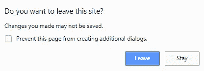

# 角度:通过在提交前离开页面来防止用户丢失数据

> 原文：<https://betterprogramming.pub/angular-how-keep-user-from-lost-his-data-by-accidentally-leaving-the-page-before-submit-4eeb74420f0d>


由[车头时距](https://unsplash.com/@headwayio?utm_source=unsplash&utm_medium=referral&utm_content=creditCopyText)在[挡泥板](https://unsplash.com/search/photos/website-form?utm_source=unsplash&utm_medium=referral&utm_content=creditCopyText)上拍摄

当用户在表单中填写了许多详细信息，然后单击 back，或者关闭/刷新选项卡时，我们希望警告用户页面上有未保存的数据。

我们希望用户只有同意下面的消息才能离开。

该消息将如下所示:



# 如何让它工作

我们需要把这个问题分解一下。当用户关闭或刷新选项卡时。
2。当导航改变时(用户点击后退或前进)。

Angular 有两种不同的处理方式:

## 1.处理选项卡关闭/刷新事件

如果用户有未保存的数据，我们需要注册`window:beforeunload`并显示一条消息。(在大多数浏览器中，你不能改变显示的信息。)

例如:

## 2.处理导航更改事件

我们需要实现一个*可以停用*的守卫。

要做到这一点，有三个步骤:

1.  实现`CanDeactivate`接口([角度](https://angular.io/)接口):

我们必须实现方法`canDeactivate`，它获取组件实例并返回一个`true`或`false`。

在本例中，如果弹出消息并且用户确认，将返回`true`。否则，路由不会改变。

2.将`CanDeactivateGuard`添加到`ngModule`提供程序中。

3.将`CanDeactivateGuard`添加到路由配置:

# 实现确认对话框的一般方法

我们看到，我们需要为每个组件提供许多不同的东西，我们需要为导航改变和标签关闭/刷新提供不同的实现。

我们需要一种通用的方法来实现所有导航案例和所有基于表单的组件的确认对话框。

因此，当我需要创建一个新的表单组件时，事情将开箱即用，无需考虑和了解上述任何事情。

# 我们开始吧

1.  让我们创建一个通用类`ComponentCanDeactivate`，它将监听浏览器`window:beforeunload`，并具有抽象 API:
    `abstract canDeactivate():boolean;`

像这样:

2.为任何表单组件添加通用实现:

基本上，在任何形式中，数据在两种情况下可以不保存:

1.  当形式还没有`submitted` 的时候。
2.  肯定是`dirty`。(如果用户只是打开表单并立即离开，我们不希望该消息出现。)

所以，`canDeactivate`检查的只是这两个条件。

注意，我对表单进行了抽象`getter`。任何组件都需要实现它并返回它的形式。

这是任何表单组件在所有导航情况下获得警告消息所需要做的唯一事情。

3.实施`CanDeactivateGuard`，但对于通用组件:

4.将`CanDeactivateGuard`添加到路由配置中。和以前一样，我们仍然需要为每个组件指定保护。

我的表单组件现在要干净得多；它只有一个`form`字段:

```
@ViewChild(‘form’)
form: NgForm;
```

# 包裹

为了防止用户由于 Angular 应用程序或浏览器级别的导航改变(如关闭/刷新)而丢失数据，我们需要创建一个通用组件来处理任何表单组件。

这个抽象组件将被注册到浏览器事件中，angular guard 将调用它的 API: `canDeactivate`。它将返回数据未保存时，该表单实际上是离开，没有提交和肮脏的。

现在，任何实现的组件都只需要扩展抽象组件并设置其表单实例，仅此而已。

# 代码示例和消息检查

这里有一个[的完整代码示例](https://stackblitz.com/edit/angular-rgsa51)

检查消息:

*   点击`add new user`链接。
*   在新用户表单中，填写名称，但不要单击提交。
*   单击返回:将出现一条消息。
*   在不填写姓名的情况下尝试同样的操作:消息不会出现，因为没有变化。当您填写名称并单击提交时，情况也是如此。

感谢阅读！