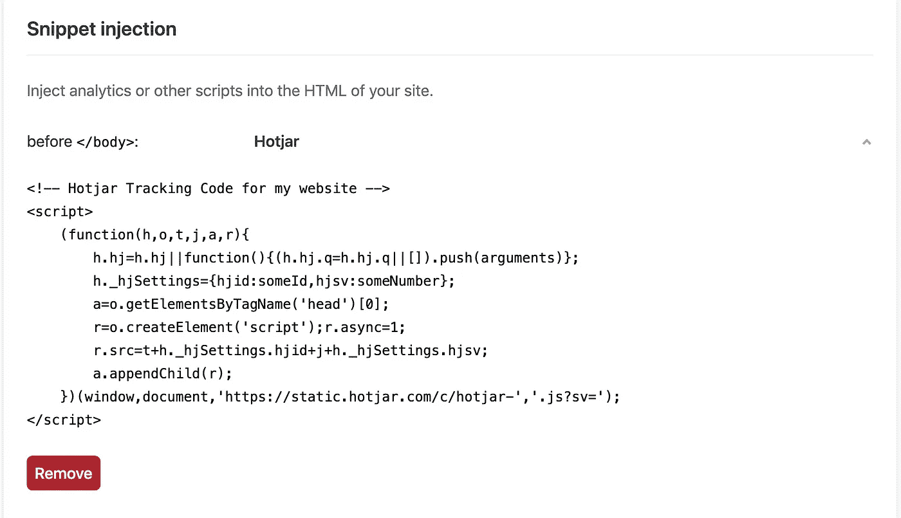

# Angular:如何只在产品中包含脚本

> 原文：<https://betterprogramming.pub/angular-how-to-include-scripts-only-in-production-a08580823029>

## 仅在需要时才在网站上加载脚本


由[卢卡斯·布拉塞克](https://unsplash.com/@goumbik?utm_source=medium&utm_medium=referral)在 [Unsplash](https://unsplash.com?utm_source=medium&utm_medium=referral) 拍摄的照片

许多用于网站和 web 应用程序的有用工具和服务都提供了 JavaScript 代码片段，作为将它们集成到您的网站中的简单方法。唯一要做的就是在 HTML 的某个地方插入代码片段。一些例子是 [Instana](https://www.instana.com) 用于错误监控，Hotjar 用于网站热图，Google Analytics 用于跟踪网站流量。

虽然任何开发人员都可以在代码中的某个地方添加这个脚本(例如在`index.html`中)，但是您可能不希望一直包含这个脚本。让我们以 Google Analytics 为例:你可能不希望`localhost`用户被跟踪。一些工具可能有限制(例如，每月只有 10，000 个事件)，所以您不想引起不必要的消耗。因此，我们可能只想在生产环境中运行时注入一些脚本。

解决这个问题有不同的方法。

*   使用类似 [nginx](https://www.nginx.com/) 的 web 服务器来注入脚本
*   基于环境在运行时注入脚本
*   使用 [Angular CLI](https://cli.angular.io/) 根据环境包含脚本
*   使用后处理注入脚本

请注意，除了 Angular CLI 之外，所有这些方法都不是特定于任何框架的，因此无论您使用 Angular、React、Vue.js 还是静态网站，都可以使用这些方法。

# 使用 nginx 仅在生产中包含脚本

如果你使用的是类似 [nginx](https://www.nginx.com/) 的网络服务器，你可以修改发送给客户端的内容。您可以在`index.html`中提供一个占位符，并用正确的脚本动态替换它。然而，这种方法与 nginx 本身没有任何关系。此外，如果不运行 nginx，就无法在本地开发环境中测试这一点。

```
# nginx.conf
location /index.html {
  *# Append Analytics script on production only* sub_filter '<span id="analytics-script-placeholder"></span>' '<script src="assets/scripts/analytics.min.js" async></script>'*;* sub_filter_once on*;* }
```

# 基于环境在运行时插入脚本

另一种方法是在应用程序中检查您是否在生产模式下运行，并有条件地插入脚本。这可以用普通的 JavaScript 通过创建一个`[<script>](https://developer.mozilla.org/en-US/docs/Web/HTML/Element/script)`元素，设置 URL，最后将其插入某个地方(通常在`[<body>](https://developer.mozilla.org/en-US/docs/Web/HTML/Element/body)`元素上)来完成。

然而，不鼓励在运行时注入脚本，特别是因为 Angular 不鼓励直接 DOM 访问，而且 Angular 做了很多来保护我们免受 XSS 问题的影响。此外，如果您有多个环境，那么您需要在代码中做更多的检查来决定是否插入脚本。

```
// main.ts
if (environment.production) {
  enableProdMode();
  const scriptEl = window.document.createElement('script');
  scriptEl.src = 'assets/scripts/analytics.min.js';
  window.document.body.appendChild(scriptEl);
}
```

# 使用 Angular CLI 根据环境包含脚本

但是等等 Angular 团队肯定已经想到了这个问题。是的，事实上，他们有！`[angular.json](https://angular.io/guide/workspace-config)`文件为 Angular CLI 提供的构建和开发工具提供了工作空间范围和项目特定的配置默认值。它允许您指定不同的配置。我们可以为每个环境指定全局脚本。这样，我们不需要自己手动注入脚本，我们让 Angular CLI 来处理这些。

在我看来，这是注入只应在生产或任何其他环境中执行的脚本的最佳方式。

```
{
 "build": {
  "builder": "[@angular](http://twitter.com/angular)-devkit/build-angular:browser",
  "options": { ... },
  "configurations": {
   "production": {
    "fileReplacements": [{
     "replace": "src/environments/environment.ts",
     "with": "src/environments/environment.prod.ts"
    }],
    "scripts": ["src/assets/scripts/analytics.min.js"],
    ...
    }
  }
 }
}
```

# 使用后处理来注入脚本

有些平台，像 [Netlify](https://www.netlify.com/) ，允许你做后期处理和优化。这种方法的一个优点是，您不需要将这些代码片段放入您的代码库。相反，你让平台注入脚本。这意味着可以在平台中更新代码片段，并且它将立即可用，而不需要执行部署。

另一方面，使用后处理方法意味着这些代码不会通过 Git 进行版本控制，并且在本地环境中也不可用。因此，无法访问这个平台的人可能不知道这些工具或服务正在你的网站上使用。



使用 Netlify 注入 Hotjar 跟踪片段

就我个人而言，我喜欢在不需要直接与脚本交互的静态网站中使用这种方式。

# 结论

感谢您阅读这篇关于基于您的环境的脚本注入的短文。

正如您所看到的，根据环境的不同，有几种注入脚本的方法。在我看来，您应该让您的构建工具(在本例中是 Angular CLI)来处理这个问题。如果你使用一个允许你做后期处理的主机平台，那么这也是一个选择。