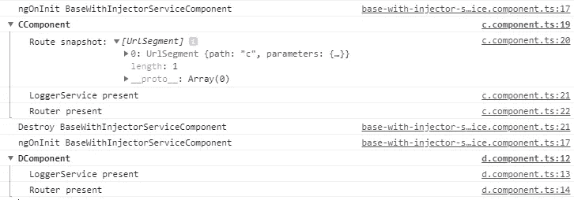

# 棱角分明:不劳而获的传承

> 原文：<https://betterprogramming.pub/angular-inheritance-without-effort-8200c8d87972>

## 在我们的应用程序中使用继承的好方法，无需维护

照片由 [Jakub Gorajek](https://unsplash.com/@cinegeek?utm_source=unsplash&utm_medium=referral&utm_content=creditCopyText) 在 [Unsplash](https://unsplash.com/search/photos/app?utm_source=unsplash&utm_medium=referral&utm_content=creditCopyText) 上拍摄

用[打字稿](https://www.typescriptlang.org/)写的 [Angular](https://angular.io/) 使得在我们的组件中使用继承的概念成为可能。

然而，当我们需要子组件中的服务时，我们面临一个问题。

# 入门指南

让我们从创建我们的`BaseComponent`开始:

注意装饰器`Component`不是必需的——我们不必在模块中声明这个类，因为它不是一个组件。我们也可以将它声明为一个抽象类，就像我们在常规 OOP 语言中所做的那样。

然后，我们创建由`BaseComponent`扩展的两个组件:

当我们从一个组件导航到另一个组件时，日志会正确地打印在控制台中。

我们的子组件现在已经准备好了！

但是，在`AComponent`中，我想访问它的`ElementRef`(或其他服务):

这就是我们的问题。当我想在那个组件中注入`ElementRef`时，我必须调用方法`super()`并传递我们的另外两个类。试想一下，如果你在`BaseComponent`里有其他服务，那就很难管孩子了。

如果我在`BaseComponent`中添加或删除一个服务，我必须在它扩展的每个子组件中反映这些变化。

幸运的是，有一个容易实现的解决方案。我们将手动将我们的服务注入到`BaseComponent`中。

对于这个例子，我将创建另一个包含我们的`Injector`的`BaseComponent`——姑且称之为`BaseWithInjectorComponent`:

主要变化在`constructor`中。我们没有使用它来让 Angular 注入我们的服务，而是手动执行这个操作。

我把`Injector`放进去，然后我把每一个注射剂绑定到它相应的属性上。就是这样！

我们现在可以通过移除`constructor`中不必要的参数来重构我们的子组件:

一切都像魔咒一样管用。但是，我们仍然必须注入`Injector` …我们可以做得更好！

我们的目标是从基本构造函数中移除注入器，但是如果不在构造函数中实例化它，我们就不能访问`Injector`的实例。

事实上，我们可以创建自己的`Injector`,当我们引导我们的应用程序，并把它作为一个单体。我们开始吧！

让我们在`/src`中创建`app-injector.service.ts`:

这将使我们的定制注入器作为单例可用。我们在`AppModule`构造函数中设置了一次:

我们现在可以在基本组件中安全地使用它:

为了测试是否一切正常，我将修改`CComponent`和`DComponent`:

而且，我们还有结构相同但没有`ActivatedRoute`的`DComponent`。

当我从一个组件导航到另一个组件时，下面的结果演示了工作示例:

一切都在按预期运行！

在`super()`方法中，我们的孩子现在没有这些依赖了！

# 继承的例外

## ActivatedRoute

如果你想在你的`BaseComponent`里注射`ActivatedRoute`就不能正常工作了。该类需要注入到组件中才能正确实例化。

但是，如果你想要路由状态，我推荐你看一看 [Redux](https://redux.js.org/) 模式，而不是使用继承，这会让你的生活更轻松。

这里是 NGXS 的一个[例子。](https://ngxs.gitbook.io/ngxs/plugins/router#custom-router-state-serializer)

你也可以选择另一个状态管理库比如 [NgRx](https://ngrx.io/) 或者 [Akita](https://netbasal.gitbook.io/akita/) ，或者用 [RxJS](https://angular.io/guide/rx-library) 创建自己的。

## ElementRef

在组件的`constructor`中声明的`ElementRef`提供了主机元素。在抽象的组件中，它是不可用的——即使你使用你的注入器，你也会得到`No provider for ElementRef`。

所以，如果你需要它，你必须在你的子构造函数中传递它。

# 警告:小心使用

本例中使用的模式称为 ServiceLocator 模式。

它被称为反模式，所以请记住只有**在基本组件中使用它。例如，FormBaseComponent、BaseComponent、… UI 组件不关心这些依赖关系。**

关于 ServiceLocator 模式的更多信息:【https://en.wikipedia.org/wiki/Service_locator_pattern 

# 结论

我们现在有了一个在我们的应用程序中使用继承的好方法，不需要维护。继承对于避免组件中的重复动作非常重要，如果我们明智地使用它，我们可以构建一个智能组件。

然而，它可能不是所有事情的最佳解决方案——在设计您的层次结构之前请三思。

祝您愉快！