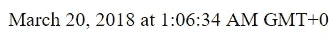
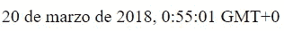
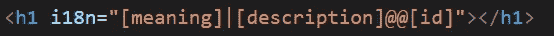
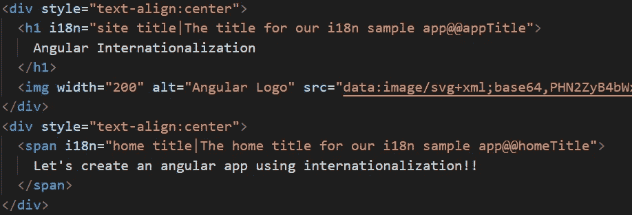
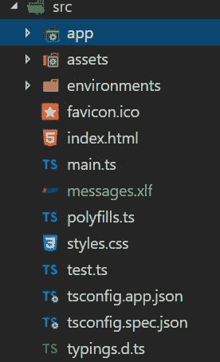
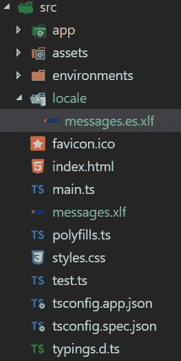
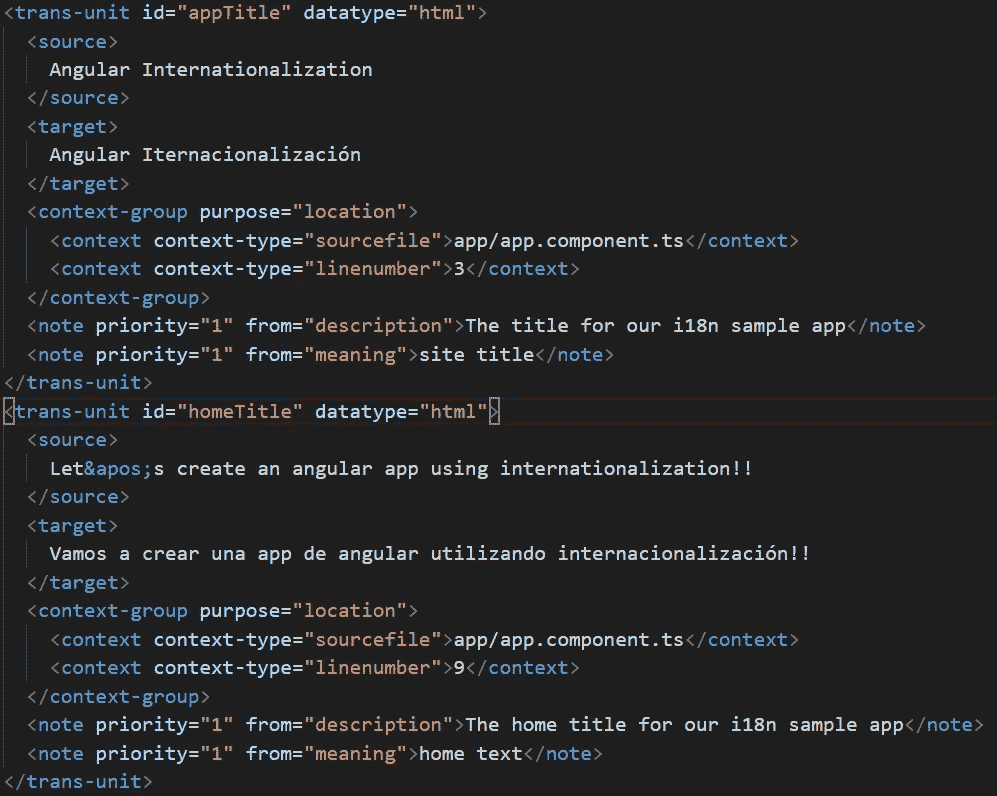
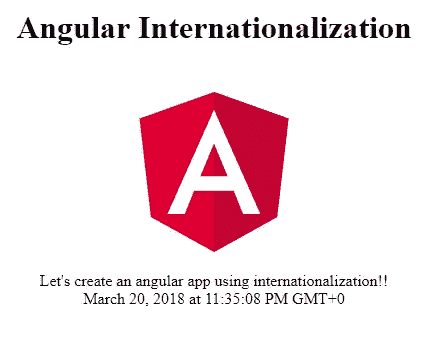
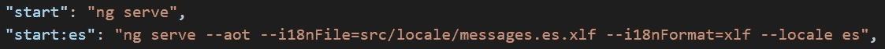
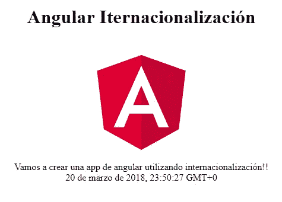

# Angular:国际化简介(i18n)

> 原文：<https://betterprogramming.pub/angular-introduction-to-internationalization-i18n-28226a85e04e>

## 如何轻松地将其他语言添加到 Angular 项目中


几周前，在我与工作中的 [Martin McWhorter](https://medium.com/u/747dc54e3?source=post_page-----28226a85e04e--------------------------------) (我很高兴与之共事的超级酷的家伙，他碰巧也很了解 Angular)的许多对话中，我们开始使用`angular-cli`讨论 Angular 中的国际化，我决定这是我下一篇文章的一个很好的主题。

处理国际化是构建全球应用程序的一个关键方面，大多数开发人员迟早都要处理这个问题。

Angular 为我们提供了一套处理国际化(i18n)的内置功能——谢谢 Angular！

*   以本地格式显示日期、数字和百分比。
*   翻译组件模板中的文本。
*   处理单词的复数形式。
*   处理可选文本。

我们将在本文将要编写的应用程序中讨论前两个问题。然后，我们将讨论与 Angular 应用程序中的国际化相关的几个其他主题。

默认情况下，Angular 使用区域设置`en-US`。要将您的应用程序区域设置为另一个值，请使用 CLI 参数区域设置和您想要使用的适当值(注意，angular 遵循 Unicode LDML 约定)。

```
ng serve --aot --locale es
```

例如，上面的命令将为您的应用程序服务，将区域设置为西班牙语。您可以通过`ng-serve`和`ng-build`使用`locale`参数。

# 让我们开始编码吧

正如我前面提到的，我们将介绍 Angular 为处理国际化而提供的一些关键特性。我们将使用 angular CLI 通过 AOT 编译器创建和运行应用程序(设置和配置 JIT 的国际化不是本文的一部分。转到 [angular 文档](https://angular.io/guide/i18n)获取关于 JIT 编译器国际化的信息)。

我们的想法是创建一个应用程序，它可以用西班牙语或者默认情况下用英语的区域设置来构建和运行。

首先，让我们创建应用程序。如果您还没有安装[角度 CLI](https://cli.angular.io/) 。然后打开你喜欢的控制台，转到你要使用的文件夹，运行 CLI 命令创建一个新项目:`ng new internationalization`。

然后使用`npm install` 安装所有的包(这应该已经执行过了，但是以防万一，让我们再做一次)并使用`ng serve`运行应用程序以检查一切是否正常。

默认情况下，Angular 为应用程序提供区域设置为`en-US`的服务，所以让我们也将它作为默认设置。要用西班牙语运行应用程序，我们只需在`package.json`脚本部分添加一个条目:`"start:es": "ng serve --aot --locale es",`

## 使用 i18n 管道

Angular 有一组内置的管道来处理一些国际化问题，比如日期、小数和百分比。

让我们以`datePipe`为例:

```
<div style=”text-align:center”> <span>{{ dateTime | date: ‘long’ }}</span></div>
```

在`app.component.html`中，让我们添加一个`datePipe`来显示组件的一个`dateTime`属性。我们将把`long`属性传递给管道，以显示日期的长字符串版本。

```
export class AppComponent { title = ‘Angular Internationlization’;
 dateTime = new Date();
```

在`app`组件中，让我们将`dateTime`设置为一个新的日期。

如果我们现在用`npm start`运行应用程序，我们将看到`en-US`版本的长日期:



让我们现在用命令`npm run start:es` *运行它。现在我们将看到日期的西班牙版本。*



## 模板翻译

这就是我们菜单的主菜——将包含的文本翻译成模板的能力。

角度 i18n 模板转换有四个阶段:

1.  标记要翻译的静态文本。
2.  Angular i18n 工具将文本提取到标准翻译源文件中。
3.  翻译人员(或本演示中我们自己)编辑文件并返回目标语言的文本。
4.  angular 编译器使用翻译后的文件来生成具有目标语言的应用程序的新版本。

让我们通过示例来了解每个阶段。

## **使用角形 i18n** 标记静态文本

我们将使用带有自定义 id 的 angular `i18n`属性，通过这样做，由`i18n`提取器工具生成的每一个翻译单元都更加易读和易于维护。我们还将为`i18n`属性添加描述和含义，这有助于 angular 提高翻译的准确性。



上图显示了如何在`i18n`属性中使用这三个值。首先是意义，然后是管道，接着是描述。最后，在 id 前加一个双 at 符号。

让我们在应用程序中创建几个例子:



太好了！在上面的代码中，我们向我们的`app.component`模板添加了两个例子。一个用于应用标题，一个用于主页标题。我们提供了两者的含义和描述。

## **使用 angular i18n 工具将文本提取到一个文件中**

现在我们将从 angular `cli`运行命令`ng xi18n` 来生成主翻译文件。这个文件将生成我们的基本翻译文件，在我们的 src 文件夹中称为`*messages.xlf*` (您可以将另一个位置和/或名称作为参数传递给命令)。



现在我们有了基本翻译文件，我们必须创建新的特定于语言的翻译文件。首先，在我们的 src 文件夹下创建一个文件夹*“locale”*，这是我们的特定语言文件将要存放的地方。

让我们将最近生成的`messages.xlf` 文件复制到 locale 文件夹中，并将其重命名为`messages.es.xlf` (在我们的例子中，我们将只有一个文件用于西班牙语翻译)*。*



## **用西班牙语翻译编辑这个新文件**

在一个真实的应用程序中，你的公司可能会雇佣一个翻译来提供文件的翻译版本(描述和意思将帮助这个人得到更准确的翻译)。在本例中，我们将自己完成。

为此，我们需要在文件中的每个`<source>`标签后添加一个`<target>`标签。然后我们在目标标签中输入西班牙语版本的文本。



很好——现在我们已经准备好了西班牙语国际化文件。

## **用指定语言**进行 angular 编译

我们希望能够建立英语或西班牙语的应用程序，我们几乎已经设置好一切来完成它。

要获得英文版的应用程序，我们只需运行`npm start command`在后台执行一个 ng 服务——这样就可以工作了。



为了用西班牙语构建应用程序，我们只需向`package.json`文件中的西班牙语构建脚本添加几个参数:



第一个新参数是`i18nFile` ，它指向西班牙语翻译文件的位置。我们添加的第二个参数是`i18nFormat`，它指的是翻译文件的格式。

现在，当我们运行命令`*npm run start:es*`时，我们将构建带有西班牙语翻译的应用程序！



## 为应用服务

在我们的例子中，我们应该有两个独立的应用程序包，一个使用默认语言(英语)，另一个使用西班牙语。我们可以使用不同的策略来服务于这个或那个:

*   服务器端语言检测。
*   Url 参数。

## 维护翻译的文件

Angular i18n 不提供任何维护翻译文件的功能。但是您可以使用`xliffmerge`来维护和合并您的 xlfs 文件。[这里有一个在有角度的环境中使用它的指南。](https://github.com/martinroob/ngx-i18nsupport/wiki/Tutorial-for-using-xliffmerge-with-angular-cli)

# 太好了！让我们看看我们做了什么

*   将 Angular 配置为使用不同的语言环境进行编译。
*   使用有角度的内置管道来帮助我们国际化。
*   使用`i18n`属性为 Angular 提供文本翻译所需的信息。
*   生成了基本翻译文件。
*   创建语言特定的文件。
*   配置 angular 以便能够编译正确的语言特定文件。
*   指出服务于正确应用程序包的策略。
*   指出如何维护翻译文件。

我希望这篇文章能帮助你对 angular 的国际化有更多的了解！

这里是 [GitHub 回购](https://github.com/SantiagoGdaR/angular-internationalization)。