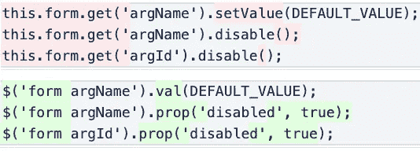

# 角度不够敏感

> 原文：<https://betterprogramming.pub/angular-isnt-reactive-enough-70b6b8d6cf8>

## 有一个非常令人沮丧的 bug 一直出现在 Angular 应用程序中


[兰斯·安德森](https://unsplash.com/@lanceanderson?utm_source=medium&utm_medium=referral)在 [Unsplash](https://unsplash.com?utm_source=medium&utm_medium=referral) 上拍照。

请注意以下错误之间的共性:

*   当用户收到新邮件时，未读邮件计数不会更新。
*   当用户加载以前的配置时，背景颜色不会更新。
*   当介质状态改变时，图标不会更新。
*   `EndDate`当用户将查询参数更改为`type=duration`时，不会禁用输入。
*   当用户订阅新队列时，他们仍然只能获得以前队列的通知。

有什么共性？都可以放入公式“__ 不更新时 ___”换句话说，“___ 没有对 __”做出反应。

一旦你看够了这些令人沮丧的 bug，你就会开始意识到它们只是出现在不同地方的同一个 bug。越是事件驱动和数据丰富的应用程序，这个错误就越明显。

我们如何摆脱这个 bug？通过反应式思考:如果一个特性最初是反应式连接的，那么任何新的事件或行为都应该无缝连接，而不必重新管理现有的行为。

但是 Angular 并不总是让我们容易做到这一点。

# 角度:必要的部分

不幸的是，Angular 中仍然有许多命令式 API，使得开发人员不再被动地思考。因此，这种强制性的错误往往会出现在围绕这些 API 的代码中。这里有一些我认为可以改进的地方。

## 角反应形式

大约一年前，我被分配去修复一个大型表单上的几个错误，这个表单是用角反应式表单构建的。过了一会儿，我开始感觉到一些我从 jQuery 时代就没有感觉到的东西。我突然意识到代码和 jQuery 是多么的相似。事实上，只要做一些表面上的改变，它就会是一样的:



jQuery 的角度反应形式。

这让我很难过。你看，我已经爱上了更新 UI 的"[棱角分明的方式](https://css-tricks.com/animations-the-angular-way/)。我喜欢这种自动的感觉。我不必担心 UI 的所有部分会因为发生的每一个小事件而更新。我可以在控制器中设置一个变量，让 DOM 中的各种元素自己做出反应。

我必须修复的错误几乎都是命令性错误。如果形体真的是反应性的，它们就不会存在。更重要的是，代码本身是杂乱的，有很多冗余，因为如果没有明确的状态管理，如果 UI 中的某些东西不同步，您可能会遇到麻烦。但是打个电话确认一下也无妨。

幸运的是，我不是唯一一个注意到反应形式需要帮助才能反应的人。其他开发人员[写了](https://netbasal.com/disabling-form-controls-when-working-with-reactive-forms-in-angular-549dd7b42110) [文章](https://medium.com/@amcdnl/reactive-angular-forms-with-ngrx-533a2f28c127)解释如何创建指令，将反应式表单的命令式界面隐藏在声明式界面之后。受这些文章的启发，我为一些方法制定了指令，比如`.disable()`和`patchValue()`，我认为它们应该是反应式的。您可以使用以下指令绑定该属性，而不是在表单控件上调用`.disable()`:

```
<input 
  [formControl]="formControl" 
  **[controlDisabled]="disabled$ | async"** />
```

下面是该指令的实现，以及表单组的实现:

*   [禁用-控制.指令. ts](https://gist.github.com/mfp22/3d9a6a7695c31d031db95871ffc978cf)
*   [禁用表单组指令 ts](https://gist.github.com/mfp22/a4a3d43ebe3665697a7361e9f32a20f4) 。

下面是一些设置和修补值的指令:

*   [set-value.directive.ts](https://gist.github.com/mfp22/12c0d3c56db06d526b0aae289823e347)
*   [patch-form-group-values . directive . ts](https://gist.github.com/mfp22/2f2c47f630e3c7b6379503236745af4c)

你可以用这些来更相对地管理你的角度反应形式。希望将来我们会看到更多的工具。

## 生命周期挂钩

生命周期挂钩让您能够在 Angular 中对生命周期事件做出反应。但是默认的反应方式不是被动的。相反，您提供这些钩子强制调用的函数。

```
ngOnDestroy() {
  // Do imperative stuff
}
```

我们又有好运气了，因为 [Sander Elias](https://twitter.com/esosanderelias) 注意到了这个机会，并且已经创建了[一个库](https://www.npmjs.com/package/@se-ng/observable-hooks)，给你生命周期钩子作为观察对象。而不是这个:

```
ngOnChanges(changes: SimpleChanges) {
  // Do imperative stuff
}
```

您可以这样做:

```
this.seOnChanges$.pipe(...)
```

## 组件输入

分量输入是随时间变化的值，因此它们是可观测量的完美候选。不幸的是，应对这些变化的唯一方法也是必要的:

如果您想被动地做这件事，您可以再次使用 Sander 的`seOnChanges$`来获得每个输入的可观察值:

```
@Input() myInput: string;myInput$ = this.seOnChanges$.pipe(
  filter(changes => changes.myInput),
  map(changes => changes.myInput.currentValue),
);
```

然而，我想要更直接的东西，所以我创建了[这个装饰器:](https://gist.github.com/mfp22/5f9717ff297deb69125afab8480eb65e)

```
import { AsyncInput } from '@ng-reactive/async-input';
...
@Input() myInput: string;
@AsyncInput() myInput$ = new BehaviorSubject('initial value');
```

我不能 100%确定它已经准备好生产了，所以要小心使用。

目前有很多关于这个主题的活动。看看 Michael Hladky 的 ngrx/platform 提案。[这个](https://dev.to/stupidawesome/reactive-adventures-in-angular-introducing-angular-effects-1epf)看起来也真有意思。

## 材料成分

Angular Material 是一个非常令人印象深刻的组件库，每个组件作者都可以从中学习。但是，有一些组件带有命令式 API:

*   [MatBottomSheet](https://material.angular.io/components/bottom-sheet/overview)
*   [MatDialog](https://material.angular.io/components/dialog/overview)
*   [MatSnackBar](https://material.angular.io/components/snack-bar/overview)

由于这些强制性接口，我们不得不在手动订阅中强制性地管理这些组件，而不是被动地用异步管道绑定数据。这种必要性使得某些更新在复杂的对话框中很容易被忽略。

我为 MatDialog 创建了一个带有声明性接口的包装组件。现在，不是做:

```
this.dialog.open(AnyComponent)
```

你只需要:

```
<app-dialog 
  [component]="AnyComponent" 
  **[open]="open$ | async"** ></app-dialog>
```

在一个地方，当`open$`发出`true`或`false`时，它会自动打开和关闭。[这里是该对话框的代码](https://gist.github.com/mfp22/479a6860510286e69d9cb7ea3a448d5e)。

# 结论

Web 开发变得越来越事件驱动和数据丰富，正因为如此，我们的代码需要变得越来越被动。随着我们越来越习惯于反应式思维，我们将会看到更多的机会来改进命令式 API，避免命令式 bug，并加速开发。

并且，希望有一天，我们将不再看到这么多的错误报告说，“当 ___ 时 ___ 没有更新。”