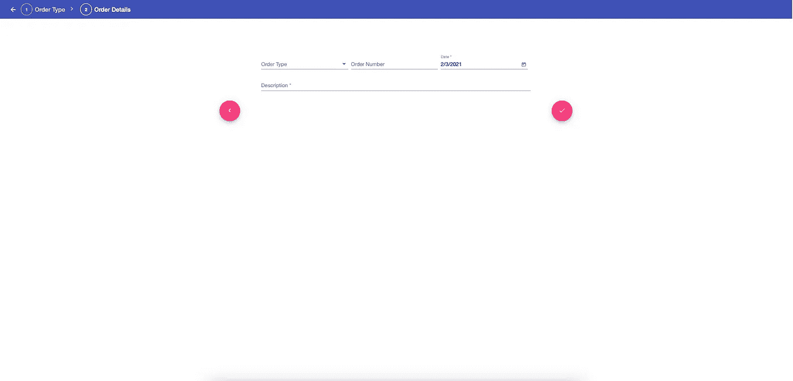
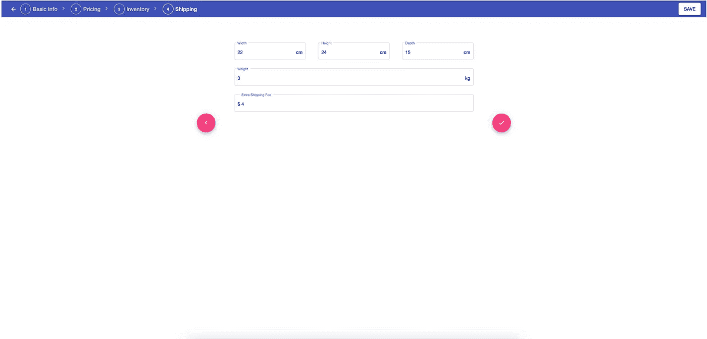
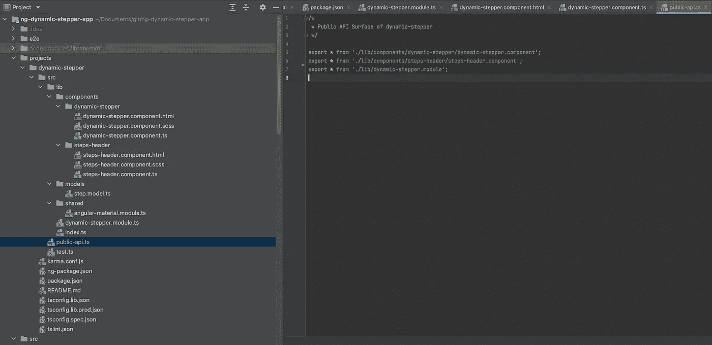
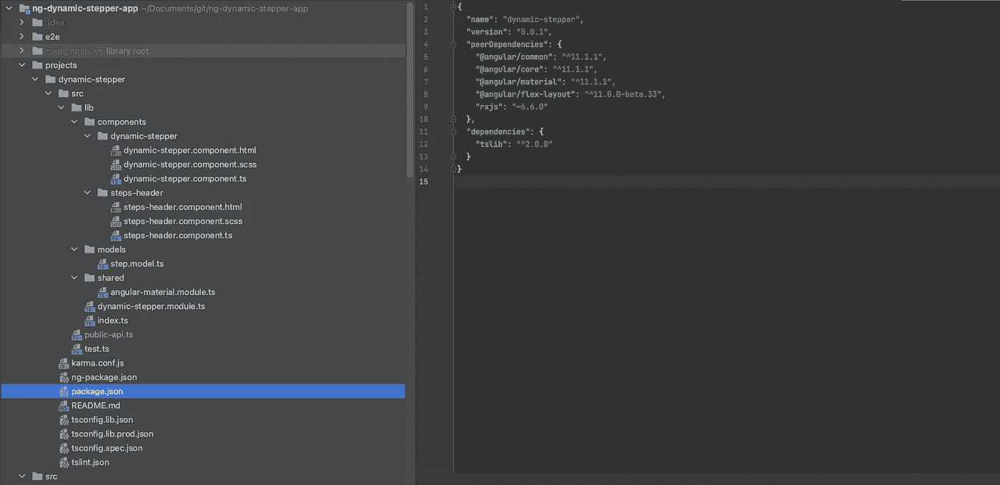
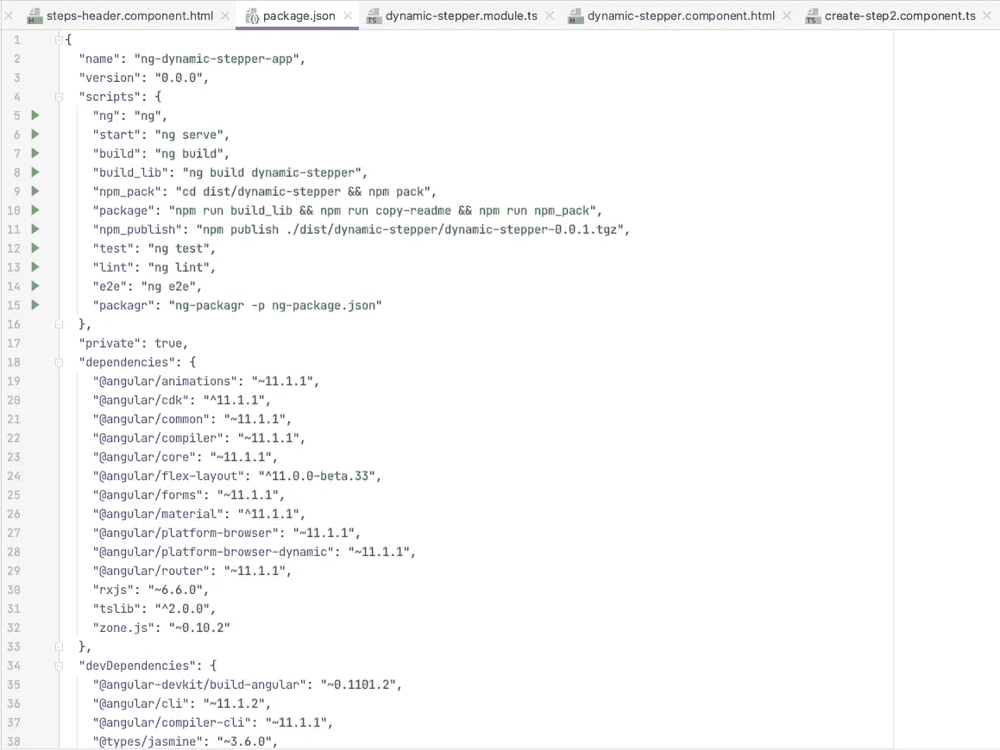
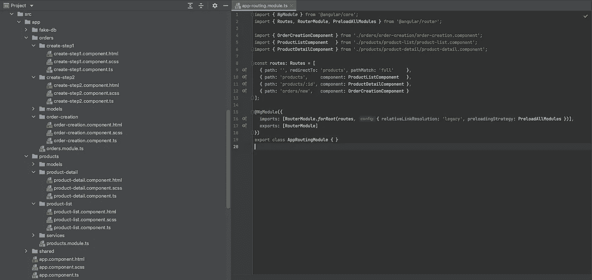

# 构建一个可重复使用的步进器作为角度库

> 原文：<https://betterprogramming.pub/angular-library-dynamic-stepper-2ba05ab40228>

## [软件工程](https://rakiabensassi.medium.com/list/software-engineering-7a179a23ebfd)

## 用动态步进器传达您的流程进度


照片由 [Maxime Lebrun](https://unsplash.com/@flub?utm_source=medium&utm_medium=referral) 在 [Unsplash](https://unsplash.com?utm_source=medium&utm_medium=referral) 上拍摄

机票预订、在 SAP 中管理发票、创建采购订单——所有这些流程的共同点是它们都涉及许多步骤来完成。例如，采购订单由几个合规性检查点、批准和输入任务组成，以确保及时处理。

如果您有机会构建一个处理类似流程的企业应用程序，这意味着您的应用程序中的多个模块应该包含相同的用户界面逻辑，并且您必须在许多地方解决相同的问题。

你猜对了！您需要实现一个可定制的可重用组件来传达流程的进度，并允许一步一步地提交数据，这就是我们下面要做的。

# 我们会做什么

[Angular](https://medium.com/better-programming/angular-10-new-features-dbc779061dc8) 材料已经提供了步进器组件，但我们今天的步进器具有增强的 UX 和:

*   它通过一系列逻辑和编号的步骤来显示进度。
*   它也可以用于导航。
*   它有一个`goBack`按钮(在其标题的左侧),可以使用或移除。
*   除了编号的步骤，它的标题支持显示额外的元素，如保存按钮或通知消息。
*   我们将创建并发布它作为 Angular 库，然后我们将在两个不同的模块中使用它:演示应用程序中的产品和订单。
*   我们将利用`ngTemplateOutlet`来实现它。

**注意:**你可以在[上一篇文章](https://medium.com/better-programming/angular-dynamic-layout-with-ngtemplate-8b6faa995a8f)中找到关于`ngTemplateOutlet`的更多细节，我已经解释了如何使用角度内容投影和动态模板构建一个具有三种布局风格的应用。



在订单模块中使用动态步进器



在产品模块中使用动态步进器

在您自己的应用程序中，根据您的业务需求，您可以使用不同的数据验证和条件在流程步骤之间导航。

介绍到此为止，下面是代码演练。

# 开始

通过 [Angular CLI](https://cli.angular.io/) 设置您的 Angular 应用程序。

使用最新版本的 Angular 创建新的 Angular 项目:

```
ng new ng-dynamic-stepper-app
cd ng-dynamic-stepper-app
```

此命令还创建以下工作空间和起始项目文件:

*   一个新的工作区，有一个名为`ng-dynamic-stepper-app`的根文件夹。
*   一个初始的框架应用程序项目，也叫做`ng-dynamic-stepper-app`(在`src`子文件夹中)。
*   一个端到端的测试项目(在`e2e`子文件夹中)。
*   相关配置文件。

初始应用程序包含一个简单的欢迎应用程序，准备运行。使用 Angular CLI 通过以下命令生成新的库骨架:

```
ng generate library dynamic-stepper
```

# 生成库的组件

在为我们的库生成组件时，我们指定了`--project`标志来告诉 Angular CLI 在我们库的文件夹中生成它:

```
ng generate component components/dynamic-stepper **--project**=dynamic-stepper **--export**ng generate component components/steps-header **--project**=dynamic-stepper **--export**
```

`DynamicStepperComponent`是我们的切入点。下面是它的模板和类型脚本代码:

dynamic-stepper.component.html

动态步进器组件

`dynamic-stepper`组件的动态内容有两个占位符:

```
<ng-container **ngTemplateOutlet*="**stepsHeader**"></ng-container>
<ng-container **ngTemplateOutlet*="**stepsContent**"></ng-container>
```

1.  `stepsContent`是我们将呈现步骤模板的占位符。
2.  `stepsHeader`是我们将在子组件`StepsHeaderComponent`中呈现步进器标题的地方。最后一个简单地显示了:

*   可以显示或移除的`goBack`按钮
*   步骤的名称、顺序和编号。当用户点击一个步骤的名称时，我们会将他们重定向到该步骤。
*   该组件支持将与角度内容投影一起注入的额外元素。这些元素应该带有模板 id `stepsHeader`:

```
<ng-container **ngTemplateOutlet*="**stepsHeader**"></ng-container>
```

steps-header.component.ts

# 将组件添加到库的入口文件中

我们的库项目有一个入口文件，它定义了它的公共 API:
`projects\dynamic-stepper\src\**public_api.ts**`



`Angular Library, entry file: public_api.ts`

我们需要将下面几行添加到条目文件中，告诉`ng-packagr`这个组件类应该向我们库的用户公开。

**注:** `[ng-packagr](https://github.com/ng-packagr)`是封装 Angular 库的解决方案，是 Angular CLI 的一部分。

# 对等依赖

然后安装以下依赖项:

```
npm add @angular/material
npm add @angular/cdk
npm add @angular/flex-layout
```

下一次更新`projects/dynamic-stepper/package.json`中的`peerDependencies`:



角度库中的对等依赖

当我们创建一个角度库时，我们的工作空间中至少有三个`package.json`文件:

*   **工作区根目录** `package.json`是我们工作区根目录下的主`package.json`文件。
*   **库项目** `package.json`是`projects/dynamic-stepper` 目录，它告诉`ng-packagr`哪些信息将进入我们库附带的发行版`package.json` 。
*   **库分布** `package.json`是在我们构建库的时候由`dist/dynamic-stepper` 目录中的`ng-packagr`生成的。我们图书馆出版的是`package.json`。

# 样式表

我们现在必须通过向`projects/dynamic-stepper/src/lib/components/dynamic-stepper/dynamic-stepper.component.scss`和`src/styles.scss`添加下面一行来导入 Angular 主题:

```
@import “~@angular/material/prebuilt-themes/indigo-pink.css”;
```

通过向`head`块中的`src/index.html`添加以下行，从 Google API 导入字体:

index.html

# 出版

现在，我们可以使用 Angular CLI 命令来构建、测试和 lint 项目:

```
ng build dynamic-stepper
ng test dynamic-stepper
ng lint dynamic-stepper
```

为了能够发布一个包，我们需要注册一个 npm 帐户。如果您已经有一个 npm 企业配置文件，您可以为不同的注册表创建第二个配置文件，例如公共的npm 注册表。要为开源概要文件设置[公共注册表](https://docs.npmjs.com/configuring-your-registry-settings-as-an-npm-enterprise-user)，您需要运行以下命令:

```
npm config set registry [https://registry.npmjs.com](https://registry.npmjs.com)
```

然后，您可以登录 npm:

```
npm login
```

这将提示您输入 npm 凭据和电子邮件。最后，您可以通过运行`package` 和`publish` 任务来发布库(打包在`.tgz`文件中):

```
npm run **package**
npm **publish** ./dist/dynamic-stepper/dynamic-stepper-0.0.1.tgz
```

package npm 任务是一个定制任务，我们需要将它添加到我们工作区根目录下的主`package.json`文件中:

```
"scripts": {
    ... "**package**": "npm run build_lib && npm run copy-readme && npm run npm_pack", "npm_publish": "**npm publish** ./dist/dynamic-stepper/dynamic-stepper-0.0.1.tgz",
    ....
},
```



package.json 中的“包”任务

Npm 允许我们发布一次特定的名称和版本组合。因此，每次想要在 npm 上发布库的更新时，都需要更改版本。

# 使用图书馆

要在项目中使用动态步进角度库，您只需运行以下命令，该命令将像安装任何其他 npm 依赖项一样安装它:

```
npm install **dynamic-stepper**
```

在我们上面的应用程序`ng-dynamic-stepper-app`中，我生成了两个模块来展示如何使用 stepper 库:

*   在`orders`模块中，`order-creation.component.html`使用了动态步进器，其中包含两个步骤:订单类型和订单详细信息。
*   在`products`模块中，在`product-detail.component.html`中使用了动态步进器，并在步进器标题上显示了一个额外的保存按钮和四个步骤:基本信息、定价、库存和发货。

```
ng generate module products
ng generate module orders
```



测试应用程序和 app-routing.ts

order-creation.component.html

product-detail.component.html

# 最后的想法

在这篇文章中，我们已经学习了如何建立一个步进器作为一个角度库。这对于大型应用程序和跨多个项目共享特别有帮助。我们还看到了如何在两种不同的常见场景中使用步进器。

你可以在[这个 GitHub 库](https://github.com/rakia/ng-dynamic-stepper)里找到源代码。此应用的第二部分可从以下网址获得:

[](/angular-custom-autocomplete-7ffb479477e7) [## 用动态表格构建一个自定义的自动完成搜索角应用程序

### 玩 CSS 覆盖和有角度的材料组件

better 编程. pub](/angular-custom-autocomplete-7ffb479477e7) 

第三部分:

[](/build-a-hand-pose-detector-web-app-powered-by-machine-learning-62131ec43db5) [## 构建由机器学习驱动的手部姿势检测器 Web 应用程序

### 结合机器学习和网络开发

better 编程. pub](/build-a-hand-pose-detector-web-app-powered-by-machine-learning-62131ec43db5) 

🧠💡感谢阅读！我为一群聪明、好奇的人写关于工程、技术和领导力的文章。 [**加入我的免费电子邮件简讯，独家获取**](https://rakiabensassi.substack.com/) 或在此注册 Medium。