# 角度生命周期挂钩:完全指南

> 原文：<https://betterprogramming.pub/angular-lifecycle-hooks-a-complete-guide-3040e3c93f97>

## 我们将深入挖掘每个生命周期挂钩，看看它们是如何在 Angular 中使用的


照片由[内森·杜姆劳](https://unsplash.com/@nate_dumlao?utm_source=medium&utm_medium=referral)在 [Unsplash](https://unsplash.com?utm_source=medium&utm_medium=referral) 上拍摄

在 Angular 中，组件实例的生命周期始于 Angular 实例化组件类并呈现组件视图及其子视图。生命周期继续变化检测，Angular 检测数据绑定属性的变化，并根据需要更新视图和组件实例。当 Angular 销毁组件实例并从 DOM 中删除其呈现的模板时，生命周期就完成了。

指令的生命周期与实例相似，Angular 在执行过程中会创建、更新和销毁实例。

Angular 应用程序可以使用生命周期挂钩方法来拦截组件或指令生命周期中的关键事件，以便初始化新的实例，在必要时启动更改检测，在更改检测期间响应更新，并在删除实例之前进行清理。

Angular 按以下顺序调用这些挂钩方法:

1.  `ngOnChanges`:当输入/输出绑定值改变时
2.  `ngOnInit`:先`ngOnChanges`后
3.  `ngDoCheck`:开发者自定义变更检测
4.  `ngAfterContentInit`:组件内容初始化后
5.  `ngAfterContentChecked`:每次检查成分含量后
6.  `ngAfterViewInit`:组件视图初始化后
7.  `ngAfterViewChecked`:每次检查组件视图后
8.  `ngOnDestroy`:就在组件/指令被销毁之前

# 设置新项目

使用 Angular CLI，我们将创建一个新的练习项目:

```
ng new angular-lifecycle-hooks
```

现在，我们将创建两个独立的组件，父组件和子组件。

```
ng g c components/parent
ng g c components/child
```

然后，我们将把`app.component.html`的内容替换成这样:

`parent.component.html`和`parent.component.ts`的启动代码看起来会像这样:

同样，我们必须在`child.component.ts`和`child.component.html`中更新以下启动代码。

至此，演示应用程序的初始设置完成。现在，只需用`ng s`或`ng serve`编译应用程序，并在你最喜欢的网络浏览器中打开`[http://localhost:4200/](http://localhost:4200/)`。输出将如下所示:

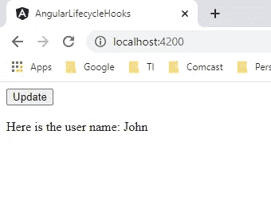

作者图片

现在，让我们彻底理解上面提到的每一个生命周期挂钩。

## **1。ngOnChanges**

该方法在创建组件时调用一次，然后每当组件的输入属性之一发生更改时调用一次。作为一个参数，它接收一个 [SimpleChanges](https://angular.io/api/core/SimpleChanges) 对象，该对象包含关于哪个输入属性已经更改的信息——如果不止一个——以及其当前和以前的值。

需要注意的是，如果你的组件没有输入，或者你在没有任何输入的情况下使用它，框架不会调用`ngOnChanges()`。

这是生命周期挂钩之一，在各种情况下都很有用。当您需要根据接收到的输入属性处理组件中的任何特定逻辑时，它会很方便。

为了理解这一点，让我们用下面的代码更新`child.component.ts`:

您可能已经注意到，我们从`@angular/core` 中导入了`OnChanges`，然后在`implements` 列表中为`ChildComponent`类添加了`OnChanges` 。现在我们添加了来自`OnChanges`接口的`ngOnChanges()`，并接受一个基本上是`SimpleChanges`对象的参数。然后我们简单地添加了`console.log`语句来打印作为参数接收的值。

现在，如果我们刷新浏览器并打开控制台，我们会看到第一次刷新/打开应用程序后调用了`console.log()`。

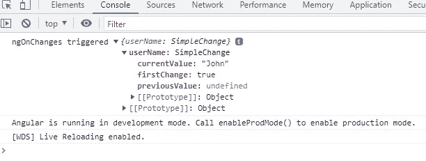

作者图片

我们可以看到，接收到的`changes`对象有三个键:`currentValue` *、* `previousValue`、和`firstChange`。这三个键的工作原理和它们听起来的一样。

如果这不是我们第一次这样做，或者如果当前值只有`Bob`，我们可以说我们想要改变`userName`值。我们可以在这里做任何事情，所以让我们进行第二个场景。

这里，我们添加了一个条件来检查它是否是第一次/初始变更，然后我们检查`currentValue`是否仅仅是`Bob`。

现在，如果我们点击`Update`按钮，我们应该看到`console.log()`功能再次被触发。发生这种情况是因为`@Input()`值从`John`变为`Bob`。如果我们持续点击`Update`按钮，我们将不会在控制台上看到任何新内容，这是因为`@Input()`没有改变。

如果我们现在点击`Update`按钮，我们应该看到`console.log()`功能再次被调用。这是因为`@Input()`值从`John`更改为`Bob`。如果我们一直点击`Update`按钮，我们将不会在控制台上看到任何新内容，因为`@Input()`没有改变。

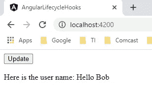

作者图片

我们甚至可以在控制台中验证我们的更改。

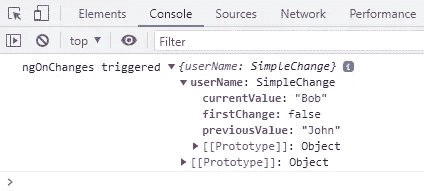

作者图片

## 2.恩戈尼特

在组件的生命周期中，这个方法只在第一次`ngOnChanges`调用之后调用一次。当没有模板绑定输入时，即使`ngOnChanges`没有，也仍然调用`ngOnInit`。

在 Angular 中，这是最常用的生命周期挂钩之一。在这里，您可以请求服务器加载内容，为该组件处理的表单创建一个[表单组](https://angular.io/api/forms/FormGroup)，设置[订阅](https://rxjs.dev/guide/subscription)，等等。在组件构建完成后，您可以在这里进行任何初始化。甚至，每当我们使用 Angular CLI 创建一个新组件时，`ngOnInit`是默认情况下唯一可用的钩子。

但是如果同样的工作(初始化`FormGroup`或者从服务器获取数据)可以在组件的`constructor()`中完成，那么使用`ngOnInit`钩子又有什么意义呢？请允许我解释一下。

以下是一些最重要的要点:

## 构造函数()

*   当类被实例化时，默认方法，即`constructor()`被调用，这确保了类及其子类中的所有字段都被正确初始化
*   在 Angular 中，依赖注入器(DI)分析构造函数参数，当它通过调用`new MyClass()`创建一个新的实例时，它寻找与构造函数参数类型相匹配的提供者，解析它们，并像 new `MyClass(someArg)`一样将它们传递给构造函数
*   应该仅用于初始化类成员，而不应该用于执行实际工作。因为`constructor`在`ngOnInit`之前被调用，所以组件还没有被创建；只有组件类被实例化了，所以引入了依赖项，但是初始化代码不会运行。

## 恩戈尼特人()

*   这是 Angular 调用的一个生命周期挂钩，表示组件已经完成。
*   所有初始化/声明都应该用这个方法完成。因为组件将在此时被初始化。

为了清楚地理解这个钩子，让我们这样做:

我们只是在 ngOnInit 中为`parent`和`child`组件添加了`console.log`语句。现在让我们看看输出。

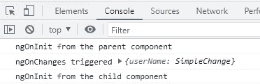

作者图片

首先创建父组件是有意义的(首先触发`parent`组件中的`ngOnInit`，然后是`child`组件)。如果我们点击`Update`按钮，则`ngOnInit`不会被触发。因为，如前所述，它只会出现一次。

## **3。ngDoCheck**

该挂钩可视为`ngOnChanges`挂钩的延伸。此方法可用于检测 Angular 无法或不愿检测的变化。在每次变化检测中，在`ngOnChanges`和`ngOnInit`钩子之后调用它。

*这个钩子很贵，因为叫得太频繁；在每个变更检测周期之后，不管变更发生在哪里。因此，应该谨慎使用它，以免对用户体验产生负面影响。*

让我们使用以下代码将这个钩子添加到我们的`child`组件中:

现在，我们将在运行应用程序后看到这个结果。

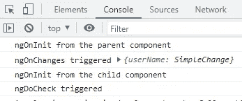

作者图片

当我们点击`Update`按钮时，我们应该看到`ngOnChanges`和`ngDoCheck`被激活。

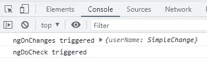

作者图片

如果我们继续点击`Update`按钮，我们应该看到每次点击后只有`ngDoCheck`被触发，因为`ngDoCheck`检测到了变化。

所以现在的问题是:

如果`@Input()` 属性没有变化，`ngDoCheck`如何捕捉变化？

因为 Angular 跟踪对象引用，如果我们在不改变引用的情况下改变对象，Angular 将不会检测到变化，也不会对组件运行变化检测。因此，新的 name 属性值将不会再次呈现在 DOM 中。幸运的是，我们可以检查对象突变，并使用`ngDoCheck`生命周期钩子通知 Angular。

## 4.ngAfterContentInit

在第一个`ngDoCheck`之后，这个方法在组件的生命周期中只被调用一次。在这个钩子中，我们在组件创建后第一次访问了 [ContentChild](https://angular.io/api/core/ContentChildren) 的[element ref](https://angular.io/api/core/ElementRef)；这是在 Angular 已经将外部内容投影到组件视图中之后。

为了理解这一点，让我们添加以下代码:

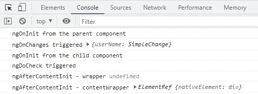

作者图片

在前面的代码片段中，我们将内容从`parent`组件投影到`child`组件。查看本文档以了解更多关于内容投影的信息。

我们此时只能访问投影内容(contentWrapper 拥有投影内容的值)。此外，组件的模板还没有初始化(包装器是`undefined`)。在`ngAfterViewInit`挂钩上，它将被初始化并准备使用。

## 5.ngAfterContentChecked

在组件的生命周期中，这个方法在`ngAfterContentInit`之后被调用一次，然后在每个后续的`ngDoCheck`之后被调用。在 Angular 检查了当前摘要循环中投射到组件中的内容后，它被调用。

为了理解这一点，让我们添加以下代码:

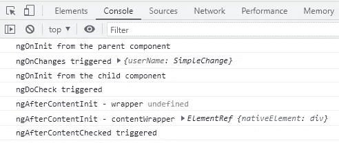

作者图片

如果我们点击`Update`按钮，每次都会触发`ngAfterContentChecked`，同样也会触发`ngDoCheck`。

## 6.ngAfterViewInit

这个方法在组件的生命周期中只被调用一次，紧接在`ngAfterContentChecked`之后。在这个钩子中，我们可以在组件创建后第一次访问 [ViewChildren](https://angular.io/api/core/ViewChildren) 的[element ref](https://angular.io/api/core/ElementRef)；那是在 Angular 已经组成了组件的视图和它的子视图之后。

当您需要在依赖于视图组件的视图上加载内容时，例如当您需要设置视频播放器或从 canvas 元素创建图表时，这个钩子非常有用。

为了理解这一点，让我们添加以下代码:

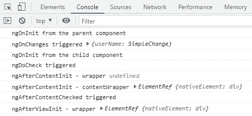

作者图片

至此，组件的模板已经创建，我们可以访问它了。

## 7.ngAfterViewChecked

这个方法在`ngAfterViewInit`之后被调用一次，之后每次`ngAfterContentChecked`都被调用。在 Angular 已经检查了当前摘要循环中组件的视图和子视图之后，将调用该函数。

为了理解这一点，让我们添加以下代码:

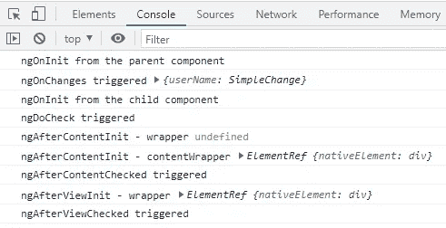

作者图片

如果我们一直点击`Update`按钮，每次都会触发`ngAfterViewChecked`、`ngDoCheck`和`ngAfterContentChecked`。

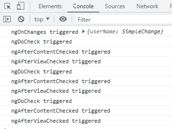

作者图片

## 8.恩贡德斯特罗伊

最后，这个方法在组件的生命周期中只被调用一次，就在它被 Angular 销毁之前。在这个钩子中，您应该通知应用程序的其余部分组件正在被销毁，以防需要根据该信息采取任何操作。

这也是您应该为该组件放置所有清理逻辑的地方。例如，您可以在这里删除任何本地存储信息，更重要的是，取消订阅观察、分离事件处理程序、停止计时器等。为了避免[内存泄漏](https://www.geeksforgeeks.org/what-is-memory-leak-how-can-we-avoid/)。

值得注意的是，当用户刷新页面或关闭浏览器时，不会调用`ngOnDestroy`。因此，如果您需要在这些情况下处理任何清理逻辑，您可以使用 [HostListener](https://angular.io/api/core/HostListener) decorator，如下所示:

```
[@HostListener](http://twitter.com/HostListener)(‘window:beforeunload’)
ngOnDestroy() {
  // Insert Logic Here!
}
```

为了理解这一点，让我们添加以下代码:

运行应用程序后，这是我们更新后的 UI 的外观:

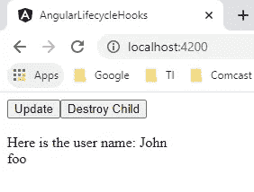

作者图片

当我们点击`Destroy Child`按钮时，`ngOnDestroy()`被调用，组件被从 DOM 中移除。

下图描述了单击销毁子按钮之前的 DOM。

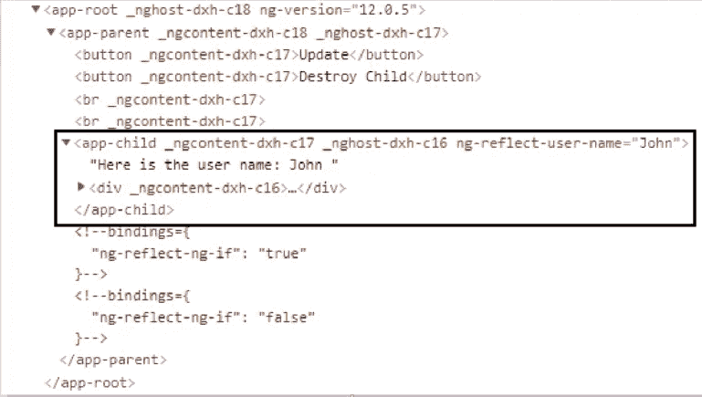

作者图片

下图描绘了点击`Destroy Child`按钮后的 DOM。

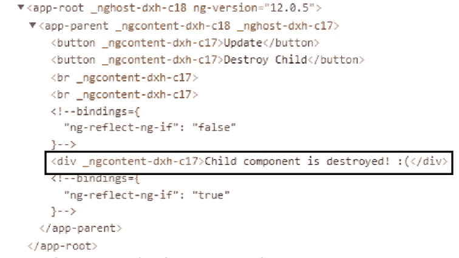

作者图片

# 长话短说

长话短说，通过将过程分成两步，我们可以更好地理解生命周期挂钩:第一次挂钩和每个变更检测周期中的挂钩。

**第一步:首次挂钩，**触发的挂钩有:

*   `onChanges`
*   `onInit`
*   `doCheck`
*   `afterContentInit`
*   `afterContentChecked`
*   `afterViewInit`
*   `afterViewChecked`
*   `onDestroy`:一旦组件从 DOM 中移除，就会调用这个函数

**第二步:在每个变化检测周期挂钩**中，触发的挂钩有:

*   `onChanges`
*   `doCheck`
*   `afterContentChecked`
*   `afterViewChecked`

下图详细描述了角度组件/指令生命周期。

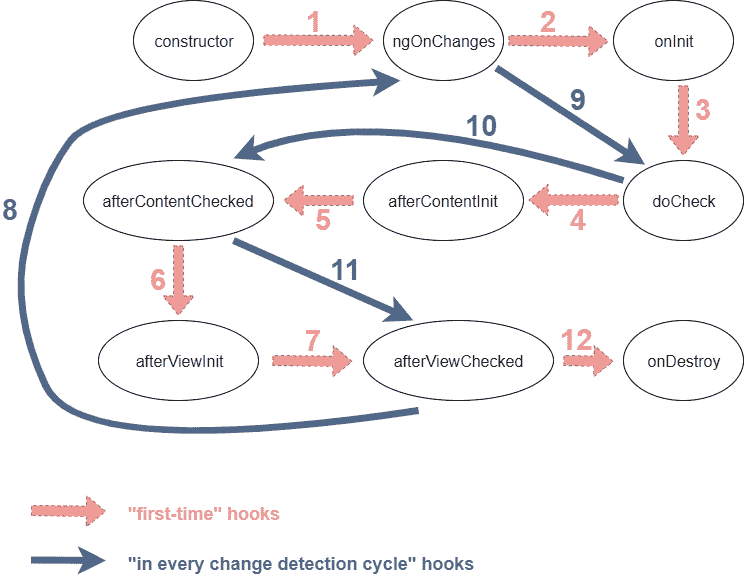

作者图片

## 结论

我们学习了 Angular 生命周期挂钩，它们的目标，它们何时被调用，以及它们在开发 Angular 应用程序时如何非常有用。因此，了解它们的工作原理以及你可以用它们实现什么是至关重要的，这样你就可以在需要的时候应用它们。

这就是这篇文章的内容。我希望你今天学到了一些新东西。想看更多这样的文章，敬请期待！

感谢阅读！