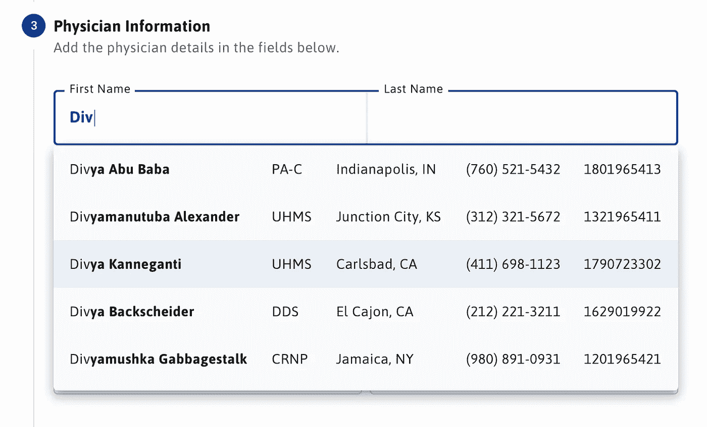

# 有角度的材料技巧—自动完成多个输入字段

> 原文：<https://betterprogramming.pub/angular-material-tricks-autocomplete-with-multiple-input-fields-adebbaae5603>

## 是的，您可以为两个输入创建一个自动完成下拉菜单

照片由 [Edho Pratama](https://unsplash.com/@edhoradic?utm_source=medium&utm_medium=referral) 在 [Unsplash](https://unsplash.com?utm_source=medium&utm_medium=referral) 上拍摄

这将是一篇不短的博文，讲述我如何调整 Angular Material 的自动完成组件，以基于两个输入框而不是一个输入框获得结果。

我正在为医疗保健行业开发 web 应用程序。在我目前的任务中，我被要求提供医生搜索功能。该要求称，应用程序的用户可以通过名字和姓氏搜索医生，并支持自动完成。

这看起来像是一个简单的任务。我们选择使用优秀的 Angular Material 框架，我有了一个好主意，使用素材库中的[自动完成](https://material.angular.io/components/autocomplete)组件。

我打算提供一个文本框。用户将输入医生的名字，瞧，一个自动完成的下拉菜单将显示医生列表，对吗？

不对。

# 问题是

我使用了一个关系数据库，它将医生的名字存储在两列中，称为`First_Name`和`Last_Name`。需求是让我让用户同时用名字、姓氏或两者进行搜索。

对于单个文本框，我无法知道输入的文本是医生的名还是姓。我可以运行一个`or`查询，但是返回的结果太多了。

由于不同的搜索组合，如果用户在文本框中输入不止一个名字，情况会变得更糟。它看起来没有希望，我有点卡住了。

# 解决方案

我想到的另一个主意是将单个全名文本框一分为二。我可以从单独的名和姓文本框中检索用户输入。分隔文本框可以让我识别要查询的正确的一列或多列。

当我检查 Angular Material autocomplete 组件时，它看起来像是为单个输入字段设计的。甚至没有针对多个输入字段的单一引用实现，似乎没有人尝试过这样做。

尽管如此，我还是决定试一试，不抱太大希望。下面是我的解决方案，奏效了！

这是最终的结果

要实现这一点，我们必须回答两个问题:

1.  如何为两个文本框显示一个为单个文本框设计的自动完成下拉框？
2.  当这些文本框中的任何一个有新值时，如何触发 autocomplete 事件？

# 为两个文本框显示单个自动完成下拉列表

让我们一行一行地查看下面的 Html*来了解这是怎么回事。*

## *第一行*

*在第 1 行，我们有一个引导程序`row` `div`，它有一个`matAutocompleteOrigin`属性。我们还有一个名为`#origin`的模板引用变量。*

*`matAutoCompleteOrigin`属性使`div`成为呈现我们的自动完成下拉框的候选目标。在接下来的几行中，我们将使用`#origin`变量将自动完成组件绑定到这个`div`。*

## *第 5 行*

*在第 5 行，我们定义了名字输入框。使用`[matAutocomplete]=”auto”`，我们将自动完成组件绑定到这个输入框。`[matAutocompleteConnectedTo]=”origin”`告诉浏览器呈现相对于我们在第 1 行定义的`div`的自动完成下拉列表。*

## *第 6 行*

*在第 6 行，我们用名为`#auto`的模板引用定义了我们的自动完成组件，我们在第 5 行引用了它。*

*我们还将自动完成的`optionSelected`事件绑定到`setFormData`函数，以便能够定制默认行为。我们将在第二节中讨论`setFormData`功能。*

## *第 7–11 行*

*第 7–11 行定义了将显示在自动完成下拉列表中的选项。我们使用`async`管道在`physicians`可观察对象上循环，并显示医生的名字和姓氏。*

## *第 18–25 行*

*第 18–25 行对姓氏输入框做同样的事情，这不需要额外的解释。*

# *为两个独立的输入框触发相同的 Autocomplete 事件*

*在这一节中，我们将讨论如何使用来自两个不同输入框的更改来触发对同一个自动完成下拉菜单的医师搜索。*

*让我们一行一行地研究代码。*

## *第 18–21 行*

*在第 18–21 行，在初始化`PhysicianInfoComponent`时，我们进行了两个函数调用`setupPhysicianControls()`和`setupPhysiciansObservable()`。*

*第一个调用用我们在模板中引用的所需的`FormControl`对象建立了反应式表单。第二个调用用于设置`physicians`可观察对象，自动完成组件使用它来显示选项列表。*

## *第 23–41 行*

*由于设置表单控件很简单，我们的重点将放在第 23 到 41 行的`setupPhysiciansObservable`方法上。*

*Angular `FormControl`对象提供了一个`valueChanges`属性，这是一个可观察的属性，每当表单控件的值发生变化时，它就会发出表单控件的值。*

*在我们的例子中，我们有两个表单控件要处理，分别是名字和姓氏。每当这些表单控件中的一个值改变时，我们都必须在后端触发新的医生搜索。*

*在这种将两个可观测量合并成一个的场景中,`[merge](https://www.learnrxjs.io/operators/combination/merge.html)`操作符非常有用。*

## *第 24 行*

*在第 24 行，我们使用`merge`来合并名字和姓氏`valueChanges`观察值。*

## *第 26 行*

*第 26 行将新值的发射延迟 300 毫秒，以便在触发搜索之前给用户时间来完成他们的搜索标准。*

## *第 27–32 行*

*在第 27–32 行，我们将发出的对象从单个输入框的值更改为名和姓输入框的值。这是因为我们的要求是让用户同时搜索名和姓。*

## *第 33 行*

*第 33 行将搜索词限制在三个字符以上。这样，我们不会触发对短于三个字母的术语的搜索。*

## *第 35–39 行*

*第 35–39 行发出后端请求，并将`response`对象映射到`response.body`，这是一个医师数组，它结束了我们的医师观察设置。*

# *setFormData 方法*

*我们必须研究的第二个重要函数是我在第一节中提到的`setFormData`方法。*

*尤其是第 74–75 行在这个方法中非常重要，因为当从下拉菜单中选择一个选项时，它们会覆盖 autocomplete 组件的默认行为。*

*在这几行中，我们不是让 autocomplete 组件设置名字和姓氏表单控件的值，而是手动设置这些值。*

*两行代码非常简单，但是技巧是使用`{emitEvent: false}`选项进行`setValue`调用。*

*默认情况下，当值改变时，表单控件发出一个`valueChanges`事件。这与用户在表单上进行更改或者您在代码中进行更改无关。*

*通过使用`{emitEvent: false}`，我们防止了一个`valueChanges`事件被触发，否则这将导致通过我们的`physicians`可观察的第二个后端调用。*

*帖子到此结束。我希望它对你的日常努力有所帮助。*

*编码快乐！*