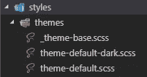
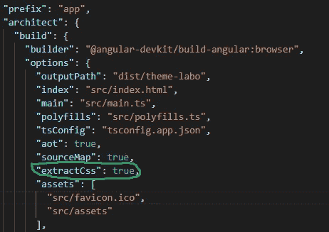
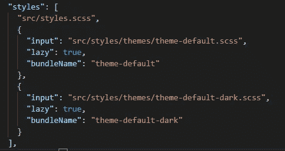
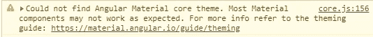

# 有角度的:多个主题，但不影响包的大小(有材料或没有材料)

> 原文：<https://betterprogramming.pub/angular-multiple-themes-without-killing-bundle-size-with-material-or-not-5a80849b6b34>

## 让用户对主题的选择感到满意

图片由[克里斯·马汀](https://pixabay.com/fr/users/cmart29-3708955/?utm_source=link-attribution&utm_medium=referral&utm_campaign=image&utm_content=1885352)发自 [Pixabay](https://pixabay.com/fr/?utm_source=link-attribution&utm_medium=referral&utm_campaign=image&utm_content=1885352)

我假设你已经熟悉了[棱角](https://angular.io/)、[棱角材质](https://material.angular.io/)的概念，以及如何用棱角材质进行主题化。有很多可用的指南，或者使用[官方文档](https://material.angular.io/guide/theming)。

如果你不使用 Angular Material，这个指南也很有趣，它可以很容易地应用于其他 UI 库或你自己的库。

# 角状材料

当我们需要给应用程序添加主题时，棱角分明的材料让我们的生活变得简单。

使用预处理器风格，比如 [Sass](https://sass-lang.com/) 或 [SCSS](https://sass-lang.com/documentation/syntax) ，你只需使用 UI 库提供的 mix-ins 就可以了。

主题的例子

您可以添加任意多的主题，并且您的用户可以轻松地选择它们，只需一次点击，就可以提供一个非常适合您的用户的站点。

但是…您有一些棘手的问题需要解决:

*   你必须通过在主 CSS 文件中提供一个类来区分每个主题。
*   当用户选择一个主题时，您必须创建一个逻辑来管理应用程序中的这些类。
*   每个主题都将包含混音，并且您正在增加包的大小。对你的用户来说下载量很大。
*   您的文件中会有许多未使用的 CSS 属性。

假设我们有一个包含两个主题的应用程序:默认和黑暗主题。

我们可以创建一个`_theme-base.scss` 来进行干燥:

我们的两个主题是:

默认主题

黑暗主题

最后，我们创建应用主题的类:

我们主题的课程

在这种配置下，我们的包大小是 184KB。

(我使用了`angular.json`中的选项`extractCss`来获取 CSS 文件，而不是 JS 文件，以便在 prod 和 dev 之间保持一致。您将在本文后面理解为什么)

我最近做了一个项目，其中有多个主题(超过六个)。包的大小很大:1.56MB

经过优化后，我成功地将每个主题的大小减少到了 150KB，因此 90%的 CSS 没有被用户使用，它必须下载它！

# 管理多个主题

这是我为管理多个主题而创建的一个指南，它不会因为沉重的风格包大小而影响用户体验。

## 1.创建一个单独的文件夹来存储你的主题文件

由于您将所有的主题都存储在一个地方，因此很容易找到它们，如下所示:

## 2.修改 angular.json，将 CSS 主题提取到文件中

当你开发的时候，Angular 会把你的样式转换成 JS 文件。开发过程中速度更快。

仅仅为了测试，您可以通过在您的`angular.json`中添加一个选项来禁用这个行为。默认情况下，这在您的产品选项中处于激活状态。

现在，我们必须为每个主题创建一个单独的 CSS 文件。为此，您必须通过指定您想要创建的文件来再次修改`angular.json`。

`input`:取文件所在的路径。
`lazy`:如果为真，向 Angular 表示我们不想将文件自动添加到我们的 HTML 的头部。
`bundleName`:只是输出名称。

此时，如果您修改了其中一个主题的属性`lazy: true`，您将在浏览器中直接看到结果。但是，真正的兴趣是动态加载它。

对于这个例子，我们可以通过一个服务来做到这一点。

## 3.创建管理主题的服务

这项服务有必要做两件事:

*   在 HTML 的头部添加主题的 CSS 文件。
*   在主题和黑暗模式之间切换。

我将专注于第一项任务，并展示我是如何完成第二项任务的。

看看这个实现，并阅读下面的解释:

处理主题的服务

使用服务时，您将无法获取渲染器。

如果你对 [Renderer2](https://angular.io/api/core/Renderer2) 和 DOM 操作的概念不太适应，我推荐你阅读[我以前的文章](https://medium.com/better-programming/angular-manipulate-properly-the-dom-with-renderer-16a756508cba)。

*   第 26 行——有时候，Angular 也有这种问题，这就是为什么他们创建了 [RendererFactory2](https://angular.io/api/core/RendererFactory2) 。这样，我们可以创建一个渲染器，并在服务中使用它。您还可以插入文档，以访问`<head>`标签。

不用担心参数设置为`null`。第一个参数是类型为`any`的`hostElement`，第二个参数是类型为`RendererType2|null`的`type`。所以，把它们设置成`null`是没有问题的。

*   第 45 行——棘手的部分是`loadCss`方法。使用我们的渲染器，我们创建适当的链接标签，它将作为子元素添加到 head 中(第 52 行)。
*   第 51 行——为了避免没有风格的页面，我们通过给它承诺的决心来等待`onload`的结束。所以，当 CSS 文件被加载时，这个承诺就结束了。

其余的代码确保我们一次只使用一个主题，以改善页面的关键路径渲染。

## 4.将服务应用于您的组件，让奇迹发生吧

终于到了使用我们的`ThemeService`的时候了，看看它能有多不可思议！

下面是测试我们主题的 HTML:

及其组成部分:

您可以直接在浏览器中看到结果。

但是真正感兴趣的是你的包的大小。您应该有以下内容，而不是开始时的 184KB:

*   `theme-default.css` = 85.5KB
*   `theme-default-dark.css` = 72.5KB

# 优化建议

这是实现的一个例子，但不是最好的方法。

在现实世界的应用程序中，你必须管理缓存，这样用户就不会一次又一次地下载文件(想象一下，如果你的用户每天都改变主意？).这可以通过使用维修工人来实现。

同样，主题初始化可以直接在`APP_INITIALIZER`中实现。这可能是有趣的，并避免有棱角的材料大喊:

正常，因为我们延迟了棱角材质主题的加载。

祝你有美好的一天和快乐的编码！