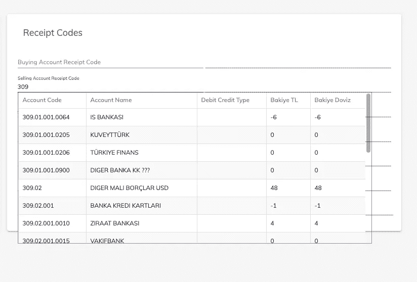
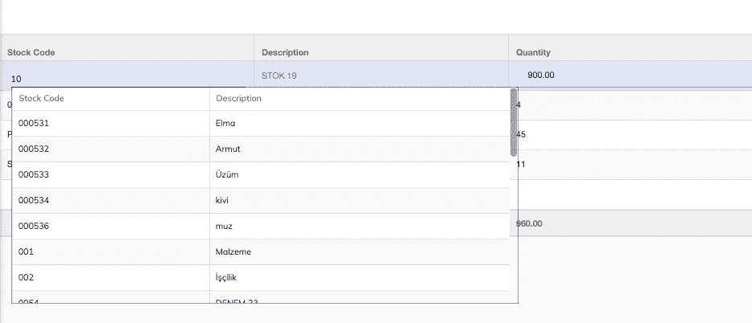
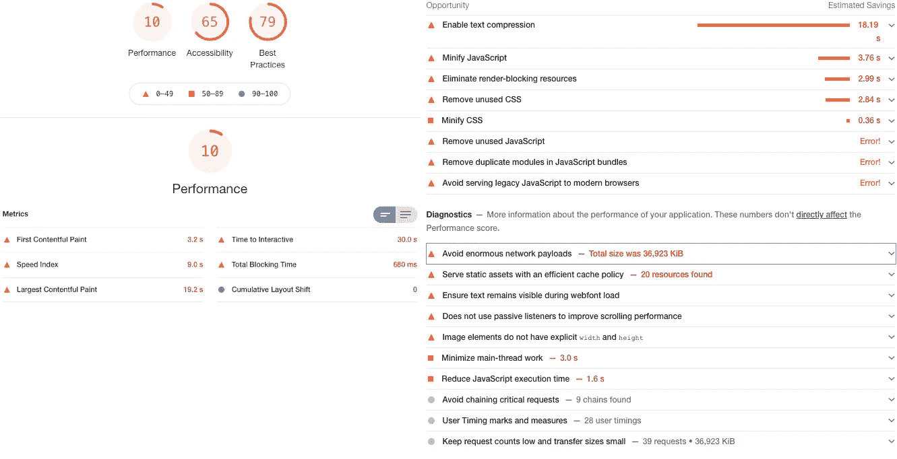

# 角度性能:5 个脉冲变化检测案例研究

> 原文：<https://betterprogramming.pub/angular-onpush-change-detection-f629cbce0bfa>

## [网页性能](https://rakiabensassi.medium.com/list/software-engineering-7a179a23ebfd)

## 从默认更改检测切换到 OnPush 更改检测的提示


照片由 [Siora 摄影](https://unsplash.com/@siora18?utm_source=medium&utm_medium=referral)在 [Unsplash](https://unsplash.com?utm_source=medium&utm_medium=referral) 上拍摄。

如果你搜索“角度变化检测”，你会发现很多文章有很多共同点。在本文中，我们不打算解释 *zone* 库是如何工作的，或者角度变化检测机制是如何实现的。我们将看到的是 Angular 应用程序中从默认切换到`OnPush`变化检测策略以优化其性能的五个真实案例。

您可能已经知道，`OnPush`变更检测不能开箱即用。您必须考虑数据结构的不变性，并调整代码设计和组件之间的交互。为了更清楚地理解**，**，我们将在今天的文章中通过分析和调整以不同方式设计的五个角度组件来应用这一点。

# 案例研究 1:容器组件

容器组件是智能组件。它们与服务、路由器和商店通信。他们知道要调用哪些服务，并负责从这些服务中检索数据。这里有一个例子:

[发票-容器.组件. ts](https://gist.github.com/rakia/bd5d43e415524270afdf73516d4b89b4#file-invoice-container-component-ts)

`InvoicesContainerComponent`从`InvoiceStoreService`中读取三个属性(两个观察值和一个数组)，然后通过模板中的数据绑定将它们传递给子表示组件(`invoices-ui`):

[invoices-container.component.html](https://gist.github.com/rakia/fb2c2edb37ad1f6ec474129fd328782a#file-invoices-container-component-html)

*   `displayColumnDefs`是商店服务中定义的`readonly`属性。我们不需要担心从中检测到新的值，因为一旦我们初始化它，它就不会改变。
*   `notification$`和`dataList$`是根据用户与应用程序的交互发出新值的可观察值。我们使用`async`管道订阅模板中的这两个属性，这确保了自动取消订阅 observables，并将新值(作为带有*新引用* 的对象)发送到`invoices-ui`的输入属性中。这便于在表示组件中使用`OnPush`变化检测。

如果我们不使用`invoices-container.component.html`中的`async`管道，而是订阅如下的`dataList$` observables:

可观测的角度订阅

然后在模板中传递新值:

*invoices-container.component.html*

`OnPush`变更检测不起作用，我们将面临一个问题。解决的方法是在`InvoicesContainerComponent`的构造函数中注入`ChangeDetectorRef`，在得到新的发票清单后调用`markForCheck()`方法:

angular change detectorref:markForCheck()

> “……`*AsyncPipe*`使用 OnPush 变化检测策略自动工作。...没有`*AsyncPipe*`的实现不会触发变化检测，所以我们需要为每个从可观察对象发出的新事件手动调用`*detectChanges()*`。迈克尔·霍夫曼

不过，要小心。呼叫`markForCheck()`被认为是最后的手段。

应用容器/呈现器模式(或智能和转储组件)的好处不仅在于指示 Angular 使用`async`管道为我们管理订阅/取消订阅，还在于为`OnPush`变更检测提供了更好的基础设施。

# 案例研究 2:演示者组件

现在让我们检查转储表示组件`invoices-ui`:

[发票-presenter.component.ts](https://gist.github.com/rakia/2f7e8b5959ad29dff945dbca87c96396#file-invoices-presenter-component-ts)

我们已经使用输入属性和事件将这个组件连接到它的父容器`invoices`。在这种情况下，我们可以很容易地将`changeDetection: ChangeDetection.OnPush`添加到`InvoicePresenterComponent`的元数据中，而不会有任何问题，因为`notification`和`dataList`将在它们的值改变时获得新的引用。

# 案例研究 3:自定义自动完成

我们的第三个例子是我在这篇文章中实现的自定义自动完成。它是一个表示性组件，具有以下输入属性:

*   数组`optionsList`:运行时会改变。
*   两个`FormControls` ( `valueFormControl`和`textFormControl`):它们会在运行时改变。
*   `optionSearchConfig`:初始化后不会改变的静态对象。
*   其他的输入是原语，这意味着它们不会对变更检测问题提出任何挑战。

[use-of-custom-autocomplete.html](https://gist.github.com/rakia/e88db1d512e475ac61273edd4449bc60#file-use-of-custom-autocomplete-html)

让我们看看打字稿代码:

[自定义-自动完成.组件. ts](https://gist.github.com/rakia/56ae55a9d860513c2fbdfb2f93fe6245#file-custom-autocomplete-component-ts)

这是模板:

角度材料自定义自动完成(HTML 部件)

在切换到`OnPush`变更检测之前，您能猜到我们是否需要任何重构吗？

让我们来分解一下:

*   `valueFormControl`和`textFormControl`输入属性的类型为`FormControl`(来自`@angular/forms`)。Angular 的反应形式通过提供不可变的数据结构来保持数据模型的纯净。每次表单发生变化时，`FormControl`实例不会更新现有的数据模型。它会返回一个新的。这意味着我们可以轻松切换到`OnPush`变化检测。
*   `optionsList`在自定义自动完成模板中获取其值，如下所示:

```
[optionsList]="dataList$ | async"
```

每当可观察对象`dataList$`发出一个新值时，`custom-autocomplete`接收一个带有新引用的新对象作为`optionsList`的值。因此，更改将被成功检测并呈现给用户。

# 案例研究 4:材料网格

您是否注意到在之前的模板`custom-autocomplete.component.html`中的覆盖图中呈现的子组件(材料表)？

调用有角度的材质网格

它是一个在多个组件中重用的动态演示器。在用户开始输入搜索查询后，我们向 REST API 发送一个请求。然后，我们将结果呈现在表格中，您可以在下面两张截图中看到:



在表单中使用的角形材料自定义自动完成



可编辑网格中使用的角度材料自定义自动完成

现在让我们试着深入研究这个问题。

`mat-grid`的三个输入参数中的两个接收静态值，在组件初始化后没有变化:

```
[**displayedColumns**]="optionSearchConfig.displayedColumns"
[**displayColumnDefs**]="optionSearchConfig.displayColumnDefs"
```

但是第一个输入(`dataSource`)，其类型为`MatTableDataSource` < T >，在每个新的`searchQuery`之后更新。每当`optionsList`改变时，`dataSource.data`在`custom-autocomplete`组件的`ngOnChanges()`钩子中获得一个新值:

角形钩

使用`ChangeDetectionStrategy.OnPush`、T21，我们将执行参照检查。因此，`mat-grid`组件不会检测到新值。对`dataSource`对象的引用仍然相同，因此不需要采取行动。为了解决这个问题，我们将实例化`MatTableDataSource`来创建一个新对象，而不是更新旧对象的`data`属性:

适于 OnPush 变化检测的角度 ngOnChanges 挂钩

# 案例研究 5:剑道网格的上下文菜单

下面是一个组件，每当用户右键单击剑道网格的一行时，它都会显示一个上下文菜单。在第 21 行，我们订阅了调用`onCellClick()`的`grid.cellClick`。最后一个方法负责提取和传达应该显示`kendo-popup`的位置，并在`dataItem`属性中设置用户单击的行的值:

剑道角度网格上下文菜单

乍一看，一切正常。但是当我们切换到`OnPush`变更检测时，我们注意到在一行上单击右键后没有出现上下文菜单。

在前面的四个例子中，我们的组件在输入改变后需要重新呈现。现在`GridContextMenuComponent`需要在视图中触发一个事件后重新呈现。

让我们在`onCellClick()`和`document.click`事件的回调中做一点调整，通过调用`markForCheck()`在用户右击后显式地将视图标记为已更改:

具有 OnPush 变化检测的剑道角度网格上下文菜单

酷！我们现在又像预期的那样有了上下文菜单。

# 外卖食品

> “毫无疑问，在 Angular 应用程序中，您应该坚持使用不可变的数据结构。它不仅允许您通过使用 OnPush 更改检测策略来提高运行时性能，还可以防止您陷入视图中呈现陈旧数据的麻烦中。”——[沃伊切赫·特拉维斯基](https://indepth.dev/posts/1381/immutability-importance-in-angular-applications)

然而，如果您在加载完应用程序后性能很差——如下图所示——不要指望`OnPush`变更检测会修复它，因为它不会:



Chrome DevTools 中 Lighthouse 测量的性能不佳示例

由 Chrome Lighthouse 衡量的这一结果表明，我们应该采取以下一项或多项措施:

*   将大组件和 JavaScript/TypeScript 文件拆分成较小的组件。
*   删除不用的文件和死代码。
*   通过使用内存化、缓存等减少 HTTP 请求的数量。
*   用 *webpack-bundle-analyzer* 分析捆绑包，检查庞大的第三方库是否值得使用。

您现在可能想知道为什么您应该关心变更检测策略呢？

不要混淆。网络表演有不同的类型。为了简单起见，让我们考虑两种类型:一种是在浏览器上直接调用您的 web 应用程序，另一种是在长时间使用它之后(运行时性能)。

有一件事你可以非常确定，那就是`OnPush`变更检测(以及取消订阅可观察值)将减少执行所花费的时间和消耗的资源数量，从而优化运行时性能。要了解这一改进，您需要[比较与](https://medium.com/better-programming/build-me-an-angular-app-with-memory-leaks-please-36302184e658)交互后的性能，并在相当长的时间内不使用 F5 重新加载页面的情况下使用您的 web 应用。

在长时间会话中保持最佳性能在生产中至关重要。

感谢阅读。如果你有一些问题，请在评论中告诉我，我会回复你。

🧠💡我为一群聪明、好奇的人写关于工程、技术和领导力的文章。 [**加入我的免费电子邮件简讯独家访问**](https://rakiabensassi.substack.com/) 或在此注册媒体。

*你可以在 Udemy 上查看我的* ***视频课程****:*[*如何识别、诊断、修复 Web Apps 中的内存泄漏*](https://www.udemy.com/course/identify-and-fix-javascript-memory-leaks/) *。*