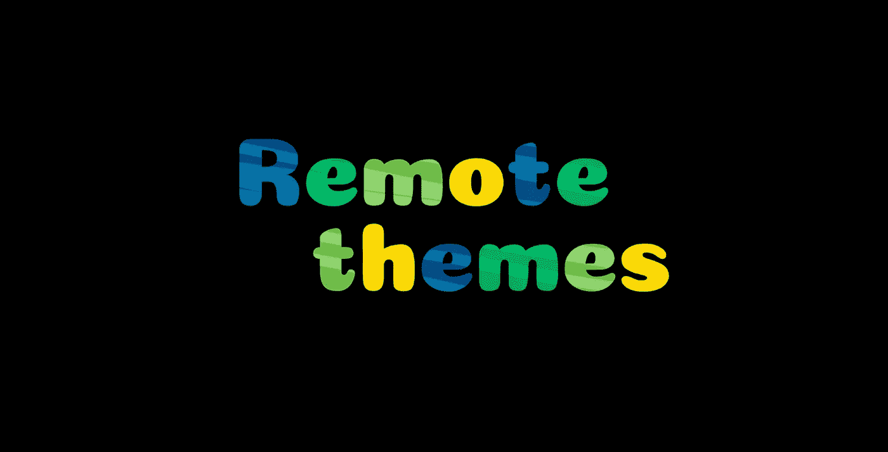
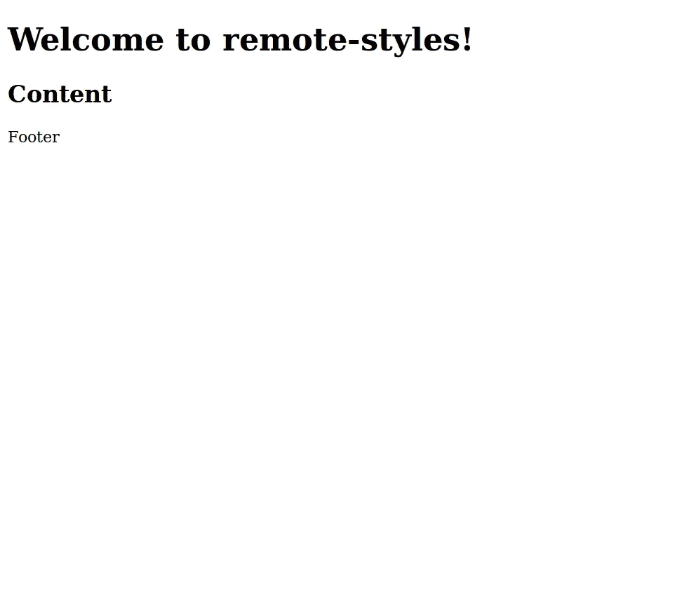
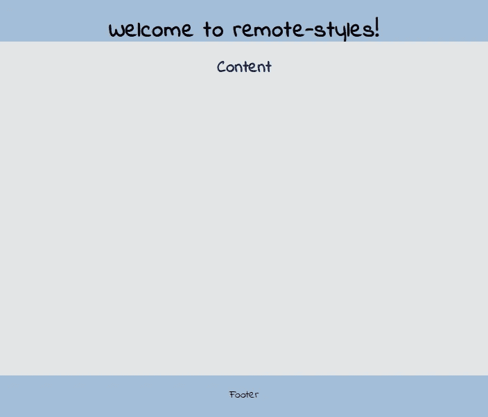
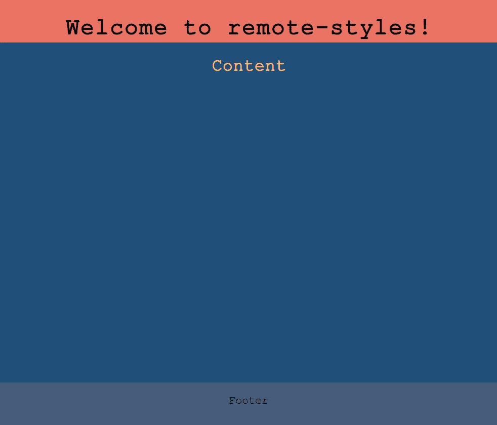

# 为 Angular 应用程序创建服务器控制的远程主题

> 原文：<https://betterprogramming.pub/angular-remote-themes-21ff698ed12e>

## 通过外部配置设置颜色、字体和其他样式元素



图片来自 loading.io。

考虑到周围有多少技术供应商，现在的创业公司很容易将现有产品作为投入生产的敲门砖。这些技术供应商提供的最受欢迎的解决方案是[软件即服务(SAAS)](https://en.wikipedia.org/wiki/Software_as_a_service) 。

假设我们是一家技术供应商，拥有一个产品，其中包含一个最终用户应用程序。我们通过 SAAS 为该产品和最终用户应用提供服务。现在的问题是，我们所有的客户都要求终端用户应用程序的主题要符合他们自己的品牌。

这是一个为所有客户提供相同代码库的单个最终用户应用程序的想法，这将允许他们在不同的主题之间进行选择并远程控制它们。

# 介绍

我将使用来自[的前一篇文章](https://medium.com/better-programming/angular-application-with-loaders-216390c6da92)的代码库，为了简单起见，我将把终端用户应用程序称为应用程序。

因此，让我们假设我们允许客户从他们可以访问的专用内容管理面板更改颜色和字体，并且我们的应用程序通过调用专用端点来获取这些信息。

我们在应用程序中要做的第一件事是使用一个 [CSS 预处理器](https://developer.mozilla.org/en-US/docs/Glossary/CSS_preprocessor)。在这个例子中，我们将使用 [SASS](https://sass-lang.com/documentation) 和 [SCSS 语法](https://sass-lang.com/documentation/syntax)。以下是来自萨斯官方网站的解释:

> Sass 是一种编译成 CSS 的样式表语言。它允许您使用[变量](https://sass-lang.com/documentation/variables)、[嵌套规则](https://sass-lang.com/documentation/style-rules#nesting)、[混合](https://sass-lang.com/documentation/at-rules/mixin)、[函数](https://sass-lang.com/documentation/modules)等等，所有这些都具有完全兼容 CSS 的语法。Sass 有助于保持大型样式表的良好组织，并使在项目内部和项目之间共享设计变得容易。

# 变量

本说明中的关键词是[变量](https://sass-lang.com/documentation/variables)。使用它们可以从一个位置更好地控制样式元素的值。这是一个很棒的特性，在构建将被用作模板的主题时，可以节省您很多时间。

就像在其他编程语言中一样，定义变量相对简单。以下是保存原色和二次色值的两个变量的示例:

```
$primary-color: #3275a8;
$secondary-color: #32a83c;
```

然后，这些变量可以在各种组中用作样式属性值:

但是如果我们以这种方式定义变量，它们将总是有硬编码的值。如果我们想要创建多个预定义的主题，这可能是一个好主意，但是在我们的例子中，我们想要使用更动态的方法。

因此，另外，我们将使用 CSS 的`[var()](https://developer.mozilla.org/en-US/docs/Web/CSS/Using_CSS_custom_properties)`函数作为 SASS 变量值。这将允许我们稍后从角度分量动态设置值。下面是一个我们如何用 CSS 的`var()`函数定义这样一个变量的例子:

```
$header-color: var(--header-color);
```

## 旁注

1.  由于 SASS 中的[突变，最好使用带插值的变量，以避免升级项目应用程序时出现任何额外问题。](https://sass-lang.com/documentation/breaking-changes/css-vars)
2.  `var()`函数还接受第二个参数，该参数可以用作后备值。例如，`$header-color: var(--header-color, red);` 表示变量值默认设置为`red`。

# 样式文件

我们的示例应用程序有三个部分:页眉、正文和页脚，每个部分都有附加文本。

我们必须创建一个将用于应用程序的模板，所以让我们创建一个名为`style`的文件夹和两个附加文件——一个名为`variables.scss`，另一个名为`theme.scss`。里面的结构看起来像这样:

在`variables.scss`文件中，我们将定义所有帮助我们动态控制样式的变量:

在`theme.scss`文件中，我们将使用`@import`导入变量，然后在样式组中使用它们作为 CSS 属性值:

# 添加工作区配置

如果我们启动我们的应用程序，我们会看到类似这样的内容:



没有工作区配置的应用程序。

正如我们所看到的，仅仅创建样式文件并没有给我们带来预期的结果。Angular 是一个很棒的框架，但是它仍然不能读懂我们的思想(还不能！).为了将样式编译成实际的资源，我们必须调整`[angular.json](https://angular.io/guide/workspace-config)`文件中的配置。以下是 Angular 对这个文件的描述:

> 在 Angular [工作空间](https://angular.io/guide/glossary#workspace)的根级别，一个名为`angular.json`的文件为 Angular CLI 提供的构建和开发工具提供了工作空间范围和项目特定的配置默认值。配置中给定的路径值是相对于根工作区文件夹的。

我们将使用这两个选项属性(来自官方来源的描述):

*   `[styles](https://angular.io/guide/workspace-config#styles-and-scripts-configuration)` —添加到项目全局上下文中的样式文件数组。
*   `[extractCss](https://angular.io/cli/build)` —将全局样式中的 CSS 提取到 CSS 文件中，而不是 JavaScript 文件中。

`styles`属性定义了在哪里搜索我们的样式资源，如何命名它们，以及这个样式包是否被注入到项目中。通过设置`inject:false`，可以拥有多个不同风格的模板，也可以进行远程控制。

属性定义了我们是提取 CSS 文件并单独提供，还是让 Angular 的框架将它编译成一个. js 文件。在这个例子中，我们将使用一个提取的 CSS 文件。

这两个属性必须添加到`angular.json`文件中的`projects.architect.build`部分。实际配置如下所示:

现在，如果我们为应用程序提供服务并等到它构建完成，我们将能够使用`localhost:4200/remote-style.css`访问我们的样式资源。但是，应用程序本身不会应用样式。这是因为我们选择了`inject:false`，这意味着现在这是一个必须手动加载的外部资源。

# 从组件设置样式

在之前的一篇文章中，我写了一种从代码中加载外部样式的方法。下面是从`[app.component.ts](https://github.com/b-pagis/angular-remote-styles/blob/master/src/app/app.component.ts)`截取的简化代码:

这将把`<link rel=”stylesheet” href=”remote-style.css”>`添加到 HTML 标题中，并在浏览器实际应用样式时将`isStylesLoaded`变量的值设置为`true`。

# 控制风格变量

因为我们的目标是让风格被远程控制，所以我们必须创建一个服务来返回我们需要的值。我添加了一个[虚拟服务](https://github.com/b-pagis/angular-remote-styles/blob/master/src/app/services/configuration.service.ts)，它返回硬编码的值，延迟一秒钟。在现实生活中，这应该是一个返回这些设置的 API 调用。

现在，留给我们的是添加允许改变样式变量的代码。下面是一个将 CSS 变量的值设置为指定值的 JavaScript 函数:

```
document.documentElement.style.setProperty('--variable-name', 'variableValue');
```

在我们的例子中，为了改变 CSS 变量的值，我们必须将上面的函数与加载我们的`remote-style.css`文件的代码结合起来。这段代码放在`app.component.ts`文件中，这两个文件的组合如下所示:

现在，如果我们启动该应用程序，我们会看到:



主题应用示例#1。

如果我们转到`configuration.service.ts`文件，更改虚拟设置、服务变量的值，并重新加载我们的应用程序，我们会看到我们的样式已更改为:



主题应用示例#2。

您可以通过分析[完整代码](https://github.com/b-pagis/angular-remote-styles)来检查和连接任何缺失的点。

# 结论

如果您有一个案例，其中相同的应用程序必须提供给具有不同样式需求的不同客户，那么这个建议的方法将是完美的解决方案。所有的颜色、字体和徽标都可以由客户远程控制，并在启动应用程序时通过`GET`请求提供。

通过这种方式应用样式更改，您可以使用单个样式文件，更轻松地维护您的应用程序，而无需为每个客户进行定制。这也意味着更快的开发和更容易的测试(在大多数情况下),因为所有客户的代码库都是一样的。

# 链接

[](https://github.com/b-pagis/angular-remote-styles) [## b-pagis/angular-remote-style

### 颜色和字体可以通过外部配置控制的小例子。配置服务包含两个…

github.com](https://github.com/b-pagis/angular-remote-styles)  [## 句法

### Sass 支持两种不同的语法。每一个都可以加载另一个，所以选择哪一个取决于你和你的团队…

sass-lang.com](https://sass-lang.com/documentation/syntax) [](https://en.wikipedia.org/wiki/Software_as_a_service) [## 软件即服务

### “软件即服务”( SaaS)是一种软件许可和交付模式，在这种模式下，软件在一个…

en.wikipedia.org](https://en.wikipedia.org/wiki/Software_as_a_service) [](https://developer.mozilla.org/en-US/docs/Glossary/CSS_preprocessor) [## CSS 预处理程序

### CSS 预处理器是一个程序，它允许你从预处理器自己独特的语法中生成 CSS。有很多…

developer.mozilla.org](https://developer.mozilla.org/en-US/docs/Glossary/CSS_preprocessor) [](https://developer.mozilla.org/en-US/docs/Web/CSS/var) [## 风险值()

### CSS 函数可以用来插入自定义属性的值(有时称为“CSS 变量”)，而不是…

developer.mozilla.org](https://developer.mozilla.org/en-US/docs/Web/CSS/var)  [## 有角的

### Angular 是一个构建移动和桌面 web 应用程序的平台。加入数百万开发者的社区…

angular.io](https://angular.io/guide/workspace-config)