# 角度和 RxJS

> 原文：<https://betterprogramming.pub/angular-rxjs-async-pipe-deep-dive-2510b56f793a>

## 深入研究异步管道

我已经用异步管道的分叉版本构建了一个示例角度应用程序。我在整个分叉版本中添加了标记为`Async:`的 console.log()语句，其他内容保持不变。这些组件模拟了异步管道的各种情况。

下载[源代码](https://github.com/Everduin94/forked-async-pipe-tester)。

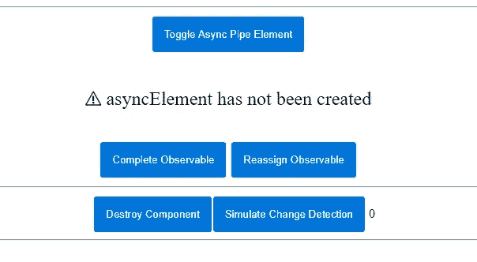

我们将介绍几个异步管道在运行时如何工作的例子，以及异步管道在高性能和可维护代码中的实际应用。如果异步管道对你来说是新的，请看[这里](https://angular.io/guide/observables-in-angular#async-pipe)和[这里](https://angular.io/api/common/AsyncPipe)快速介绍。

# **异步管道创建**

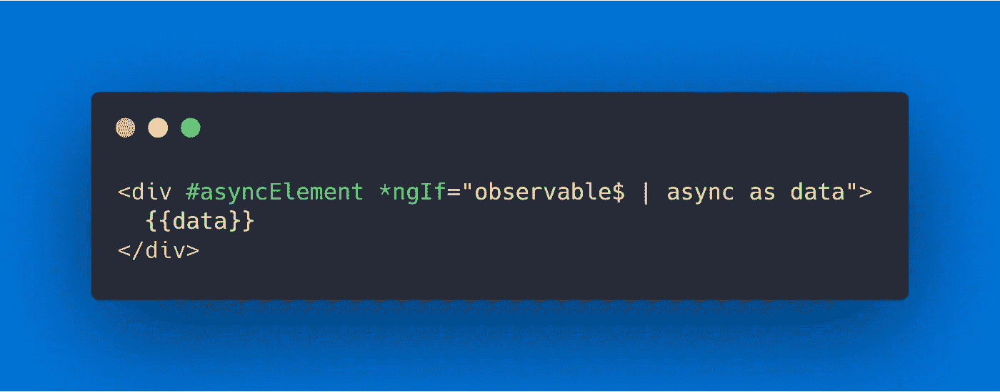

intro.component.html

当一个异步管道被创建时，它将在每个变化检测周期开始调用`transform()`。在第一次调用 transform 时，将从我们传入的可观察对象中创建一个订阅。如果我们的可观察值发出一个新值，显示值(`this._latestValue`)将被更新。

注意，`obj`是我们传入的可观测量，也称为源可观测量。`this._obj`是异步管道中可观察对象的保存状态。`this._latestValue`是我们在`{{data}}`中看到的值，我们称之为我们的显示/最新值。

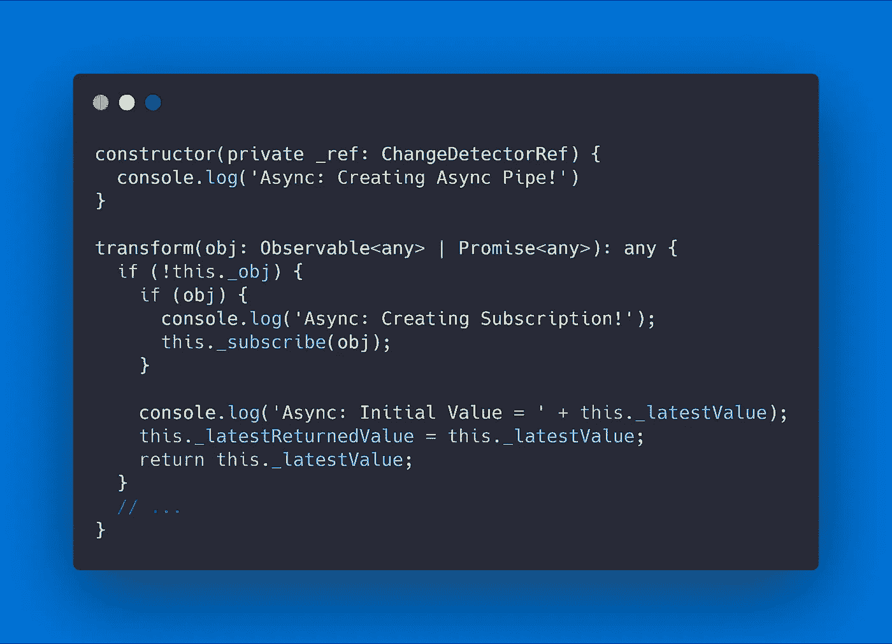

异步管道

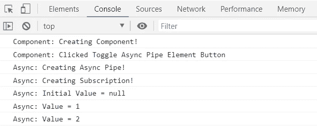

observable$ | async 的初始输出

# 实用:不要为同一个可观察对象创建多个异步管道

对于创建的每个异步管道，将会创建一个新的冗余订阅。每个管道的转换方法将在每个变化检测周期被调用。使用`as`，我们可以重用来自异步管道的最新值，并维护单一订阅。这将保持我们的应用程序的性能和可维护性。

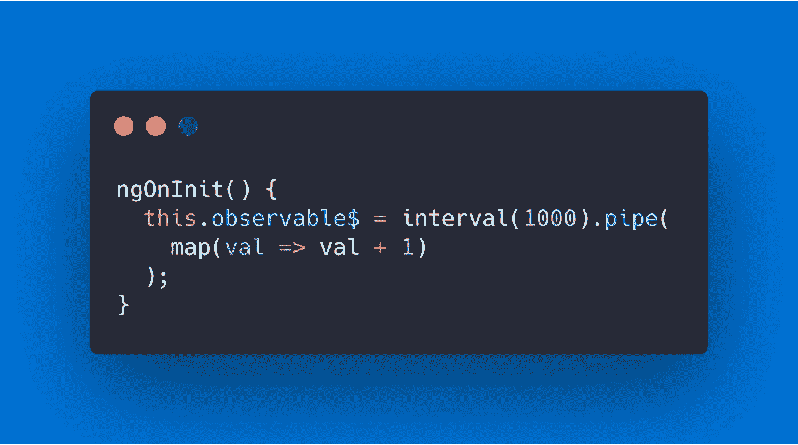

clean . component . ts & dirty . component . ts

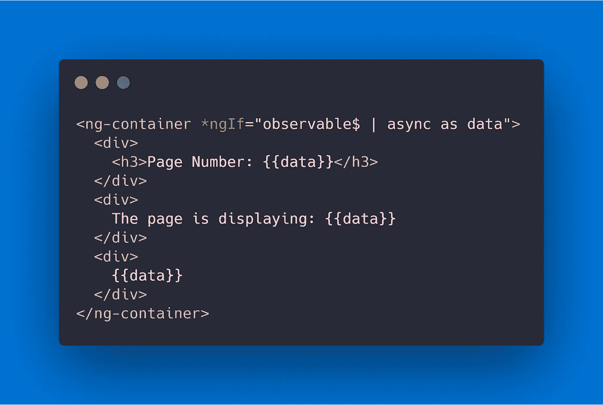

清洁.组件. ts

在`clean.component.html`中，当`observable$`发出一个值时，一个 change 事件将被触发，transform 方法将被调用一次。在`dirty.component.html`中，当`observable$`发出一个值时，将触发三个 change 事件，每个异步管道将调用 transform 方法三次。对于三个冗余管道，输出如下所示:

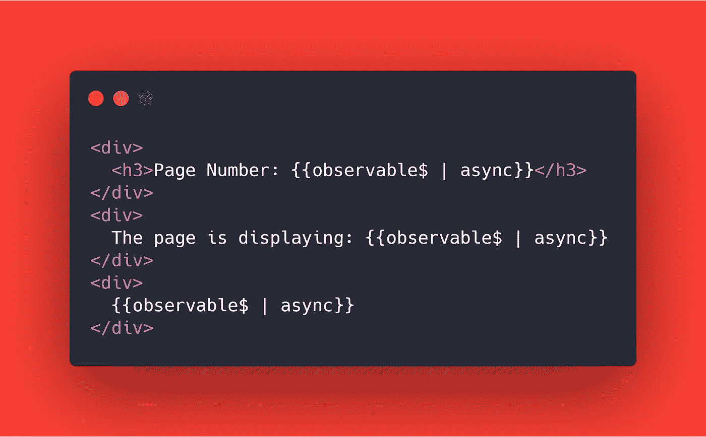

dirty.component.html

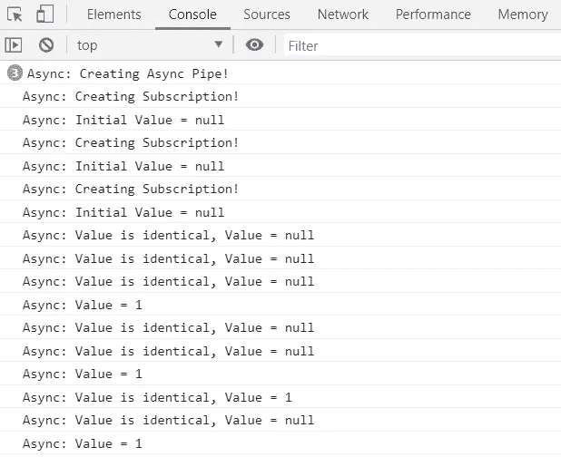

# **异步管道破坏**

当异步管道的容器从 DOM 中移除或者其父组件被销毁时，异步管道将被销毁。当异步管道被销毁时，它会执行任何必要的清理，例如取消订阅。在任何时候，我们都不需要显式地/手动地对源可观察对象的订阅调用 unsubscribe。

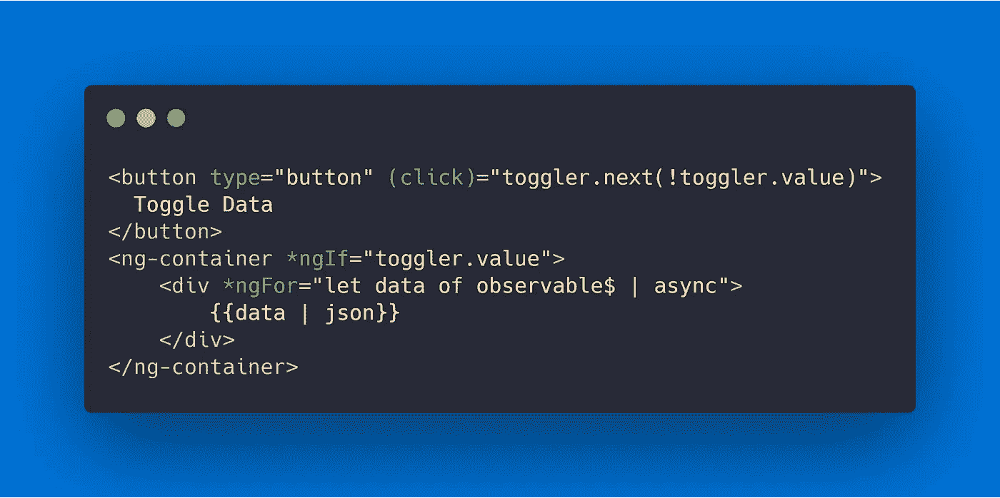

toggle.component.html

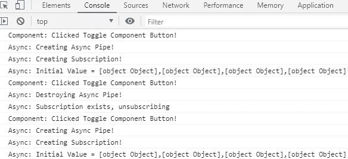

切换异步容器的创建/销毁

我们可以通过在 Google Chrome 开发工具中运行分配时间表来验证我们的订户正在被清理。从 51 个订户开始，我们反复切换组件。一旦我们停止，我们在切换时创建的任何订户都将被释放，因为我们仍然有 51 个订户。有关分配时间表的更多信息，请参见[此处](https://itnext.io/angular-rxjs-detecting-memory-leaks-bdd312a070a0)。

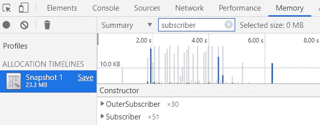

分配时间表

# 实用:异步管道联合收割机

RxJS 操作符`combineLatest`允许我们将多个可观察值组合成一个包含我们所有值的数组的可观察值。我们可以将这个数组映射到一个对象，然后从异步管道访问该对象上的任何显示值。[【2】](https://www.youtube.com/watch?v=Z76QlSpYcck)

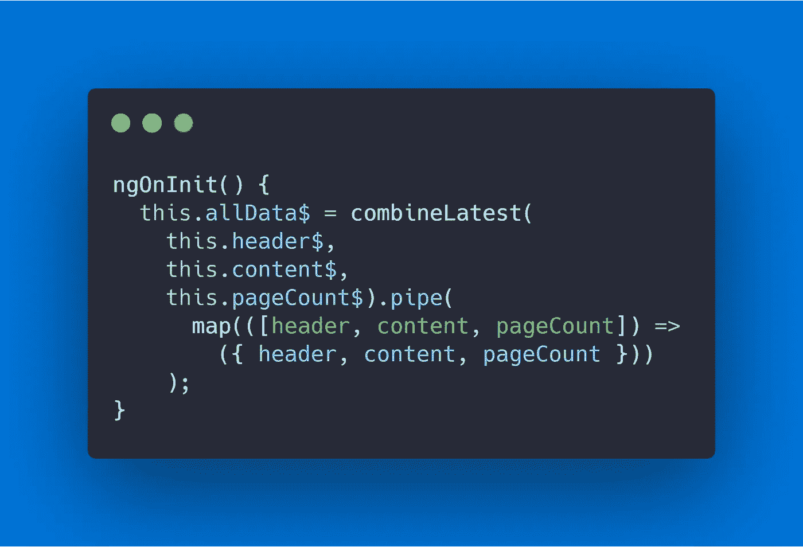

component.ts

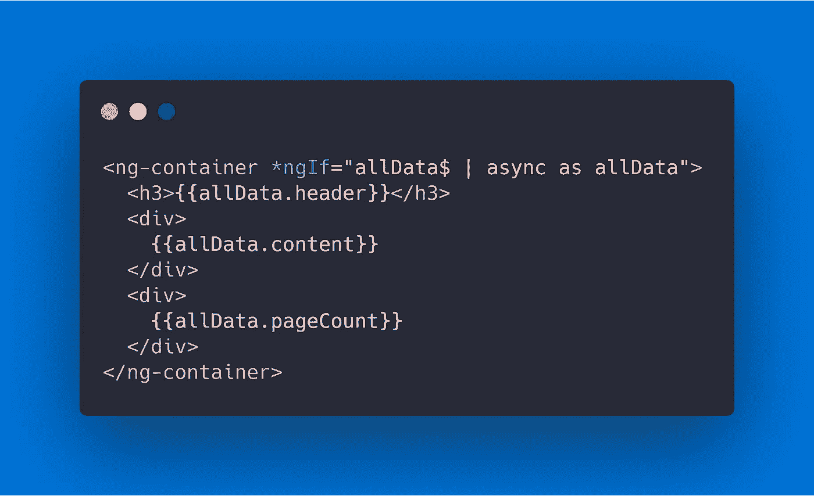

combine.component.html

注意，异步管道将对`allData$`中任何值的更改视为对对象的单个更改。这使我们的组件保持高性能，只需在检测到变化时发出一次订阅。

更改 allData$中的值

# 异步管道重新分配和完成

## 异步管道重新分配

如果源可观察对象被重新分配，异步管道将取消订阅先前的可观察对象，并订阅新的可观察对象。这本质上是边缘案例订阅管理。

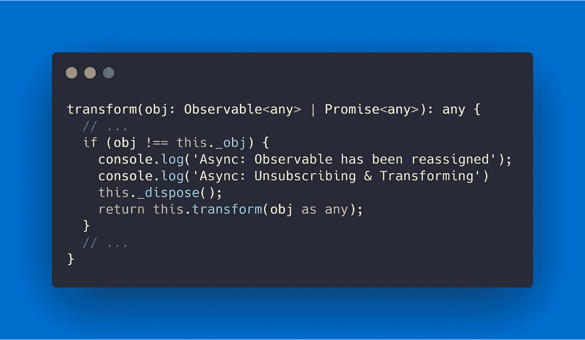

异步管道

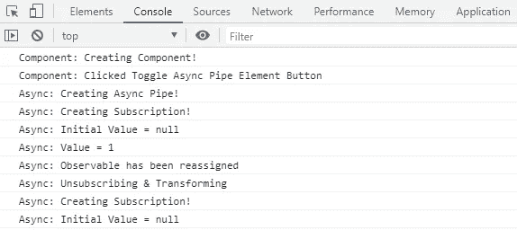

重新分配可观察的美元

## 异步管道完成

如果观测完成，排放将停止，我们的最新值仍将显示在 DOM 中。但是，异步管道仍然会在每个更改检测周期调用 transform 方法，直到它被销毁。

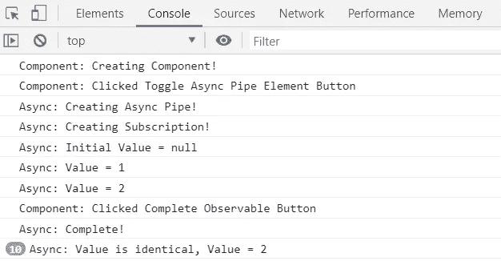

完成后切换更改检测

# 实用:适用时使用 OnPush 进行优化(高级)

异步管道在每个变化检测周期调用转换方法，因为它是一个不纯的管道[【3】](https://angular.io/guide/pipes)。对于每个转换调用，异步管道都执行一个检查来查看最新的值是否已经更改，如果没有，则提前返回。

异步管道结合我

然而，我们可以完全避免这些多余的检查。当异步管道的父组件使用`ChangeDectionStrategy.OnPush`时，它会进行优化。当父组件使用这种策略时，只有当视图被标记为更改时，才会调用 transform。

当一个值从异步管道的源 observable 发出时，它将通过`markForCheck()`标记要检查变更的视图。这意味着我们的异步管道只会告诉我们的组件，当它的源 observable 发出一个值时，它需要重新呈现。

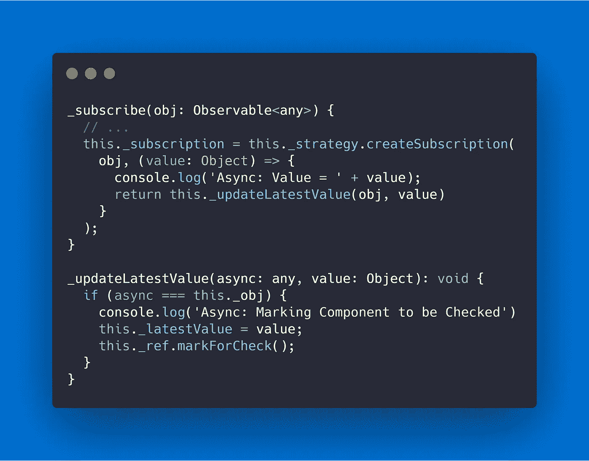

异步管道

换句话说，异步管道使我们能够利用`ChangeDetectionStrategy.OnPush`，而不必显式地/手动地管理变更检测。

我们可以通过模拟多个变化检测周期来验证这个想法。我在应用程序中添加了一个按钮，通过触发 DOM 中不相关的事件来模拟变化检测。我们将从测试`ChangeDetectionStrategy.Default`开始。

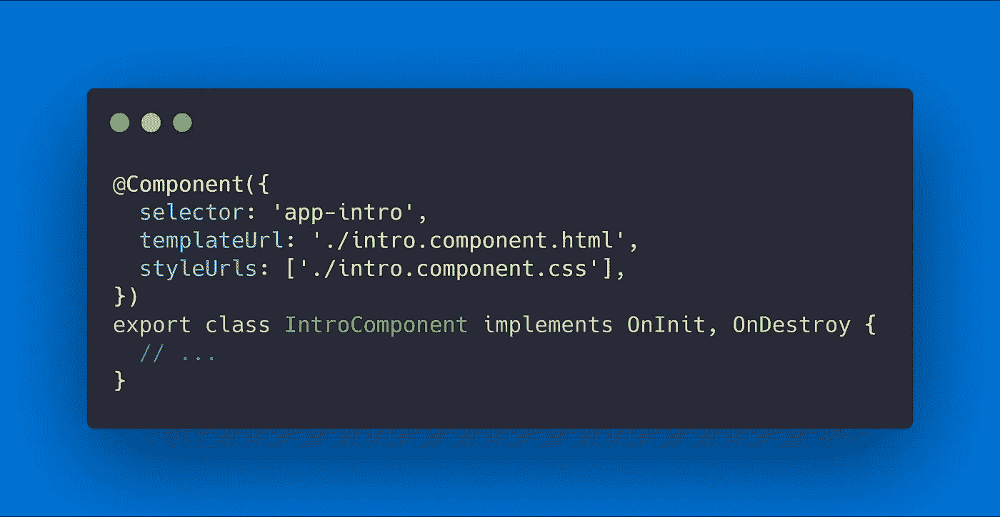

组件简介. ts

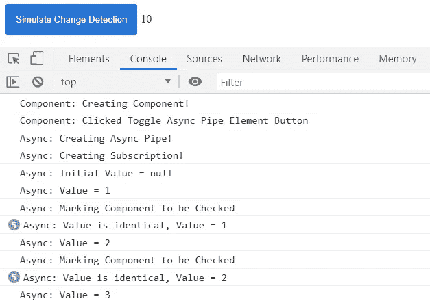

默认策略

现在，我们将更改`intro.component.ts`以利用推送更改检测策略。我们可以看到 transform 方法不再被调用十次。请注意，视图仍在我们的应用程序中按预期进行更新。

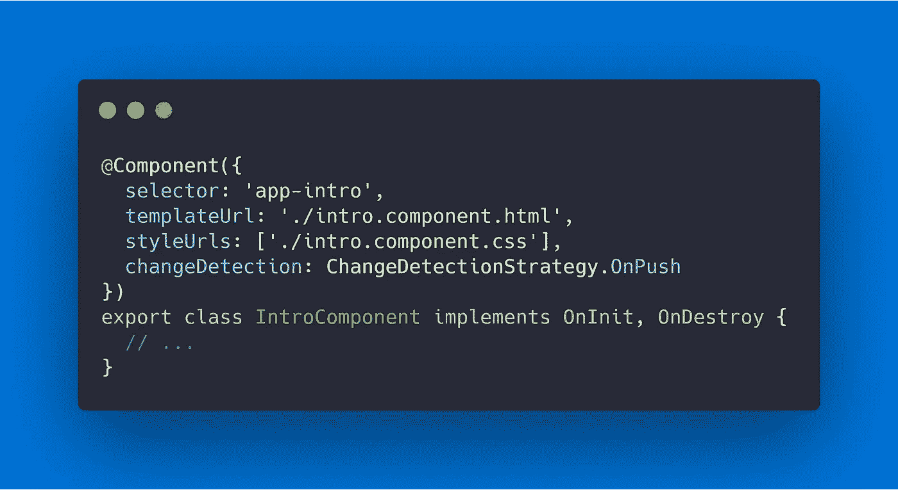

组件简介. ts

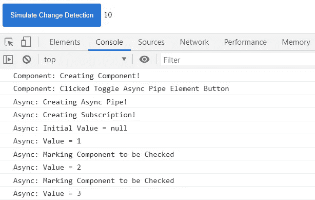

推进策略

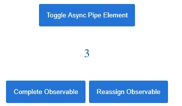

来自异步管道的最新值

**警告**:虽然 on-push 可以提高我们组件的性能，但是必须谨慎使用，并且只在适用的时候使用。不正确地使用 on-push 会导致视图没有按预期更新的错误。[【4】](https://angular.io/api/core/ChangeDetectionStrategy)

# 摘要

*   对每个可观察对象使用一个异步管道，以避免冗余订阅
*   在适用的情况下，使用 RxJS combineLatest 运算符将数据组合到单个异步管道中
*   使用异步管道启用推送更改检测策略时要小心，并且仅在适用时才启用

> ☁️[flotes](https://flotes.app)——尝试演示，不需要登录。或者免费报名。Flotes 是我记笔记和高效学习的方式，即使在我很忙的时候。

[flots](https://flotes.app)

# 资源/参考资料

【答】:简介[https://angular.io/guide/observables-in-angular#async-pipe](https://angular.io/guide/observables-in-angular#async-pipe)

[B]:简介[https://angular.io/guide/pipes](https://angular.io/guide/pipes)

[1]关于检测内存泄漏的文章:[https://it next . io/angular-rxjs-detecting-memory-leaks-BDD 312 a 070 a 0](https://itnext.io/angular-rxjs-detecting-memory-leaks-bdd312a070a0)

[2]我在 ngConf 上看到了这种技术，这要归功于黛博拉·库拉塔。[https://www.youtube.com/watch?v=Z76QlSpYcck](https://www.youtube.com/watch?v=Z76QlSpYcck)

[3]在本指南中搜索纯净/不纯净管道，了解更多信息[https://angular.io/guide/pipes](https://angular.io/guide/pipes)

[4]https://angular.io/api/core/ChangeDetectionStrategy

[5]我的代码片段内置于 [https://carbon.now.sh](https://carbon.now.sh/)

【6】感谢朋友们的校对和帮我编辑