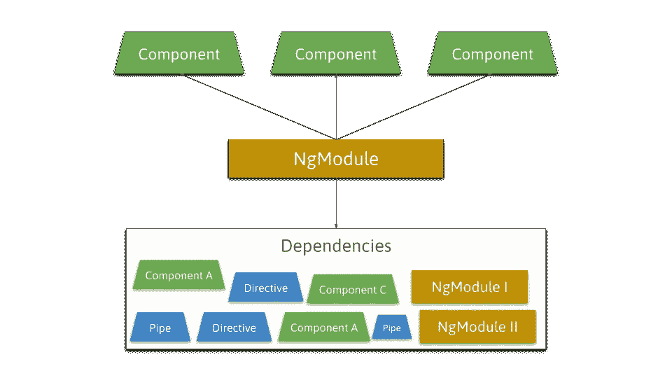
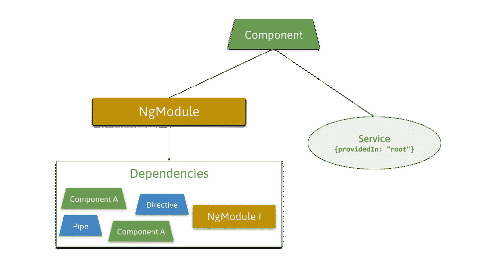
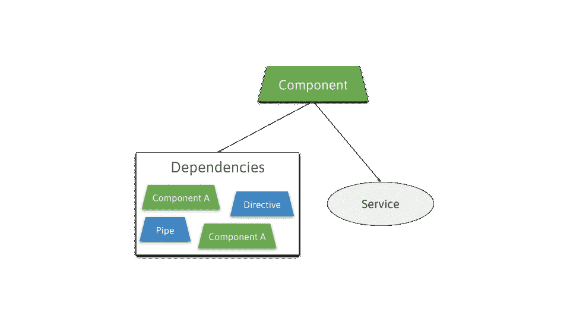
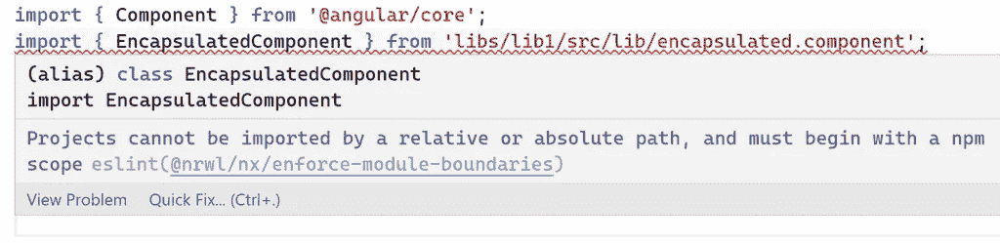

# 有角度的独立组件及其对模块化的影响

> 原文：<https://betterprogramming.pub/angular-standalone-components-and-their-impact-on-modularity-e186806aa28a>

## “可选模块”一瞥

Angular 框架中即将出现的特性之一将是“独立组件”(SC)或“可选 NgModules”。它将消除`NgModules`的必要性。

有很多博文，文章等。关于 SC。本文回答了一个不常讨论的问题:SC 将如何影响 Angular 应用程序中的模块化？

NgModule 包含术语模块。当 SC 让`NgModules`成为可选的，并且从长远来看可能会弃用它们，这是否意味着我们将不再拥有模块？鉴于 Angular 是一个企业框架，以及 Angular 团队对稳定性的持续努力，这将是一个意想不到的举动。

我首先总结一下什么是 SC，以及它们带来的优势。然后我关注主要问题，即可选性`NgModules`和模块化是否形成矛盾。最后一部分是关于我们现在可以为 SC 准备的最好方法。

源代码可在 [GitHub](https://github.com/rainerhahnekamp/angular-standalone-components-and-modularity) 上获得。

如果你喜欢看而不是读，这里有视频版本:

# 1.什么是独立组件？

围绕 SC 的讨论已经在社区中持续了几个月。Angular 的主要开发者之一 Igor Minar 表示，从 Angular 的早期测试版开始，他就一直想开发 NgModules。这是在 2016 年。因此，当 Pawel Kozlowski 在 GitHub 上发布独立组件的官方 RFC 时，这是一件大事。

Angular 中的关键元素是组件。每个组件都属于一个为其提供依赖关系的`NgModule`。一个`NgModule`的装饰者的属性声明创建了这种关系。

例如，如果组件需要`formGroup`指令，NgModule 通过`ReactiveFormsModule`提供该指令。

同样的规则也适用于其他可视元素，如管道和指令。为了简单起见，当我们谈到一个组件时，这两个都包括在内。

这不仅仅是额外的开销。考虑到组件和模块之间额外的链接，以及一个`NgModule`可以声明多个组件的事实，要弄清楚一个特定的组件需要哪些依赖项并不容易。

除了组件之外，还需要考虑服务——以及如何提供服务的三种不同方式。NgModule 可以做到这一点，组件可以做到这一点，或者服务可以通过`providedIn`属性提供自己。最后一个选项是首选方式，在 Angular 6 中引入。

因此，我们看到，即使是包含一个表单和一个服务的单个组件也包含相对较高的复杂性。

独立组件去除了 NgModule 的附加层。

一个组件的装饰者会收到额外的属性。提供服务也将变得更加容易，因为只有两种选择。

# 2.如何在独立组件中模块化？

NgModules 能在角度应用中实现模块化吗？如果是的话，我们现在应该不用模块来编写我们的应用程序吗？

## 2.1 什么是模块？

一个好的模块定义应该是应用程序中属于一起的一组元素。“归属在一起”有不同的可能。它可以是一个只包含表示性组件的组，一个包含 NgRx 特性状态的所有相关元素的组，或者一些其他标准。

模块最重要的功能是封装。模块可以从外部隐藏某些元素。封装是稳定架构的关键，因为它防止每个元素访问任何其他元素。

## 2.2 ng module 是模块吗？

那么，NgModule 在这个意义上是一个模块吗？不幸的是，NgModule 只能部分满足这些需求。它至少为可视元素(组件、指令、管道)提供封装，但不能强制它们。

理论上，我可以创建一个从封装组件扩展而来的组件，创建一个新的选择器，瞧。没有什么可以阻止我访问一个没有导出的类。

它不会因为服务而变得更好。如上所述，它们可以不受 NgModule 的控制。

由于`NgModules`不能提供完全的模块化，我们已经可以回答本文的主要问题:

> 独立组件或可选模块不会对应用程序的模块化产生影响。

然而，我们现在有了一个新的问题:一直以来，我们应该对模块使用什么？

## 2.3 如何在 Angular 中实现模块？

Angular 里除了 NgModule 还有别的东西，只是它用不同的名字伪装了自己。它是图书馆或只是图书馆。从 Angular 6 开始，Angular CLI 支持库的生成。

库在实际应用程序的文件夹旁边有自己的文件夹。这个库也有一个所谓的桶文件`index.ts`，在那里进行封装。从那个`index.ts`输出的一切都暴露在外面。一切都可以是服务、类型脚本接口、函数，甚至是`NgModules`。

关于库中 NgModule 的补充说明:在 SC 可用之前，我们仍然需要 ng module 来公开组件。这就是为什么一个库也包含了`NgModules`。

那么强制封装呢？每当开发人员从库中导入非公开文件时，都会发生这种情况。有了现代的 IDE，一切都变得非常快。当非公开元素通过相对路径导入，而公开元素通过使用库名导入时，我们经常会看到这种情况。

不幸的是，Angular CLI 中没有任何东西可以阻止我们这样做。这就是 nx 介入的地方。

Nx 是 Angular CLI 的扩展，在众多特性中，它提供了模块化的林挺规则。如果发生所谓的深度导入，即对非公开文件的直接访问，该林挺规则将抛出错误。请参阅这篇精彩的文章了解更多信息。

Nx 提供了另一个林挺规则，我们也可以在其中定义模块之间的依赖规则。我们可以制定一些规则，比如模块 A 可以访问模块 B 和模块 C，但模块 B 只能访问模块 C。这些规则也通过林挺进行验证。

> 因此，满足模块需求的是库(与 nx 结合)而不是 NgModule。

# 3.我如何为迁移做最好的准备？

我们还没有 SC，但是我们现在能为它们做准备以使迁移尽可能顺利吗？

一段时间以来，早在 SC 公布之前，模式单组件角模块或“骗局”已经在社区中流行。使用 SCAM，NgModule 只声明一个组件。

如果您已经使用了 SCAM，那么迁移到 SC 的工作可能只是将`imports`和`providers`属性移动到`@Component`装饰器。脚本可以自动完成这项任务。你可以在这里找到更多信息[。](https://netbasal.com/aim-to-future-proof-your-standalone-angular-components-accb574d273f)

您是否应该将 SCAM 应用到现有的应用程序中？如果您有一个大的应用程序，并且非常希望尽快迁移到 SC，那么 SCAM 可以帮助您实现这一目标。一般来说，我会一直等到 SC 发布。

现在还有一个[垫片](https://stackblitz.com/edit/ng-standalone?file=standaloneShim.ts)提供 SC。该垫片仅用于演示目的，对生产而言并不安全。

# 摘要

Angular 中的依赖管理有不同的变化。这可能会降低一致性，对新人来说是一个障碍。

尤其是 NgModule，会产生不必要的开销。独立组件(可选 NgModules)将消除 NgModules，这将是一个很大的改进。

可选的 NgModules 对库提供的模块化基本上没有影响。对于遵循 SCAM 模式的应用程序，脚本可以自动完成迁移。没有骗局，你将不得不手动完成。

我要感谢 Pawel Kozlowski 审阅了这篇文章并提供了宝贵的反馈。

# 进一步阅读

*   Igor Minar 在 Twitter 上写道:“独立组件、指令和管道(也称为可选 NgModules)的 Angular 提案背后的故事。很长… 🧵" /推特
*   [🎯旨在让您的独立角形组件面向未来| Netanel Basal | Netanel Basal](https://netbasal.com/aim-to-future-proof-your-standalone-angular-components-accb574d273f)
*   [使用单个组件角度模块模拟树摇动组件——开发社区](https://dev.to/this-is-angular/emulating-tree-shakable-components-using-single-component-angular-modules-13do)
*   [用 Nx 中的模块边界驯服代码组织|作者 Miroslav jona | 2021 年 12 月| Nrwl](https://blog.nrwl.io/mastering-the-project-boundaries-in-nx-f095852f5bf4)
*   [RFC:独立组件、指令和管道—使 Angular 的 NgModules 成为可选讨论#43784 angular/angular GitHub](https://github.com/angular/angular/discussions/43784)
*   [https://stackblitz.com/edit/ng-standalone?file=standaloneShim.ts](https://stackblitz.com/edit/ng-standalone?file=standaloneShim.ts)
*   [Angular 没有 NgModules 的未来——第二部分:这对我们的架构意味着什么？—角度架构](https://www.angulararchitects.io/aktuelles/angulars-future-without-ngmodules-part-2-what-does-that-mean-for-our-architecture/)

*最初发表于*[*www.rainerhahnekamp.com*](https://www.rainerhahnekamp.com/en/angular-standalone-components-and-their-impact-on-modularity/)