# Angular:使用 NGXS 进行状态管理

> 原文：<https://betterprogramming.pub/angular-state-management-with-ngxs-8b17719def29>

## 理解 NGXS 的基础知识，并构建一个示例 CRUD 应用程序

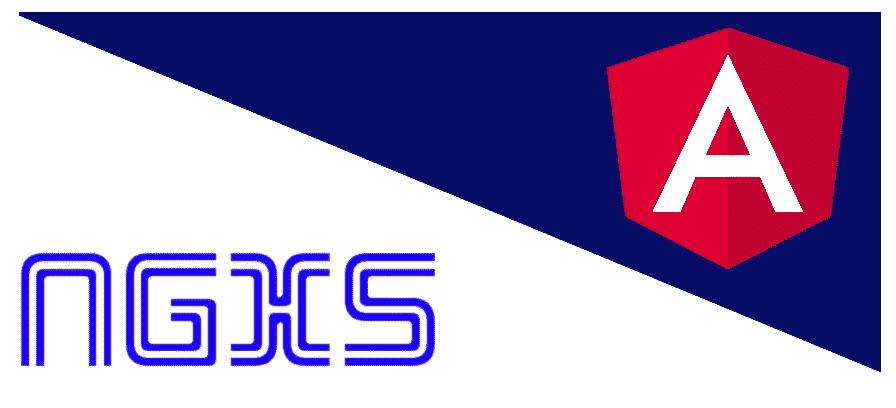

NGXS 本质上是 Angular 的状态管理库。您可能遇到过 Angular 的其他状态管理解决方案，比如 NgRx 和 Akita。下面是我以前写的两篇关于使用 NgRx 进行状态管理的文章:

*   [Angular:NgRx](https://medium.com/better-programming/angular-getting-started-with-ngrx-75b9139c23eb)入门
*   [Angular:用 NgRx](https://medium.com/better-programming/angular-building-a-crud-application-with-ngrx-40e5f1c0b50c) 构建一个 CRUD 应用程序

在这篇文章中，我打算涵盖以下主题。

*   NGXS 是什么？
*   NGXS 的基本概念
*   构建一个示例 CRUD 应用程序

# NGXS 是什么？

如上所述，NGXS 是专门为 Angular 开发的状态管理解决方案。在我们深入讨论细节之前，让我们试着理解角度应用中*状态*的概念。

## 状态

理论上，应用程序状态是应用程序的整个内存。简而言之，应用程序状态由 API 调用接收的数据、用户输入、呈现 UI 状态、应用程序首选项等组成。应用程序状态的一个简单、具体的例子是 CRM 应用程序中维护的客户列表。

让我们试着在角度应用程序的上下文中理解应用程序状态。众所周知，角度应用通常由许多组件组成。这些组件中的每一个都有自己的状态，并且不知道其他组件的状态。为了在父子组件之间共享信息，我们使用了`@Input`和`@Output`装饰器。然而，只有当您的应用程序由几个组件组成时，这种方法才是实用的，如下所示。

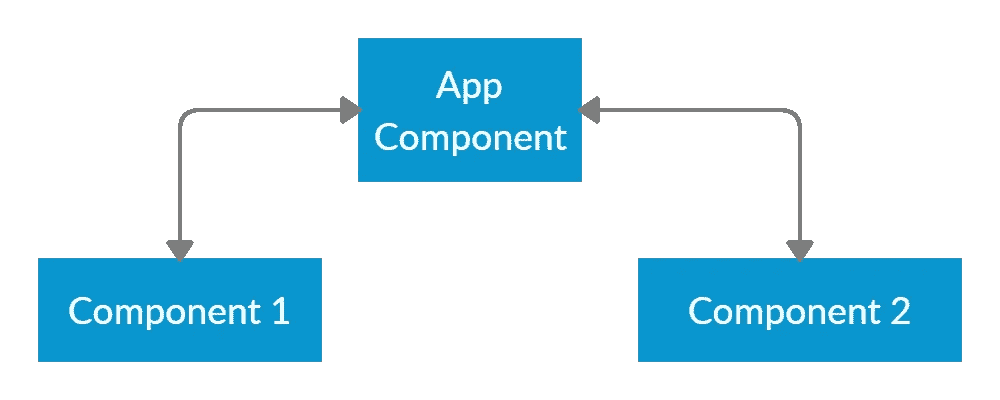

当组件数量增加时，仅仅通过`@Input`和`@Output`装饰者在组件之间传递信息就成了一场噩梦。我们就拿下图来对此进行阐述吧。

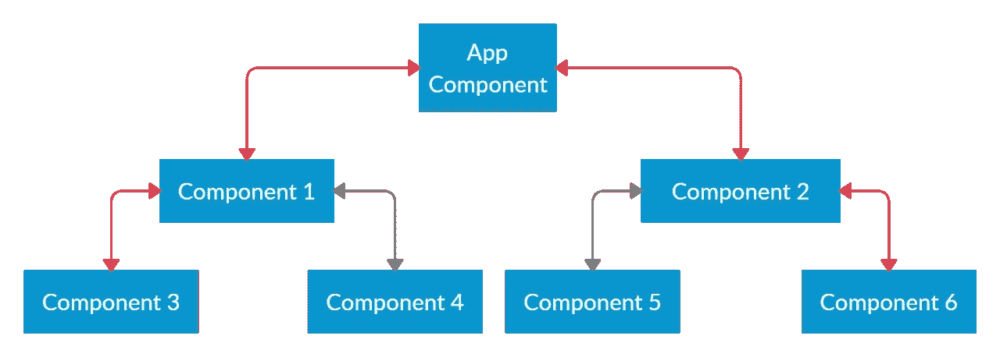

如果您必须将信息从组件 3 传递到组件 6，您将必须跳四次并涉及其他三个组件。如您所见，这是一种非常麻烦且容易出错的状态管理方式。在这种情况下，拥有一个像 NGXS 这样的状态管理解决方案会派上用场。它将简单地转换上面的数据传输模型，如下所示。

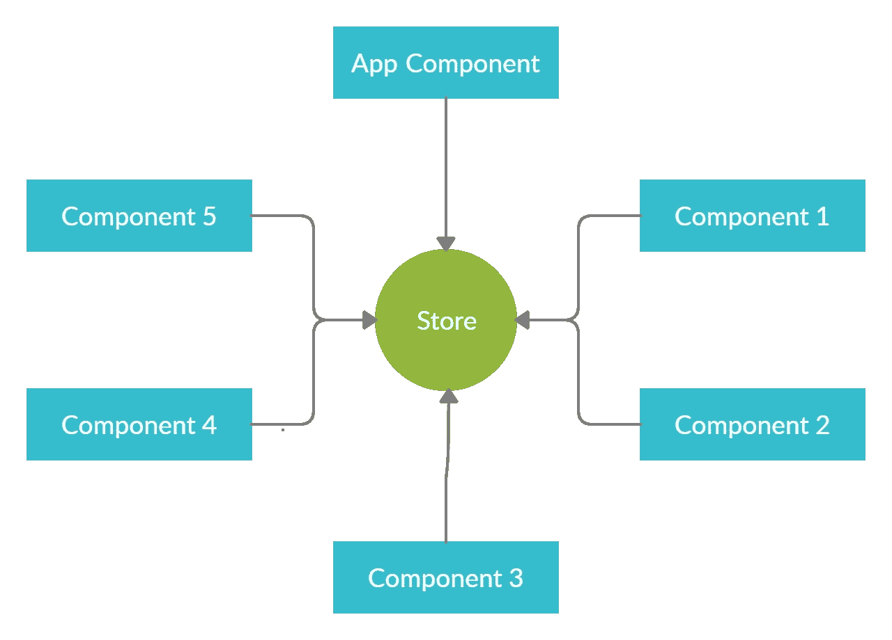

根据这种体系结构，数据在存储和组件之间流动，而不是在组件之间流动。

# NGXS 的基本概念

NGXS 包括四个主要概念——存储、动作、状态和选择。

## 商店

商店是整个状态管理过程中的关键元素。它促进了组件和状态之间的交互。你可以通过角度依赖注入获得对外挂的引用，如下所示。

```
constructor(private store: Store) { }
```

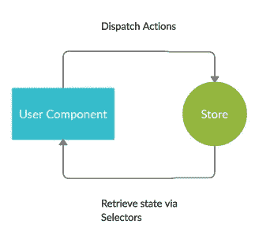

该存储引用随后可用于两个主要操作:

*   通过`store.dispatch(…)`方法向商店分派动作，这将依次触发状态修改器函数。
*   通过选择来检索应用程序状态。

## 状态

在 NGXS 的上下文中，状态是定义状态容器的类。这些类持有整个应用程序状态的不同部分。假设您的应用程序包含两个名为 User 和 Product 的特性模块。这些模块中的每一个都处理整体状态的不同部分。产品信息将一直保持在状态中的`products`部分。用户信息将一直保持在`user`区的状态。这些切片也被称为*切片*。

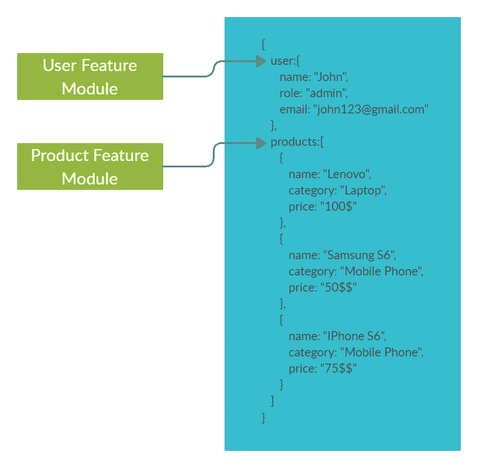

在 NGXS 中，状态类通常定义如下。

## 行动

动作是您分派到存储区的指令，可选地带有一些元数据(有效负载)。根据操作类型，商店决定执行哪些操作。每个动作包含一个作为其唯一标识符的`type`字段。状态修饰符函数将使用可选地嵌入在动作中的元数据来修改状态。

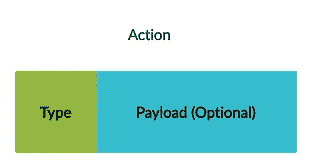

**以下是一个没有任何元数据的简单操作。它将具有`type`属性，该属性本质上描述了动作的目的。State 类将有一个方法来监听这个动作，然后通过后端 API 检索用户并更新应用程序状态。**

**以下是带有元数据的动作定义。**同样，State 类将有一个监听这个动作的方法，并将调用后端 API 来创建一个用户。状态类函数将获得嵌入在动作中的`user`对象，并将其传递给 API 调用。

## 挑选

选择是从全局状态容器中分割状态的特定部分的函数。您基本上可以使用`Select`函数来查询应用程序状态。在 NGXS 中，有两种选择状态的方法——您可以在`Store`服务上调用`select`方法，或者使用`@Select`装饰器。首先，我们来看一下`@Select`装饰器。

**选择装饰器:**您可以使用`@select`装饰器从商店中选择数据片。下面的代码片段说明了这种技术。

```
@Select(AppState.users) user$: Observable<User[]>;
```

存储选择函数:`Store`类还有一个`select`函数，可以用来读取应用程序状态的一部分。

```
constructor(private store: Store) { this.users$ = this.store.select(state => state.users);}
```

# 构建一个示例 CRUD 应用程序

在本文的其余部分，我们将使用 NGXS 构建一个简单的课程管理系统。如下所示，您将能够通过这个简单的 web 应用程序在课程实体上执行所有 CRUD 操作。

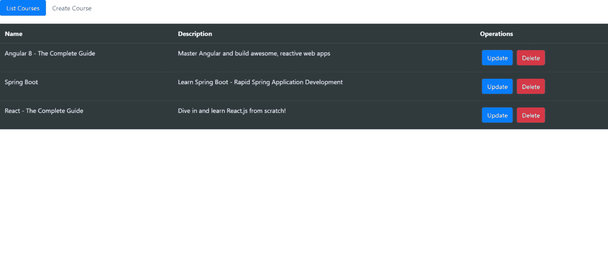

## 项目结构

如下图所示，我们的应用程序将由两个主要模块组成，即`App`和`Course`。课程模块又将有两个定制组件，即`Course List`和`Create Course`。


## REST API

一般来说，Angular 应用程序与 REST API 交互，对数据执行 CRUD 操作。

因此，我在 Spring Boot[中实现了一个简单的 REST API，它公开了下面的端点。我们将使用这个 API 从 Angular 应用程序进行连接，并执行数据操作。](https://spring.io/projects/spring-boot)

```
// Retrieve all courses
GET     [http://localhost:8080/api/courses](http://localhost:8080/api/courses)// Create a course
POST    [http://localhost:8080/api/courses](http://localhost:8080/api/courses)// Delete a course
DELETE  [http://localhost:8080/api/courses/{courseId}](http://localhost:8080/api/courses/%7BcourseId%7D)// Update a course
PUT     [http://localhost:8080/api/courses/{courseId}](http://localhost:8080/api/courses/%7BcourseId%7D)
```

## 完整源代码

您可以在 [GitHub](https://github.com/sarindufit/ngxs-crud-app) 上找到这个示例应用程序的完整源代码。请注意，我还将 Spring Boot 应用程序(REST API)的可执行 JAR 文件(course-1.0.0-SNAPSHOT.jar)添加到了同一个存储库中。

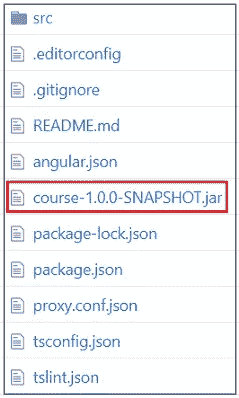

# 设置项目

## **使用的软件版本**

*   角度 CLI: 8.0.1
*   节点:11.6.0
*   角度:8.0.2
*   NGXS: 3.6.2
*   引导程序:4.4.1

## 项目初始化

步骤 1:执行下面的命令并创建一个新项目。

```
ng new ngxs-crud-app
```

步骤 2:我们将使用 [Bootstrap](https://getbootstrap.com/) 向我们的应用程序添加样式。您可以使用下面的命令安装 Bootstrap。

```
npm install bootstrap --save
```

步骤 3:通过更新`angular.json`文件导入引导程序，如下所示。

步骤 4:安装 NGXS 依赖项。

```
npm install @ngxs/store --save
npm install @ngxs/logger-plugin @ngxs/devtools-plugin --save-dev
```

# 向根模块添加 NGXS 支持

为了将 NGXS 支持添加到您的应用程序中，您必须更新`app.module.ts`文件，如下所示。

请注意，在完成应用程序之前，我们将对该文件进行一些额外的调整。

## **特别说明**

*   `NgxsReduxDevtoolsPluginModule`模块已注册，以便将应用程序与 [Redux Devtools 扩展](http://extension.remotedev.io/)集成。
*   是一个简单的控制台日志插件，用于记录正在处理的操作。

# 创建和设置“课程”功能模块

## 生成“课程”模块

如前所述，我们的应用程序由两个主要模块组成，`App`和`Course`。现在是用下面的命令创建`Course`模块的时候了。

```
ng generate module course
```

该命令将在`app`文件夹下直接创建一个名为`course`的子文件夹。此外，一个名为`course.module.ts`的新文件将被创建并放在`app/course`文件夹下。

以下是`course.module.ts`文件的初始版本。注意，这个文件将在下游被修改，以声明组件和声明服务提供者。

## 定义“课程”模型

下一步，您必须定义代表`Course`实体的模型接口。创建一个名为`course.model.ts`的文件，并将其放在`app/course/model`文件夹下。这个文件的内容应该如下所示。

## 定义服务类别

服务用于与 REST API 交互并执行数据操作。为了定义服务类，创建一个名为`course.service.ts`的文件，并将其放在`app/course/services`文件夹下。

这个文件的内容应该如下所示。

如您所见，它有通过 REST API 检索、创建、更新和删除`Course`实体的方法。一旦定义了服务类，您必须在如下所示的`course.module.ts`文件中注册它。

下图说明了此时我们的应用程序的文件夹结构。

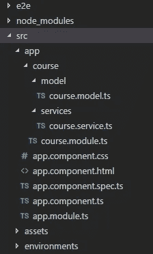

# 将 NGXS 工件添加到“课程”模块

下一步，您必须定义 NGXS 工件，比如状态类、动作和选择。这些工件将被创建在一个名为`store`的目录中，该目录位于`app/course`目录下。

## 定义 NGXS 操作(course.actions.ts)

我们为四个不同的 CRUD 操作定义了四个动作— `AddCourse`、`GetCourses`、`UpdateCourse`和`DeleteCourse`。

## 定义状态和选择(course.state.ts)

**特别说明:**

*   **定义应用程序状态(@State):** 如前一节所述，在 NGXS 中，状态是定义状态容器的类。这些类持有整个应用程序状态的不同部分。在上面的文件中，`CourseState`保存了属于课程模块的状态片。该状态片的格式定义如下。`courses`属性保存加载到状态的课程实体数组。`areCoursesLoaded`是一个布尔标志，用于表示课程是否已经加载到状态中。

```
export class CourseStateModel { courses: Course[]; areCoursesLoaded: boolean;}
```

*   **定义状态片标识符:**下面代码片段中的`name`属性表示表示课程模块的状态片的名称。在这个实例中，`courses`切片包含了所有课程的相关信息。

```
@State<CourseStateModel>({ name: 'courses', defaults: { courses: [], areCoursesLoaded: false }})
```


*   **定义选择(@Selector):** 在上面的文件中，我们定义了两个选择，分别用于从状态中检索课程列表和检查`areCoursesLoaded`标志的值。
*   **定义动作监听器(@Action):** 这些是监听分派给商店的不同动作的函数。基于在@Action decorator 中指定的动作类型，相应的函数将被调用。例如，如果您将类型为`GetCourses`的动作分派给商店，将会调用下面的函数。

在此阶段，您的项目文件夹结构应该如下所示。

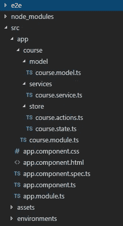

## 在 NGXS 模块中注册课程状态

在定义了 NGXS 工件之后，您必须将`CourseState`附加到父 NGXS 模块。如前一节所示，NGXS 模块是在`app.module.ts`文件中定义的。让我们在该文件中做一个小小的调整，并在 NGXS 父模块中注册`CourseState`。

# 创建组件和定义路线

正如我们前面讨论的，我们的应用程序由两个主要模块组成，即`App`和`Course`。课程模块由两部分组成，即`courses-list`和`create-course`。

我们的下一步是创建这两个组件并定义相应的路由。注意，`courses-list`和`create-course`目录将被创建在`app/course/component`目录下。

## 定义“课程-列表”组件

模板:`courses-list.component.html`

组件:`courses-list.component.ts`

**特别说明:**

该组件负责简化列表、更新和删除操作。

## 定义“创建课程”组件

模板:`create-course.component.html`

组件:`create-course.component.ts`

## 在课程模块中声明组件

您必须在已经创建好的`course.module.ts`文件中声明上述组件。此外，这些组件将在`app.module.ts`文件中用于定义路线。为了将这些组件暴露给`app.module.ts`文件，您必须在`exports`数组中定义这些组件。请注意，我还导入了`FormsModule`和`HttpClientModule`，它们将分别被模板和服务使用。

## 配置路线

现在是时候定义路线并将相应的组件与这些路线相关联了。这必须在`app.module.ts`中完成，如下所示。

## 定义路由器出口

作为最后一步，您必须在`app.component.html`中定义路由器出口。

在这个阶段，你的文件夹结构应该如下图所示。

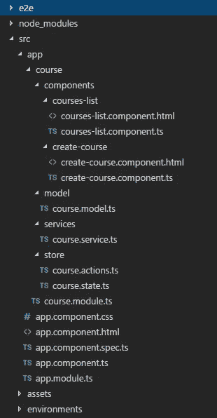

# 配置代理以访问 REST API

正如本文开头提到的，我们使用一个用 Spring Boot 编写的简单的 REST API 来连接 Angular 应用程序。

Spring Boot 应用程序在`localhost:8080`运行，而角度应用程序在`localhost:4200`运行。当 Angular 应用程序试图访问 REST API 时，这种不匹配将导致跨源资源共享(CORS)错误。为了解决这个问题，我们必须创建一个代理。

## 创建代理文件

在项目的根文件夹中创建一个名为`proxy.conf.json`的文件(与`package.json`文件在同一层)，并在其中添加以下内容。

## 注册代理文件

在 CLI 配置文件`angular.json`中，将`proxyConfig`选项添加到`serve`目标:

# 运行应用程序

应用程序应该分两步启动。您必须首先启动 Spring Boot 应用程序(REST API ),然后启动 Angular 应用程序。

# 运行 Spring Boot 应用程序(REST API)

Spring Boot 应用程序被打包成一个名为`course-1.0.0-SNAPSHOT.jar`的可执行 JAR 文件，放在[这里(GitHub)](https://github.com/sarindufit/ngxs-crud-app) 。

注意，要执行这个 JAR 文件，您必须在系统上安装 Java 8。如果安装了 Java 8，您可以执行下面的命令并启动应用程序。

```
java -jar {path_to_the_jar_file}/course-1.0.0-SNAPSHOT.jar
```

## 运行角度应用程序

可通过执行以下命令启动角度应用。

```
ng serve
```

当应用程序成功启动时，从您的浏览器导航到`http://localhost:4200/courses`，您应该会看到下面的屏幕。

# 结论

这个故事的主要目的是提供一个分步指南来构建一个基于 NGXS 的 Angular 应用程序。如果您以前使用过 NgRx，您会理解与 NgRx 相比，NGXS 的样板代码更少。在我的下一篇文章中，我希望通过使用 Akita 作为状态管理系统来实现类似的 CRUD 应用程序。随后，我们可以将 NgRx、NGXS 和 Akita 作为状态管理系统进行比较。