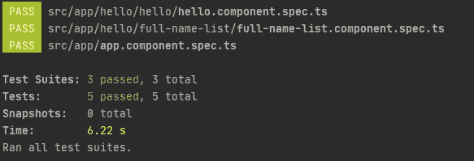
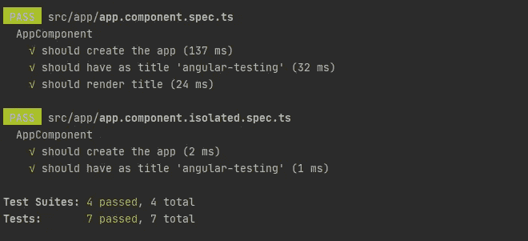
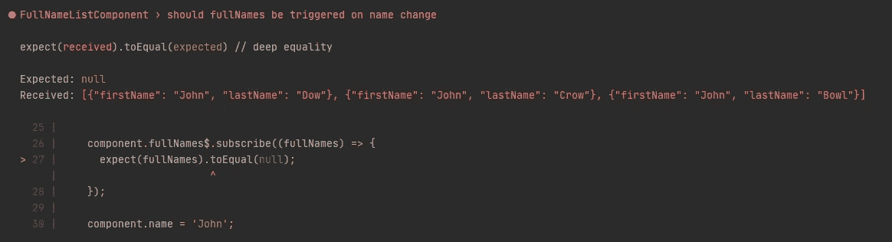

# 角度测试系列:为什么你的角度测试可能有味道

> 原文：<https://betterprogramming.pub/angular-testing-series-why-your-angular-tests-probably-smell-ebab93c59e0>

## 测试角度项目时遇到的常见陷阱


照片由[亚伦·伯顿](https://unsplash.com/@aaronburden?utm_source=unsplash&utm_medium=referral&utm_content=creditCopyText)在 [Unsplash](https://unsplash.com/s/photos/relax?utm_source=unsplash&utm_medium=referral&utm_content=creditCopyText) 拍摄

测试角度应用本来就很简单。Angular 框架是从头开始构建的，所以它们的抽象很容易测试。默认的松散架构，将逻辑分割成组件、指令、服务、模块或管道——所有这些都在测试过程中极大地帮助了我们。如果我们遵循经过验证的模式，并产生真正可测试的代码，测试就不应该是一件麻烦的事情——它应该是促进可靠代码开发的事情。

## 你永远不会独行

此外，Angular 并没有让我们在战场上孤军奋战——它为我们提供了一套强大的工具来简化和加速编写测试。

作为 Angular 用户，彻底学习这些工具是我们的责任。在这个 Angular Testing 系列文章中，我将基于准备好的例子，展示 Angular 中内置单元测试机制的典型和正确的用法。


兰迪·法特在 [Unsplash](https://unsplash.com/s/photos/team?utm_source=unsplash&utm_medium=referral&utm_content=creditCopyText) 上的照片

## 不良测试习惯

坏习惯往往来自诱惑。我注意到我们(开发人员)也经常屈服于一种诱惑:*为单元测试复制代码*。这项技术有两个方面:

*   *我们可以坚持一致的测试方式，提高我们的生产力并带来价值。*

或者，如果我们不知道我们实际复制的是什么:

*   在项目的所有测试中，我们可以为涂抹有异味的代码片段做出贡献。

在这篇文章中，我想把重点放在我在各种 Angular 项目中遇到的单元测试中那些发臭的代码片段上。

# 组件测试

让我们假设这是我们正在测试的组件:

我们想要验证`Full Names`是否被渲染到`<header>`标签中。让我们来看看下面的测试:

当我们运行`jest`时，一切正常:



但是有东西闻起来——你能说出是什么吗？

让我们看看最后一次测试，看看那里发生了什么。调用`ngOnInit`，在`fixture`中模拟变化检测，当夹具模板准备好时进行断言。显然，一切都很好，但这是对事实的歪曲，是对组件生命周期的糟糕模拟。在这个例子中，一切都会如预期的那样进行。然而，方法`ngOnInit`被调用了两次。变化检测也被再执行一次。

## 应该怎么处理？

为了让我们的测试反映现实，我们应该做些什么来摆脱`ngOnInit`调用？实例化的`fixture:ComponentFixture<AppComponent>`有适当的职责，当我们调用它的`detectChanges`方法时，我们可以相信单个组件生命周期方法会自动执行。

在上面的主旨里，我又改了一点。`async`功能被替换为`waitForAsync`。为什么？因为在 Angular 10 中，`async`函数最终被标记为不推荐使用，我们可以预计在 Angular 12 中我们根本看不到它。

## 不关心测试中的渲染

我们经常发现并编写组件测试，其中检查 DOM 中是否生成了实际值并不重要。这种方法是好是坏只取决于你的测试结果和目标，但是我想提一下与这种类型的测试相关的另一个常见错误。

现在，我们只想验证字段`title`是否分配了期望值。看起来一切都很好，测试本身是确定性的，但是所提出的解决方案有些问题。

如前所述，`fixture`用生成的 DOM 模型反映模板。在上面的测试中，我们不检查 DOM 中的任何内容。真的值得用资源去创造`fixture`吗？这是隔离测试的一个典型例子。如果收集在`spec`集合中的所有测试都是隔离的，那么整个`spec`都应该被实现，就像这样:

*   在独立测试中，我们必须记住调用适当的生命周期方法，比如`ngOnInit`
*   使用`ComponentFixture`的孤立测试明显比浅层测试快。即使对于这样简单的测试，资源使用和总测试时间的差异也是显著的。



# 异步服务和事件

在 Angular 的项目开发中，我们大部分时间都在处理异步操作。XHR 请求、渲染/浏览器事件的处理、用户输入的去抖都是异步任务，所以测试应该适当地处理它们。


[哈里·桑德胡](https://unsplash.com/@harryxsandhu?utm_source=unsplash&utm_medium=referral&utm_content=creditCopyText)在 [Unsplash](https://unsplash.com/@harryxsandhu?utm_source=unsplash&utm_medium=referral&utm_content=creditCopyText) 上拍摄的照片

让我们用一个简单的服务来分析这个示例场景，这个服务以 xhr 的形式获取数据:

智能域组件`FullNameListComponent`使用上述服务。

我们想要测试`fullNames$`流。这一次，我们使用`ComponentFixture`，因为这是向 Angular DI 提供存根的一种便捷方式。

两个基本测试如下所示:

测试通过了。可以吗？显然，不是！为了找出我稍微修改第二个测试的原因:

```
it('should fullNames be triggered on name change', () => {
  const expectedFullNames = *FAKE_NAMES*;

  component.fullNames$.subscribe((fullNames) => {
    expect(fullNames).toEqual(**null**);
  });

  component.name = 'John';
});
```

我修改了断言，期望`fullNames`为`null`，这是不正确的。测试仍然通过。怎么了?

## fakeAsync 求助

除了所谓的`subscribe-assert`不是我们可以用于流测试的最佳方法这一事实之外，我们经常忘记一件事。如果流异步运行，测试应该考虑这个事实。幸运的是，Angular 为我们提供了有用的工具:一个特殊的`fakeAsync`区域。

```
it('should fullNames be triggered on name change', fakeAsync(() => {
  const expectedFullNames = ***FAKE_NAMES***;

  component.fullNames$.subscribe((fullNames) => {
    expect(fullNames).toEqual(null);
  });

  component.name = 'John';
  tick();
}));
```

现在，测试运行人员能够识别出断言是不正确的:



我不想在这里解释`fakeAsync`到底是什么，因为这不是本文的目的。然而，我们必须永远记住，如果我们处理异步，那么我们也应该在测试中考虑它。

上面的测试方法还有一个很臭的东西。让我们看看我们的存根:

这里我们模拟用假数据返回`Observable`。这是一种流行的方法，但它正确吗？一点也不。

我这里指的是 [Netanel Basal](https://medium.com/u/b889ae02aa26?source=post_page-----ebab93c59e0--------------------------------) 的一篇很好的[文章](https://netbasal.com/testing-observables-in-angular-a2dbbfaf5329)。他很好地解释了为什么`of`不是用来伪造 API 响应的合适函数。

简而言之，`of`函数提供同步数据，而对 XHR 的响应是异步的，被视为宏任务。用同步调用伪造异步数据是欺骗，而且很糟糕。它增加了代码覆盖率，但是这种测试的质量是有问题的。

由于为`of`函数提供一个合适的调度器是不可取的，我推荐以下方法:

```
import { ***asyncScheduler***, Observable, scheduled } from 'rxjs';getFullNames(name: string): Observable<FullName[]> {
  return scheduled([***FAKE_NAMES***], ***asyncScheduler***);
}
```


照片由 [Unsplash](https://unsplash.com/s/photos/island?utm_source=unsplash&utm_medium=referral&utm_content=creditCopyText) 上的 [jcob nasyr](https://unsplash.com/@j_cobnasyr1?utm_source=unsplash&utm_medium=referral&utm_content=creditCopyText) 拍摄

# 摘要

如何在测试中避免此类事故:

*   尝试遵循红/绿/重构技术。如果你不使用 TDD 方法，试着故意让你的测试失败。
*   查看并了解 Angular 给我们的两个特性:`[waitForAsync](https://angular.io/api/core/testing/waitForAsync)`和`[fakeAsync](https://angular.io/api/core/testing/fakeAsync)`。要意识到它们之间的区别。
*   不要用`of`伪造数据。在大多数情况下，你不会注意到任何差异。但是，有一个框架黑客。信任提供的`fakeAsync`区域来模拟同步执行。
*   所有的例子都收集在我的 Github 上的[库](https://github.com/marcinmilewicz/angular-testing)中。

# 角度测试系列

*本文是角度测试系列的一部分，该系列收集了在角度框架中进行测试的有用技巧。我将非常感谢您的反馈。请不要犹豫，留下你喜欢或不喜欢的评论。*

*如果您能告诉我您对角度测试的恐惧是什么，我将不胜感激。我将很乐意准备一个务实的解决方案，并协助你。*