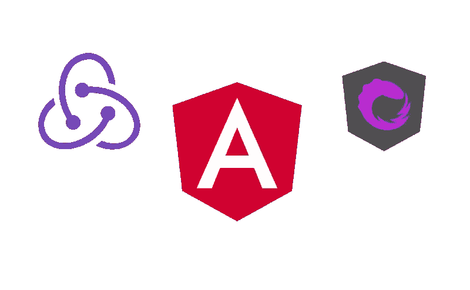
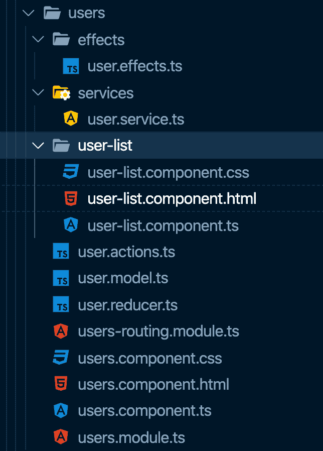
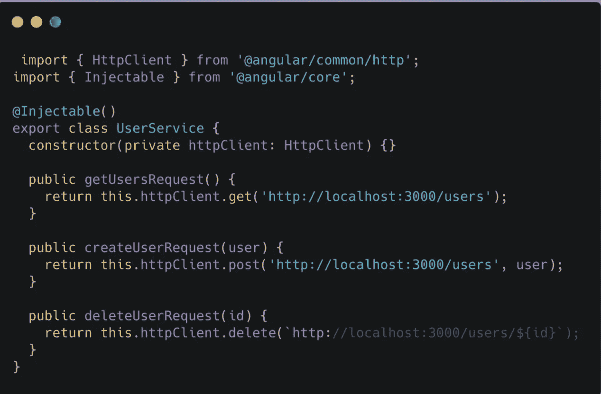
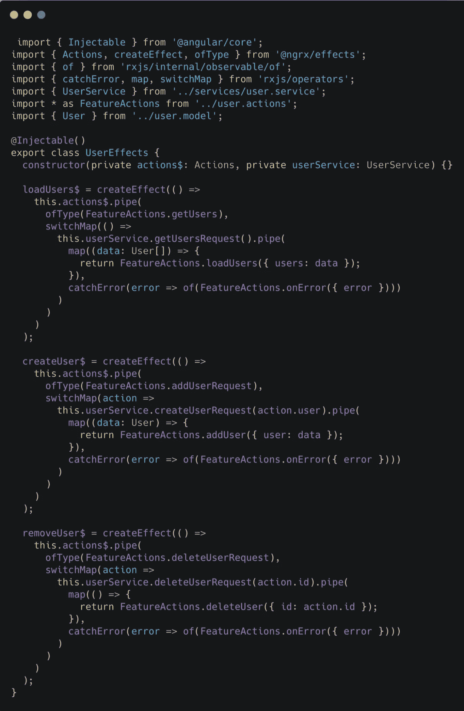
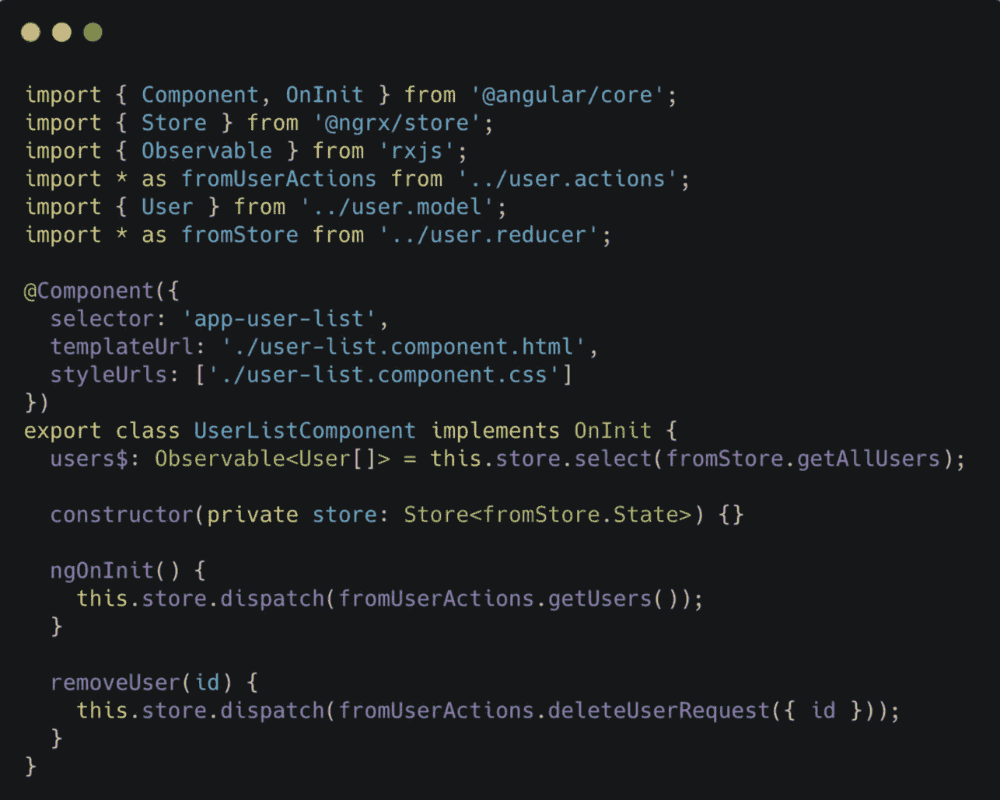
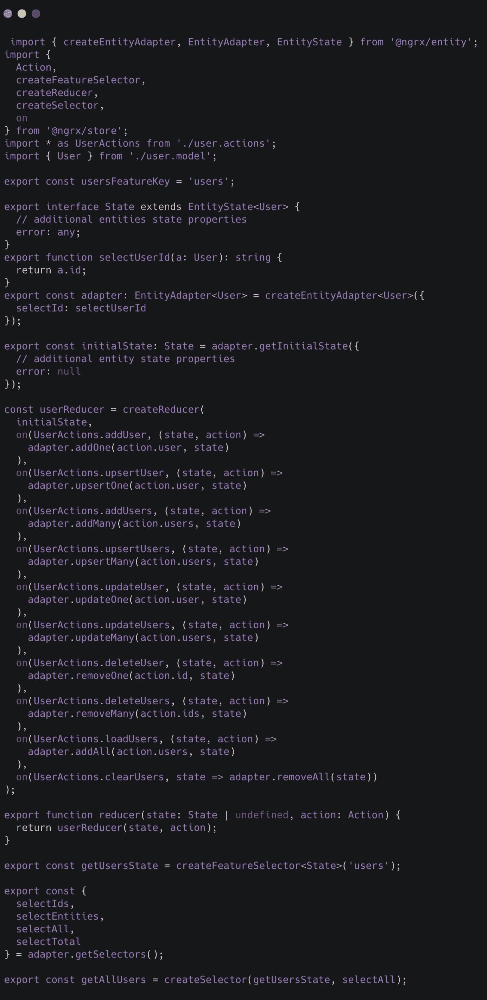
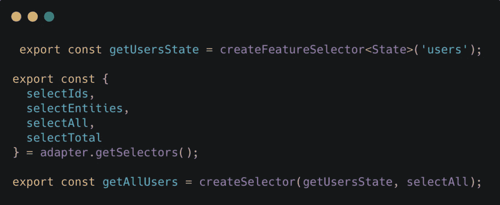
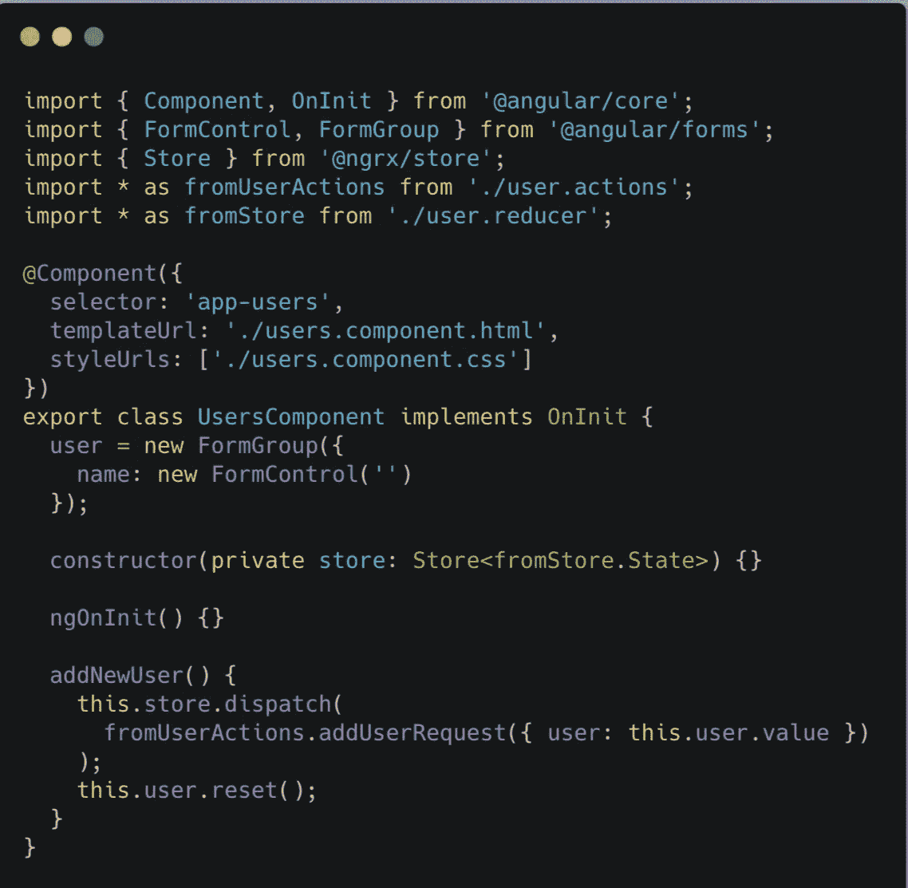
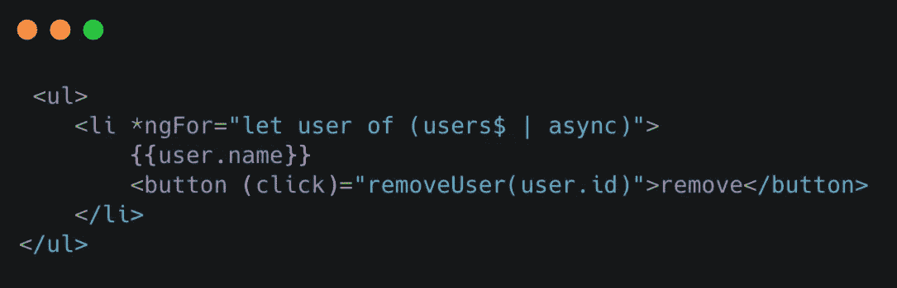

# 如何使用 NgRx 原理图和 NgRx 实体来加速您的开发过程

> 原文：<https://betterprogramming.pub/angular-using-ngrx-schematics-ngrx-entity-to-speed-up-your-development-process-bb4edbab12d>

## 好的开发者都很懒



如今，我们开发人员如此懒惰，以至于编码变得有压力和令人讨厌，但是如果有一种方法可以减轻这种痛苦呢？我敢打赌，你们都有一个“上标”,可以在你做其他工作时做任何需要的事情。

今天，我将分享我使用[角度示意图](https://angular.io/guide/schematics)结合 [NgRx 示意图](https://ngrx.io/guide/schematics)的经验，并触及一些 NgRx 主题，如商店、实体和效果。

# **什么是原理图？**

Schematics 是简单的命令，通过使用特定的模式可以更快地生成源代码的不同部分。

*   例如:创建组件— `ng generate component user-list`。
*   例如:`ng generate module user`。

上面是非常基本的角度示意图。有关更多选项和细节，请参考[角度 CLI](https://angular.io/cli) 。

# 为什么原理图好？

Angular 框架有严格的规则(MVC)，所以没有必要过分关注这个结构。这就是原理图有用的地方——它们和 devs 做得差不多；写代码，但是更快。

如果开发人员足够了解命令行界面，并使用它来键入代码，他们将很快完成新项目的设置，并将剩余的时间用于更复杂的事情。

# **主应用**

我将介绍一个使用 NgRx 创建、读取和删除的简单应用程序，它主要是使用 Angular/NgRx Schematics 创建的。

我应该提到，这个应用程序制作得非常快，旨在展示用较少的努力创建一个简单的 CRUD 是多么容易。

# **为什么是 NgRx？**

*   很方便。
*   它让你建立一个可读的结构。
*   它有原理图，可以为你生成 70%的代码。



自定义代码写在下面的文件中:

## 服务



[user.service.ts](https://gist.github.com/Lolibai/c217203ae1d918684c85cc25179d1a0a)

## **效果**



[用户.效果. ts](https://gist.github.com/Lolibai/277e653375e15d0f1939b91f1eb2c66b)

## **用户列表组件**



[用户列表.组件. ts](https://gist.github.com/Lolibai/c9fba1e8880b5aae3991c772cb650b0b)

更重要的是，NgRx 建议使用 [@ngrx/entity](https://ngrx.io/guide/entity) 进行 CRUD 操作。

它有很多功能来帮助消除相同代码的重复。管理状态变得更容易，调度调用变得可读，因为它们确实如其名所言。



Redux 实体缩减器

## **是什么让他们按预期工作？**

有`@ngrx/effects` 和`HttpServices`。

他们所做的是捕捉动作并执行生成的`@ngrx/entity` 动作。每次为实体创建 CRUD 时都要遵循一个简单的流程，仅此而已。

但是请记住，没有必要为功能的每个部分都使用一个实体。总的来说，都是关于 reducer 怎么写的。你可以完全忽略*实体样式*，使用*动作*、*效果*、*自定义缩减器*编写一个简单的缩减器。

# **流程**

## **创建动作**

```
ng generate @ngrx/schematics:action users/Users — group
```

## **创建减速器**

```
ng generate @ngrx/schematics: reducer users/User — group
```

## **创建 HTTP 调用**

它应该被定制。参见上面的例子。

## **创造效果**

```
ng generate @ngrx/schematics:effect users/Users -m users/users.module.ts — group
```

## **创建选择器**

总是检查你是否需要一个自定义选择器，但是我建议总是创建从基本选择器继承的自定义选择器。

## **使用选择器**



[选择器. ts](https://gist.github.com/Lolibai/d31343c25298e637412aebf580247b15)

## **调度动作**

参见上面的例子。下面是用户的添加。



[用户.组件. ts](https://gist.github.com/Lolibai/d3d7bb617ee4c7d245e602d0b51e6a6d)

## **连接视图(将收到的数据整合到模板中)**



[user-list.component.html](https://gist.github.com/Lolibai/6c9f246ca1d2d3a2d1e450e559871a02)

# **总结**

通过几个步骤，您可以获得一个完整的功能模块，它执行基本的 CRUD 操作。

我 100%确定高级设置不会成为问题。使用 schematics，快速构建，并使用更少的努力开发出色的应用程序，因为有如此多有用的工具，但其中许多仍未使用。

想深入挖掘吗？[让我们知道](https://inveritasoft.com/blog/angular-using-ngrx-schematics-and-ngrx-entity-to-speed-up-your-startup)。

*原载于 2020 年 3 月 17 日*[*inveritasoft.com*](https://inveritasoft.com/blog/angular-using-ngrx-schematics-and-ngrx-entity-to-speed-up-your-startup)