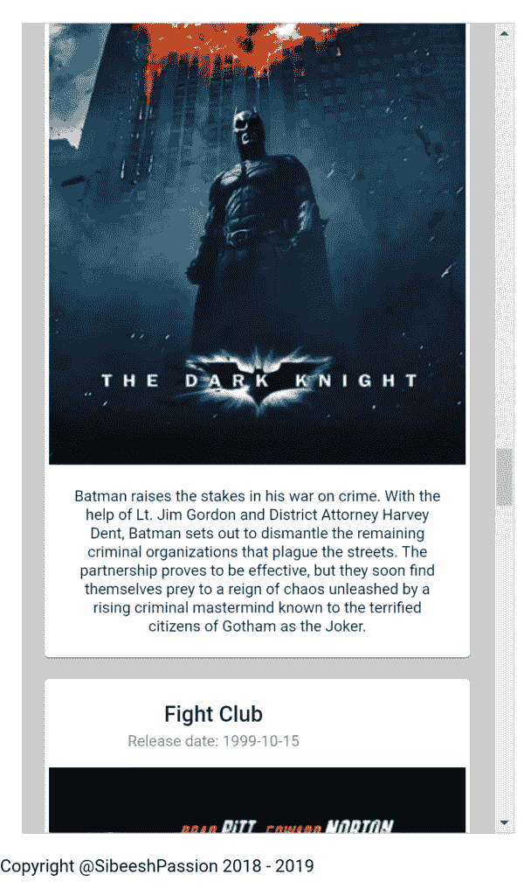
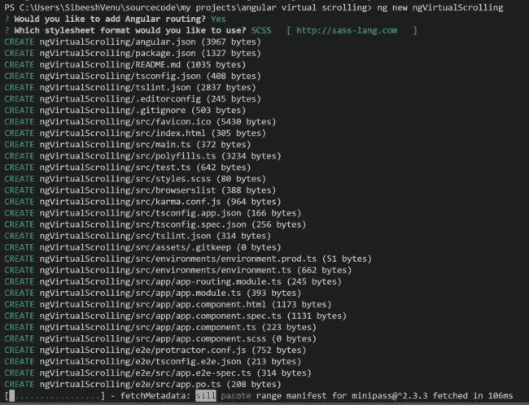
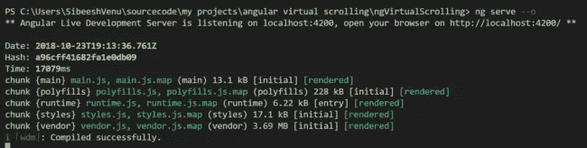
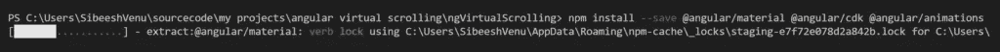
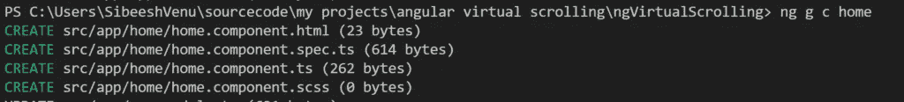
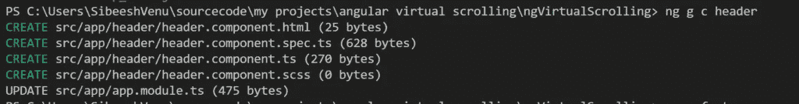
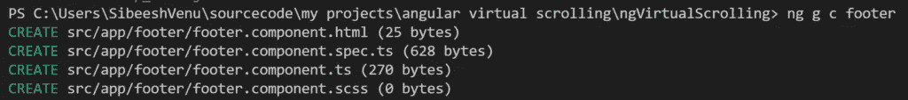
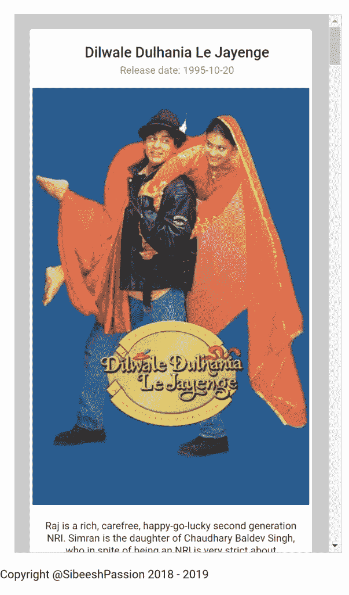

# 角度虚拟滚动— ngVirtualScrolling

> 原文：<https://betterprogramming.pub/angular-virtual-scrolling-ngvirtualscrolling-159e1c66c63b>

## 了解如何在 Angular 7 中实现虚拟滚动

角度虚拟滚动演示中间

# 介绍

是啊！Angular 7 推出了一些很酷的新功能。在这篇文章中，我将解释一下 Angular 7 的一个特性——虚拟滚动。

到本文结束时，您将拥有一个应用程序，该应用程序使用虚拟滚动特性从数据库中获取真实数据并将其绑定到 UI。我不知道你是怎么想的，但是我对开发一个具有这个特性的示例应用程序感到非常兴奋。

说够了。看一看[源代码](https://github.com/SibeeshVenu/ngVirtualScrolling)，然后让我们进入设置。

# 正在创建 ngVirtualScrolling 应用程序

我们要做的第一件事是创建一个虚拟应用程序。

## 安装角度 CLI

是的，正如你所猜测的，我们正在使用 Angular CLI。如果你还没有安装 Angular CLI，我建议你安装。对于 Angular 来说，这是一个非常棒的 CLI 工具。您可以通过运行以下命令来安装 Angular CLI。

一旦我们设置了这个项目，我们将使用 Angular CLI 命令。前往 Angular 到[看看你能用 CLI](https://cli.angular.io/) 做的一切。

## 生成新项目

现在是时候生成我们的新项目了。我们可以使用下面的命令来做到这一点。

您将能够看到这个 CLI 为我们所做的所有艰苦工作。

生成 ng 项目

现在我们已经创建了我们的应用程序，让我们运行它，看看它是否工作。

构建并在浏览器中打开

我们将使用棱角分明的材料进行设计。现在安装它，连同动画和 cdk。

安装材料、cdk 和动画

对于 Angular 6+版本，您也可以通过执行以下命令来完成此操作。

## 生成组件

现在我们的项目已经准备好了，我们可以开始创建组件了。同样，CLI 将免费为我们完成这项工作。如果是自由开发人员做这项工作，你认为你会付给他们多少钱？

ng g c 主页

天然气集管

ng g c 页脚

现在我们有三个组件可以使用。让我们开始吧。

## 设置标题组件

我将只编辑标题组件的 HTML，而不添加任何逻辑。你可以添加任何你想添加的东西。

## 设置页脚组件

## 设置 app-routing.module.ts

我们将专门创建一条回家的路线。

## 在 app.component.html 设置路由器出口

现在我们有了路线，我们可以设置出口。

## 设置 app.module.ts

每个 Angular 应用程序至少有一个 NgModule 类。它被命名为`AppModule`，驻留在一个名为`app.module.ts`的文件中。如果你想了解更多关于架构的知识，请查看[角度指南](https://angular.io/guide/architecture-modules)。

你看到那边的`ScrollingModule` 了吗？您应该导入它以使用虚拟滚动。它驻留在`@angular/cdk/scrolling`文件中。您可能已经注意到，我们已经在提供商的阵列中添加了一个名为`MovieService` 的服务。我们现在将创建一个。

## 创建电影服务

由于我想让这一块尽可能短，所以我没有对服务类做太多，也没有实现错误机制和其他东西。这项服务将从在线数据库 [TMDB](https://www.themoviedb.org/) 获取电影。在这个作品和仓库里，我用我的。我强烈建议你创建自己的而不是用我的。

现在让我们尝试设置配置文件。

## 设置配置

配置文件允许你以一种方便的方式安排事情。您必须在使用的所有项目中实现。

## 创建电影组件

现在让我们创建一个新的组件来加载电影。基本上，我们将在`cdkVirtualFor` 中使用这个电影组件，这样它每次都会调用这个组件并呈现它。我们的电影组件将有如下的 HTML。

typescript 文件将有一个带有`@Input` decorator 的属性，这样我们可以从 home 组件向它输入值。

## 设置主页组件

这是主要部分，虚拟滚动发生的地方。让我们现在设计 HTML。

这里`itemSize` 是强制属性。您可以根据想要加载到组件中的数据量给出任何数字。我们使用`[movie]=“movie”`将这些值输入到我们的 app-movie 组件中。

现在让我们看看 typescript 代码。

我有一个父类`HomeComponent` ，在那里我从一个类`MyDataSource`中获取数据，这个类扩展了`DataSource<Movie | undefined>`。这个`DataSource` 是一个抽象类，驻留在`@angular/cdk/collections`中。

由于`MyDataSource`类是从`DataSource`扩展而来的，我们必须覆盖两个函数——`connect()`和`disconnect()`。根据[角度材质文档](https://material.angular.io/cdk/scrolling/overview)，虚拟滚动视口将调用`connect` 方法来接收一个流，该流发出应该被渲染的数据数组。当视口被销毁时，视口将调用`disconnect` ，这可能是清理在连接过程中注册的任何订阅的正确时间。

在`connect` 方法中，我们调用自己的服务来获取数据。

## 自定义样式

我对一些组件应用了一些自定义样式，你可以在 GitHub 的资源库中看到。如果您正在从头开始创建应用程序，请复制这些内容。

## 输出

一旦你实现了所有的步骤，你将拥有一个使用 Angular 7 虚拟滚动和实际服务器数据的应用程序。现在让我们运行应用程序，看看它是如何工作的。

角度虚拟滚动演示开始

角度虚拟滚动演示中间

# 结论

在这篇文章中，我们学习了如何:

1.  创建角度为 7°的应用程序
2.  使用 Angular CLI
3.  以角度生成分量
4.  使用材料设计
5.  在 Angular 7 中使用虚拟滚动

请随意使用这个 GitHub 库并分享您的发现。非常感谢你的阅读。我很快会带着同一主题的另一篇文章回来。