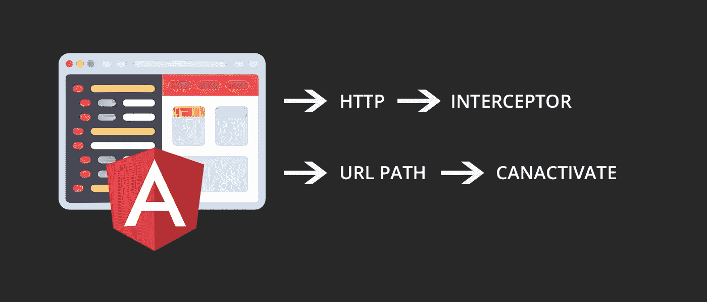
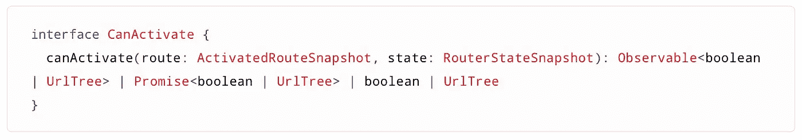
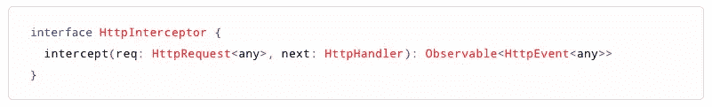

# 角激活器与截击机——综合指南

> 原文：<https://betterprogramming.pub/angular-vs-interceptors-guide-c256b72f3415>

## 如何在它们之间做出选择以得到你想要的



[CanActivate](https://angular.io/api/router/CanActivate) 和[拦截器](https://angular.io/api/common/http/HttpInterceptor)都是操作和设置认证模式的伟大工具。但是它们经常被误解，因为它们看起来代表相似的机制，但是它们彼此之间却有很大的不同。

这两个工具之间唯一的共同点是它们都是实现角度接口的类，并且两个接口都需要实现一个方法。对它们进行编码非常简单。但是由于这些类没有通用的设计模式，所以很难选择使用哪一个或者更喜欢哪一个。

# CanActivate 界面



该接口要求该类实现`canActivate()`方法，其参数是当前路线和状态。

该接口的主要目标是产生一个布尔值，指示当前路线是否可通过导航访问。

这个接口的重要之处在于，返回值可以是普通的布尔值、`Promise<boolean>`或`Observable<boolean>`。这使得实现接口方式的类更加通用，因为我们可以在某一点产生一个布尔值，甚至不是立即产生。我们可以使用 web 服务来验证 URL 调用，而不是直接响应 Angular 路由器。那么我们有两种常见的实现模式:

1.  **同步**:使用 RBAC(基于角色的访问控制)系统或通过简单地检查认证令牌是否正确地存储在它应该存储的位置以及它是否过期，来验证当前用户是否具有访问路由的特权
2.  **异步**:通过 AJAX 验证用户是否可以访问路由器，再次使用 RBAC 服务器端控件或验证令牌及其摘要，以检查它是否被黑客攻击或出现任何错误

在同步的情况下，记住你必须使用 Rx 操作符如`pipe()`、`map()`、`catchError()`和可观察构造函数如`of()`来发出一个`Observable<boolean>`。

# HttpInterceptor 接口



这个接口需要实现`intercept()`方法。角度拦截器类似于中间件(比如像 Express’中间件)，拦截并处理所有 HTTP 请求。拦截器通常用于将 HTTP 头附加到请求上，读取或过滤请求。Angular 拦截器作用于每个 HTTP 请求，不能只拦截其中的一部分，除非您对每个 HTTP URL 进行编码和切换，定义规则来这样做。

拦截器处理所有请求，操纵或读取其中的数据。在单页面应用程序中，它们基本上处理 AJAX 请求，因为我们不使用服务器端导航模式。

接口方法获得两个参数:第一个检查当前请求，第二个在链中转发请求并使 HTTP 进程继续进行。请注意，角度`HttpRequest`不能直接修改，而必须克隆，然后按照[官方文档](https://angular.io/api/common/http/HttpRequest)中的描述转发。

# 角度实现

在 Angular 应用程序中有两种不同的方式来使用拦截器和激活器。每一个实现这些接口的类都必须在`app.module.ts`或者你的定制模块中被包含和声明。

因为它们互不相同，所以它们在模块中的包含也有所不同。拦截器和激活器(有时称为*守卫*)都必须在提供者数组中声明。但是，虽然只需要包括守卫，拦截器需要一点更棘手的声明:

```
**// app.module.ts**providers: [
 MyService,
 MyOtherService,
 ...,
 AuthGuard,    // <- implements canActivate
 RoleGuard,    // <- implements canActivate
 ...,
 // Interceptor 
 {
    provide : HTTP_INTERCEPTORS,
    useClass : TokenInterceptor,
    multi : true
 }
 ],
 // continue...
 ],
```

正如您所看到的，CanActivates 只是被简单地包含在内，但是拦截器需要在一个特殊的对象中用这些字段来声明:

`provide`:用于注入拦截器的多提供者令牌

`useClass`:表示当前的拦截器类

`multi`:描述`HTTP_INTERCEPTORS`是否是注入一组值而不是单个值的`multiProvider`的标记

# 结论和主要差异

can activatives(guards)和 interceptors 都可以用来将导航锁定到某条路线或实现授权机制。然而，它们是完全不同的，必须在不同的环境中分别使用。

*   **可以激活单个路由上的工作，接口可以处理所有 HTTP 请求**。这意味着如果您必须完整地操作 HTTP，那么您需要一个拦截器。如果你需要控制一条路线，那么你应该使用警卫。
*   CanActivates 可以是异步的，而拦截器不能。让一个拦截器异步地做一些事情，然后使用一个防护来验证您的令牌或者通过 AJAX 授权访问，这是没有意义的。
*   **创新者被制成锁链**。很少需要多个拦截器，而守卫通常是一个接一个的。这允许多个警卫分析对特定路线的访问，并避免或允许访问。

代码守卫和拦截器的实现和模式非常依赖于应用程序的上下文，因为不同的应用程序需要不同的和特定的认证机制。一些应用程序需要在启动时显示登录页面。其他应用程序要求用户在特定的关键点登录，就像 CRM(完全锁定)和电子商务 web 应用程序一样，可以要求用户仅在结账时登录。

使用守卫和拦截器很容易，但是您需要练习一些模式来避免计算开销，并了解您是否需要其中一个。