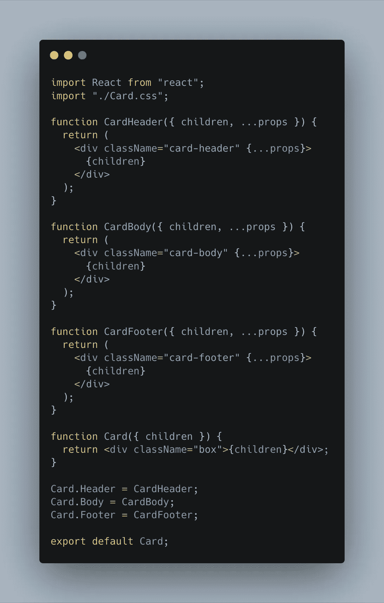
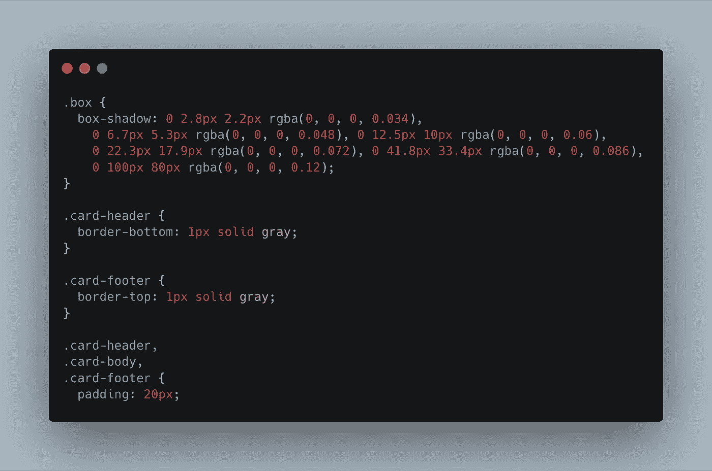
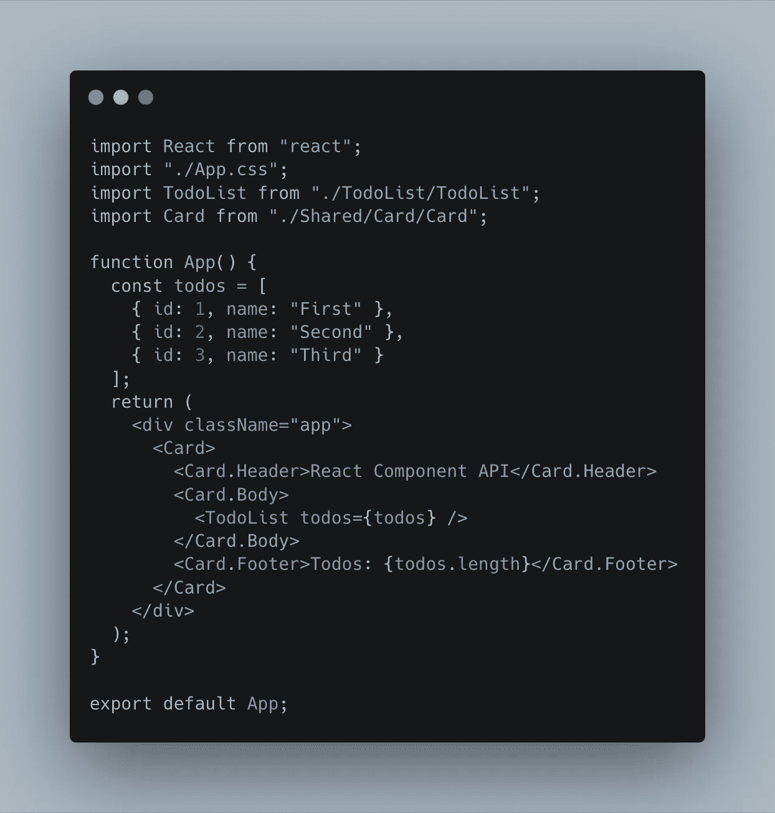
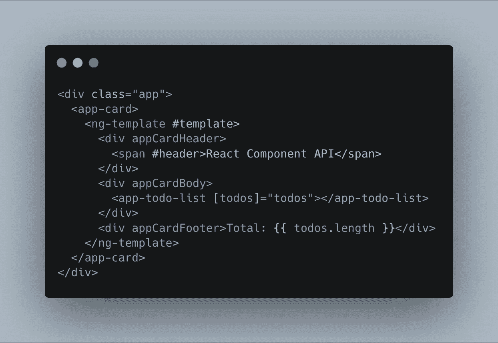
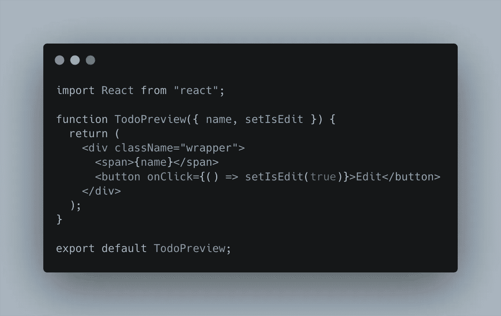
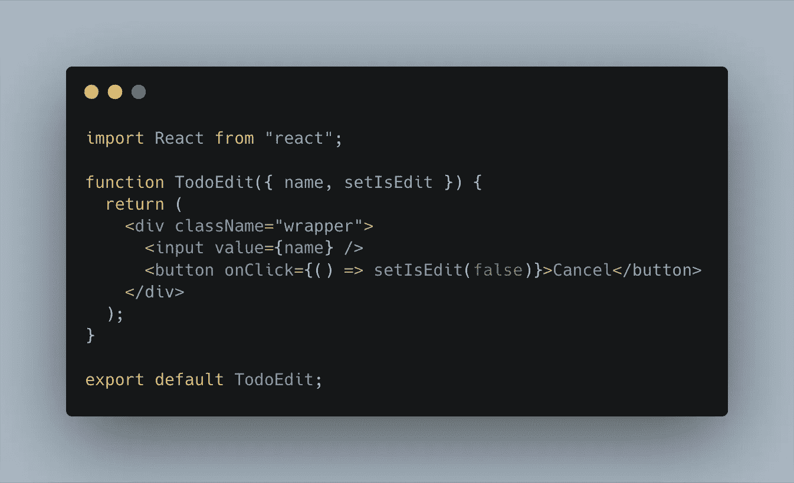
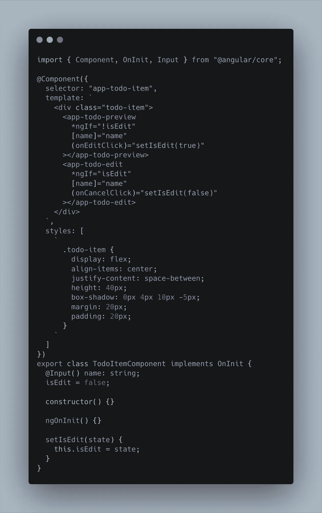
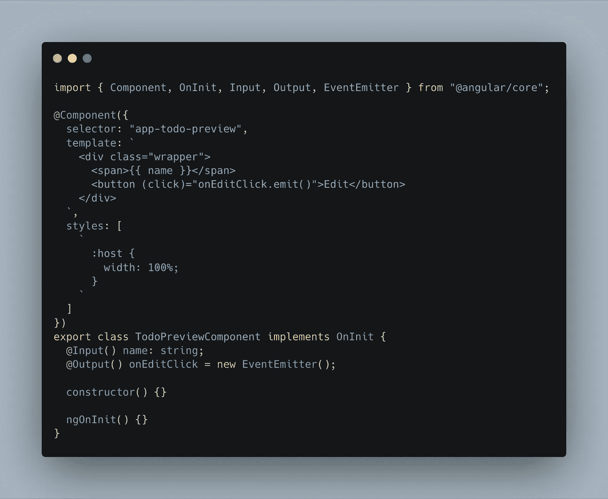
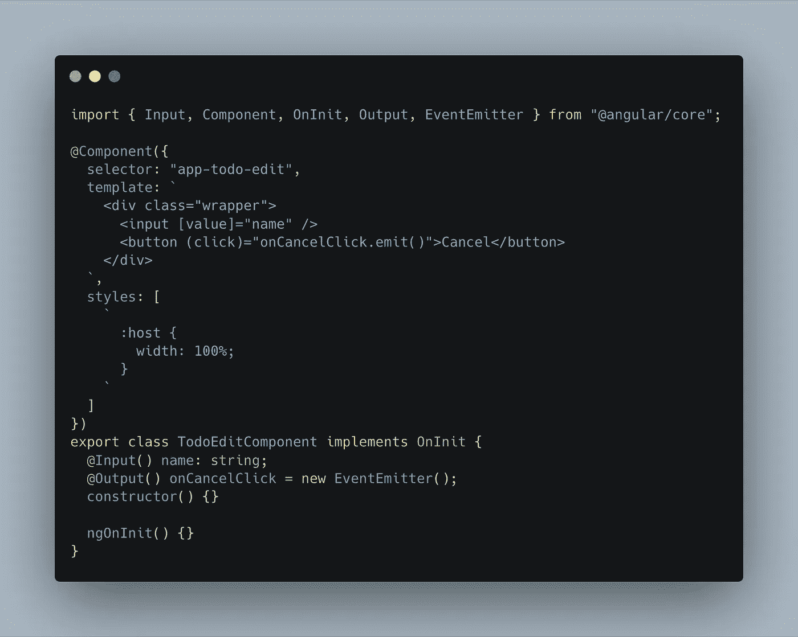

# 反作用与角度:组件比较

> 原文：<https://betterprogramming.pub/angular-vs-react-components-compared-b4f6782bc1d9>

## 角度分量与反应分量有何相似和不同之处

角度与反作用:组件比较

每天，我们都面临前端挑战，最常见的是用组件构建一个可重用的环境。

毫无疑问，每个开发人员都有自己的代码风格，但现在，我将尝试展示我们如何在 React 和 Angular 中使用组件，以及它们的区别和优势。

# **API**

我们先看 React，拿一张简单的卡片来讨论。

上面，你可以看到我们有一个`Card`，它只接收`children`组件作为道具，并用这个可重用组件的独特风格包装它们。

我们还有`Header`、`Body`和`Footer`组件。它们完全独立，只是作为`Card`的一部分输出。见下文:

我们简单地导入`Card`，自动在里面有`Header`、`Body`和`Footer`。

## 问与答(Question and Answer)

问:我们能在`Card`之外使用它吗？

答:是的，但是你必须导入整个`Card`而不仅仅是`Header`。

那么 Angular 呢——这个有上面那么简单吗？

让我们看看！

在构建组件时，Angular 是非常不同的。由于特定于角度的生态系统和类型脚本，我们不能逐个函数地构建函数。

上面，你可以看到我们已经创建了一个定制组件`app-card`，它可以在内部接受一个定制模板。然后，可以看到`appCardHeader`、`appCardBody`、`appCardFooter`。不一样了吧？

我们不能只为一个需要的组件制作一个包装器——Angular 强迫我们使用他们的[指令](https://angular.io/guide/attribute-directives) API *。*

我们也可以创建完全独立的组件，对于其他人来说会更容易理解，但是为什么要这样做呢？Angular 为构建和定制组件提供了额外的功能。

然而，这并不是在 Angular 中构建`Card`组件 API 的唯一方式。如何实现更复杂的组件 API 取决于您。

# **做出反应**

React 中最近的更新允许我们将组件构建为返回自定义标记并可以包含状态的函数。

我建议尽可能深入地将组件分解成更小的子组件，只要它仍然有意义。让我们看看下面的例子。

# **角度**

会有一点不同，但仍然使用相同的想法。

# 讨论

让我们讨论一下为什么我们需要这样的方法来构建最简单的应用程序。

首先，你不知道什么时候或者如何使用你以前的经验来构建和你以前做过的项目几乎一样外观的组件。随着你的学习，当一个新的挑战出现在你面前时，你会感到更加轻松。

第二，想象你正在着手一个全新的项目，看到某种指令，比如:“嘿，你应该像这样构建和使用这个组件”，并看到使用中的组件 API。

你怎么想呢?整合需要多长时间？答案很清楚——它会很快集成。

最后，我们构建的组件越多，我们得到的应用程序就越复杂。然而，如果一个组件做了它应该做的事情，那么它就值得被创建。

# 优势

如果你足够擅长在你的项目、工作等中使用 React 和 Angular，那么你就没有问题。

## **反应过来的优势**

*   可以非常快速地创建组件。
*   它将是可读和简短的。
*   即使在应用程序之外，也可以访问和共享它。您可以为自己构建组件，或者将它们作为组件库共享。
*   React 的编码组件非常快。

## **棱角优势**

*   会很严格。
*   大多数 Angular 开发人员都熟悉这个文件夹结构。
*   指令很容易在应用程序中共享。

# 摘要

无论你构建什么样的组件，记住要让它在将来可以重用，并且记住别人应该理解你写的东西。

在大型组件的情况下，我建议明智地分析它，并获取为它构建一个舒适的 API 所需的所有信息。阅读文件，做实验，做自己喜欢的项目。

学习 JavaScript ，你会有更多的新想法来构建令人惊叹的应用程序。如果你自己处理不了， [inVerita 非常乐意帮助](https://inveritasoft.com/blog)。

# 饭桶

*   [有角度的待办事项](https://github.com/Lolibai/angular-todo)
*   [对待办事项做出反应](https://github.com/Lolibai/react-todo)

> “想象是创造的开始。你想象你所渴望的，你将实现你所想象的，最后，你将创造你所希望的。”乔治·萧伯纳

祝你好运！

*原载于 2020 年 1 月 28 日*[*【inveritasoft.com】*](https://inveritasoft.com/blog/react-vs-angular-components-compared)