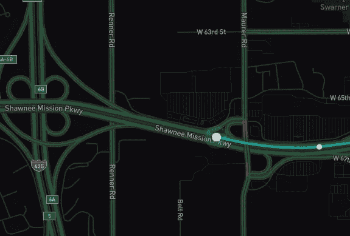

# 如何使用 Mapbox 和 React 钩子制作地图标记动画

> 原文：<https://betterprogramming.pub/animate-map-markers-using-mapbox-react-hooks-2f646a6301e>

## 美妙的地图体验改变了应用程序的游戏规则。我们如何在 web 应用程序中实现这一点？

每个人都会注意到一款拥有良好地图体验的应用。我们都见过让这种情况发生的移动应用程序:你在等待拼车，实际上可以看到你的司机越来越近！那么，我们如何在 web 应用程序上实现这一点呢？



# **地图框**

相比谷歌地图，我更喜欢 Mapbox，原因有几个，主要是我觉得它性能更好。以下示例将使用 [React](https://reactjs.org/) 和第三方 NPM 模块`[react-mapbox-gl](https://www.npmjs.com/package/react-mapbox-gl)`。您可以使用普通的 JS 和您选择的视图库来做同样的事情。

# 贴图设置(React-mapbox-gl 示例)

一旦我们建立并渲染了地图，我们就可以创建动画标记了。这可以使用一个[标记](https://docs.mapbox.com/help/tutorials/custom-markers-gl-js/)，或者像上面例子中的符号。我们还将使用另一个名为 [Turf](https://github.com/Turfjs/turf) 的包。Turf 基本上是 lodash 的地图功能。非常方便。

# 反应钩

[React 钩子](https://reactjs.org/docs/hooks-intro.html)都是最近炒作的。钩子允许我们利用许多我们习惯于基于类的组件的特性，而没有类的开销。在这个例子中，我们将使用两个不同的钩子，useState 和 useEffect。


# 组件设置

我们的组件将接受一个 prop，它是一个给定时间段内的位置数组。我假设您的应用程序每隔几秒钟就更新一次位置数据。如果你有一个更基于事件的模式，比如 web sockets，那就更好了👏。我们要做的第一件事是初始化我们将提供给地图提供商的当前位置。

```
*const* [currentLocation, setCurrentLocation] = useState(*null*);
```

接下来，我们要设置我们的效果，它将遍历我们的位置坐标数组。我们将使用一个名为`[requestAnimationFrame](https://developer.mozilla.org/en-US/docs/Web/API/window/requestAnimationFrame)`的 web API 函数:

将这种效应分解得更细一些。首先，我们希望确保我们的 locations prop 不为空(`length == 0`)。如果是这样，我们想返回，不做任何其他事情。一旦我们知道我们有了坐标，我们将使用 Turf 来构建我们的[更详细的](https://turfjs.org/docs/#lineString)坐标数组。这可以接受一个包含 X 个项目的数组，并创建一个包含任意多步长的线的数组。很有帮助！然后，我们想定义我们的动画功能。这是我们用数组中的当前位置设置状态的地方。确保我们有一个退路，以防我们想出`*undefined*` *。*

假设我们的时间步长不大于我们的步数，我们将继续调用`requestAnimationFrame` 并将其传递给我们的动画函数。一旦我们用完了步骤，动画将停止被调用。在上面的例子中，我们假设大约每 30 秒就会得到一个新的位置。在 animate 函数下面是我们取消动画帧并开始一个新帧的调用。当我们的位置发生变化时，就会发生这种情况。有一个很好的方法来防止在每个组件渲染时运行。这是`useState`的第二个参数:一组用于观察和比较的道具。

# 提供；给予

最后，我们将使用当前位置的状态来呈现我们的标记:

# 资源

*   [反应钩](https://reactjs.org/docs/hooks-intro.html)
*   [react-mapbox-gl](https://www.npmjs.com/package/react-mapbox-gl)
*   [地盘](https://github.com/Turfjs/turf)