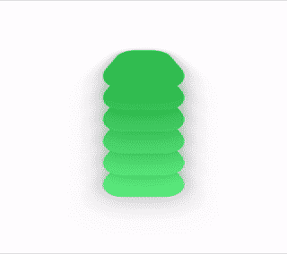
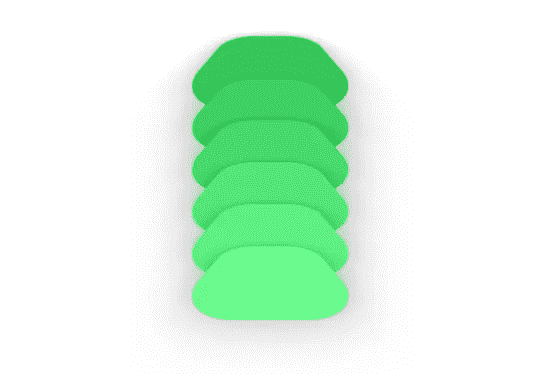
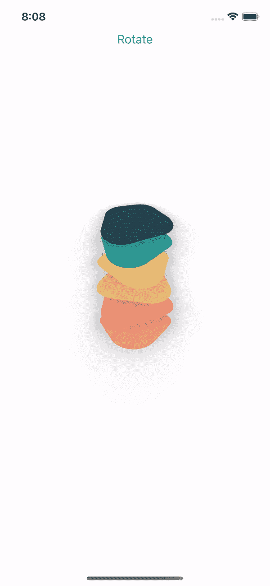

# SwiftUI 中的动画视图

> 原文：<https://betterprogramming.pub/animate-views-in-swiftui-5a9e7a2be21>

## 如何用 SwiftUI 构建简单但漂亮的动画


由[麦克斯韦·纳尔逊](https://unsplash.com/@maxcodes?utm_source=unsplash&utm_medium=referral&utm_content=creditCopyText)在 [Unsplash](https://unsplash.com/s/photos/swift?utm_source=unsplash&utm_medium=referral&utm_content=creditCopyText) 上拍摄的照片

## **先决条件**

*   迅速发生的
*   斯威夫特伊
*   Xcode 12 beta 2

# 介绍

构建一个复杂的动画起初可能看起来令人生畏，但是，像计算机科学中的任何其他问题一样，您可以通过使用分而治之的方法来简化它。这是我们将要建造的。



如果你不想跟随整篇文章，跳到你能找到 GitHub 链接的结尾。

# 第一

让我们从一些基本的开始。我们要做的是画一个矩形，并使角落变圆。与 UIKit 相比，这在 SwiftUI 中相当简单——只有一行代码:

```
RoundedRectangle(cornerRadius: 25.0, style: .continuous)
```

我们画了一个长方形。

现在，我们要添加一些颜色和旋转效果。然后，我们将通过一个按钮来触发旋转。我们将使用 SwiftUI 中的工具，如`VStack`、`Button`、`@State`、`@Binding`。如果你不熟悉这些词，你可能想刷新你的 SwiftUI 知识！

当您运行这段代码时，您会看到矩形旋转了，但是动画效果并不平滑。在 SwiftUI 中，有一个完美的修改器来制作这样的过渡动画。只需在第 14 行之后，在`.rotationEffect(..)`之后添加下面的代码。您也可以将`rotationDegree`改为 360°进行全旋转:

```
.animation(.easeInOut)You can also make your view animate forever (Well, not forever of course). Here is how to do it..animation(Animation.easeInOut.repeatForever(autoreverses: **true**))
```

我们将`autoreverses`设置为 true，这样当动画完成时，视图也可以返回到原始状态。现在，我们有一个连续旋转的矩形视图。

为了实现 gif 格式的动画，我们应该旋转 3D 视图:

```
.rotation3DEffect(Angle.degrees(60), axis: (x: 1, y: 0, z: 0))
```

这段代码将我们的视图在 x 轴上旋转 60 度。它应该看起来好像我们的对象是躺在一个平面上。我不确定如何准确地描述它，但它看起来像这样:


由于我们有一个旋转视图，我们将使用该视图的多个实例。但是我们必须首先修改我们的视图，以便它能够动态地工作。我的意思是我们的视图需要知道什么时候开始旋转。这里有两个要点。第一个是点击动作，告诉视图开始旋转。另一个是延迟机制。如果我们不使用延迟机制，我们的视图将一起旋转，看起来完全一样。我们需要的是一个绑定属性和一个索引。我们将这样使用它:

```
RectangleView(isRotated: $isRotated, index: index)
```

`ContentView`:

`RectangleView`:

我们就快到了，只差几步了。如果你跟踪了一切，你会看到我们的视角如预期的那样旋转。但是他们彼此远离。为了解决这个问题，我们使用了`.offset`修改器。我们将在 Y 轴上拉近它们，这样会好得多。

```
**var** yOffset: CGFloat = -60.offset(x: 0, y: yOffset * CGFloat(index))
```

我知道——这看起来有点奇怪，当你运行它时，动画甚至没有接近我在 Gif 中承诺的那样。相信我，会好起来的。

问题是所有视图都在同一 Z 轴上:



为了解决这个问题，我们将使用`.zIndex`来控制哪个视图出现在前面或后面。把它想象成你在 Z 轴上插入。任何具有更大`zIndex`的视图都将在最前面。为了简单起见，我使用了一个带有负值的数组索引:

```
.zIndex(Double(-index))
```

# 最后

我们完了！

让我们美化它并添加一些颜色，将这条线从`.green`改为`color[index]`:

```
.foregroundColor(color[index]).brightness(0 + (0.04 * Double(index)))
```



# 结论

Gif 质量不如视频质量——在模拟器中看起来好很多，也更流畅。

借助 SwiftUI 的强大功能，构建 UI 动画变得前所未有的简单。你可以把小的动画放在一起，创造出漂亮的动画。尝试不同的组合——值得你花时间。

感谢阅读！如果您有任何问题或反馈，请联系我们。您可以通过下面的链接找到该项目:

[](https://github.com/ibrahimoktay/SwiftUIAnimation) [## ibrahimoktay/SwiftUIAnimation

### 在 GitHub 上创建一个帐户，为 ibrahimoktay/SwiftUIAnimation 开发做贡献。

github.com](https://github.com/ibrahimoktay/SwiftUIAnimation)