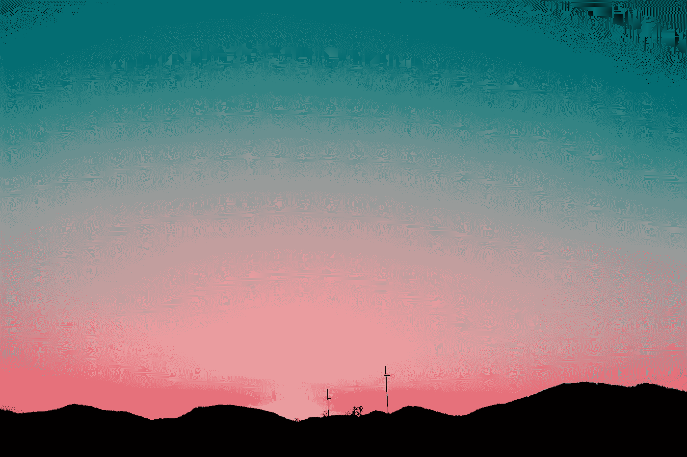
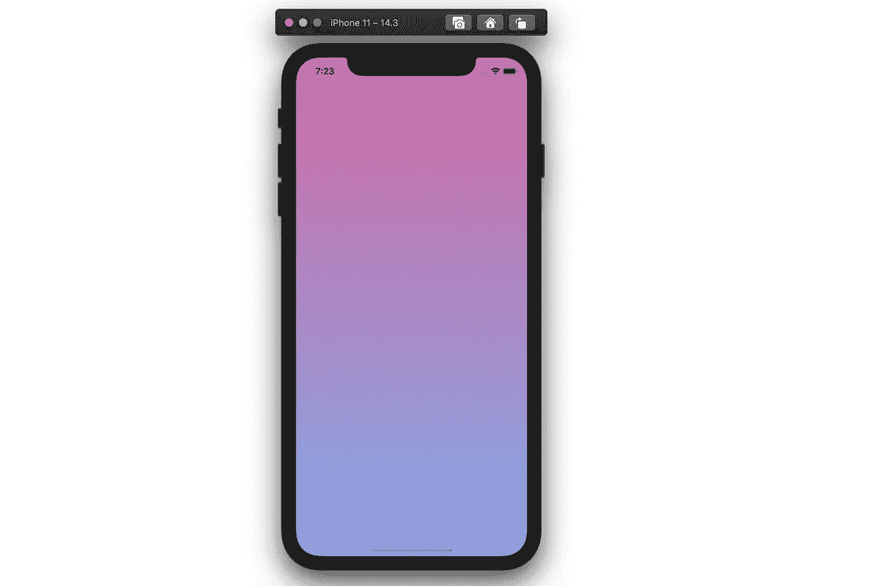
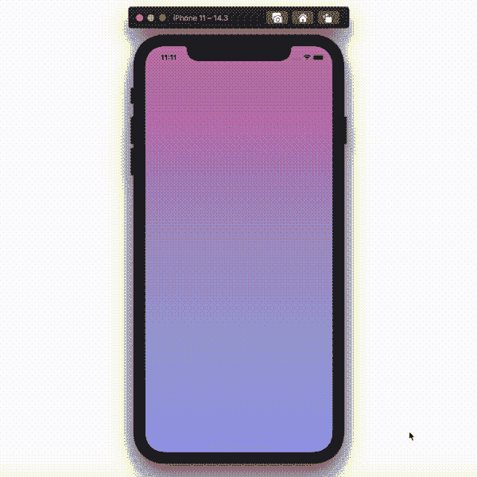
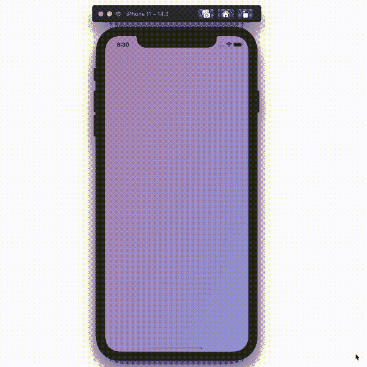

# 在 Swift 中制作渐变动画

> 原文：<https://betterprogramming.pub/animate-your-gradient-in-swift-52186b9b14d3>

## 了解如何在您的 iOS 应用程序中创建平滑的动画渐变



照片由[丹·阿拉贡](https://unsplash.com/@danaragonmx?utm_source=medium&utm_medium=referral)在 [Unsplash](https://unsplash.com?utm_source=medium&utm_medium=referral) 上拍摄。

如今，渐变随处可见。这也难怪。通过适当的颜色组合，它们可以创造出非常流畅的视觉效果。

今天，我将向你展示如何创建你自己的渐变。更好的是，我将教你如何制作动画来进一步改善体验。

让我们开始吧。

# 给我看看代码

如果您对实现细节不感兴趣，请随意将以下代码复制粘贴到您的视图控制器中，并运行应用程序来查看效果:

# 如何在 Swift 中创建动画渐变

对于那些对实现细节感兴趣的人来说，您来对地方了。

如果使用得当，渐变会产生强大的效果。为了最大限度地利用它，请确保使用看起来很好的颜色和/或符合你的应用程序主题的颜色。

*注意:除非你是设计配色方案的专业人士，否则你可能会发现*[*ui gradients*](https://uigradients.com/)*中提供的渐变样本很有用。*

在你选择了一组好看的颜色后，让我们开始编码。

记得将所有代码放在视图控制器中。

## 定义颜色

首先，你需要定义你刚刚选择的渐变的颜色。我觉得这三种颜色非常酷。您也可以使用它们:

注意每种颜色是如何转换成`cgColor`的。这是因为你不能在渐变中使用这些颜色，否则。

## 初始化渐变

让我们初始化一个空的渐变层和一个空的数组。这个数组稍后将包含渐变颜色。您还需要一个索引来跟踪颜色:

```
**let** gradient: CAGradientLayer = CAGradientLayer()
**var** gradientColorSet: [[CGColor]] = []
**var** colorIndex: Int = 0
```

然后，让我们定义简单地为视图设置渐变的`setupGradient`函数。阅读代码注释，逐行理解该方法:

现在，你在你的`viewDidAppear`方法中调用`setupGradient`。运行应用程序，您应该会看到一个静止梯度:

```
**override** **func** viewDidAppear(**_** animated: Bool) {
    **super**.viewDidAppear(animated)

    setupGradient()
}
```



视图中会显示一个非动画渐变。

这个静止帧渐变从`color1`到`color2`(即`gradientColorSet`中的第一个颜色对)。稍后，您将在创建动画时更新这些颜色。

酷毙了。你有一个好看的渐变，但是动画部分不见了。接下来让我们给它一些动作。

# 如何制作渐变动画

## 组合渐变动画

为了制作流畅的渐变动画，您需要以这样的方式组合单独的渐变动画，即当一个动画停止时，下一个动画开始。

为了首先制作渐变动画，您需要赋予视图控制器处理渐变动画的能力。为此，确保视图控制器符合`CAAnimationDelegate`协议:

```
**class** ViewController: UIViewController**, CAAnimationDelegate** { 
    ...
}
```

然后让我们创建一个名为`animateGradient`的函数。这个函数负责创建一个渐变层的动画渐变。

这个视图控制器符合的`CAAnimationDelegate`带有一个非常有用的内置方法`animationDidStop`。每当一个动画结束时，都会触发此方法。该方法可用于*在前一个动画完成时创建新的动画*:

```
**func** animationDidStop(**_** anim: CAAnimation, finished flag: Bool) {
    **if** flag {
        animateGradient()
    }
}
```

现在您已经准备好了所有的代码，您可以在视图控制器的`viewDidAppear`方法中调用它:

```
**override** **func** viewDidAppear(**_** animated: Bool) {
    **super**.viewDidAppear(animated) setupGradient()
    animateGradient()
}
```

运行应用程序，您应该会看到:



这就完成了渐变动画的配置。一旦你启动你的应用程序，你现在应该在你的视图中有一个平滑的动画渐变。

# 更改渐变的方向

现在梯度从底部到顶部。但是你可能想改变这一点。这很简单。只需改变 `*setupGradient*` *方法内渐变图层*的`startPoint`和`endPoint`属性即可。**

在此之前，最好知道这些属性在默认情况下是这样配置的:

```
gradient.startPoint = CGPoint(x: 0.5, y: 0.0)
gradient.endPoint = CGPoint(x: 0.5, y: 1.0)
```

例如，如果您想要一个对角线渐变，您可以这样做:

```
gradient.startPoint = CGPoint(x:0.0, y:0.0)
gradient.endPoint = CGPoint(x:1.0, y:1.0)
```

结果:



一个漂亮的对角线对齐的渐变看起来很酷！

# 结论

恭喜你。现在你知道如何为你的应用程序设置一个简单的动画渐变。

感谢阅读。我希望你觉得这很有用。

# 资源

 [## Apple 开发者文档

### 编辑描述

developer.apple.com](https://developer.apple.com/documentation)