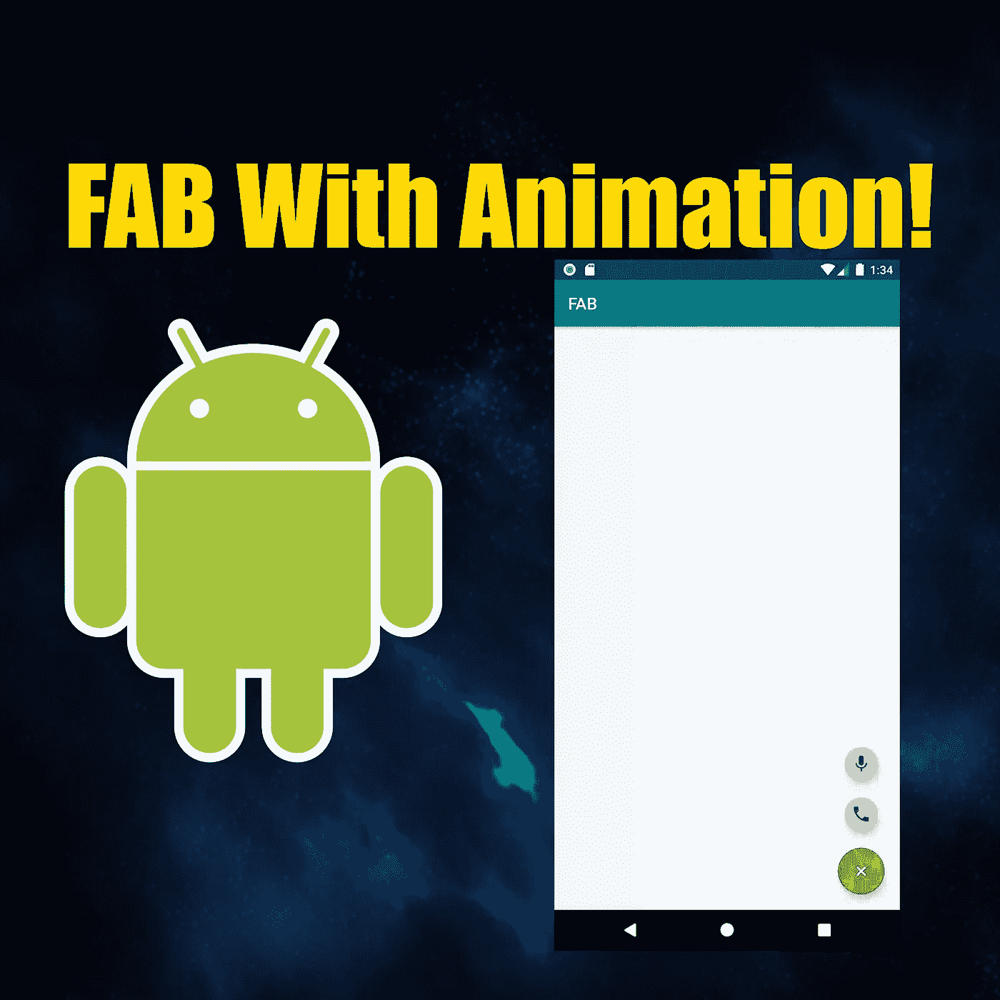
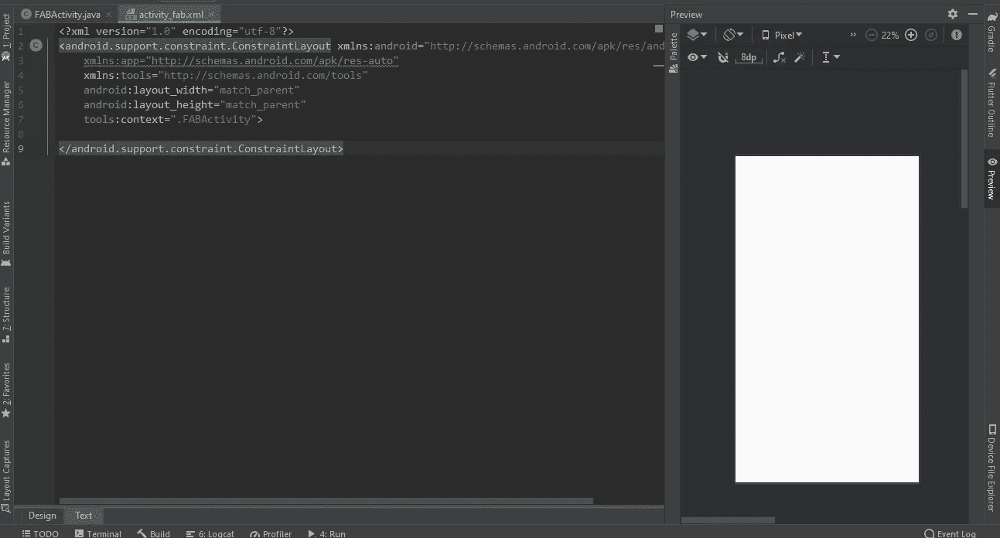
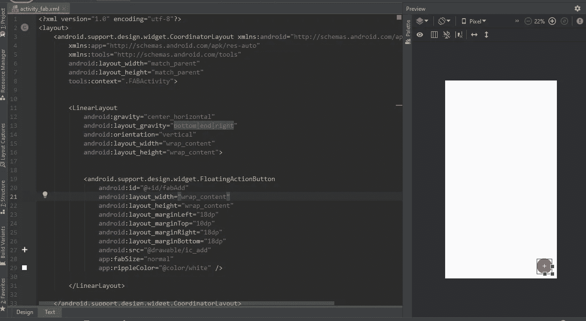
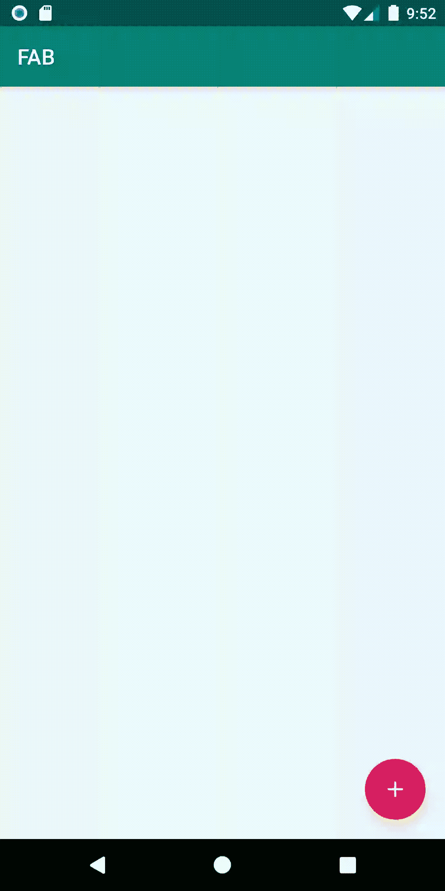
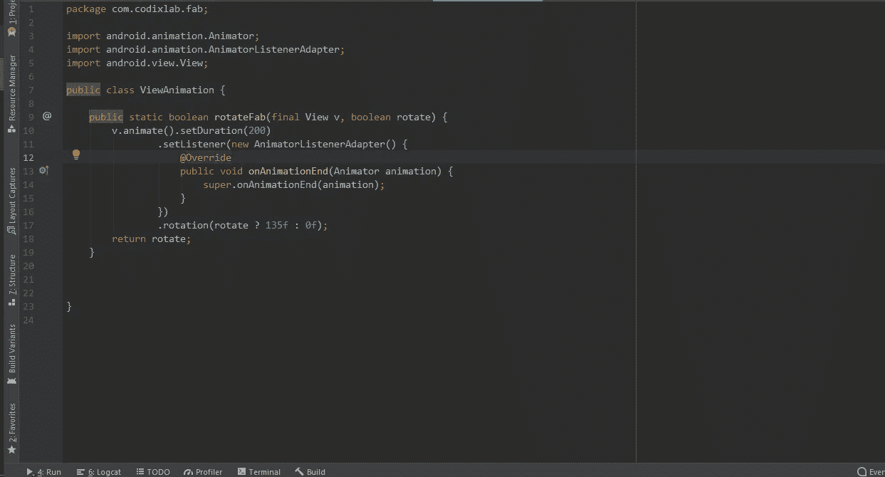
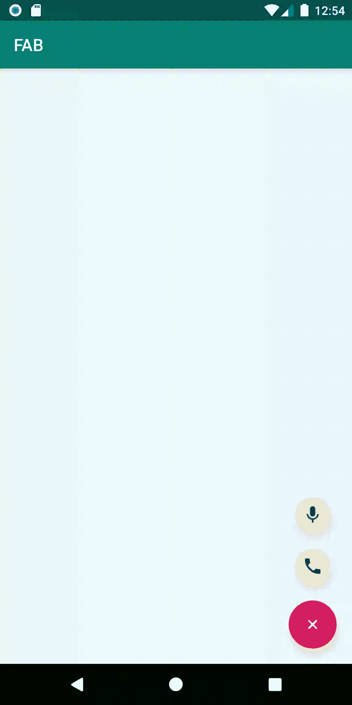
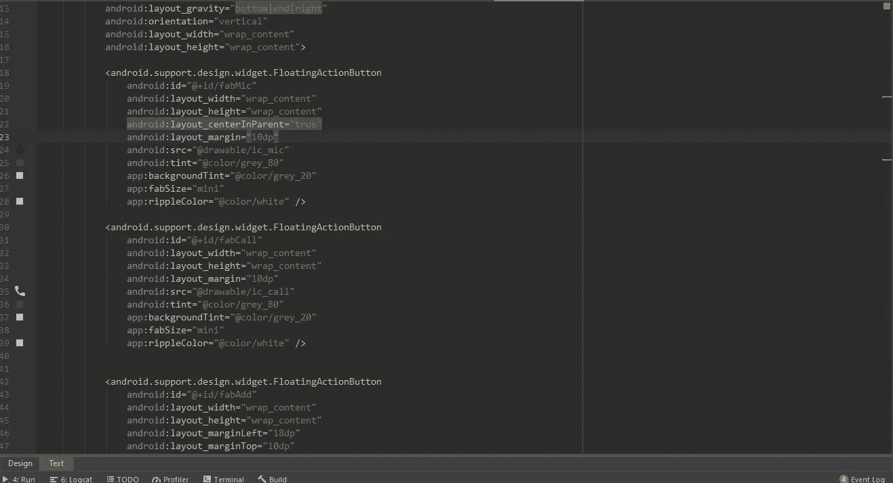
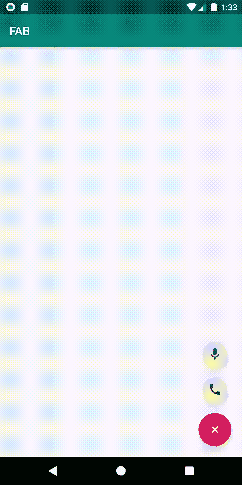
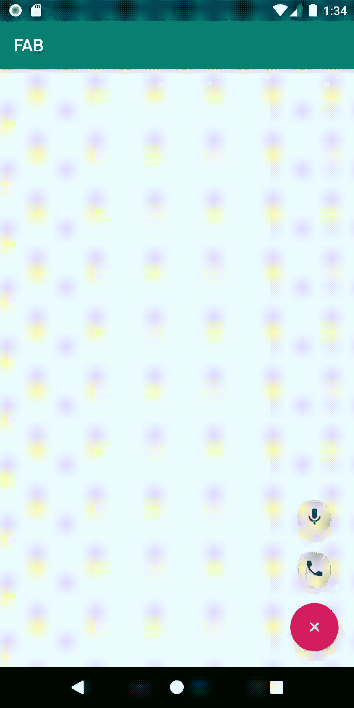

# 更多选项的动画浮动动作按钮！

> 原文：<https://betterprogramming.pub/animated-fab-button-with-more-options-2dcf7118fff6>



开发者们好！欢迎来到本教程。今天我要教你如何制作一个动画 FAB(浮动动作按钮),点击时显示更多选项。激动吗？

首先做一个 Android 空白项目。我希望你已经知道如何创建一个。

确保您已经添加了 Android 设计依赖项，因为 FAB 包含在该库中。将其复制并粘贴到您的项目中。

```
implementation 'com.android.support:design:28.0.0'
```

如果你不知道 android 数据绑定是如何工作的，也不知道什么是数据绑定，我强烈建议你去学习一下 [Android 数据绑定](https://android.jlelse.eu/android-data-binding-8d0eb34b9bad)。

对于这个项目，我将告诉你一些关于数据绑定的信息。在数据绑定中，你不再需要写`findViewById`。您可以将 XML 存储在一个变量中，并在整个活动中使用它。有道理吗？

要启用数据绑定，请在您的`build.gradle (app level)`中包含以下代码行。

```
dataBinding{
    enabled true
}
```

开始后，您的活动应该是这样的:



接下来，用`<layout>`标签把它包起来。不要慌；这就是数据绑定的工作原理！


包含<layout>标签！</layout>

`coordinatorLayout`是一辆超能力的`FrameLayout`。如果我们想与多个子视图或顶层装饰/chrome 布局交互，我们可以使用它。

让我们在`coordinatorLayout`里面加上`LinearLayout`。添加以下代码。

```
<LinearLayout
    android:gravity="center_horizontal"
    android:layout_gravity="bottom|end|right"
    android:orientation="vertical"
    android:layout_width="wrap_content"
    android:layout_height="wrap_content">
</LinearLayout>
```

接下来，在这个线性布局中添加浮动动作按钮(FAB)。

```
<android.support.design.widget.FloatingActionButton
    android:id="@+id/fabAdd"
    android:layout_width="wrap_content"
    android:layout_height="wrap_content"
    android:layout_marginLeft="18dp"
    android:layout_marginTop="10dp"
    android:layout_marginRight="18dp"
    android:layout_marginBottom="18dp"
    app:fabSize="normal"
    app:rippleColor="@color/white" />
```

把这些加到你的`colors.xml`里。

```
<color name="white">#ffff</color>
<color name="grey_20">#cccccc</color>
<color name="grey_80">#37474F</color>
```

添加三个将在按钮上显示的图标。我用的是安卓材质图标。你也可以使用你自己的图标，但是如果你想坚持使用我的图标，请加上我的选择。

现在在你的浮动动作按钮中包含添加图标。您的代码应该如下所示:

```
<android.support.design.widget.FloatingActionButton
    android:id="@+id/fabAdd"
    android:layout_width="wrap_content"
    android:layout_height="wrap_content"
    android:layout_marginLeft="18dp"
    android:layout_marginTop="10dp"
    android:layout_marginRight="18dp"
    android:layout_marginBottom="18dp"
    android:src="@drawable/ic_add"  //added add icon
    app:fabSize="normal"
    app:rippleColor="@color/white" />
```



让我们先制作我们的 FAB 动画:



制作一个名为`ViewAnimation.java`的动画师类。我们将把所有的动画方法添加到这个类中。

在 animation 类中添加此方法:

```
public static boolean rotateFab(final View v, boolean rotate) {
    v.animate().setDuration(200)
            .setListener(new AnimatorListenerAdapter() {
                @Override
                public void onAnimationEnd(Animator animation) {
                    super.onAnimationEnd(animation);
                }
            })
            .rotation(rotate ? 135f : 0f);
    return rotate;
}
```

您的动画类应该如下所示:



`ViewAnimation.java`

现在，让我们转到 activity 类，在 FAB 上实现我们的动画。

您的活动代码应该如下所示:


不要惊慌。我来详细说明一下每一步！

`ActivityFabBinding`:用于数据绑定。您首先必须编写*活动*，然后是它的名称，(在我的例子中，我将其命名为 *Fab* )，然后添加绑定。

`isRotate`:这是一个布尔值，它将根据旋转条件工作。如果为真，这意味着我们的晶圆厂是旋转的，如果为假，它不是。

`bi`:我使用数据绑定方法将整个 XML 存储在这个变量中。

运行应用程序，你会看到一个美丽，流畅的动画制作！

喜欢吗？

现在是添加子 FAB 按钮的时候了，当您点击*添加 FAB 按钮时，子 FAB 按钮将向上填充。*像这样:



为了实现这一点，您必须打开您的主 XML，在我们之前添加 FAB 按钮的地方，并在它下面添加以下代码行。

```
<android.support.design.widget.FloatingActionButton
    android:id="@+id/fabMic"
    android:layout_width="wrap_content"
    android:layout_height="wrap_content"
    android:layout_centerInParent="true"
    android:layout_margin="10dp"
    android:src="@drawable/ic_mic"
    android:tint="@color/grey_80"
    app:backgroundTint="@color/grey_20"
    app:fabSize="mini"
    app:rippleColor="@color/white" />

<android.support.design.widget.FloatingActionButton
    android:id="@+id/fabCall"
    android:layout_width="wrap_content"
    android:layout_height="wrap_content"
    android:layout_margin="10dp"
    android:src="@drawable/ic_call"
    android:tint="@color/grey_80"
    app:backgroundTint="@color/grey_20"
    app:fabSize="mini"
    app:rippleColor="@color/white" />
```

两者都是子 FAB 按钮。

你可以看到`fabSize`就是`mini`。您的代码应该如下所示:



现在我们必须实现打开和关闭功能。让我们在我们的`ViewAnimation.java`文件中添加一些新的函数来获得所需的结果。

```
public static void showIn(final View v) {
    v.setVisibility(View.*VISIBLE*);
    v.setAlpha(0f);
    v.setTranslationY(v.getHeight());
    v.animate()
            .setDuration(200)
            .translationY(0)
            .setListener(new AnimatorListenerAdapter() {
                @Override
                public void onAnimationEnd(Animator animation) {
                    super.onAnimationEnd(animation);
                }
            })
            .alpha(1f)
            .start();
}
public static void showOut(final View v) {
    v.setVisibility(View.*VISIBLE*);
    v.setAlpha(1f);
    v.setTranslationY(0);
    v.animate()
            .setDuration(200)
            .translationY(v.getHeight())
            .setListener(new AnimatorListenerAdapter() {
                @Override
                public void onAnimationEnd(Animator animation) {
                    v.setVisibility(View.*GONE*);
                    super.onAnimationEnd(animation);
                }
            }).alpha(0f)
            .start();
}

public static void init(final View v) {
    v.setVisibility(View.*GONE*);
    v.setTranslationY(v.getHeight());
    v.setAlpha(0f);
}
```

这三个功能帮助我们为迷你晶圆厂获得流畅的动画。

`showIn()`:这个方法负责在我们点击的时候把我们的晶圆厂推进去。

`showOut()`:这个方法负责把我们的晶圆厂往外推。

`init()`:这个方法负责在 app 启动时隐藏我们的按钮。

现在只需运行应用程序！


当我们运行它时，什么也没有发生！让我们一步一步地实现功能。

首先，让我们在应用程序启动时隐藏我们的迷你晶圆厂。在您的`onCreate`方法中添加以下代码行并运行应用程序。

```
ViewAnimation.*init*(bi.fabMic);
ViewAnimation.*init*(bi.fabCall);
```

现在是点击我们的主 FAB 按钮弹出它们的时候了。

在您的`onCreate`方法中添加这些行。

```
bi.fabAdd.setOnClickListener(new View.OnClickListener() {
    @Override
    public void onClick(View v) {
        isRotate = ViewAnimation.*rotateFab*(v, !isRotate);
        if(isRotate){
            ViewAnimation.*showIn*(bi.fabCall);
            ViewAnimation.*showIn*(bi.fabMic);
        }else{
            ViewAnimation.*showOut*(bi.fabCall);
            ViewAnimation.*showOut*(bi.fabMic);
        }

    }
});
```

运行应用程序，看看神奇！



让我们给我们的迷你晶圆厂添加点击听众！

```
bi.fabCall.setOnClickListener(new View.OnClickListener() {
    @Override
    public void onClick(View v) {
        Toast.*makeText*(FABActivity.this, "Calling", Toast.*LENGTH_SHORT*).show();
    }
});

bi.fabMic.setOnClickListener(new View.OnClickListener() {
    @Override
    public void onClick(View v) {

        Toast.*makeText*(FABActivity.this, "mic", Toast.*LENGTH_SHORT*).show();
    }
});
```

现在再次运行应用程序:



希望你喜欢这个教程！感谢阅读！:-)编码快乐！

**关注**[**CodixLab**](https://medium.com/codixlab)**了解更多科技知识。**

觉得这篇文章有用？跟着我 [Mustufa Ansari](https://medium.com/u/8ee4abb8abb8?source=post_page-----ab66e15c8635----------------------) 上媒。看看下面我读得最多的文章。

*   [Android recycler 用漂亮的动画观看](https://medium.com/better-programming/animated-fab-button-with-more-options-2dcf7118fff6)
*   [什么是 AndroidX？](https://medium.com/better-programming/what-is-androidx-1b8c9832af43)
*   [用 flutter 制作简单的笔记 app](https://medium.com/better-programming/simple-notes-app-with-flutter-part-1-ab66e15c8635)