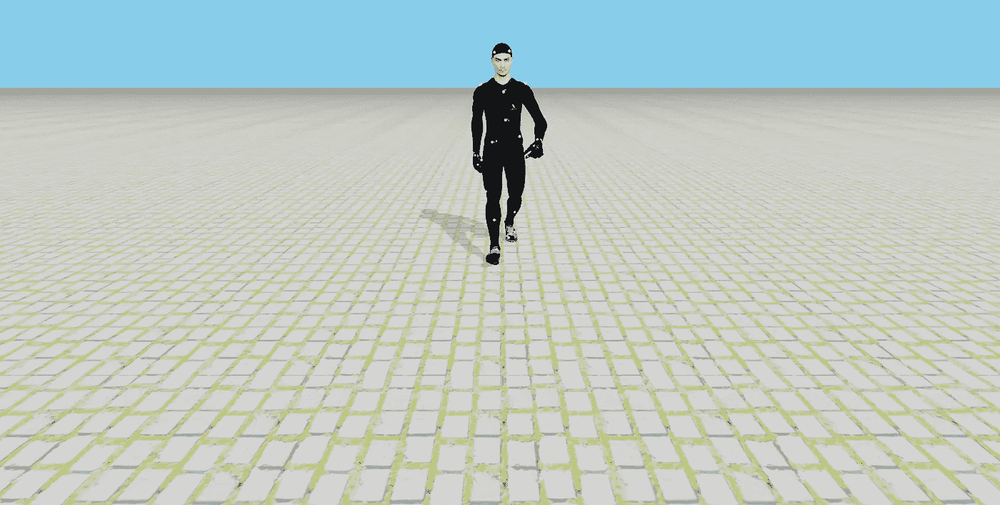
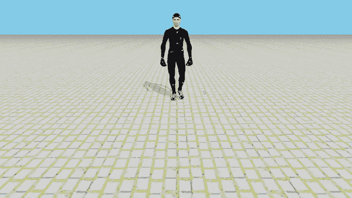

# 使用 PyWeb3D 制作 3D 模型动画

> 原文：<https://betterprogramming.pub/animating-3d-models-using-pyweb3d-ca5ad462235a>

## 将 three.js 与 Python 语法结合使用



作者图片

欢迎回来！今天的文章将指导你如何使用 [pyWeb3D](https://www.pyweb3d.org/) 制作 3d 模型动画。如果您错过了上一篇关于如何使用 pyWeb3D 加载 3D 模型的文章，请查看一下。

下面是我们将在本文结束时创建的内容的一个简短剪辑:



作者的视频剪辑

## 你需要什么

下载一个你选择的 3D 模型，这个模型已经装配好并且有动画(你可以从[sketchfab.com](https://sketchfab.com/3d-models?features=downloadable+animated)下载),或者如果你是一个 3D 艺术家，你可以使用你最喜欢的软件创建你的角色并将其导出。GLTF 或者。GLB 格式。

以下是我们将使用的资源:

*   [三维模型](https://sketchfab.com/3d-models/passive-marker-man-walking-4b1ef9a1d8814e4c9ff4fe668d62bff1)
*   [地面纹理](https://hdstockimages.com/wp-content/plugins/image-downloader-custom/temp/HDStockImages_premium_lbTzoB.jpg)

## HTML 样板文件

下面的所有代码都将放入 HTML 文件主体的内联`<script type=”text/python”>`标签中。

## 导入必要的模块和函数

## 变量设置

我们声明了稍后将在代码中使用的全局变量

## 创建我们的场景和动画模型

让我们一行一行地检查上面代码片段的内容

*   从第`2–7`行开始，我们从**变量设置**代码片段的第`1–3`行创建了可修改的变量。如果您是 python 的新手，那么需要使用 global 关键字来修改我们在**变量设置**代码片段的第`1–3`行中声明的变量的全局副本。
*   从台词`10 — 12`，我们创造了一个摄像机，定位摄像机，给它一个可以看的地方。
*   在第`15`行，我们创建了一个时钟。当我们制作场景动画时，时钟将在我们的代码中使用。
*   从第`17 — 19`行，我们创建了一个场景，给它一个天蓝色的背景颜色，和一个雾。
*   从第`22 — 35`行开始，我们添加了两个光源，一个半球光源和一个平行光，并将它们添加到场景中。
*   从第`38 — 42`行，我们为地面加载了一个图像纹理，并调整了默认设置。
*   从第`44 — 49`行开始，我们创建了一个网格，它将几何图形(本例中为平面)和材质作为参数。素材对于网格就像 CSS 对于 HTML 一样。然后我们调整了默认设置，并将其添加到场景中。
*   在第`52`行，我们实例化了我们的。GLB 模型装载机
*   从第`54 — 75`行，我们创建了一个回调函数来加载和动画我们的模型。
    我们来过一遍函数:
    **-** 从第`56 — 58`行开始，我们实例化了模型，缩小了一点，添加到场景中。
    **-** 来自`60 — 65`的线条，如果是网格物体，给模型添加阴影。
    **-** 在第`68`行，我们从模型中获取所有的动画片段。
    **-** 在第`70`行，我们为动画创建了一个播放器。
    **-** 在第`72`行，我们使用`animation[0]`选择了一个特定的动画剪辑。根据模型有多少动画剪辑，我们可以通过改变索引来选择剪辑。
    **-** 在第`73`行，我们使用`.play()`方法播放动画片段。
    **-** 在第`75`行，我们调用了我们的`animate`函数(我们还没有定义它)
*   在第`77`行，我们加载了模型。
*   从第`79 — 86`行开始，我们创建了一个 webgl 渲染器，调整了设置并将其添加到 HTML 文件的主体中。`renderer.domElement`是`canvas`
*   在第`88`行，我们初始化了控件。
*   在第`90`行，我们为窗口调整大小添加了一个事件监听器。

## 处理窗口大小

在这个代码片段中，我们定义了窗口大小调整处理程序

## 为我们的场景制作动画

最后，我们创建了`animate`函数

*   在第`2`行，我们告诉浏览器我们想要执行一个动画。
*   在`3`线上，我们得到了自时间开始以来经过的秒数。
*   从线`4 — 6`开始，我们向后移动地面。
*   在第`7`行，我们更新了动画播放器
*   在第`8`行，我们渲染了场景和摄像机。

# 现在运行代码

在浏览器中打开 HTML 文件。:)


作者的视频剪辑

看现场[版这里](https://www.pyweb3d.org/examples/#webgl_3D_model_animation)。

我希望你喜欢这篇文章。感谢阅读。

## 源代码

[](https://github.com/Bruno-Odinukweze/PyWeb3D/blob/main/examples/webgl_3D_model_animation.html) [## pyweb 3D/web GL _ 3D _ model _ animation . html 位于主 Bruno-Odinukweze/PyWeb3D

### 此时您不能执行该操作。您已使用另一个标签页或窗口登录。您已在另一个选项卡中注销，或者…

github.com](https://github.com/Bruno-Odinukweze/PyWeb3D/blob/main/examples/webgl_3D_model_animation.html) 

## 学分和参考

*   灵感来自 [three.js](https://threejs.org/)
*   [布里森](https://brython.info/)
*   P [ython](https://python.org/)

```
**Want to contribute?**Would you like to contribute to PyWeb3D? Join me, and let’s create something awesome together. Join me [here](https://github.com/Bruno-Odinukweze/PyWeb3D).
```