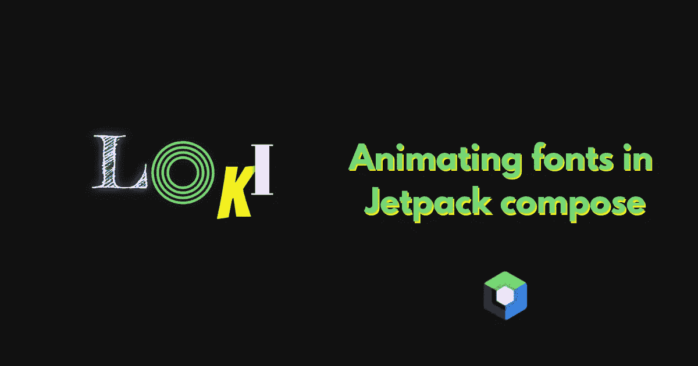
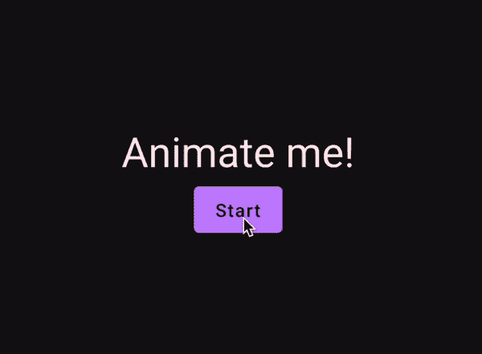
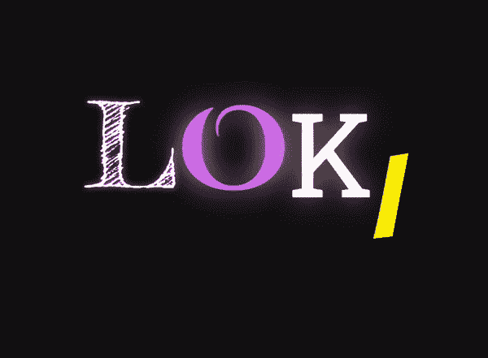

# Jetpack 合成中的动画字体

> 原文：<https://betterprogramming.pub/animating-fonts-in-jetpack-compose-15ba183b6d4f>

## 了解如何在 Jetpack Compose 中轻松制作不同字体之间的动画



作者图片

Jetpack Compose 提供了许多不同的动画助手功能。我们可以很容易地动画浮动，颜色，密度像素等。这些辅助函数通常是这样调用的:

```
val animatedColor by animateColorAsState(  
    targetValue = color,  
    animationSpec = tween(durationMillis = 300, easing = LinearEasing)  
)
```

函数返回一个状态对象，我们可以简单地在我们的 composable 中监听它。我们必须传入一个`targetState`。在这种情况下，`targetState`是我们想要制作动画的颜色。我们还可以传入一个`animationSpec`来控制动画的时间和行为。这部分是可选的，默认为`spring`T5。

在本文中，我们将创建一个助手函数，我们可以使用它来轻松地在不同的`TextStyles`之间制作动画。

# Lerp 函数

设置我们的助手函数的关键是一个`lerp` 函数。简单地说，`lerp`函数接受两个值——一个起点和一个终点——并根据从 0 到 1 的浮点数在这两个值之间进行动画处理。有了这个功能，我们可以在起点和终点之间制作动画。

```
fun lerp(start: Int, end: Int, fraction: Float): Int
// lerp(0, 100, .71f) will return 71
```

Jetpack Compose 有几个 lerp 函数，包括一个用于`TextStyle`的函数。看起来是这样的:

```
fun lerp(start: TextStyle, stop: TextStyle, fraction: Float): TextStyle
```

并且可以这样使用:

```
lerp(previousTextStyle, nextTextStyle, fraction)
```

使用这个函数和一个浮动动画将会得到一个很酷的文本动画。我们可以这样写:



要使用 lerp 函数，我们需要设置一个从 0 到 1 的浮动动画。我们使用`Animatable`来做这件事。我们还需要使用来自浮动动画的值来获取当前的`TextStyle`。

这个方法提供了一个很好的文本动画，但是我们为一个动画创造了很多开销。必须为每个动画手动创建一个`Animatable`，随着我们添加更多的动画，代码会变得更加复杂。

# 作为状态动画

解决这种复杂性的方法是创建一个函数来为我们处理这个问题，并给我们一些额外的灵活性。前面，我们看到了一个“作为状态动画”函数的例子。现在，我们将创建自己的应用程序，如下所示:

```
val animatedTextStyle by animateTextStyleAsState(  
    targetState = textStyle,  
    animationSpec = tween(durationMillis = 300, easing = LinearEasing)  
)
```

`animateTextStyleAsState`函数将处理`Animatable`的创建，并跟踪当前`TextStyle`的状态。最终，它返回一个我们可以在函数中监听和使用的状态对象。

该函数接受与默认 Jetpack Compose 函数类似的参数，但是我们可以用其他定制元素来扩展它。我们有`targetValue`来定义我们想要动画的文本样式。`animationSpec`用于指定所需的动画。还有一个`finishedListener`，以防万一，我们希望在动画完成时得到通知。

使用这个函数，我们可以制作一个稍微复杂一点的例子，在更多的文本样式之间制作动画。除了拥有更多不增加复杂性的动画之外，我们还获得了可中断的动画。我们不需要担心不和谐的动画变化。


从这里，我们可以添加更多的文本样式，并在它们之间制作动画，从而轻松地制作出酷酷的效果。例如，在改变字体的同时在多种随机字体之间制作动画，以重新创建“Loki”标题序列动画。



在 compose 中制作动画元素的辅助函数可以节省大量时间和代码。这不仅仅局限于颜色和字体。让我在[推特](https://twitter.com/sinasamaki)上知道你用这个做了什么。

感谢阅读，祝你好运！

*原载于 2022 年 11 月 3 日*[*https://www.sinasamaki.com*](https://www.sinasamaki.com/animating-fonts-in-jetpack-compose/)*。*