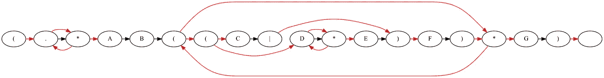
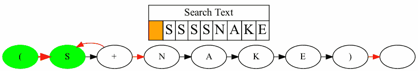
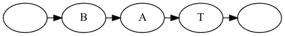
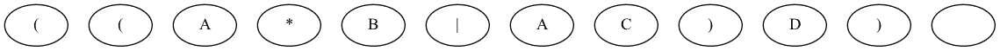
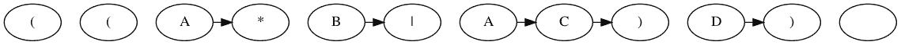
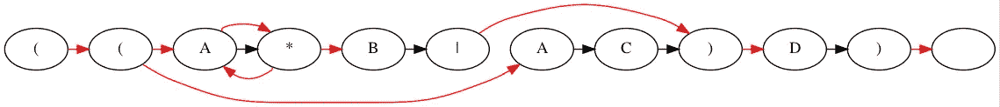
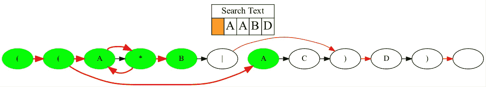
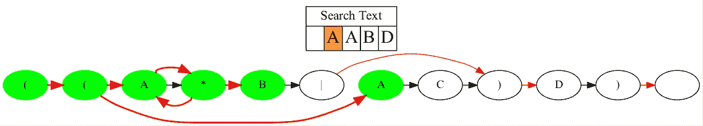
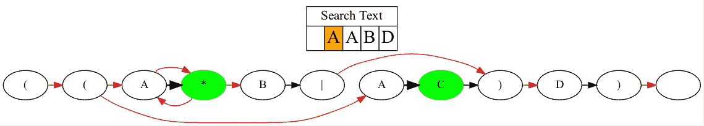

# 用 Python 和 Graphviz 制作正则表达式动画

> 原文：<https://betterprogramming.pub/animating-regular-expressions-with-python-and-graphviz-e0df447b827a>

## 窥视正则表达式引擎的内部



正则表达式名声不好。似乎只要一提到它们，就会让人想起可怕的文字墙，这些文字看起来完全是胡说八道。例如，这是一个常用于验证电子邮件地址的正则表达式:

```
(?:[a-z0-9!#$%&'*+/=?^_`{|}~-]+(?:\.[a-z0-9!#$%&'*+/=?^_`{|}~-]+)*|"(?:[\x01-\x08\x0b\x0c\x0e-\x1f\x21\x23-\x5b\x5d-\x7f]|\\[\x01-\x09\x0b\x0c\x0e-\x7f])*")@(?:(?:[a-z0-9](?:[a-z0-9-]*[a-z0-9])?\.)+[a-z0-9](?:[a-z0-9-]*[a-z0-9])?|\[(?:(?:25[0-5]|2[0-4][0-9]|[01]?[0-9][0-9]?)\.){3}(?:25[0-5]|2[0-4][0-9]|[01]?[0-9][0-9]?|[a-z0-9-]*[a-z0-9]:(?:[\x01-\x08\x0b\x0c\x0e-\x1f\x21-\x5a\x53-\x7f]|\\[\x01-\x09\x0b\x0c\x0e-\x7f])+)\])
```

呀。我不打算假装在本文结束时你会理解这个表达，但我至少想告诉你，它是建立在简单的规则之上的，并不太难理解。

您可能想知道，为什么您要首先关心这些东西是如何工作的？我认为有几个很好的理由。首先，理解了基本原理，就更容易记住如何编写好的正则表达式。

我确实遇到过这样的情况，我写了一个正则表达式，然后几个月都不需要看它。当我最终回来时，我已经忘记了一切，不得不从头开始重新学习。通过理解正则表达式背后的思想而不仅仅是它们的语法，你将能够避免这个问题。

此外，也许这是我肩上的自学程序员芯片，但我认为窥视一下理论计算机科学的世界是值得的。正则表达式似乎是少数几个已经脱离理论计算机科学并被日常程序员使用的概念之一。理解一个正则表达式引擎提供了一个实践的机会，去接触一些高端的概念，比如有限状态自动机。

我发现理解一个概念的最好方法是把它形象化。我已经使用 Python 和 Graphviz 构建了一个正则表达式引擎，它可以显示正则表达式在搜索文本主体时实际发生的事情。如果你想尝试你自己的例子，这个项目可以在 GitHub 上公开获得。作为未来的演示，这里有一个 regex `S+NAKE`搜索文本 SSSSNAKE 的动画:



# **背景**

正则表达式的概念背后有很多理论，但我将尝试解释实现我们的正则表达式引擎所需的基本要素。

首先，我们需要正则表达式的具体定义。[维基百科](https://en.wikipedia.org/wiki/Regular_expression)将其定义为“在文本中指定搜索模式的字符序列。”正则表达式中的大多数字符都被同等对待，但是有一些特殊的字符，我称之为元字符(*、+、？, |).这些具有独特的功能，将在后面讨论。

该引擎的核心是确定性有限状态自动机(DFA)。这听起来很花哨，但实际上，它只是一个有开始节点和结束(或接受)节点的有向图。DFA 通过基于一些输入改变状态来工作。读取所有输入后，我们评估 DFA 的状态。如果它处于接受状态，它返回`True`。否则返回`False`。



在上面的 DFA 中，从起始状态进入接受状态的唯一方法是向它传递序列“BAT”这个例子看起来很简单，但是它可以扩展到任意长的输入和复杂的字母序列。因此，理想情况下，我们希望找到一种方法，将正则表达式转换为 DFA。

理论来拯救！[克莱尼定理](https://www.cs.cornell.edu/courses/cs2800/2017sp/lectures/lec27-kleene.html)指出对于任何正则表达式，都存在一个能够指定相同字符串集的 DFA，反之亦然。这意味着有某种算法能够将我前面提到的疯狂的电子邮件正则表达式验证转换成 DFA。一旦它变成那种形式，计算机就能很容易地处理它。

在我们开始构建这个算法之前，我还有一个警告要提。将正则表达式转换成 DFA 在计算上非常昂贵。

相反，我们可以把它变成一个不确定的有限状态自动机(NFA)。关键区别在于，NFA 可以同时处于多个状态，并且它可以移动到不同的状态，而无需扫描额外的输入字母。这听起来可能有点混乱，但我认为在下面的例子中会变得清晰。

# **正则表达式** → **NFA**

下面是该引擎支持的元字符的简要概述:

*   星号(`*`):匹配一个字符零次或多次。
*   加号(`+`):匹配一个字符一次或多次。
*   问题(`?`):匹配一个字符零次或一次。
*   句点(`.`):也称为通配符，它匹配任何字符。
*   括号(`()`):封装子表达式。
*   竖线(`|`):也称为`or`操作符，匹配子表达式中的多个元素。

如果您以前使用过正则表达式，您可能会注意到缺少一些元字符，如方括号(`[]`)和花括号(`{}`)。但是，引擎仍然具有实现这些缺失字符所完成的操作的所有功能。

不支持的表达式`[ABC]`等同于支持的表达式`(A|B|C)`。同样，`A{2, 3}`相当于`AAA?`。添加这些元字符是完全可能的，但是这会使图形表示变得复杂，所以我选择不添加它们。

我将通过使用正则表达式`(A*B|AC)D`作为例子来演示转换过程。首先，我们需要对正则表达式进行一点预处理，用括号将它括起来。然后我们为正则表达式中的每个字符创建节点。我们还包括最后一个空白节点来象征接受状态。此时，我们的 NFA 应该是这样的:



接下来，我们添加黑色的匹配过渡边缘。我们可以把这些边想象成对应于字母表中字母节点的边。只有当我们从文本中扫描的字母与节点的字母匹配时，这些边才会被跟踪。添加匹配过渡边的逻辑很简单:如果一个节点不包含元字符，则添加从该节点到下一个节点的匹配过渡。



最难的部分是添加ε过渡边。我们可以把这些边想象成对应于包含元字符的节点的边。这些边缘对于每个元字符来说是不同的，并且还受到括号位置的影响。例如，任何时候一个星形操作符在正则表达式中，它都需要三个独立的ε转换边。一个到它之后的状态，一个到它之前的状态，另一个从它之前的状态回到恒星。

添加所有ε转换边后，NFA 完成:



# NFA 模式匹配

既然 NFA 已经完全构建好了，我们可以在一个文本体上运行它，并观察它如何从一个状态转换到另一个状态。如果 NFA 达到了最终的接受状态，我们就有了一场比赛。如果我们完成了对文本的扫描，并且从未到达接受状态，则不会找到匹配。

运行 NFA 的基本模式如下:

1.  在扫描文本的第一个字母之前，创建一个名为*活动状态*的列表，并将 NFA 中的第一个节点添加到其中。
2.  取从每个处于活动状态的节点到每个可到达状态的ε转换。将所有可到达的状态放入一个候选状态列表中。
3.  浏览课文中的下一个字母。
4.  清除*活动状态*列表。如果*候选状态*中的任何状态与文本中的字母匹配，将其匹配转换到下一个状态，并将其添加到新的*活动状态列表*。
5.  重复步骤 2–4，直到到达接受状态或到达文本结尾。

此过程的 Python 代码如下:

对于一个可视化的例子，我们将通过一个文本体运行前面创建的 NFA。我们将搜索文本 AABD，看看我们是否得到一个匹配。第一步是在 AABD 的第一个字母被扫描之前，得到所有可能的ε跃迁。



在扫描文本的第一个字母之前，通过ε转换找到可用的状态

NFA 在第一步就已经有 6 个不同的候选州了！接下来，我们浏览课文的第一个字母。



阅读课文的第一个字母

两个节点具有来自 A 的匹配转换:节点 4 和节点 8。下一步是从这些节点获取匹配过渡。



匹配从 A → *和 A → C 的转换

从这里开始，这个过程以完全相同的方式重复。我们从活动状态获取每个可用的ε转换，扫描下一个字母，并获取下一个匹配转换。整个过程如下图所示:


整个 NFA 搜索过程，在接受州结束

# **最后的想法**

我希望阅读完本文后，您能够更好地理解正则表达式引擎的内部操作。为了进一步澄清，我强烈推荐[罗伯特·塞奇威克教授的这些视频讲座](https://www.coursera.org/lecture/algorithms-part2/regular-expressions-go3D7)。

我认为不与它互动就很难完全理解一些东西，所以我鼓励任何阅读这篇文章的人创建他们自己的[正则表达式动画](https://github.com/aydinschwa/Regex-Engine)或者只是摆弄一下[正则表达式调试器](https://regex101.com/)。

如果你对如何提高可视化有任何问题或建议，我很乐意听听。感谢阅读！