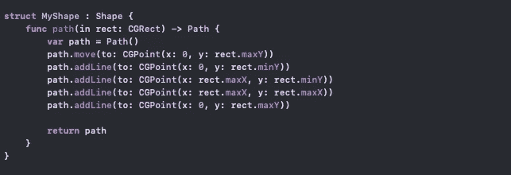
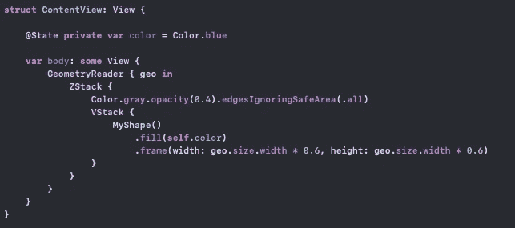
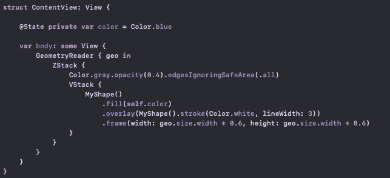
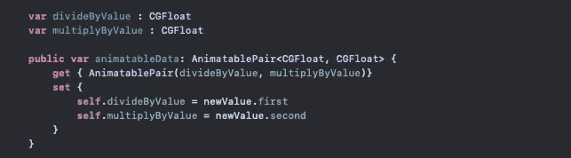
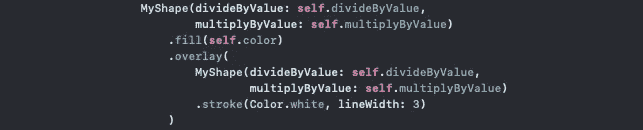
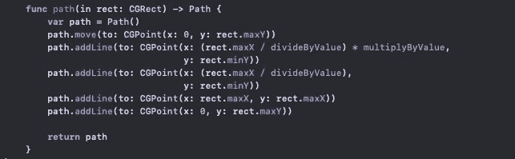
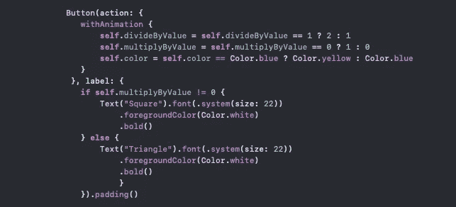
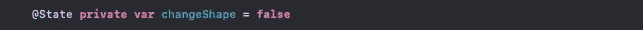
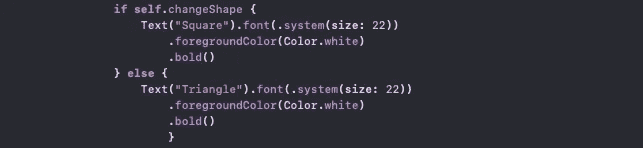
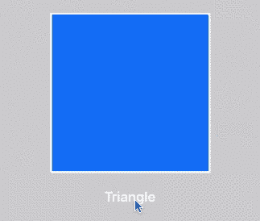

# 在 SwiftUI 中使用 AnimatablePair 制作形状动画

> 原文：<https://betterprogramming.pub/animating-shapes-using-animationpair-in-swiftui-cedbb227e4c6>

## 将形状从正方形转换为三角形，然后再转换回来


由 [Delila Ziebart](https://unsplash.com/@delilaziebart?utm_source=medium&utm_medium=referral) 在 [Unsplash](https://unsplash.com?utm_source=medium&utm_medium=referral) 上拍摄的照片。

# 形状

我们可以从使用类型为`Shape`的结构和绘制并返回正方形的路径函数来制作正方形开始:



在我们的`ContentView`中，我们可以在一个`GeometryReader`中添加我们的形状。这将允许我们给我们的形状一个框架，这取决于我们的屏幕宽度。这将使我们的形状在肖像模式下的所有设备上看起来都一样。为了让我们的形状在风景模式下看起来更好，你可以使用`min`功能来查看宽度和高度哪个更小，然后使用最低值来调整框架。



当你运行代码时，你会发现我们的正方形。如果你想给正方形添加一个笔画，你可能会得到一个编译器错误(`“Value of type ‘some View’ has no member ‘stroke.’”`)为了避免这个错误，我们可以用一个笔画覆盖一个相同的形状:



# `AnimatablePair`

现在我们可以将下面的代码片段添加到我们的形状中。这段代码将允许我们的形状通过逐渐改变`divideByValue`和`multiplyByValue`的值来制作动画。

例如，如果 *x* =1，那么当我们将它的值改为 *x* = 0 时，该值将逐渐变化为 0.9→0.8→0.7→0.6……→0.0。



在我们的`ContentView`中声明两个状态变量，将它们传递给我们的形状。使`divideByValue` = 1，使`multiplyByValue` = 0。



# 动画

我们为正方形添加的前两条路径线中的 *x* 值如下:

```
path.addLine(to: CGPoint(**x: 0**, y: rect.minY))
path.addLine(to: CGPoint(**x: rect.maxX**, y: rect.minY))
```

要将我们的正方形形状改为三角形，我们需要将 *x* 值改为`rect.maxX/2`:

```
path.addLine(to: CGPoint(x: (rect.maxX / 2), y: rect.minY))
path.addLine(to: CGPoint(x: (rect.maxX / 2), y: rect.minY))
```

我们第一行的 *x* 需要在 *x* = 0 和 *x* = `rect.maxX /2` 之间切换才能做出两种形状，我们第二行的 *x* 值需要从 *x* = `rect.maxX`变为`rect.maxX /2`。

用下面的代码替换我们的路径函数。我们将让`divideByValue`在 1 和 2 之间切换，让`multiplyByValue`在 0 和 1 之间切换:



现在，我们添加一个按钮，它将改变我们在`ContentView`中声明的状态变量的值。按钮使用我们的`multiplyByValue`状态值在`Square`和`Triangle`之间切换文本:



由于`multiplyByValue`在`withAnimation`里面，这将使我们的文本动画。我们不希望这种情况发生，因为它会在切换到单词`Triangle`之前显示`Tria…`。为了避免这种情况，我们可以声明一个布尔变量，并让它在按钮内的`withAnimation`之前改变它的值:



全部完成！您可以运行代码并查看形状动画:



使用`AnimatablePair`的形状动画示例