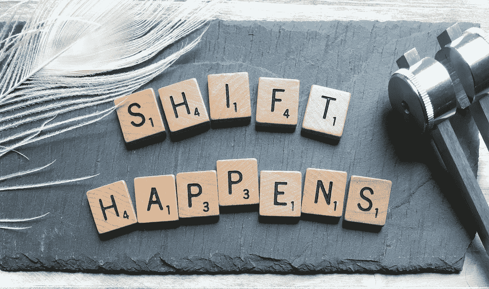
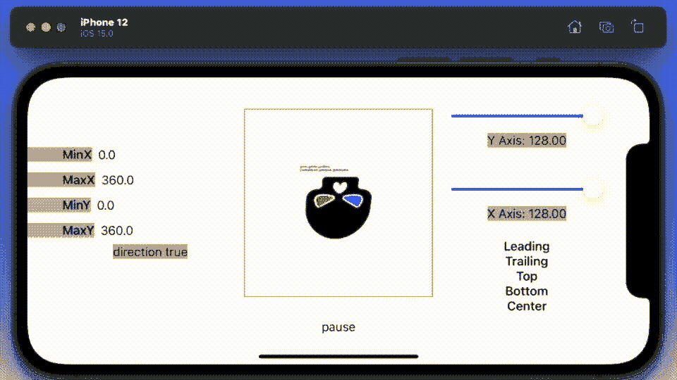
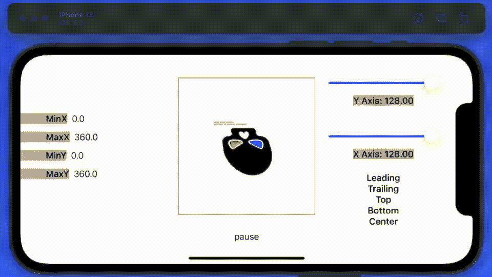

# 在 iOS 15 中制作 SwiftUI 画布动画

> 原文：<https://betterprogramming.pub/animating-swiftui-canvas-in-ios-15-8d8ba940fcc9>

## 用画布视图看转换

照片由 [SOULSANA](https://unsplash.com/@soulsana?utm_source=unsplash&utm_medium=referral&utm_content=creditCopyText) 在 [Unsplash](https://unsplash.com/s/photos/transformation?utm_source=unsplash&utm_medium=referral&utm_content=creditCopyText) 上拍摄

Combine 框架和 SwiftUI one 同时出现并不是巧合，它们是天生的一对。虽然在不同的尺度上，`TimelineView`和`Canvas`同时发布也不是巧合，它们也是为彼此而生的。继续读下去，我会解释的。

上个月，我发表了第一篇关于 Canvas 视图的文章，这篇文章讲述了如何使用 Canvas 视图构建一个时钟。今天我想用一个不同版本的`TimelineView`。我怀疑这是一个专门用于`Canvas`视图的版本。

# 案情摘要

我对仿射变换很感兴趣，不久前发表了一篇关于仿射变换的文章。我想在这篇论文中做同样的事情。我想建立一个工具来帮助读者和我自己理解这些动物是如何工作的。现在要明确的是，我这次谈论的是 3D 仿射变换。

首先，我还打算使用动画版的`TimelineView`，以及一个`Canvas`视图。计划是创建一个界面，当我对管理我的 3D 仿射动画的参数进行更改时，它会实时显示。

编码——这是我们将要构建的接口。我选择头骨是因为它是一个很好的形状，因为你可以很容易地理解你在看什么，就翻转和转动而言。

就代码而言，你看到的是红色方块中的`Canvas`视图，它的动画是由`TimelineView`维护的。所有可以更改的变量都保存在一个专用的类中，这样就可以在不打乱动画循环的情况下进行更改。

最后一点很关键，你不能使用`@State`变量在`Canvas`视图中进行修改，否则会遇到 SwiftUI 中的紫色运行时警告。我确实用 Combine 框架组装了一个版本，但是这个解决方案更简单，也一样好。

来自名词项目的弗拉基米尔·别洛奇金的《头骨》

# 它是如何工作的？

当您单击方向提示时，它会改变颜色编码。当头骨从左向右旋转时，绿色背景的参数可以改变。当头骨前后旋转时，红色背景的参数可以改变。当然，没有什么能阻止你在绿灯时换红灯，你只是看不到任何不同。

左边的数字是度数，你可以看到它在两个方向旋转了 360 度。如果你愿意，你也可以修改它。

右侧的滑块控制旋转的锚点，滑块下方的文本也是如此。它们如何影响你将在代码本身中看到的大画面。

右下角的文本也代表锚点。代码比我希望展示的要多一点，但是额外的代码只是为了布局。去上课吧。

这里需要注意的最重要的部分是返回下一个角度的函数。需要它们来促进发生在一个闭环内的动画制作，即`TimelineView`。现在，到原则视图——这显示了嵌入在`TimelineView`中的`Canvas`视图。

下一段代码是`CanvasView3`本身。这里需要注意的两个最重要的细节是函数`returnNextAngleX`和`returnNextAngleY`，它们在每次画布循环刷新时返回下一个数字。

他们是动画背后的驱动力——这也是我在`Canvas`视图的一层中绘制它的事实。这样做说明了如何将类似`projectionTransforms`的效果应用到同一个`Canvas`视图的不同部分。

提到的所有其他方法都是简单的 UI 元素，您可以在控制屏幕上看到，用于修改正在发生的事情。

现在，虽然我加快了 GIF 的速度以保持它的小——当我点击不同的锚点时，你可以看到这对变换的效果有很大的影响。

来自名词项目的弗拉基米尔·别洛奇金的《头骨》

虽然我不会包括第三个 GIF，但改变 X 轴或 Y 轴也有同样的效果。您可以通过下载并亲自尝试代码来体验这种效果。

最后，这里是我之前发布的`Canvas`视图中引用的方法。这里没有火箭科学，您可能以前没有遇到过的唯一细节是文本字段的默认值设置。

所有这些都让我想到了这篇文章的结尾。有几样东西留给你去尝试:

*   我没有为 Z 轴添加任何控件，它们将与 X 轴或 Y 轴的控件相同…自己试试吧。Z 轴控制旋转。
*   我将显示器设置为显示 X 平面或 Y 平面上的旋转，现在当然可以在两个平面上旋转图像。改变代码试试吧，如果你愿意，你可以使用 3 个平面。
*   我确实提到了`transform3d.m34 = 1/512`的设置，它控制图像滚动时的视角。尝试更改这个数字，看看它如何影响结果。试试 1024 和 2048——只是为了好玩。
*   我也没有展示暂停按钮的实际操作，它停止了角度的更新，但没有停止动画循环——所以您仍然可以对锚点进行更改并查看结果。

感谢阅读。