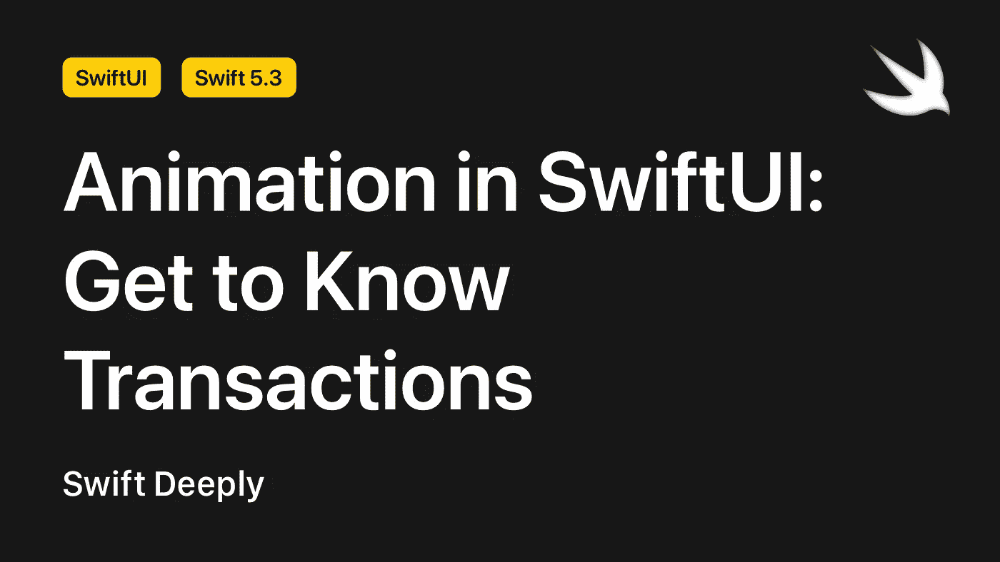
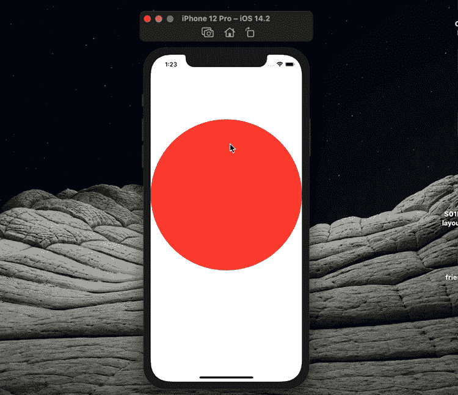
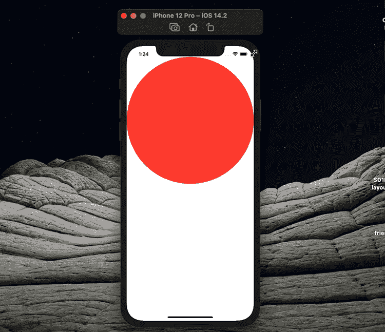
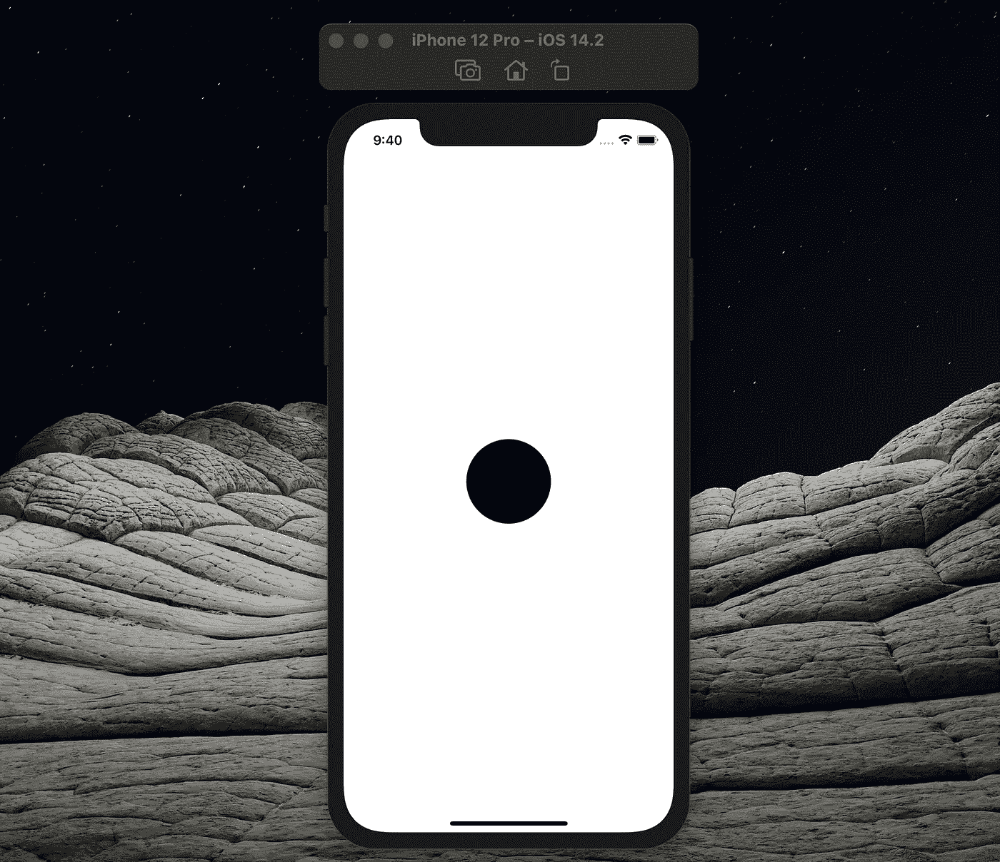
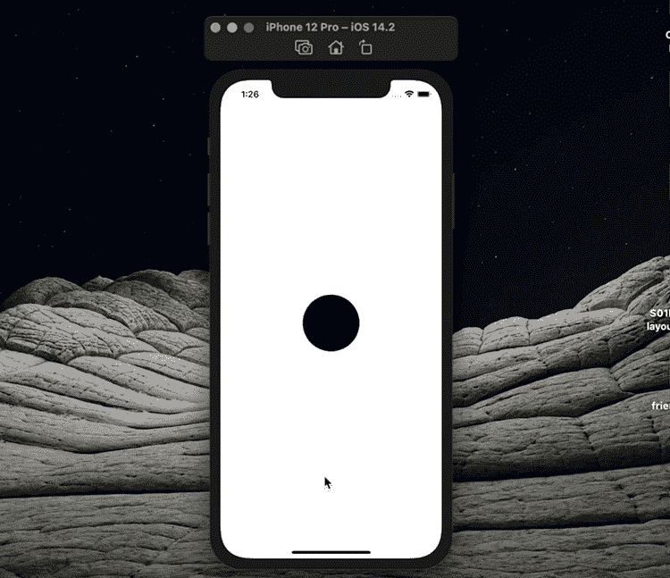
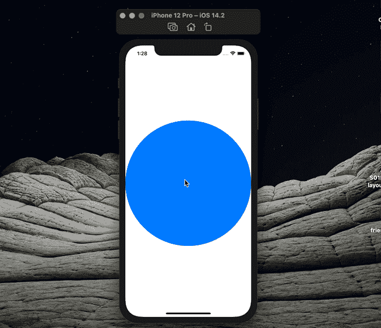

# SwiftUI 中的动画:了解交易

> 原文：<https://betterprogramming.pub/animation-in-swiftui-get-to-know-transactions-7cd57cfb299f>

## 制作复杂的动画非常容易



作者照片。

应用程序设计中最重要的一个方面是动画。您可能需要使用复杂的动画来增加应用程序的用户体验。令人欣慰的是，在 SwiftUI 中创建高度复杂的动画相当容易:改变您的状态，SwiftUI 会自动在您的视图中制作动画。

在本文中，我将向您展示如何以最好的方式在 SwiftUI 中创建动画。

# 基础

在动画显示 SwiftUI 元素之前，必须更改该元素的属性。例如，如果我们想用动画改变 UI 元素的位置，我们首先需要一个存储该元素位置信息的属性。该属性也必须是一个`@State`属性。

```
// MARK: - Properties
**@State private var** isTapped = **false**
```

我们需要使用`onTapGesture`修改器通过触摸来移动我们的元素，并且`isTapped`值应该在这个修改器中改变。

```
**struct** ContentView: View {

    // MARK: - Properties
    **@State private var** isTapped = **false**

    // MARK: - UI Elements
    **var** body: **some** View {
        Circle()
            .fill(Color.red)
            .offset(y: isTapped ? 200 : -200)
            .animation(.spring())
            .onTapGesture {
                isTapped.toggle()
            }
    }
}
```

正如你所看到的，我们使用`offset`修改器来改变`Circle`元素的位置。当`isTapped`属性为`true`时取`200`，当`false`时取`-200`。

在子视图上使用动画修改器有一个缺点:我们不能完全控制动画。例如，我们不能用“线性”动画替换“弹簧”动画。我们可以使用事务来覆盖`onTapGesture`中子视图中定义的动画。

```
// MARK: - UI Elements
**var** body: **some** View {
    Circle()
        .fill(Color.red)
        .offset(y: isTapped ? 200 : -200)
        .animation(.spring())
        .onTapGesture {
            **var** transaction = Transaction(animation: .linear)
            transaction.disablesAnimations = **true** withTransaction(transaction) {
                isTapped.toggle()
            }
        }
    }
}
```



感谢`withTransaction`修饰符，我们可以运行我们想要的事务，同时改变我们想要的属性。新事务禁用视图层次结构中定义的所有动画，并启用线性动画。

# 交易修改量

多亏了`transaction`修饰符，可以用比上面例子更简单的方式使用定制事务。此外，您的代码层次结构会变得更好。让我们看看如何通过改变上面的例子来使用修饰语。

```
// MARK: - UI Elements
**var** body: **some** View {
    Circle()
        .fill(Color.red)
        .offset(y: isTapped ? 200 : -200)
        .animation(.spring())
        .transaction { transaction **in**
            transaction.disablesAnimations = **true**
            transaction.animation = .linear
        }
        .onTapGesture {
            isTapped.toggle()
        }
}
```



您会注意到，我们首先关闭所有交易:

```
transaction.disablesAnimations = **true**
```

之后，我们通过将事务元素的动画属性定义为线性来定义什么是事务:

```
transaction.animation = .linear
```

# 手势更新

SwiftUI 为我们提供了一个特定的属性包装器来跟踪手势的状态:`@GestureState`。

虽然您可以使用`@State`属性包装器，但是`@GestureState` 增加了在手势结束时自动将属性设置回初始值的能力。

例如，我们可能想要创建一个可以拖动视图的手势。为此，我们首先需要像这样创建一个`@GestureState` 属性。

```
// MARK: - Properties
**@GestureState private var** offsetValue: CGSize = .zero
```

UI 元素将在其运动结束后返回该值。

然后，我们会附加一个`offset`修饰符，这样我们的视图就会随着`offsetValue`中的任何值而移动:

```
// MARK: - UI Elements
**var** body: **some** View {    
    Circle()
        .frame(width: 100, height: 100)
        .offset(offsetValue)}
```



最后，我们使用`gesture`修改器使我们的`Circle`元素可以根据`offsetValue`拖动。

```
// MARK: - UI Elements
**var** body: **some** View {
    Circle()
        .frame(width: 100, height: 100)
        .offset(offsetValue)
        .gesture(
            DragGesture()
                .updating($offsetValue) { value, state, transaction **in**
                    state = value.translation
                    transaction.animation = .interactiveSpring()
                }
        )
}
```



# 粘合剂

我们还可以在绑定更新期间使用绑定上的`transaction` 函数提供一个自定义事务。让我们看一个例子来说明这一点。

例如，考虑一个按下时会改变大小的按钮。为此，让我们创建一个名为`CircleView`的 UI 组件。

```
**struct** CircleView: View {

    // MARK: - Properties
    **@Binding var** animatedBinding: **Bool** // MARK: - UI Elements
    **var** body: **some** View {
        Circle()
            .fill(Color.blue)
            .scaleEffect(animatedBinding ? 0.5 : 1)
            .animation(.spring())
    }
}
```

然后我们可以像这样在我们的主`View`元素中使用`CircleView`元素。`animatedBinding`是输出类型为`Binding<Bool>`的计算属性。这个计算的属性就像一个函数一样工作:如果`scale`对象的值改变，它可以改变它的输出。

```
**struct** CircleView: View {

    // MARK: - Properties
 **@State private var** scale = **false** **private** **var** animatedBinding: Binding<**Bool**> {
        **var** transaction = Transaction(animation: .interactiveSpring())
        transaction.disablesAnimations = **true**
        **return** $scale.transaction(transaction)
    } // MARK: - UI Elements
    **var** body: **some** View {
        CircleView(animatedBinding: animatedBinding)
            .onTapGesture {
                scale.toggle()
            }
    }
}
```



我们现在已经看到我们可以使用`@Binding`对象运行事务！您可以在 Xcode 中自己运行这些代码并查看结果。

# 结论

有了 SwiftUI，你几乎可以把你想象的任何动画都变成现实！如果你有任何问题，请在评论区告诉我。

您可以在下面访问我们在本文中创建的项目:

[](https://github.com/canbalkya/Transactions-in-SwiftUI) [## canbalkya/swift ui 中的交易

### 这个项目是为我的文章创建的。你可以在这里看我的文章…

github.com](https://github.com/canbalkya/Transactions-in-SwiftUI) 

```
**My Other Articles** -[Build a TextField for Numbers in SwiftUI](/build-a-textfield-for-numbers-in-swiftui-21030b58a41)
- [Programmers Should Learn How to Learn](/programmers-should-learn-how-to-learn-51800061ae12)
- [How to Create Onboarding Screens in Your iOS App](/how-to-create-onboarding-screens-in-your-ios-app-e41b518db31f)
```

如果你想见我或有关于 iOS 开发等问题。你可以在这里和我进行一对一的会谈[。](https://superpeer.com/canbalkya)