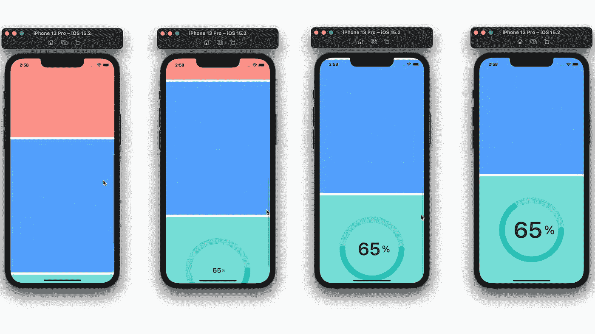
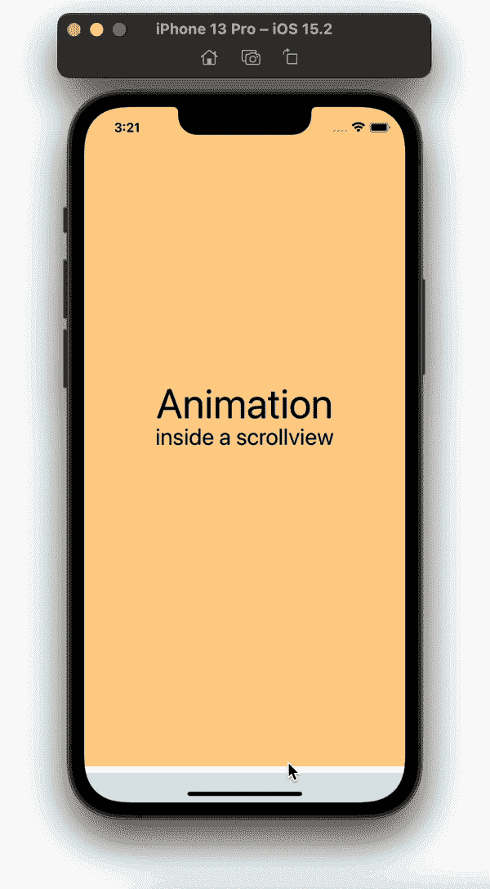
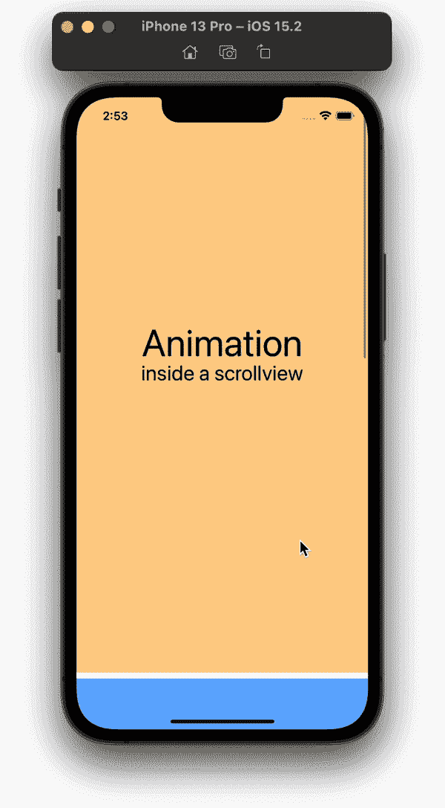
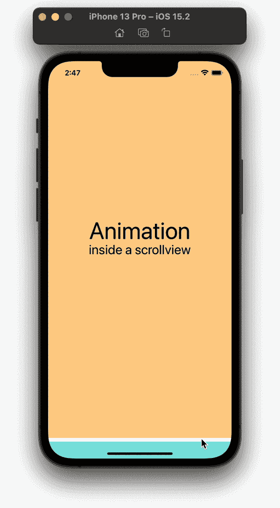
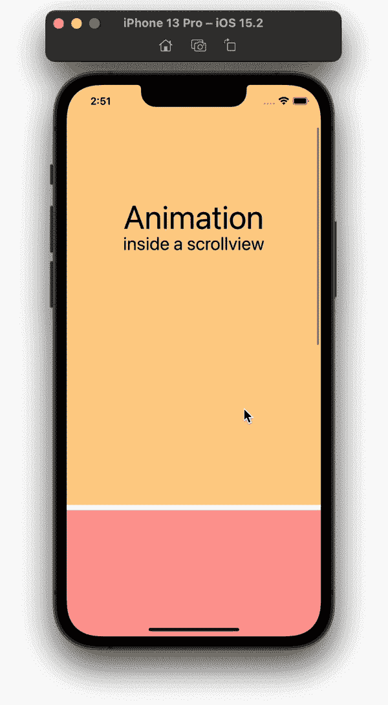
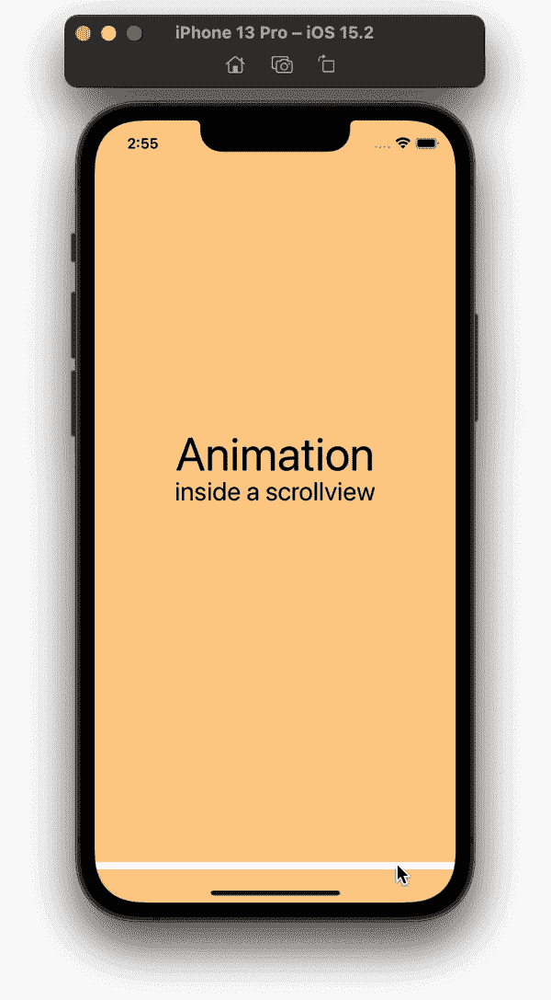

# 带 SwiftUI 的 ScrollView 中的动画

> 原文：<https://betterprogramming.pub/animations-inside-a-scrollview-with-swiftui-3b550c18a442>

## 延迟播放动画，直到视图出现在屏幕上

带 SwiftUI 的 ScrollView 中的动画

在`ScrollViews`和`Lists`中，嵌入式视图在显示在屏幕上之前被加载。`onAppear`在视图出现在屏幕上之前触发。在播放动画之前，我们需要等待动画视图出现在屏幕上。

# 视图修改器

为了延迟我们的动画，我们将创建一个视图修改器来计算视图的位置，并在视图到达屏幕底部时触发动画播放。

在 body 函数中，使用`GeometryReader`获得视图的全局位置。如果视图在屏幕外(滚动视图/列表的下方)，则内容将位于高于屏幕高度的位置。

我们在代码中要做的是:

*   将我们的内容嵌入到`GeometryReader`中。
*   用 GeometryReader 创建一个变量来获得视图的全局`midY`位置。
*   如果需要，创建一个变量来偏移视图的`midY`位置。
*   使用我们创建的变量，使用 if 语句将屏幕高度与视图的`midY`位置和偏移量进行比较。如果屏幕的高度等于或高于`midY`位置(+偏移)，那么内容将出现，这将触发我们的动画开始。

# 动画视图

为了测试我们创建的视图修改器，我们可以创建一个带有两个动画元素的`Text`视图；`opacity`和`y`位置。

为不透明度和 y 位置创建一个变量。使用`opacity()`和`offset()`修改器。

向修饰符传递它们的相对变量。在`.onAppear()`中，使用`withAnimation()`制作不透明度和 y 位置属性的值变化的动画。

最后，添加一个`modifier()`并将我们在上面创建的`AnimationModifier`视图修改器传递给它。

# 例子

这里是使用我们的`AnimationModifier`视图修改器的其他动画例子。在下面的所有例子中，我不需要偏移任何视图的中间位置。

## 动画条形图

## 动画圆圈

## 动画框

滚动视图中的动画文本框

# 内容视图

最后，我们可以在内容视图中添加所有的例子。添加一个滚动视图或列表，并在其中嵌入我们上面创建的所有动画视图。

本教程到此为止。感谢您的阅读！