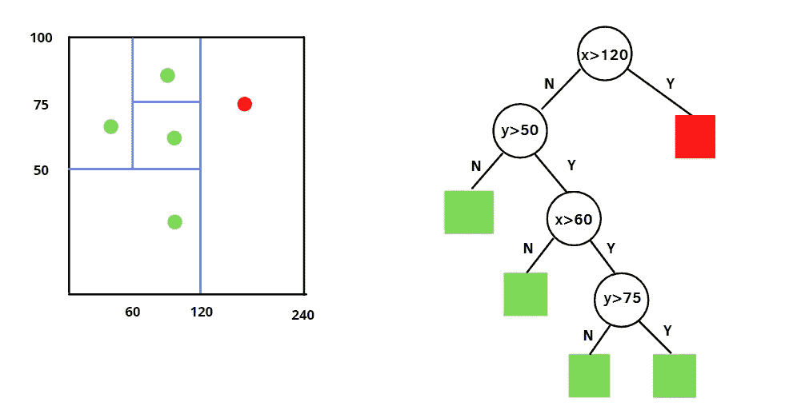
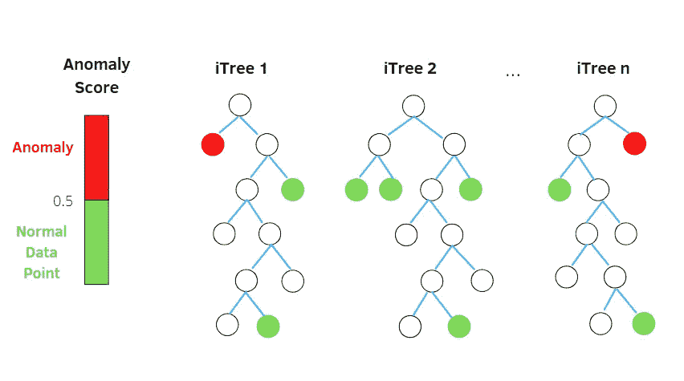
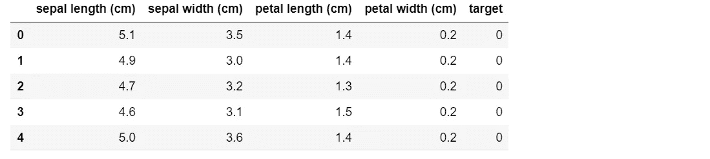
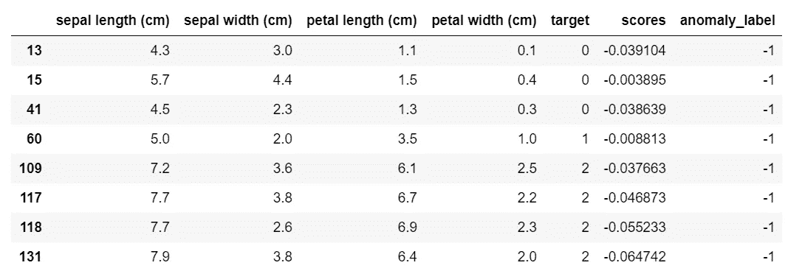
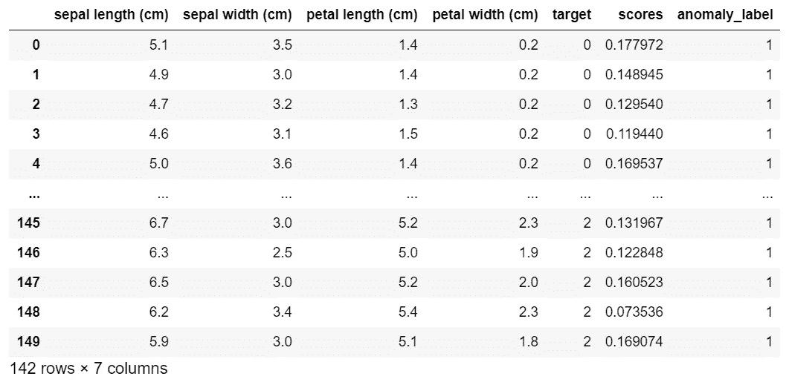
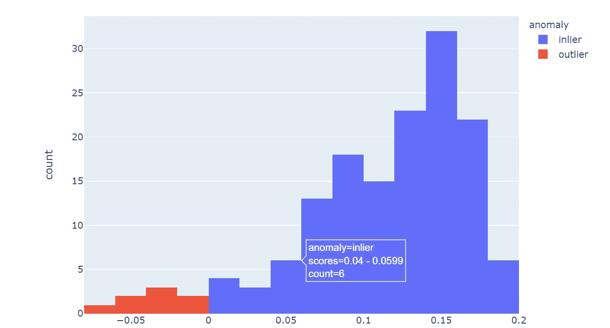
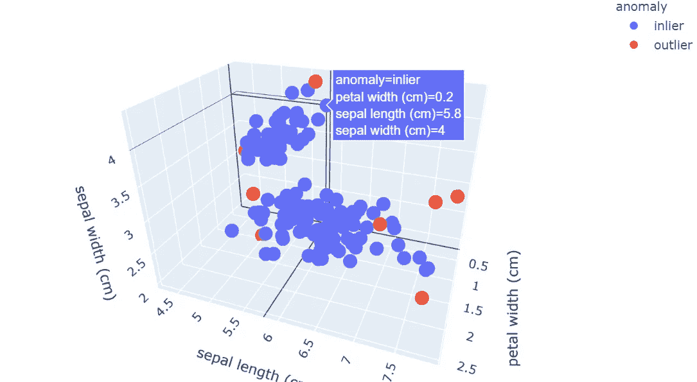
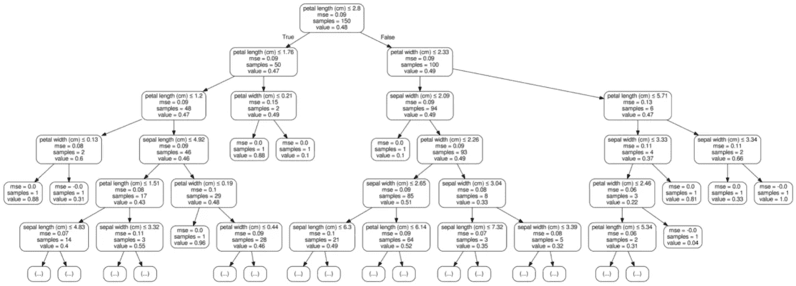
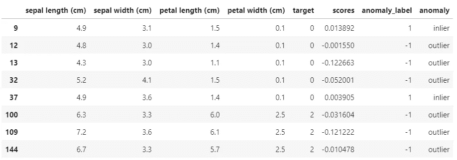
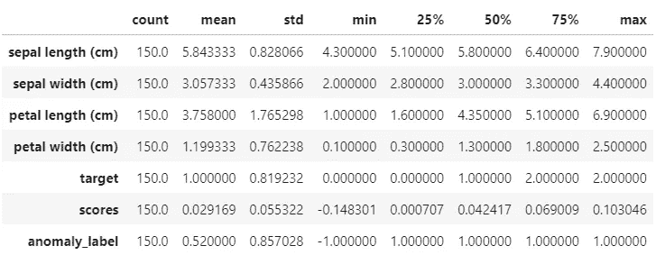

# 利用隔离林进行异常检测

> 原文：<https://betterprogramming.pub/anomaly-detection-with-isolation-forest-e41f1f55cc6>

## 让我们用 scikit 应用隔离森林-使用 Iris 数据集学习


鲁珀特·布里顿在[号航天飞机](https://unsplash.com/)上的照片

异常检测是对罕见观测值的识别，这些观测值的极值与其余数据点的极值有很大差异。这些项目被称为异常值，需要进行识别，以便与正常项目分开。出现这些异常观察结果有多种原因:数据的可变性、数据收集过程中出现的错误，或者发生了新的罕见情况。最后一个解释并不像你通常预期的那样是错误的。

管理异常值具有挑战性，因为通常不可能了解问题是否与错误的数据收集或其他原因相关联。根据动机，您需要决定是删除还是保留离群值。如果异常点是由于新事件的发生而产生的，那么去除异常值意味着丢失信息。在后一种情况下，异常值由于其罕见性而包含重要的新信息。

检测欺诈性金融交易、制造环境中的故障机器或恶意网络活动可被视为异常检测的应用。因此，异常检测的目标是建立一个解释数据异常的模型。对这些异常行为的研究可以用于公司的相关决策，如银行和行业。

我将重点介绍检测异常的**隔离森林**算法。由刘飞东、亭、于 2008 年提出[1]。这是一种基于树的无监督非参数算法。实际上，它由给定数据集的许多隔离树组成。隔离是该算法的关键词，因为它将异常与其他观察结果隔离开来。该隔离过程通过将区域随机分成更小的片段来分离所有数据点。在解释了该算法的基础后，我将使用 Iris 数据集展示 [scikit-learn](https://scikit-learn.org/stable/) 隔离森林的应用。

```
Table of Contents1\. [How Isolation Forest works](#3ef4)
2\. [Anomaly Score](#6c1c)
3\. [Implementation with sklearn](#59d9)
```

# 1.隔离森林是如何运作的

隔离林与随机林非常相似，它是基于给定数据集的决策树集合构建的。但是，也存在一些差异。隔离林将异常识别为隔离树上平均路径长度较短的观测值。每个隔离树都适用一个程序:

1.  随机选择**两个特征**。
2.  通过在所选特征的最小值和最大值之间随机选择一个**值**来分割数据点。

观察值的划分被递归地重复，直到所有的观察值被隔离。



隔离程序。作者插图

上面我分别展示了**四次拆分**、**、**后的程序示例。在这种情况下，我只有两个特征`x`和`y`以及四个观察值要检查。第一个条件是区分正常观察和异常观察的条件。如果`x`大于 120，那么观察值就是异常值，用红色标出。然后，可以基于平均路径长度来区分正常和异常数据点:较短的路径表明我们有异常，而较长的路径表明有正常的观察。

# 2.异常分数



基于隔离森林的异常检测。作者插图

隔离林需要一个**异常分数**来了解数据点的异常程度。它的值介于 0 和 1 之间。异常分数定义为:


s(x，n) = 2 - E(h(x))/c(n)

其中`E(h(x))`是`h(x)`的平均值，是从根节点到外部节点`x`的路径长度，而`c(n)`是给定`n`的`h(x)`的平均值，用于归一化`h(x)`。有三种可能的情况:

*   当观测值的分值接近 1 时，路径长度很小，这时数据点很容易被隔离。我们有一个**异常**。
*   当那个观察的分数小于 0.5 时，路径长度大，然后我们有一个**正常数据点**。
*   如果所有观察值的异常值都在 0.5 左右，那么**整个样本没有异常**。

然后，隔离林能够通过计算每棵树的异常得分并对隔离树进行平均，以比正常观察更少的步骤隔离异常。事实上，分数越高的离群值路径长度越短。

**注:** scikit-learn 的隔离林引入了异常分值的修改。异常值由负的分数表示，而正的分数意味着我们有内标。

# 3.使用 sklearn 实现

让我们从导入库`plotly.express`和`sklearn`开始这个例子。特别是，我们需要`sklearn.ensemble`中的隔离林库。去图书馆的方法如下:

```
import plotly.express as px
from sklearn.datasets import load_iris
from sklearn.ensemble import IsolationForest
```

一旦库被导入，我们将使用函数`load_iris`读取 iris 数据集。目标是检查该数据集中的异常。

```
data = load_iris(as_frame=True)
X,y = data.data,data.target
df = data.frame
df.head()
```



从每个样本中收集了四个特征:萼片和花瓣的长度和宽度。隔离森林算法将检测这些特征，以检查观察值是否异常。

第二步是定义模型。有相关的超参数来实例化隔离林类[2]:

*   **污染**是数据集中异常的比例。在这种情况下，我们将其固定为等于 0.05。
*   **max_samples** 是从特征矩阵`X`中考虑的最大样本数。我们会用所有的样本。
*   **max_features** 是在模型训练期间可以考虑的最大特征数量。我们将使用所有四个特性。
*   **n_estimators** 是考虑的隔离树的数量。我们将使用 100 个估值器。

代码如下:

```
iforest = IsolationForest(n_estimators=100, max_samples='auto', 
                          contamination=0.05, max_features=4, 
                          bootstrap=False, n_jobs=-1, random_state=1)
```

在我们定义了模型之后，我们可以根据数据拟合模型并返回`X`的标签。使用功能`fit_predict`完成该任务。以下代码:

```
pred= iforest.fit_predict(X)
df['scores']=iforest.decision_function(X)
df['anomaly_label']=pred
```

我们可以使用函数`decision_function`找到异常分数，同时我们可以存储在预测中获得的标签。**当标签等于-1 时，表示我们有异常。如果标签是 1，我们有内联器**。

```
df[df.anomaly_label==-1]
```



如果我们通过`anomaly_label`等于-1 来过滤数据集，我们可以观察到所有的分数在零附近都是负的。在相反的情况下，异常标签等于 1，我们找到了所有的正分数。

```
df[df.anomaly_label==1]
```



为了突出异常分数和通过预测获得的标签之间的关系，我们可以显示直方图。在创建直方图之前，我添加了一个指示异常状态的列。代码如下:

```
df['anomaly']=df['anomaly_label'].apply(lambda x: 'outlier' if x==-1  else 'inlier')fig=px.histogram(df,x='scores',color='anomaly')
fig.show()
```



通过查看这张交互式图表，可以更明显地看出，分数为负值的点是异常值。你不觉得吗？通过移动鼠标，您还可以看到具有特定异常分数的观察值的数量以及观察值是如何分类的。异常值的另一个有用表示是 3D 散点图，可查看两个以上的要素。以下是创建散点图的方法:

```
fig = px.scatter_3d(df,x='petal width (cm)',
                       y='sepal length (cm)',
                       z='sepal width (cm)',
                       color='anomaly')
fig.show()
```



从该散点图中，我们可以观察到被视为异常值的红点具有数据集中所考虑的特征的极值。

为了更深入地解释模型的输出，我们可以使用 Graphviz(一种开源的图形可视化软件)来可视化第五个隔离树。首先，我们创建一个点文件，它是隔离树的 Graphviz 表示。稍后，我们将点文件转换成 png 文件来显示图像。

```
from sklearn.tree import export_graphviz
from subprocess import call
from IPython.display import Imageestimator = iforest.estimators_[5]
#print(estimator)export_graphviz(estimator,out_file='tree.dot',max_depth=5,
                feature_names = data.feature_names,
                special_characters=True,rounded=True,precision=2)call(['dot', '-Tpng', 'tree.dot', '-o', 'tree.png', '-Gdpi=600'])Image(filename = 'tree.png')
```



隔离树的可视化

在隔离树图的每个内部节点中，都有一个分割数据的决策规则。例如，第一个决策规则以花瓣长度为特征，分割点为 2.8。异常可以被识别为在隔离树上具有**短平均路径长度**的实例。事实上，我们可以注意到有些节点已经被隔离了。似乎一个很小的花瓣宽度或者一个很大的花瓣宽度就决定了一个物品是否异常。让我们检查数据框中的过滤:

```
df[(df['petal width (cm)']<=0.13)|(df['petal width (cm)']>=2.46)]
```



当花瓣宽度非常低时，观察结果并不总是异常的，它可能取决于其他特征的值，而高花瓣宽度意味着总是异常值。这些观察是通过查看数据帧的统计数据完成的:

```
df.describe().T
```



# 最后的想法

恭喜你！我希望本指南能帮助您对异常检测和隔离林的问题有一个大致的了解。我想说明的是，污染超参数在该算法中具有相关的作用。修改的时候模型会返回相同比例的离群值，需要慎重选择。典型值介于 0 和 0.5 之间，但也取决于数据集。

我还建议您使用 plotly.express 库来显示图形，就像我在本教程中所做的那样。它们比用 seaborn 和 matplotlib 得到的要详细得多。GitHub 的代码在这里是。感谢阅读。祝你有愉快的一天。

你有兴趣看看其他关于隔离森林的文章，以更好的方式解释结果吗？下面我用 SHAP 图书馆提供的漂亮的数据可视化来推荐另一个故事。

[](https://pub.towardsai.net/interpretation-of-isolation-forest-with-shap-d1b6af93ae71) [## 用 SHAP 解读《隔离林》

### 了解异常检测最重要功能的简单方法

pub.towardsai.net](https://pub.towardsai.net/interpretation-of-isolation-forest-with-shap-d1b6af93ae71) 

**参考文献:**

[1]刘福亭，丁克明，周振华(2008 年 12 月).隔离森林。在*数据挖掘，2008 年。08 年的 ICDM。第八届 IEEE 国际会议*(第 413–422 页)。IEEE。

[2][https://sci kit-learn . org/stable/modules/generated/sk learn . ensemble . isolation forest . html # sk learn . ensemble . isolation forest](https://scikit-learn.org/stable/modules/generated/sklearn.ensemble.IsolationForest.html#sklearn.ensemble.IsolationForest)

你喜欢我的文章吗？ [***成为会员***](https://eugenia-anello.medium.com/membership) ***每天无限获取数据科学新帖！这是一种间接的支持我的方式，不会给你带来任何额外的费用。如果您已经是会员，*** [***订阅***](https://eugenia-anello.medium.com/subscribe) ***每当我发布新的数据科学和 python 指南时，您都可以收到电子邮件！***