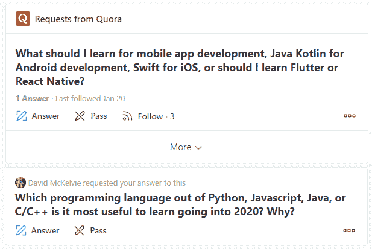
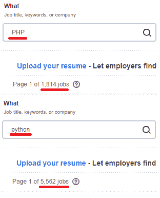

# 回答问题:“应该学什么编程语言？”

> 原文：<https://betterprogramming.pub/answering-the-question-what-programming-language-should-i-learn-fa55ddacb685>

## 更深入地分析你可能会问的问题和原因

最近，我在问答网站 [Quora](https://www.quora.com/) 上花了相当多的时间，看到(并回答)了同一个问题的许多变体:

很多人(有抱负的程序员)想知道为了成功他们应该学习什么语言。

我将根据十多年的行业经验来回答这个问题，但首先我想说点题外话。忍耐一下，如果你只是想看答案，就直接跳到最下面。如果你是一个考虑从事编程职业的人，请允许我先讨论一些事情。

# 审视潜台词

越来越多的人通过机构或自学来学习编程。我怀疑这是为什么这么多人在这个问题上寻求建议的核心原因。

当像乔·拜登这样的政治家建议[失业的煤矿工人应该学习编码](https://www.mining.com/joe-biden-tells-coal-miners-to-learn-to-code/)时，这并不奇怪。撇开精辟的言论和政策失误不谈，这是许多人心中的一个话题。“学习编程”似乎是当今解决不稳定就业和不确定未来的灵丹妙药。

随着西方蓝领工作在全球化和自动化面前消失，人们正在寻求安全感。我有几个正在考虑转行的朋友找到我，询问参加编码训练营的事情——在那里，你放弃 4 到 5 位数，换取成为程序员的超浓缩(短至几周)速成课程。

我不知道有谁真正经历过这样的训练营，但我对它们的功效表示怀疑。我已经建议我的朋友，有一个专门为小型企业维护 WordPress/Drupal 站点的地方，当地的网络开发公司将会提供服务并雇佣员工来支持。在我看来，对于这样的毕业生来说，这是一个很好的目标市场，但我怀疑这是一个艰难的过程。不过，训练营似乎大赚了一笔。

照片由[阿迪·戈尔茨坦](https://unsplash.com/@adigold1?utm_source=unsplash&utm_medium=referral&utm_content=creditCopyText)在 [Unsplash](https://unsplash.com/?utm_source=unsplash&utm_medium=referral&utm_content=creditCopyText) 上拍摄

不管怎样，很多人得出结论，他们应该成为程序员。

最好的情况是，这意味着事情将变得更具竞争性。作为一个参加过面试的双方，我可以告诉你已经是了。我相信很少有工作面试会像编程职位的面试一样令人紧张——如果你想深入了解这一点，可以看看这篇文章。

现在回到煤矿工人身上。我怀疑的另一件事是成为开发人员的道路是否是(大多数)人应该考虑的。

如果你成功了，你可能会筋疲力尽。要达到这一目标将是困难的，需要承诺。当你试图让某件事成功，但它失败了，你的第一个冲动将是放弃(我总是这样)。你需要学习如何利用现有的大量网络资源和社区来为自己谋利。有个笑话说，要成为一名程序员，你需要做的就是 Google things，并在堆栈溢出上查找答案。实际上，事情要比这微妙得多。

我不想劝阻任何人成为程序员，尤其是如果你对它充满热情的话，但是这是值得考虑的事情。如果你不擅长学术风格的问题解决或坚持解决困难的逻辑问题，你可能会挣扎。

编程不是通往成功职业的灵丹妙药。它竞争激烈，富有挑战性，可能会出乎你的意料。

…或者也许你会成为下一个扎克。不管怎样，祝你好运——真诚的！

# 回答你的问题…

如果在所有这些之后你仍然想要一个答案，这里是我的大约 2020 年初的答案(这是一个不断变化的领域):

*   如果你想为一个特定的平台开发本地移动应用，学习 iOS(苹果)的 **Swift** 或 Android 的 **Kotlin** 。
*   如果你想开发“混合”移动应用，即。部署跨平台(Android 和 iOS 都来自一套代码)，学习 **React Native** 或 **Flutter** 。
*   想做基础的网站，学学 **WordPress** 。
*   如果你想做高级的网站或者 web apps，学学 **React** 、 **Angular** 、 **Vue** ，或者**svelite**(按人气顺序排列)。我推荐 React 用于简单的构建，Angular 用于单页应用( [SPAs](https://en.wikipedia.org/wiki/Single-page_application) )，如果你想酷一点，Vue 或 Svelte。
*   如果你想做后端，即。*power*web，学 **Python** ， **Node.js** ，或者 **Java** 。
*   想做“软件”(桌面、大数据、AI)，学 **C#** 、 **Java** ，或者 **Python** 。
*   想做任何平台的游戏，用 **Unity** 。
*   如果你在网络/应用领域，你可能需要学习如何使用 **Docker** 、 **Kubernetes** ，并熟悉云托管平台，如 **AWS** 、 **GCP** 和 **Azure** 。
*   有一些数据库经验也很好。MongoDB 很受欢迎，但我个人更喜欢传统的 RDBMS ，比如 MySQL 或 Postgres 。如果你对大数据感兴趣，你将需要一些大数据库，这不是我的专业领域。

基于我所接触的技术，这个列表肯定是有偏见的。不管怎样，这是你做研究的起点。通过比较像[实际上是](http://indeed.com)这样的网站上的职位数量，你可以对每种语言的工作机会有一个印象。

例如，我主要是一名 PHP 开发人员(濒临灭绝的物种？).让我们比较一下 PHP 和 Python 的工作数量，Python 现在很流行:

对我来说不幸的是，Python 以 5562 比 1814 击败了 PHP。也许我应该去蟒蛇训练营。顺便说一下，我用的是加拿大版本的网站，以防你得到不同的数字。

除此之外，您可以使用以下内容来了解增长趋势和受欢迎程度:

*   PYPL:编程语言的普及
*   [TIOBE 指数](https://www.tiobe.com/tiobe-index/)

据推测，你想使用某种正在增长(或至少没有下降)的产品，并拥有可观的市场份额。然而，成为一个狭窄市场的专家可以给你一个优势:古代 FORTRAN 和 COBOL 语言的实践者甚至在今天也能大赚一笔。这主要是因为需要支持银行和金融行业的遗留系统。也许我和 PHP 终究还有希望。

还有一件事，Stack Overflow 贴出了一份[年度调查](https://insights.stackoverflow.com/survey/2019)，其中有一些很好的见解可以帮助你。做一些研究，然后决定你的命运。

# 未来是代码

不管你是否在写。也有可能是行业内而不是编程。我们需要优秀的设计师、测试人员、业务分析师、项目经理、支持人员、技术写作人员等等。即使你开始编程，但发现它不适合你，在申请相关工作时，拥有一些经验将对简历大有帮助。涉足编码的分析师通常比没有涉足的分析师更有吸引力。