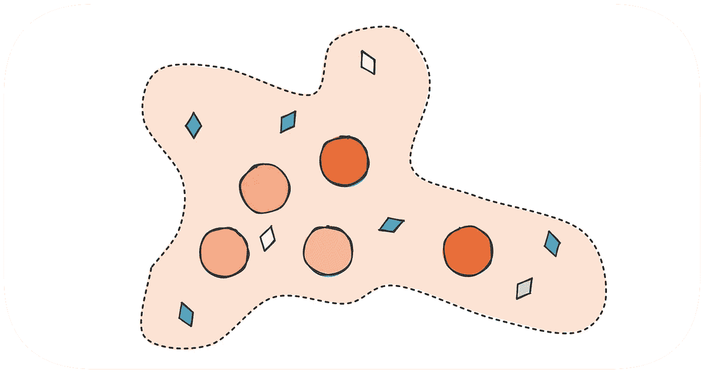
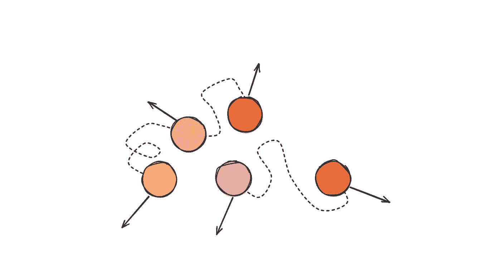
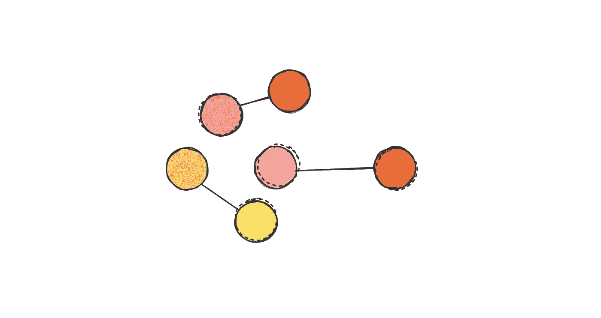
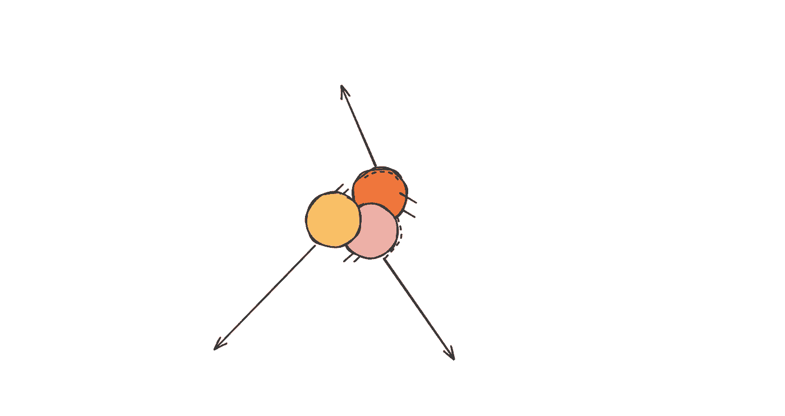

# 反模式:工程经理小组

> 原文：<https://betterprogramming.pub/anti-pattern-the-engineering-managers-group-8003b72e0201>

## 投资一个真正的工程经理团队来获得收益


鸣谢:作者

只要有机会，工程经理就会强调成长的重要性和团队合作的重要性。然而，他们经常忘记他们的发展，并且背弃他们在团队中使用的技术。

事实是，当 EMs 作为一个团队工作时，他们可以获得团队的好处。听起来很简单？这并不简单。

# 我们是…一个团队吗？


一个团队还是一个团体？

作为一个团队，我们作为一个单位工作，分享一个使命，有共同的目标，并对我们的成就负责。自然地，工程经理将他们的小组称为团队。他们有一个共同的使命和他们设定要完成的目标(希望如此)。

这里有一些迹象可以让你弄清楚你是作为一个团体还是一个团队工作。

# 信号

如果你是一个团体，一些简单的信号可以帮助你理解。

**我叫什么名字？** 人们通常把自己的 EMs 伙伴称为“EMs 族”。

你能帮我代班吗？
如果一位经理不在，他的同事可以代替他吗？

我们有共享的记忆吗？
不同的团队是否在同一个问题上犯同样的错误，失败？

**我和其他 em 有 1:1 吗？** 经理是唯一一个方便沟通的人吗？

# 组建团队

## 内部笑话



这个笑话只有团队能看懂:)

我决定从这里开始，因为大多数 EMs 完全错过了它，直接跳到高级部分。在你前进之前，首先确保你的团队有一些内部笑话。

团队需要共享的时刻，一个创造让他们感到自豪的独特行为的时刻。腾出一些时间来娱乐和讨论。一个积极的信号是听到人们说，“记得我们…

每个团队都有自己的风格，你可以尝试不同的东西，直到你达到目标。也许这是一次有趣的会议，或者是一次解决危急情况的合作努力。没有什么比一个好的战斗故事更能有力地定义一个团队了。

## 设计跨团队目标



目标应该涉及多个团队

缺乏真正的共同目标是一个重大问题。EMs 可以共享与工程标准或公司目标相关的共同目标。然而，他们经常被解释为团队目标，这让 EMs 感觉他们是在各自为这些目标而努力。

目标是一种工具。通常，他们推动卓越的执行或调整团队，但他们可以做得更多。目标设定了文化，可以将人们团结在一起。他们能把一个团体转变成一个团队。

设计跨团队目标，有目的地触及多个团队，并设定对 EMs 协同工作的期望。

示例:

1.  我们的目标是减少 4 周的客户流失:团队成长和团队应用程序将共同努力，找出引领这一变化的举措。
2.  移动发布的 CI 运行时间低于 5 分钟:团队平台和团队移动将共同开发一个解决方案。

让 EMs 一起找出如何实现这个目标，并在团队之间分配工作。确保匹配需要改进协作和不断迭代的团队。

## 配对游戏



找一个伙伴

对于 EMs 来说，建立系统有很多工作要做，而且这不是日常的产品工作。像招聘过程或改进你的发展流程这样的事情对于保持系统良好运转和减少摩擦是至关重要的。

常见的做法是在 em 之间划分这些区域。这可以根据个人实力来做。这个想法是，这些是关键项目，不能有任何错误。

在我看来，这是一个很大的错误。与任何团队一样，人们必须相互配合以提高彼此的技能。

**例子** 卡洛从未建立过招聘流程。他加入的每家公司都已经有了非常健全的流程。另一方面，娜塔莎有建造一些的经验。与其让娜塔莎拥有所有权，不如让卡罗进行研究并提出建议。然后娜塔莎可以回顾和指导他，以提高他的技能。双赢。

## 产生健康的摩擦



虽然让每个人保持一致是必要的，但健康的摩擦也是产生高质量结果的必要条件。新兴市场团队必须制造摩擦，并带来不同的观点。如果团队总是同意每一个决定和最小的反对，那就是一个警告信号。在某些情况下，这必须通过鼓励少数新兴市场对不同观点直言不讳来人为创造。

**例**
公司即将改变系统开发生命周期。一个曾经在 Scrum 导向的组织中工作的 EM 计划采用类似的方法。所有其他的环境管理体系对此都非常满意，并且经过一些小的改变，这个组织已经准备好改变了。虽然这似乎是一个令人信服的例子，但我认为缺乏摩擦。有许多不同的模型可能更适合您的特定文化和情况。我想得到更多的选择，让 2-3 个 em 互相争论，直到第一次迭代准备好。

团队应该根据风险水平选择正确的战斗。上面的系统开发生命周期是高风险变更的一个很好的例子。

# 那又怎样？

以上都需要大量的工作。组建团队没有什么魔术。团队必须付出努力，花时间思考和设计他们想要的文化。

```
**Want to Connect?**This story was originally published at [https://engstuff.substack.com](https://engstuff.substack.com)
```