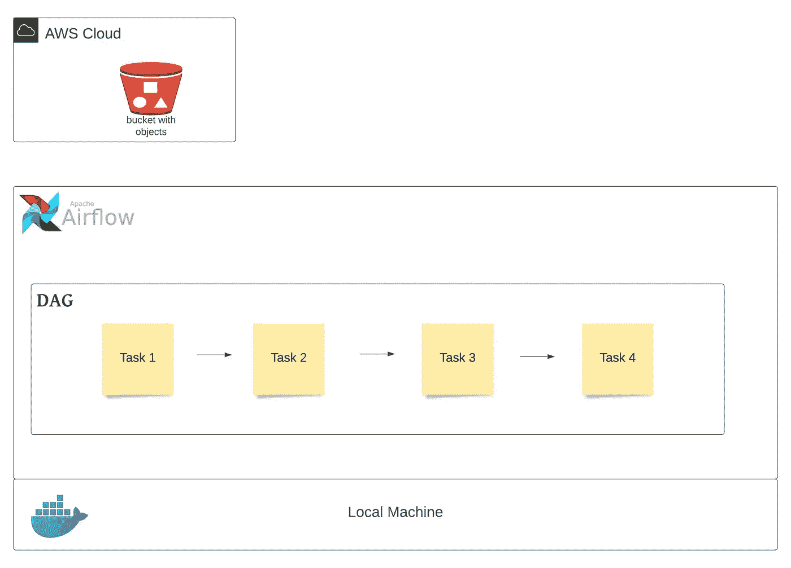
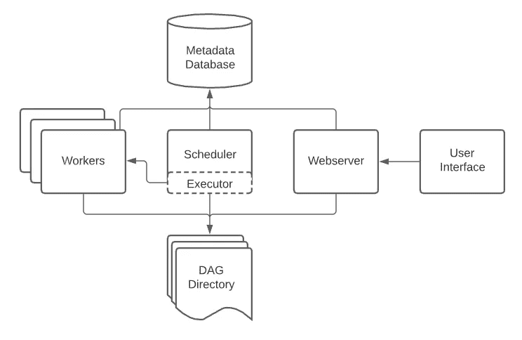
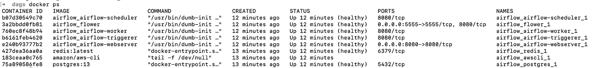
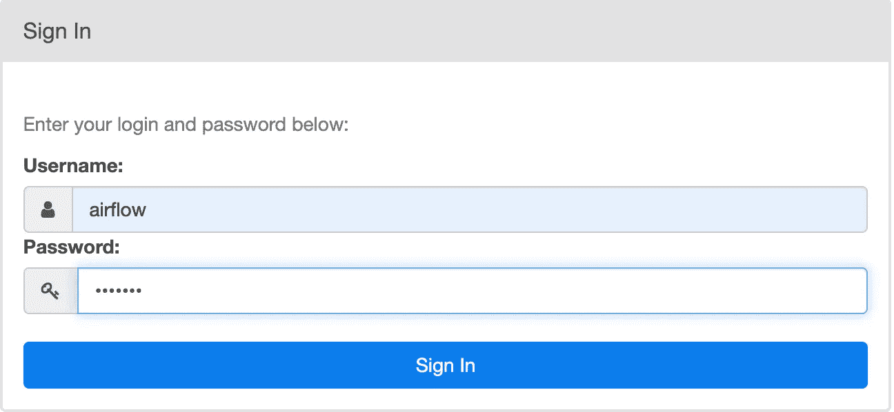
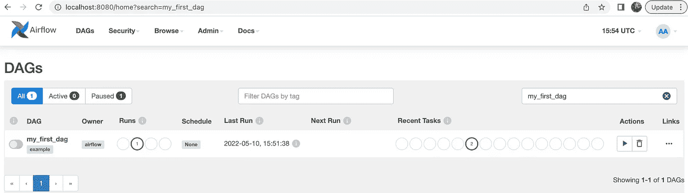
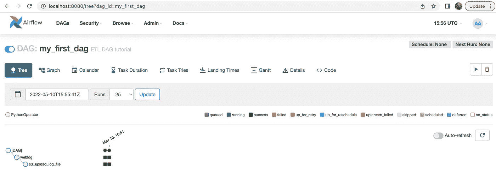
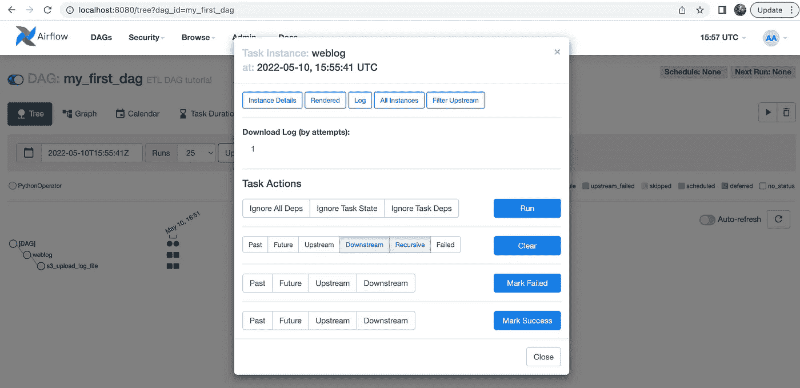
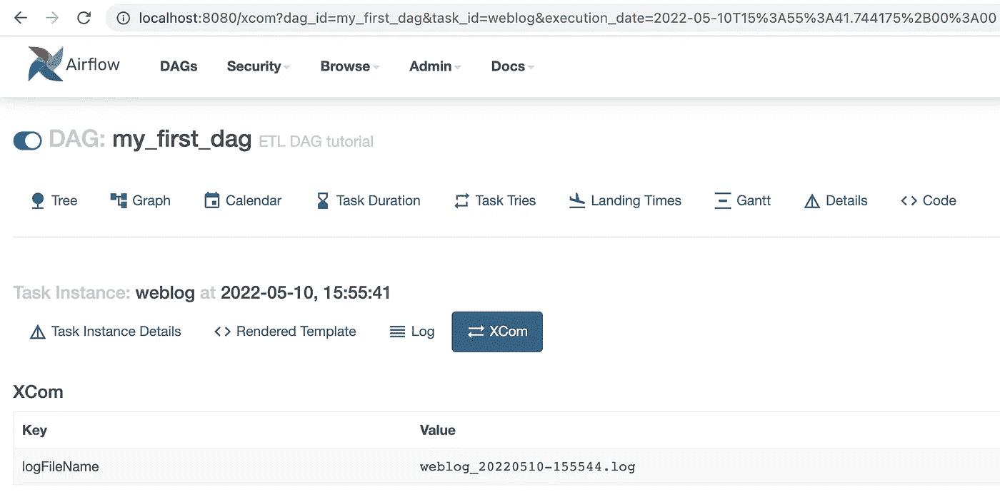
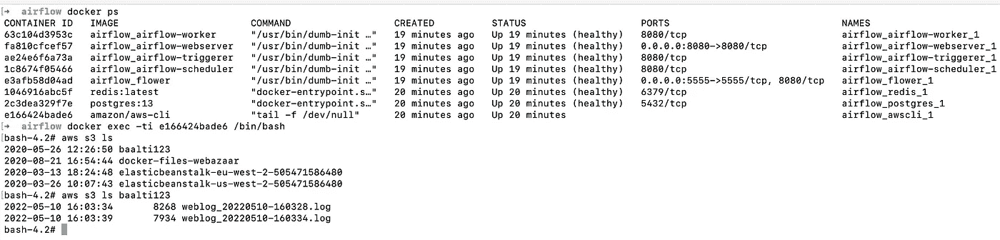

# 带有 AWS S3 的 Docker 上的 Apache 气流

> 原文：<https://betterprogramming.pub/apache-airflow-on-docker-with-aws-s3-3abaf6874a49>

## 写你的第一个 DAG


照片由 [Emin Sefiyarov](https://unsplash.com/@emin008?utm_source=medium&utm_medium=referral) 在 [Unsplash](https://unsplash.com?utm_source=medium&utm_medium=referral) 上拍摄

这个博客是为那些想快速入门 Apache Airflow 的人准备的。这篇博客假设您对 Apache Airflow、Docker 和 AWS 有基本的了解。

在这篇博客的结尾，你将会有你的第一个 DAG 在气流中编写和编排。

主要关注如何使用 Docker 上的扩展映像启动气流，使用 PythonOperator 为中心的任务构建 DAG，利用 XComs(一种允许任务相互通信的技术)，使用 Python 模块，以及最终从 AWS S3 桶发布和检索数据。



为了更好地理解这一点，我们将执行一个包含以下任务的小项目:

a)使用 Python 脚本创建一个网络日志文件
b)将该文件上传到上一步中创建的 AWS S3 存储桶
c)使用 AWS CLI 连接到 AWS S3 进行对象验证

我们将按照下面的步骤完成我们的气流设置并启动 docker，之后我们将能够在气流中运行我们的管道并检索数据。

1.  气流对接配置
2.  气流扩展图像的 Docker 配置
3.  AWS 的 Docker 配置
4.  执行 docker 映像以创建容器
5.  DAG 和气流中的任务创建
6.  从 Airflow UI 执行 DAG
7.  使用 AWS CLI 访问 S3 存储桶/对象

## **1。气流的停靠配置**

我们将在 macOS 上使用 docker 来运行气流设置的容器。我们将使用 Airflow 文档中的`docker-compose.yaml`文件作为基础，并在其上添加所需的配置。下面是[链接](https://airflow.apache.org/docs/apache-airflow/stable/start/docker.html#running-airflow)和气流官网的一些信息。

```
curl -LfO ‘[https://airflow.apache.org/docs/apache-airflow/2.2.5/docker-compose.yaml'](https://airflow.apache.org/docs/apache-airflow/2.2.5/docker-compose.yaml')
```



*   `airflow-scheduler`-[调度器](https://airflow.apache.org/docs/apache-airflow/stable/concepts/scheduler.html)监控所有的任务和 Dag，然后一旦它们的依赖完成就触发任务实例。
*   `airflow-webserver` —网络服务器在`[http://localhost:8080](http://localhost:8080.)`可用
*   `airflow-worker` —执行调度程序给定任务的工人。
*   `airflow-init` —初始化服务。
*   `flower` — [用于监测环境的花卉 app](https://flower.readthedocs.io/en/latest/) 。在`[http://localhost:5555](http://localhost:5555.)` [有。](http://localhost:5555.)
*   `postgres` —数据库。
*   `redis`—[redis](https://redis.io/)—将消息从调度器转发到工作器的代理。

## 2.**气流扩展图像的 Docker 配置**

下一步是创建一个 docker 文件，它将允许我们扩展我们的 Airflow 基础映像，以包含原始映像中没有包含的 Python 包(apache/airflow:2.2.5)。

在 docker-compose.yaml 文件所在的目录下创建一个名为“Dockerfile”的文件，并将下面几行粘贴到其中。

```
FROM apache/airflow:2.2.5
RUN pip3 install Faker numpy boto3 botocore
```

这里我们使用 Airflow 的基本映像，然后使用附加的库、包、模块等来扩展它。这是我们的用例所需要的。您可以根据您的数据处理要求添加/删除包。

有几种方法可以执行 Dockerfile

1.  注释基础图像并取消注释`docker-compose.yaml`文件中的构建行
2.  在此阶段不要对`docker-compose.yaml`文件做任何更改，在运行 docker 时强制执行(在第 4 节中解释)。

```
# image: ${AIRFLOW_IMAGE_NAME:-apache/airflow:2.2.5}
build: .
```

## 3.**AWS 的 Docker 配置**

下一步是将 AWS 凭证作为 ENV 变量添加到`docker-compose.yaml`文件中。

在 environment 部分下添加以下变量，并放置来自您的 AWS 帐户的凭证。

```
AWS_ACCESS_KEY_ID: <>
AWS_SECRET_ACCESS_KEY: <>
AWS_DEFAULT_REGION: <>
```

让我们在`docker-compose.yaml`文件中包含 AWS CLI 映像，它可用于访问 AWS S3 对象，以验证所需数据是否已存储在 S3 上。

```
awscli:
  image: amazon/aws-cli
  entrypoint: tail -f /dev/null
  environment:      
    <<: *airflow-common-env
```

`**entrypoint**` **→** 这将保持 cli 容器运行

`**environment**` **→** 将气流环境传递给 AWS CLI 以使用 AWS 凭证

## 4.**执行 docker 镜像创建容器**

现在运行以下命令来初始化环境，验证气流图像是否太旧且不受支持，UID 是否已配置，以及必要的 RAM、磁盘空间和资源是否可用。

```
docker-compose up airflow-init
```

现在让我们运行 docker-compose.yaml 文件，这将产生文件中指定的所有图像(包括 Dockerfile ),然后使用这些图像运行容器。

```
docker-compose up -d
```

-d →在后台运行容器(分离模式)

或者

如果您没有在 docker-compose.yaml 文件中注释图像行和取消注释构建行，请运行以下命令。

```
docker-compose up --build -d
```

-构建→运行 Dockerfile

成功完成后，您可以使用下面的命令或者通过点击 Docker UI 中新形成的容器/应用程序来验证图像的状态。

```
docker ps
```



使用以下命令，通过 CLI 登录到这些容器中的任何一个。

```
docker exec -ti <Container ID> /bin/bash
```

5. **DAG 和气流中的任务创建:**

将 weblog_gen.py(来自 Github 链接-[https://github.com/narotam333/de-project-1](https://github.com/narotam333/de-project-1))放在`dags`文件夹下。该脚本用于生成 weblog 数据，并作为模块导入到我们的 DAG 中。

让我们导入第一个 dag 所需的库、包或模块。

```
# The DAG object; we'll need this to instantiate a DAG
from airflow import DAG# Pendulum is a Python package to ease datetimes manipulation
import pendulum# Operators; we need this to operate!
from airflow.operators.python import PythonOperator# Python module for data weblog generation 
from weblog_gen import generate_log# Other packages for AWS connection and data processing
import os
import boto3
from botocore.exceptions import ClientError
import logging
```

**DAG:** A *DAG* (有向无环图)是气流的核心概念，将任务收集在一起，用依赖和关系组织起来，说它们应该如何运行。

让我们开始写我们的第一个 DAG…

```
# [START instantiate_dag]with DAG(
    ‘my_first_dag’,
    default_args={‘retries’: 2},
    description=’ETL DAG tutorial’,
    schedule_interval=None,
    start_date=pendulum.datetime(2022, 1, 1, tz=”UTC”),
    catchup=False,
    tags=[‘example’],
) as dag:# [END instantiate_dag]
```

`my_first_dag` →这是 DAG ID，必须全部由字母数字字符、破折号、点号和下划线组成(全部为 ASCII 码)。所有不同的 DAG 必须有唯一的 id。

`default_args` →初始化运算符时用作构造函数关键字参数的默认参数字典(可选)

`description`→DAG 的描述，例如显示在网络服务器上(可选)

`schedule_interval` →定义 DAG 运行的频率，这个 timedelta 对象被添加到您最新的任务实例的 execution_date 中，以确定下一个计划。

`start_date` →调度程序将尝试回填的时间戳(可选)

`catchup` →执行调度程序追赶(或仅运行最新的)？默认为真

`tags` →帮助在 UI 中过滤 Dag 的标签列表(可选)

接下来，我们将使用 PythonOperator 编写我们的第一个任务。

**任务:**任务是气流中执行的基本单位。任务被安排到[Dag](https://airflow.apache.org/docs/apache-airflow/stable/concepts/dags.html)中，然后在它们之间设置上游和下游依赖关系，以表示它们应该运行的顺序。

操作符:操作符在概念上是一个预定义任务的模板，你可以在你的 DAG 中声明性地定义它。

在这个任务中，我们将调用名为 f_generate_log 的函数，并将所需的参数传递给它。当运行我们的 callable 时，Airflow 将传递一组可以在我们的函数中使用的参数/关键字参数。

```
# [START weblog_function]def f_generate_log(*op_args, **kwargs):
    ti = kwargs[‘ti’]
    lines = op_args[0]
    logFile = generate_log(lines)
    ti.xcom_push(key=’logFileName’, value=logFile)# [END weblog_function]# [Start weblog task]**create_weblog_task** = PythonOperator(
    task_id=’weblog’,
    python_callable=f_generate_log,
    op_args = [30],
)# [End weblog task]
```

`task_id` →对于 DAG 中的所有任务，这应该是唯一的

`python_callable` →对可调用对象的引用

`op_args` →调用 callable 时将被解压缩的位置参数列表

`op_kwargs` →将在函数中解包的关键字参数字典

`generate_log` →这是生成网络日志数据文件的模块。请浏览 weblog_gen.py 脚本，看看它是如何工作的，但它基本上是在一个文件中生成 weblog 数据，行数将等于作为参数传递的数量。一旦创建了日志文件，它将返回日志文件的名称。

`ti.xcom_push()` →使用`taskInstance` (ti)关键字参数作为键值对，将键`logFileName`的值推入 XCom

`key=’logFileName’` →这保存了键名

`value = logFile` →保存来自`generate_log`模块的返回值(日志文件的名称)

让我们继续我们 DAG 中的第二个任务。

```
# [START s3_upload_file function]def s3_upload_file(**kwargs):
    ti = kwargs[‘ti’]
    bucketName = kwargs[‘bucketName’] fileName = ti.xcom_pull(task_ids='weblog', key='logFileName')
    objectName = os.path.basename(fileName)    
    s3_client = boto3.client(‘s3’) try:
        response = s3_client.upload_file(fileName, bucketName, objectName)
    except ClientError as e:
        return False
    return True# [END s3_upload_file function]# [Start s3 upload task]**s3_upload_log_file_task** = PythonOperator(
    task_id = ‘s3_upload_log_file’,
    python_callable=s3_upload_file,
    op_kwargs = {‘bucketName’: <>},
)# [End s3 upload task]
```

我们在这个任务中使用关键字参数，因为我们需要传递 AWS S3 存储桶名称。请提供您创建的或您的 AWS 帐户中可用的存储桶的名称。

我们在这个任务中调用 s3_upload_file 函数，并传递所需的关键字参数。

`ti.xcom_pull()` →使用 XCom `taskInstance` (ti)关键字参数，检索关键字`logFileName`的值

`task_ids = ‘weblog’` →传递上一个任务的任务 id 名称

`key=’logFileName’` →传递保存生成的网络日志文件名的密钥

下一步是建立新创建任务的流程。

```
create_weblog_task >> s3_upload_log_file_task
```

这就完成了我们用例的 DAG 文件的开发，它包括 DAG 对象、任务和操作符，以及最后陈述的任务的编排。

## 6.**从气流 UI 执行 DAG**

首先，使用下面列出的凭证登录到 Airflow UI。

链接→[http://localhost:8080/](http://localhost:8080/home)
用户名/密码→气流



您应该能够在 DAG 的菜单下看到我们创建的 DAG。



现在，让我们通过点击右侧“Actions”下的“play”按钮来运行 DAG。如果你点击 DAG，你将能够看到 DAG 和任务的进度使用彩色编码。



您也可以随时通过选择任务，然后选择日志来查看日志。



打开日志后，单击 XCom 查看我们从一个任务传输到下一个任务的关键变量的值。



这就结束了我们的 DAG 在气流中的成功执行。

## 7.**使用 AWS CLI 访问 S3 存储桶/对象**

让我们快速浏览一下 AWS S3 存储桶，看看是否生成了合适的文件或对象。为此，使用下面的命令登录到 AWS CLI 容器，并执行 s3 命令来显示所有对象。



在这里！该文件已成功上传到 S3 存储桶。这标志着我们首次在气流中运行 DAG 的完成，以及它的成功验证。

> 【GitHub 链接】完整代码:【https://github.com/narotam333/de-project-1】

我希望这个博客能够帮助那些正在寻找 Apache Airflow 快速实践文章的人，并帮助他们开始使用这个令人敬畏的开源工具的旅程。

感谢您的阅读。