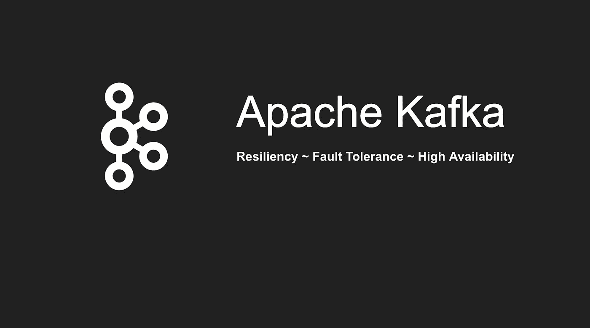

# Apache Kafka —弹性、容错和高可用性

> 原文：<https://betterprogramming.pub/apache-kafka-resiliency-fault-tolerance-high-availability-8ab1c35c8823>

## 了解 Apache Kafka 的弹性、容错和高可用性

Apache Kafka 是一个分布式系统，分布式系统会出现多种类型的故障。一些经典案例包括:

1.  代理停止工作，变得无响应，并且无法访问
2.  数据存储在磁盘上，某个场景会导致磁盘出现故障，然后无法访问数据
3.  假设一个集群中有多个代理。每个代理都是多个分区的领导者。如果其中一个代理出现故障或无法访问，将会导致数据丢失。

这些是动物园管理员前来救援的场景。当 ZooKeeper 意识到其中一个代理关闭时，它会执行以下操作:

1.  它将找到另一个代理来代替失败的代理
2.  它将更新用于生产者和消费者工作分配的元数据，以确保系统继续运行

一旦 ZooKeeper 执行了上述两个步骤，消息的发布和消费将照常继续。这里的挑战是失败的代理包含一些数据。除非做好准备将数据复制到其他地方，否则会出现数据丢失的情况。

Kafka 提供了一个配置属性来处理这个场景— *复制因子*。该属性确保所有数据都存储在多个代理中。即使在上面列出的故障的情况下，复制因子也将确保没有数据丢失的风险。

另一个需要注意的重要事情是，必须确定复制因子的数量。例如，如果复制因子设置为 5，则意味着数据在 5 个代理上复制。因此，即使在五分之四的经纪人倒下的情况下，也不会有数据丢失。

这里需要理解的另一个术语是同步副本或 ISR 中的*。当副本集完全同步时，即 ISR 等于复制因子，这意味着每个主题和主题内的每个分区都处于健康状态。*

**让我们在下面的视频中看看阿帕奇卡夫卡是如何展示这些特征的-**

**上面视频教程的步骤列在**下面

**参考文献**—

[https://kafka.apache.org/](https://kafka.apache.org/)