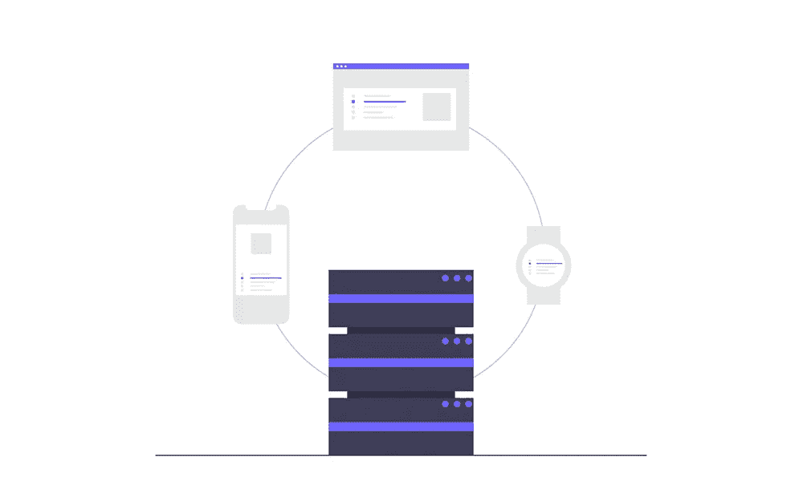
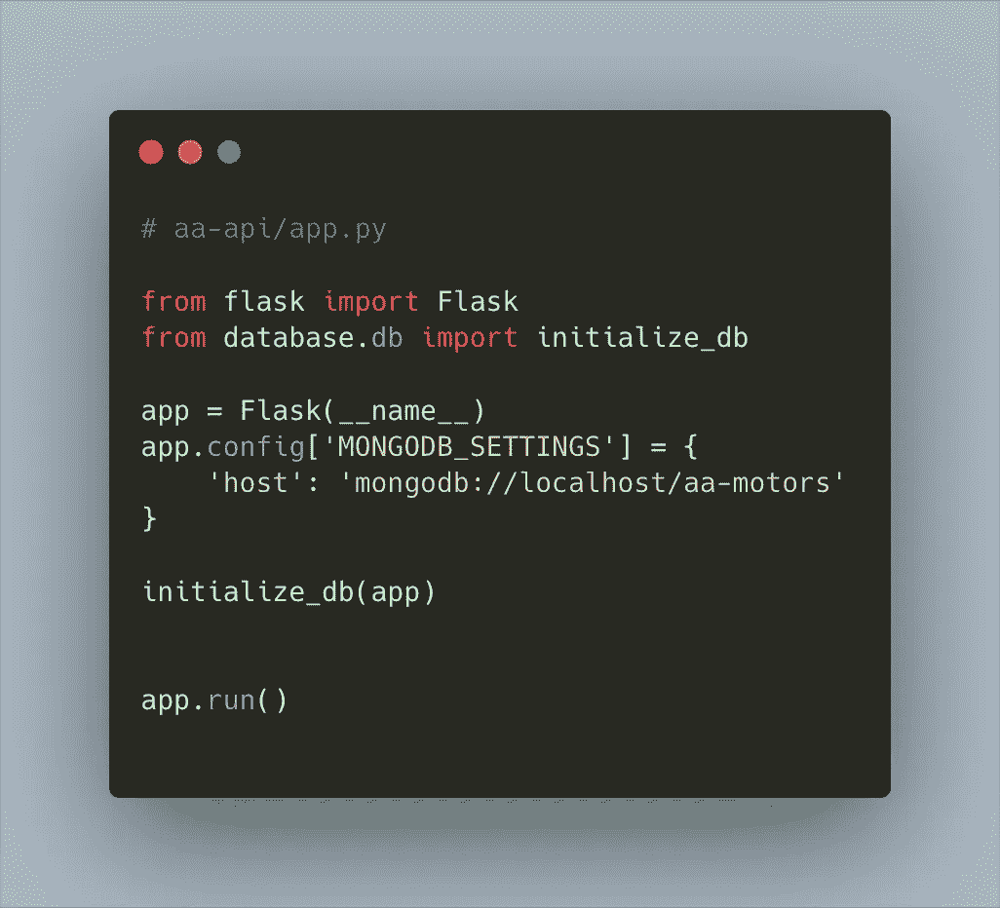
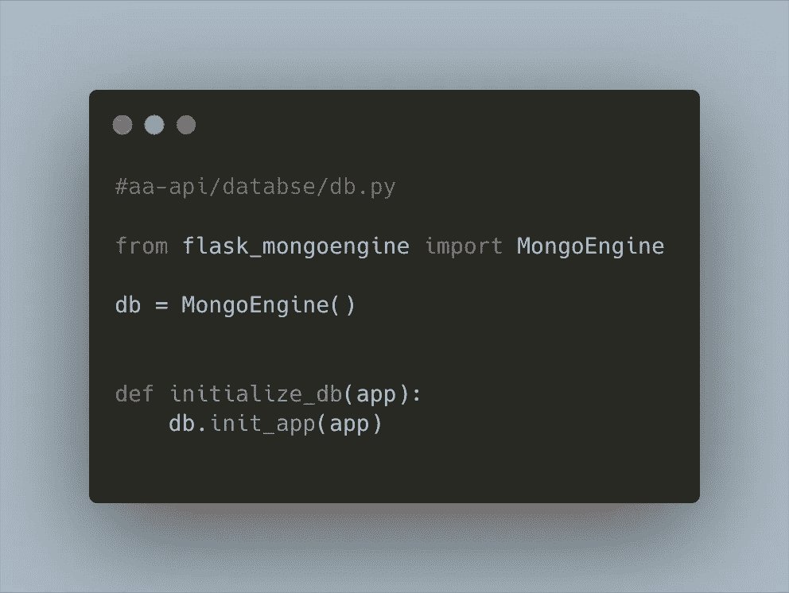
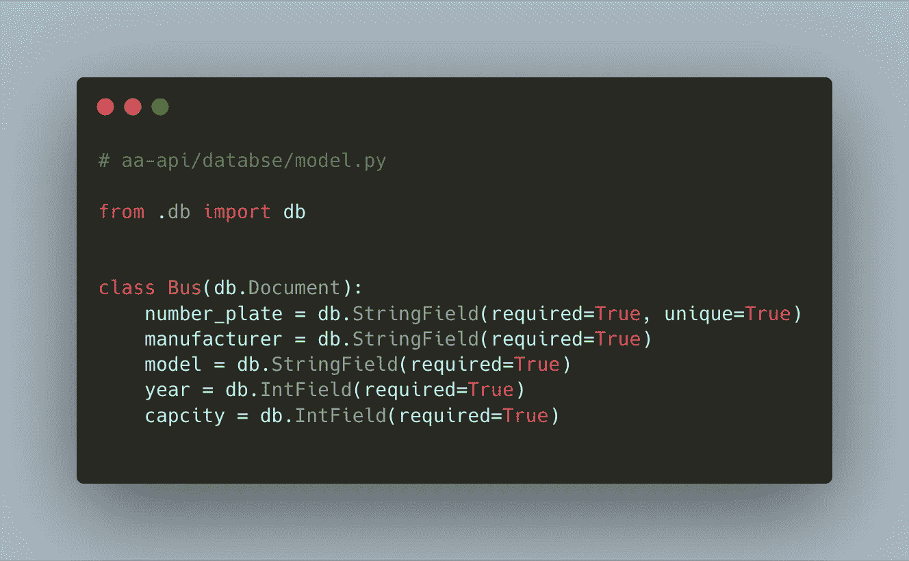
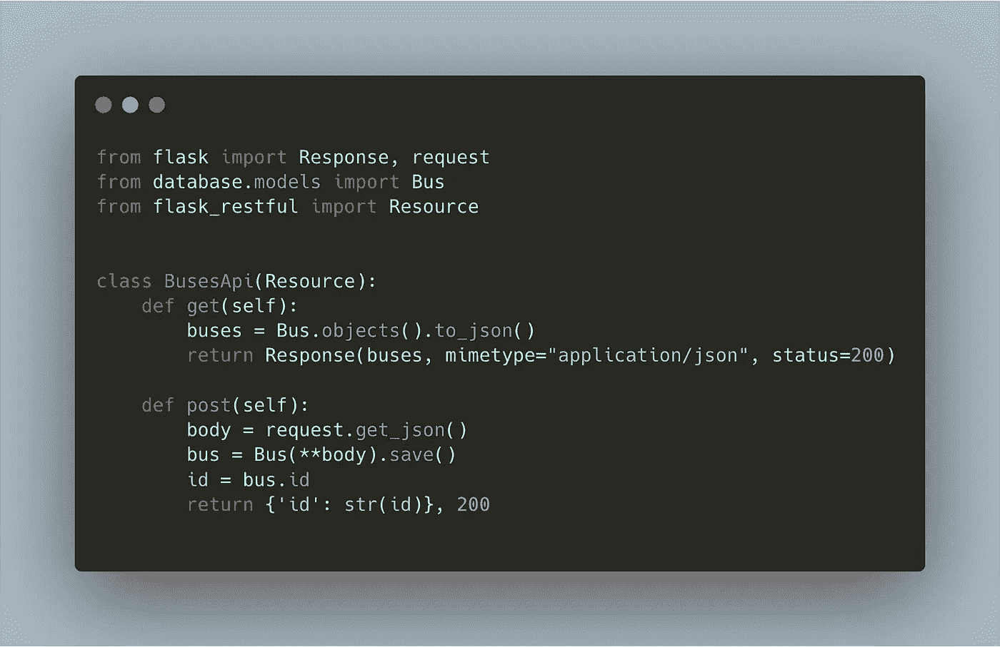
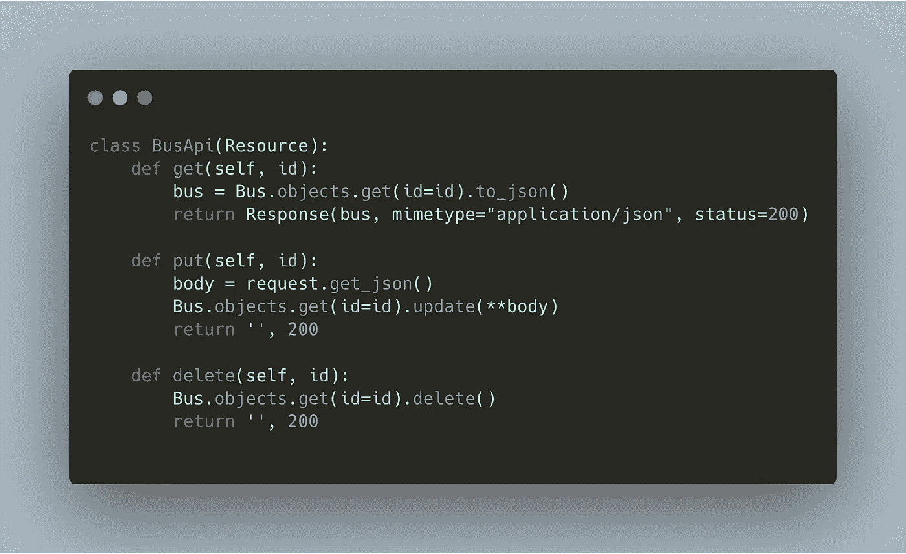
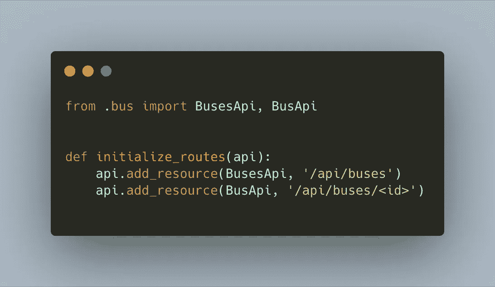

# 用 Flask-Restful 和 MongoDB 在 Python 中开发 API

> 原文：<https://betterprogramming.pub/api-development-in-python-with-flask-resful-and-mongodb-71e56a70b3a6>

## 使用 Flask-Restful 更好地构建 Flask API 开发



# 背景

本文面向中级 Python 开发人员，或者具有任何语言的面向对象编程经验的人。如果你已经用 Ruby、Java 或 PHP 开发了一个 web 应用程序，并想学习 Python，这也会给你一个很好的开端。

如果你是一个有一些基本 Python 的初学者，我会推荐你看看我以前的帖子:[初学者用 Flask 进行 API 开发](https://medium.com/better-programming/api-development-with-flask-for-the-absolute-beginner-a2163b2bd8ca)。我假设您的机器上已经安装了 Python，并且您有一些使用数据库和命令行的经验。

# 技术

这是我们将在本教程中讨论的技术的重点。

> [**Flask-RESTful**](https://github.com/flask-restful/flask-restful/) 是 Flask 的扩展，增加了对快速构建 REST APIs 的支持。它是一个轻量级的抽象，可以和你现有的 ORM/库一起工作。Flask-RESTful 鼓励用最少的设置实现最佳实践。如果你熟悉 Flask，Flask-RESTful 应该很容易上手。— [烧瓶-RESTful](https://flask-restful.readthedocs.io/en/latest/)
> 
> MongoDB 是一个通用的、基于文档的分布式数据库，为现代应用程序开发人员和云时代而构建。没有数据库能让你更有效率。— [MongoDB](https://www.mongodb.com/)
> 
> NoSQL 数据库提供了一种存储和检索数据的机制，这种数据的建模方式不同于关系数据库中使用的表格关系。这种数据库自 20 世纪 60 年代末就已经存在，但“NoSQL”这个名字只是在 21ˢᵗ世纪早期由 Web 2.0 公司的需求引发的。— [维基百科](https://en.wikipedia.org/wiki/NoSQL)
> 
> MongoEngine 是一个对象文档映射器，用 Python 编写，用于 MongoDB。要安装它，只需运行— [MongoEngine](http://docs.mongoengine.org/index.html)

# 设置

在继续之前，请确保您的机器上安装了 [Python 和](https://www.python.org/downloads/)，并且安装了 [MongoDB](https://www.mongodb.com/download-center/community) 。用大约 15 秒的谷歌搜索，你应该能够让他们安装在你的电脑上，因为在网上有很多资源可以做到这一点。

我将使用 [Visual Studio Code](https://code.visualstudio.com/download) 作为我的开发编辑器，你可以使用任何你想要的 IDE，尽管我推荐 VS Code，因为它是免费的和跨平台的，有很多针对所有主流编程语言的扩展。

我们还将为人类使用 Pipenv: Python 开发工作流。这将使我们更容易管理 Python 的依赖性，并为我们的项目创建一个独立的开发环境。

> [**Pipenv**](https://pipenv-fork.readthedocs.io/en/latest/) 是一款工具，旨在将所有包装领域的精华(bundler、composer、npm、cargo、yarn 等。)到 Python 世界。 *Windows 是我们这个世界的一等公民。*

# 我们正在建造的东西

在本教程的其余部分，我们将为 AA 汽车公司开发 API 服务来管理其车队。从您的控制台中，运行以下命令。

```
mkdir aa-api
cd aa-api
touch app.py
```

然后安装管道。之后，我们将安装烧瓶。`pipenv install flask`这将创建一个虚拟环境并安装 Flask。它将为我们生成两个文件，`Pipfile`和`Pipfile.lock`。如果你有一些 Node.js 的经验，这类似于一个`Package.json`文件或 Ruby Gemfile。

要激活 Pipenv 创建的虚拟环境，运行`pipenv shell`:

```
➜  aa-api pipenv shell 
Launching subshell in virtual environment…
 . /Users/peterayeni/.local/share/virtualenvs/aa-api-9L89IsJh/bin/activate
➜  aa-api  . /Users/peterayeni/.local/share/virtualenvs/aa-api-9L89IsJh/bin/activate
(aa-api) ➜  aa-api
```

要安装 Flask-Restful，请运行:

```
pipenv install flask-restful
```

要安装 MongoEngine:

```
pipenv install flask-mongoengine
```

在根目录中，创建一个名为 database 的新目录以及两个名为 db.py 和 model.py 的文件:

```
mkdir database
touch database/db.py
touch database/model.py
```

您的目录现在应该是这样的:

```
aa-api
│   app.py
|   Pipfile
|   Pipfile.lock   
└───database
    │   db.py
    └───models.py
```



上面是我们的 app.py，在这里我们初始化了我们的应用程序，并使用我们从`database.db`导入的 MongoEngine 配置了一个 MongoDB 连接，我们接下来将创建它。



用 MongoEngine 实例化一个 MongoDb 数据库就是这么简单。接下来，我们将创建我们的数据模型。



MongoEngine 使用 Python 类来建模我们的数据。`db.StringField`用于设置文本数据类型，我们也可以提供为我们的数据类型设置某些属性的参数，比如`required`和`unique` MongoEngine，它们是很好的文档，您可以查看它们以了解更多信息。

## 端点

我们将从创建一个端点开始，获取数据库中的所有总线，并添加一条新总线。让我们创建一个名为 resources 的新文件夹，并在其中创建两个文件`bus.py`和`routes.py`,此时我们的文件夹结构将是这样的。

```
aa-api
│   app.py
|   Pipfile
|   Pipfile.lock   
└───database
    │   db.py
    └───models.py
└───resources
    │   bus.py
    └───routes.py
```

通过这种方式，我们可以按照特性来组织我们的 API，并且当我们添加额外的资源(比如 trip)时，很容易扩展我们的 API 并最好地管理我们的代码。

# 获取所有总线并添加一条新总线



在上面的代码中，我们从 flask_restful 导入数据库和资源。创建一个资源就像创建一个 Python 类一样简单，每个方法都是我们想要创建的资源的 HTTP 请求方法。代码的大部分是不言自明的。获取数据库中的所有总线并将其转换为 JSON，然后我们将其存储在一个名为 bus 的变量中，并使用 Flask 的响应方法将其返回给用户；将它的“mimetype”设置为“application/json”，并将状态代码设置为 200。

post 方法通过从请求体获取新的总线数据来创建新的总线，然后我们将它传递给`Bus(**body)`，然后保存到数据库。`**body`是一个扩展操作符，类似于 JavasScript 扩展操作符。然后我们返回新添加的总线的 id。

是时候测试我们的 API 了，运行`pipenv shell`来激活我们的虚拟环境，然后运行`python app.py`:

```
(aa-api) ➜  aa-api git:(resource) ✗ python app.py
 * Serving Flask app "app" (lazy loading)
 * Environment: production
   WARNING: This is a development server. Do not use it in a production deployment.
   Use a production WSGI server instead.
 * Debug mode: off
 * Running on [http://127.0.0.1:5000/](http://127.0.0.1:5000/) (Press CTRL+C to quit)
```

测试你的 API 的最好方法是使用 [Postman](https://www.postman.com/) 。

# 更新、删除和获取单个总线



从上面，你会看到我们使用了一个叫做`BusApi`的新类。这有助于关注点的分离；您将会注意到，这些 HTTP 请求方法中的每一个都需要获取总线的 ID 来完成它们的任务；这让我们能够以巧妙的方式组织路线。



您可以看到，通过这种方式，我们能够为我们的端点创建一个清晰的路由。请在此找到完整的代码[。](https://github.com/peterayeniofficial/flask-bus-api)

# 尾注

本文的要点是如何使用 Flast-Restful 和实现 MongoDB 引擎在 Flask 中最好地构建 API 代码，使使用 MongoDB 成为一种乐趣。我们的 API 还远远没有完成；还有很大的提升空间。比如错误处理、认证、文档和测试。我将在以后的文章中逐一介绍这些内容。

直到那时候:)快乐编码。