# 面向初学者的 Flask API 开发

> 原文：<https://betterprogramming.pub/api-development-with-flask-for-the-absolute-beginner-a2163b2bd8ca>

## 开始使用 Python 构建后端服务

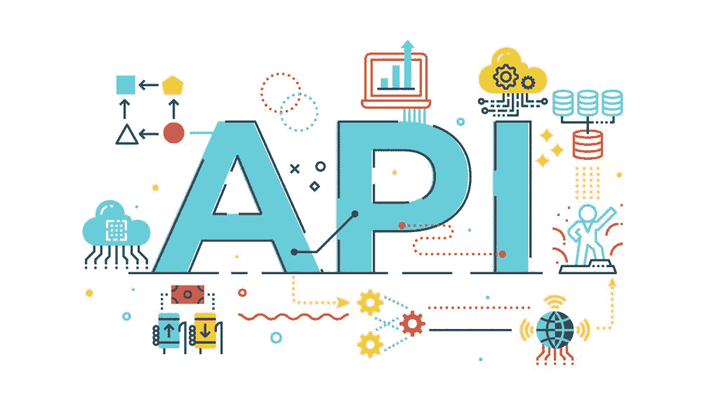

图片来源:[https://www.endivesoftware.com](https://www.endivesoftware.com)

# 背景

我这篇文章的目标是帮助刚开始编程的人用他们新发现的技能快速变得高效。

当你开始学习编程时，最困难的障碍之一是你如何开始应用你新发现的知识来解决一个实际问题。用 Python 构建一个 API 是开始看到你努力工作的结果的一个很好的地方。

这篇文章是为那些一直在学习用 Python 编程，并且对命令行和 web 如何工作有基本了解的人准备的。

# 技术

在本文中，我们将使用[烧瓶](https://flask.palletsprojects.com/en/1.1.x/):“Web 开发一次一滴”。Flask 是一个基于 Python 构建的 web 开发库。

Flask 利用 Python 的简单性作为初学者的一种方法，这使得为复杂的后端 API 和服务于数百万用户的微服务构建基本应用程序变得容易。Flask 被网飞、Reddit、Lyft 等科技巨头使用。

对于 IDE，我将使用 [Visual Studio 代码](https://code.visualstudio.com/)。我强烈推荐你使用它，它是免费的，有一个惊人的插件生态系统，会让你的 Python 开发充满乐趣。为了测试我们的 API 端点，我们将使用 [Postman](https://www.postman.com/) ，你可以免费下载。

## 边注

在本教程中，我将假设您已经知道基本的 Python 语法，您已经在开发机器上安装了 Python，您知道如何使用命令行，以及互联网如何工作的基础知识。

如果你还没有这些知识，我会在下面提供免费资源链接，你可以在那里学习这些基础知识，然后你可以回到这个教程。

*   [学习 Python —初学者全教程(教程](https://www.youtube.com/watch?v=rfscVS0vtbw))
*   [安装 Python](https://www.codecademy.com/articles/install-python)
*   [互联网如何工作](https://www.youtube.com/watch?v=x3c1ih2NJEg)
*   [命令行基础知识](https://www.theodinproject.com/courses/web-development-101/lessons/command-line-basics-web-development-101)

# 定义

## API 定义

> “应用程序编程接口是软件组件或系统的计算接口，它定义了其他组件或系统如何使用它。它定义了可以进行的调用或请求的种类、如何进行、应该使用的数据格式、应该遵循的约定等。”— [维基百科](https://en.wikipedia.org/wiki/Application_programming_interface)

## JSON 定义

> JavaScript 对象表示法是一种开放的标准文件格式和数据交换格式，它使用人类可读的文本来存储和传输由属性值对和数组数据类型组成的数据对象— [维基百科](https://en.wikipedia.org/wiki/JSON)

## HTTP 定义

> HTTP 定义了一组请求方法来指示对给定资源要执行的期望动作。虽然它们也可以是名词，但是这些请求方法有时被称为 *HTTP 动词*。
> 
> 它们中的每一个都实现了不同的语义，但是它们之间有一些共同的特性:例如，请求方法可以是安全的、幂等的或者可缓存的。”— [MDN](https://developer.mozilla.org/en-US/docs/Web/HTTP/Methods)

## `[GET](https://developer.mozilla.org/en-US/docs/Web/HTTP/Methods/GET)`

方法请求指定资源的表示。使用`GET`的请求应该只检索数据。

## `[POST](https://developer.mozilla.org/en-US/docs/Web/HTTP/Methods/POST)`

`POST`方法用于将一个实体提交给指定的资源，这通常会导致状态的改变或者对服务器产生副作用。

## `[PUT](https://developer.mozilla.org/en-US/docs/Web/HTTP/Methods/PUT)`

`PUT`方法用请求负载替换目标资源的所有当前表示。

## `[DELETE](https://developer.mozilla.org/en-US/docs/Web/HTTP/Methods/DELETE)`

方法删除指定的资源。`[CONNECT](https://developer.mozilla.org/en-US/docs/Web/HTTP/Methods/CONNECT)`。

## `[PATCH](https://developer.mozilla.org/en-US/docs/Web/HTTP/Methods/PATCH)`

`PATCH`方法用于对资源进行部分修改。

# 我们要建造什么

在本教程中，我们将为 AA 汽车公司构建一个后端服务来跟踪他们的车队。在本教程中，为了简单起见，我们将使用一个基本的 Python 数据结构来存储我们的数据，我们可以在以后的教程中添加一个数据库。

我们还不需要担心数据库的复杂性，但是已经了解了构建 API 的基本概念以及它们是如何工作的。

# 入门指南

上面，我已经为我们提供了 API 世界中的通用定义，随着您继续学习和构建 API，所有这些将变得更加清晰。

创建一个新目录，并导航到新创建的目录。我把我的名字叫做`aa-api`，“你可以随便叫你的名字。

```
mkdir aa-api
cd aa-api
```

## 安装[管道](https://github.com/pypa/pipenv)

> “Pipenv 是一种工具，旨在将所有包装领域(捆扎机、作曲家、npm、货物、纱线等)的精华带给客户。)到 Python 世界。在我们的世界里，Windows 是一等公民。
> 
> 它会自动为您的项目创建和管理一个 virtualenv，并在您安装/卸载软件包时从您的`Pipfile`中添加/删除软件包。它还生成了非常重要的`Pipfile.lock`，用于产生确定性的构建。"

```
pip install --user pipenv
```

## 安装烧瓶

正如我在上面的技术部分提到的，我们将使用 [Flask](https://flask.palletsprojects.com/en/1.1.x/) ，一个用于构建 web 应用程序的极简 Python 库。我们将使用 Pipenv 来安装 Flask。

```
pipenv install flask
```

这将创建一个虚拟环境并安装 Flask。它将为我们生成两个文件，`Pipfile`和`Pipfile.lock`。如果你有一些 Node.js 的经验，这类似于一个`Package.json`文件或 Ruby Gemfile。

```
[[source]]
name = "pypi"
url = "https://pypi.org/simple"
verify_ssl = true
[dev-packages]
[packages]
flask = "*"
[requires]
python_version = "3.8"
```

六行代码中的 flask“Hello Universe”API。

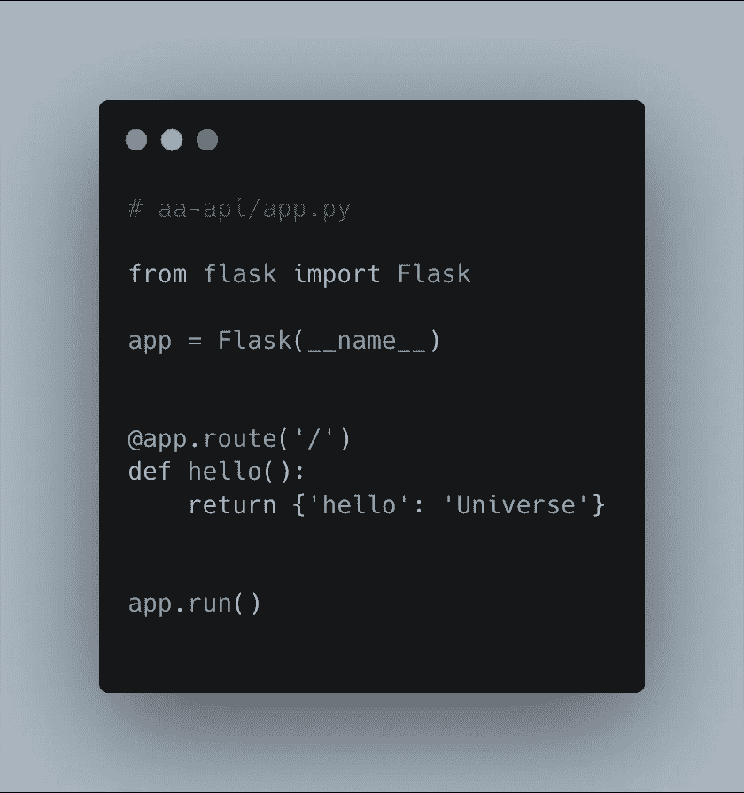

这就是我们的第一个 API，只有 6 行代码，这就是 Flask 的厉害之处。如果您熟悉 Python，那么这些代码的大部分对您来说会很熟悉。

也许`@app.route('/)`可以看起来有点关。这在 Python 中叫做 *decorators* ，这个概念在其他编程语言中也有，所以并不是 Python 特有的。

装饰者接受一个函数并为我们的`hello`函数扩展它的功能，当`/`路由被请求时，它将被调用并返回一个 JSON `{"hello": "Universe"}`。

我将在本文后面放一个链接，以学习更多关于 Python 中的 decorators 的知识，尽管这不是本文的要求。弗拉斯克已经帮我们做了繁重的工作。

# 运行我们的应用

要运行我们的应用程序，我们首先需要通过运行`pipenv shell`来激活 Pipenv 为我们创建的虚拟环境。

```
➜  aa-api pipenv shell 
Launching subshell in virtual environment…
 . /Users/peterayeni/.local/share/virtualenvs/aa-api-9L89IsJh/bin/activate
➜  aa-api  . /Users/peterayeni/.local/share/virtualenvs/aa-api-9L89IsJh/bin/activate
(aa-api) ➜  aa-api
```

然后我们跑`python app.py`。

```
(aa-api) ➜  aa-api python app.py
 * Serving Flask app "app" (lazy loading)
 * Environment: production
   WARNING: This is a development server. Do not use it in a production deployment.
   Use a production WSGI server instead.
 * Debug mode: off
 * Running on [http://127.0.0.1:5000/](http://127.0.0.1:5000/) (Press CTRL+C to quit)
```

您将看到一个开发服务器正在本地主机的端口 5000 上运行。启动 Postman 并创建一个 GET 请求。

如果您以前没有使用过 Postman，为了帮助您理解它，请查看这个快速教程:[如何使用 Postman](https://www.youtube.com/watch?v=jBjXVrS8nXs) 发送和捕获 API 请求。

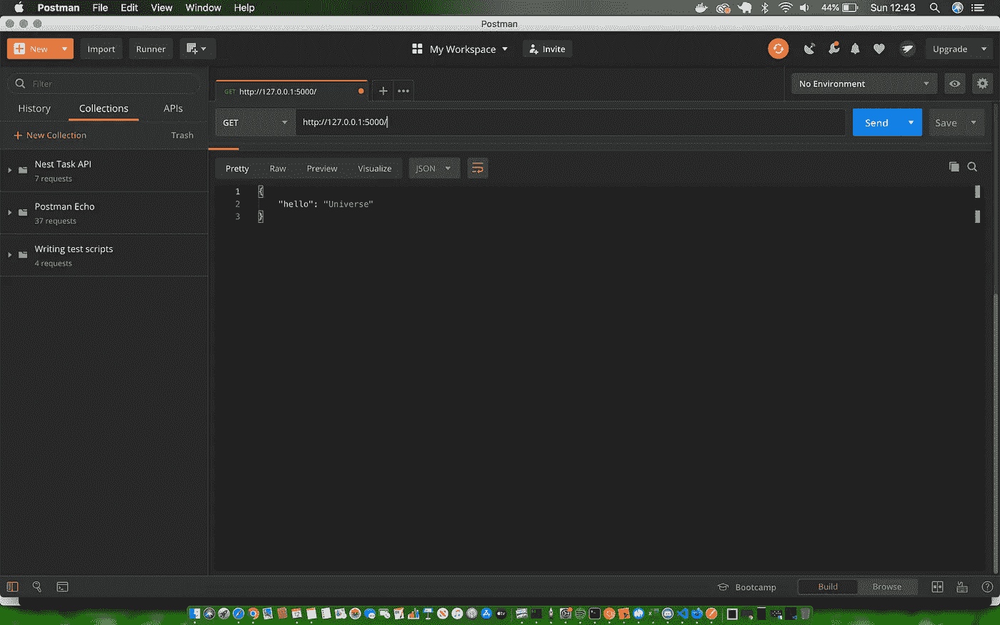

这就是上面的 HTTP 动词的定义开始有意义的地方。默认情况下，我们的`hello`函数向根路由`"/"`发出 GET 请求，您可以在上面的 Postman 中看到返回的 JSON。

干得好，现在让我们扩展我们的应用程序，以便能够做更多的事情。

# 总线数据

在本教程的剩余部分，我们将构建一个 CRUD API 来管理 AA 汽车的总线。让我们定义我们需要收集的关于每辆公交车的信息。

```
Number Plate
Manufacturer
Model
Year
Capacity
```

以上是定义每条总线的数据。我们可以创建一个 Python 列表来帮助我们存储每辆公交车的信息。

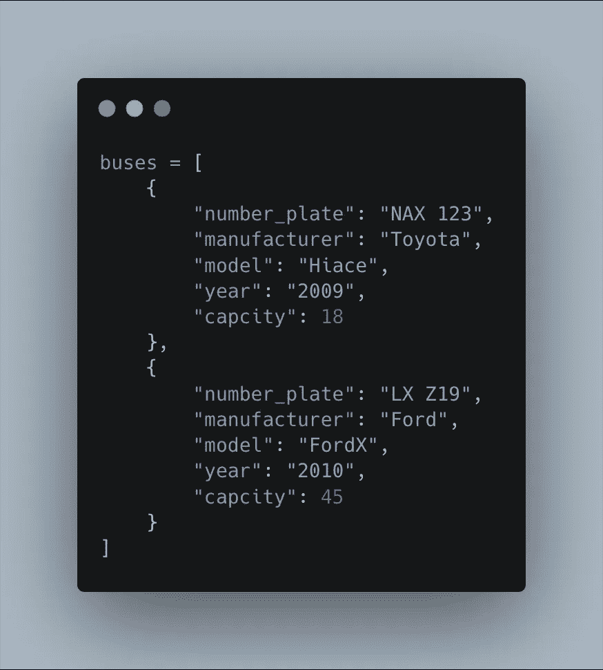

以上是一个字典列表，通过这种方式，你会看到大多数语言都在创建数据集合，以便在内存中存储复杂的数据。从现在开始，我们将在应用程序中使用上面的列表。

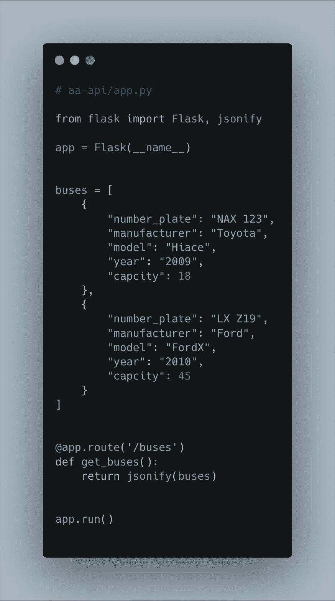

上面，我对我们的代码做了一些修改，添加了一个*总线*集合，并对函数做了一些修改。

我们的`hello`函数现在改名为`get_buses`。这个名字让我们知道这个函数的功能是什么，它将得到我们集合中的所有总线。

为了看到我们工作的结果，我们需要使用`ctr+ c`和`python app.py`重启服务器。

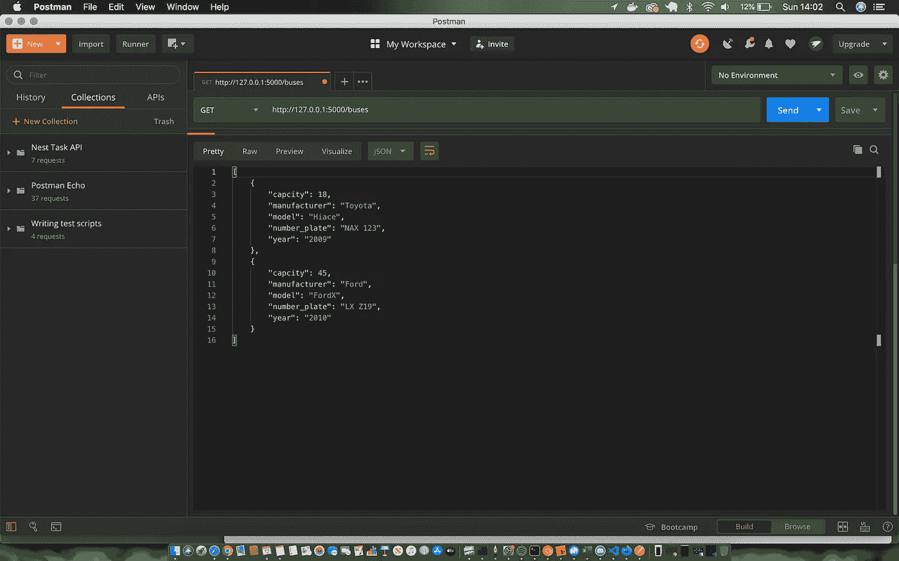

## 坐一辆公共汽车

现在，让我们创建另一个仅检索一条总线的端点。

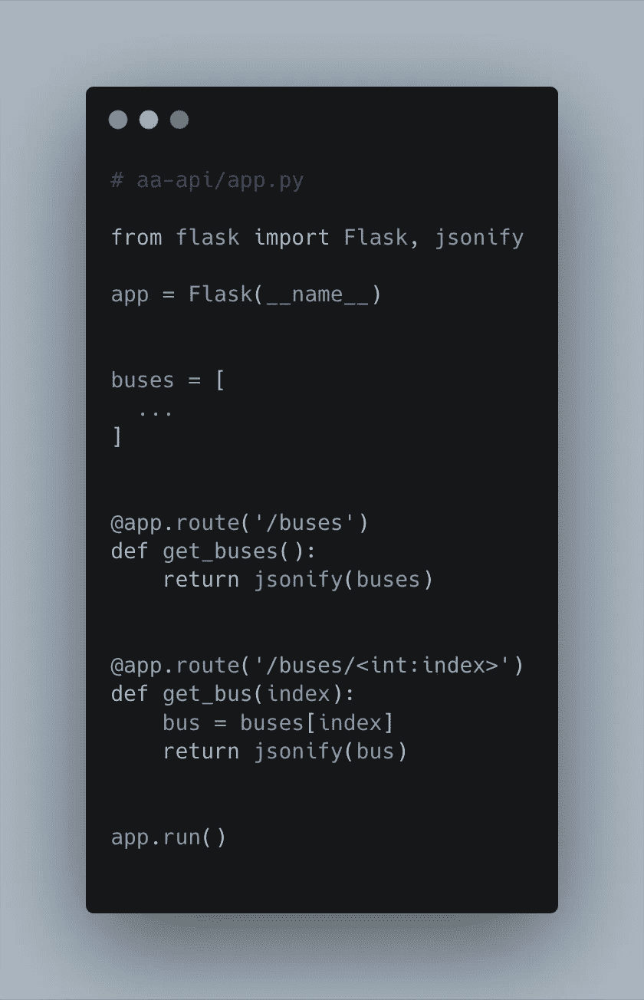

上面，我们添加了一个新的端点来获得单条总线。

我们通过 URL `'/buses/<int:index>'`捕获了我们想要检索的总线的索引，因此，在我们的 URL 中，我们可以有`[http://127.0.0.1:5000/buses/1](http://127.0.0.1:5000/buses/1)`,并且“1”将被传递给`get_bus`函数，该函数将用于在我们的`buses`数组的那个位置获取总线并将其返回给我们。

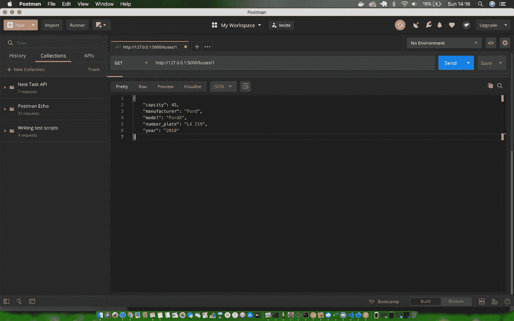

## 添加新总线

太棒了，我们只有一辆巴士。现在，我们将创建一个端点，允许用户使用我们的 API 添加新的总线。

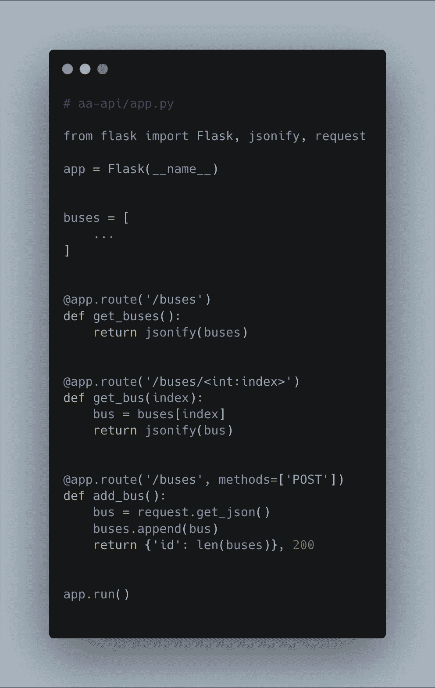

上面是我们添加了新总线的端点的代码实现，您会注意到这里有一些简单的区别。

首先映入您眼帘的是我们的`@app.route`接受了第二个参数 *methods* ，它指定了我们期望的 HTTP 方法的类型。

根据上面对 POST 的定义，您将会记得，每当我们需要创建一个新资源时，我们都需要使用 HTTP 方法。此外，我们从 Flask 导入请求方法，这允许我们捕获通过请求体发送的数据。

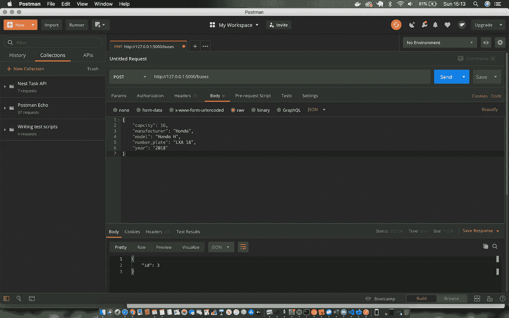

您还会注意到，这一次，我们返回了新添加的总线的 ID，该 ID 只是列表的大小和一个状态代码 200，表示资源创建成功。

让我们更新代码，只返回我们添加的总线，这对于良好的用户体验更好，并将使我们的前端开发人员的生活更好。

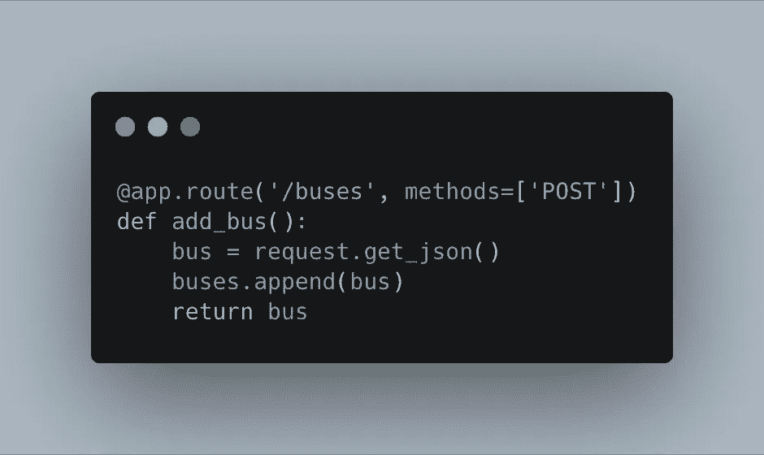

## 更新和删除

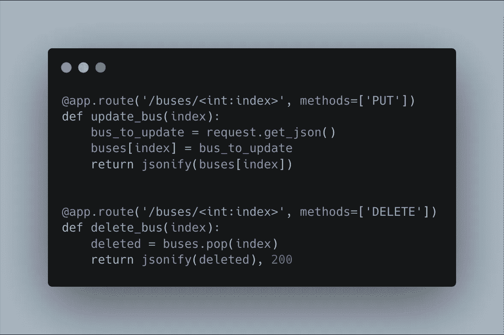

如您所见，更新和删除遵循相似的模式。对于更新，我们使用 PUT HTTP 方法，通过 request 方法获取更新的内容。我们通过 URL 传递数据来了解要更新的数据，就像获取单条总线一样。

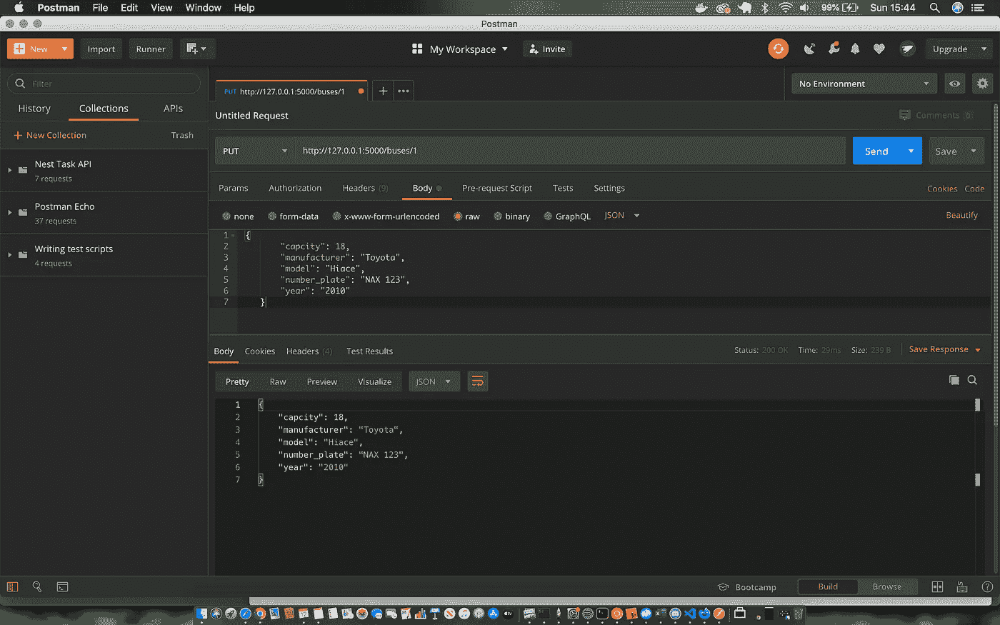

删除是最简单的部分。我们从 URL 中取出要删除的总线，并使用 pop 数组方法将其从列表中取出，然后将删除的总线返回给用户。

您会注意到我们使用了`jsonify()`，一个来自 Flask 的方法，将 Python 字典转换成 JSON，然后发送给用户。

# 完整代码

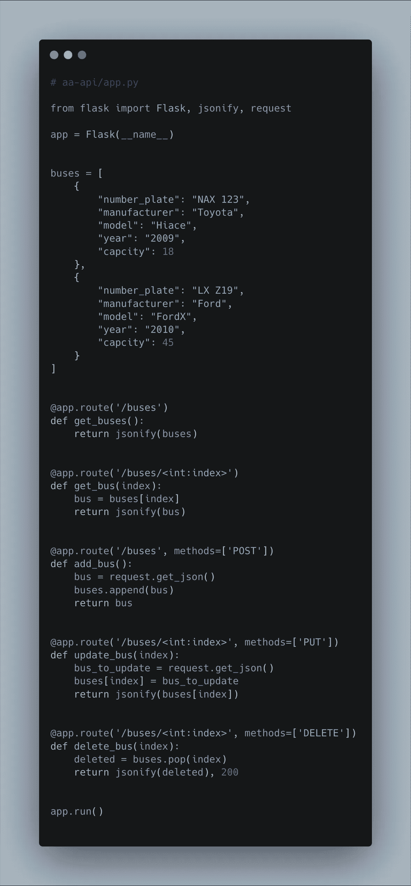

这就是使用 Flask 在 Python 中构建完整 CRUD API 所需的所有代码。

我希望这能在您需要开始用 Python 构建后端服务时给你一些提示。这段代码中有很多我们可以改进的地方，比如错误检查、验证、添加数据库来保存数据、认证、测试和文档。

Flask 提供了很棒的文档，可以用来改进这个 API，还有许多其他资源，只需一个 Google away 就可以让你继续学习。我将继续在本教程的基础上增加其他层次的改进。

# 资源

*   [什么是 API？定义、类型、规格和文件](https://www.endivesoftware.com/blog/api-definition-types-specifications-documentation/)
*   [Python 装饰器和烧瓶](https://dev.to/sonnk/python-decorator-and-flask-4c16)
*   [HTTP 响应状态码](https://developer.mozilla.org/en-US/docs/Web/HTTP/Status)

编码快乐！