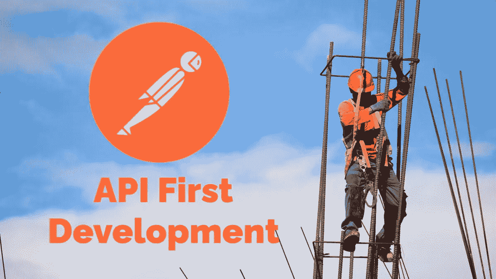
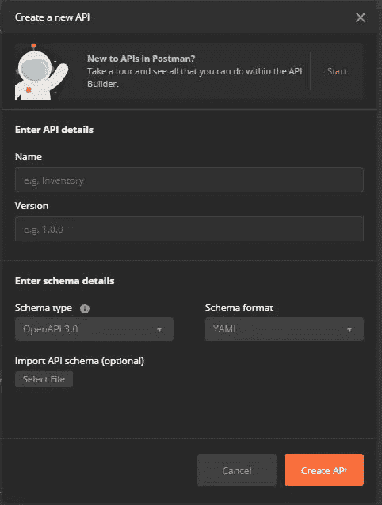
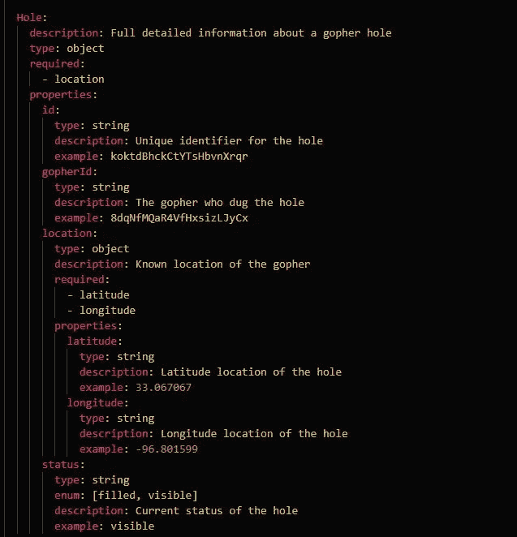
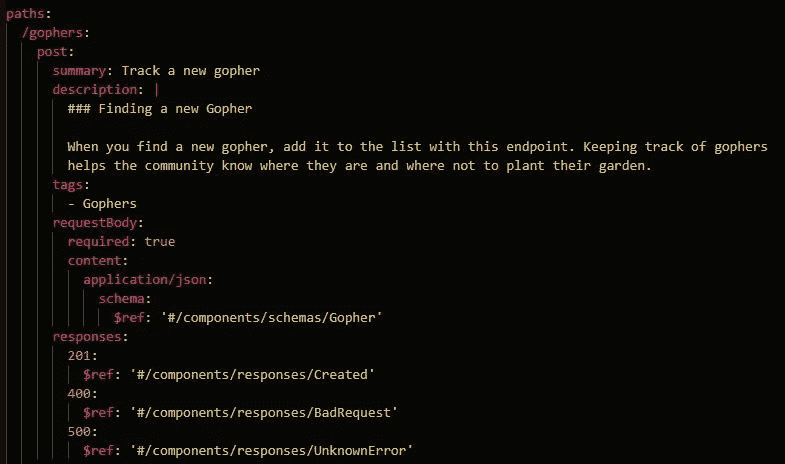
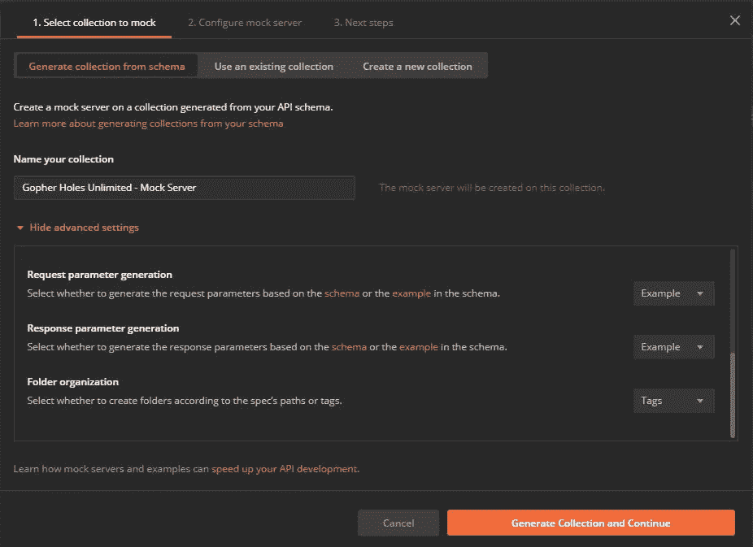
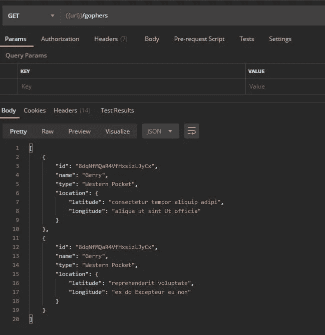
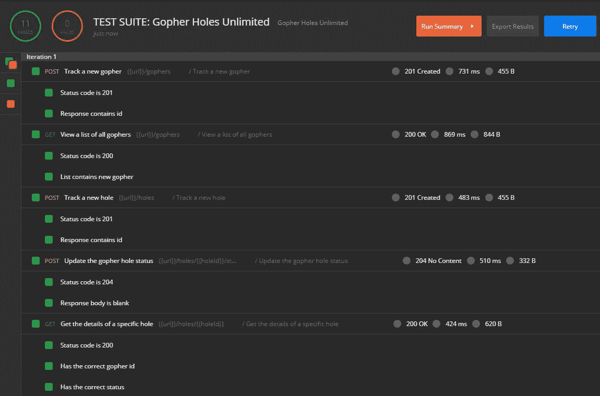
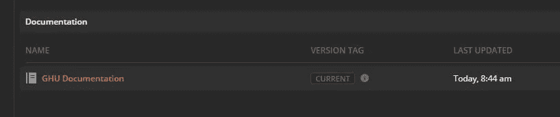

# API 优先开发:用 Postman 构建一致的、有意义的 API

> 原文：<https://betterprogramming.pub/api-first-development-build-consistent-meaningful-apis-with-postman-db7d1e9e8b5c>

## 用开放 API 规范和 Postman 构建强大的 API



Josue Isai Ramos Figueroa 在 [Unsplash](https://unsplash.com/s/photos/construction-worker?utm_source=unsplash&utm_medium=referral&utm_content=creditCopyText) 上拍摄的背景照片。

我们生活在一个真正的革命时代。

家居用品变得越来越智能，服务假设你的行为(而且通常是正确的！)，事情就自动完成了。

随着人工智能和人工智能迅速进入我们的生活，事情变得越来越简单。更方便。好多了。

当我的闹钟在早上响起时，我可以让它启动我的毛巾加热器。当我洗完澡的时候，我有一条漂亮的热毛巾可以用来擦干。这是怎么发生的？一切都有联系吗？

从某种意义上说，是的。

几乎所有东西都有一个 API(应用程序编程接口),可以访问和控制某些功能。随着面向公众的 API 成为规范，标准必须到位，以便将服务连接在一起既容易又直观。

让我们来看看如何开始为您的应用带来一致的 API，从而加入这场变革。

# 站台

你想要一个可以集设计、开发、测试和观察于一体的地方。[进入邮递员](https://www.postman.com/)。

Postman 处理 [API 生命周期](https://swagger.io/blog/api-strategy/what-is-api-lifecycle-management/)的所有组件，为开发团队的所有成员提供无缝体验。

分析师可以描述数据形状，开发人员可以构建端点和后端代码的连接，QA 可以验证响应是否符合设计，技术人员可以在 Markdown 中构建漂亮的文档，自动化工程师可以构建复杂的工作流来测试它。

更不用说，该应用程序允许对几乎每个组件进行完全的源代码控制和评论/协作。

# 目标

当你决定采用 API 优先时，你到底在承诺什么？是什么给了你这样说的能力？

想一想你的消费者——内部的和外部的。他们想从 API 中得到什么？

*   可消费性
*   一致性
*   清除文档

三个 C。消费者不关心你的构建管道或者你的开发实践。他们关心最终产品。他们关心这三件简单的事情。

作为工程团队，你的目标是提供一个满足这些需求的 API(同时解决业务问题！).要做到这一点，您需要在使用 API 时努力提供最佳体验。

# 可消费性

您可以构建几种类型的 API，Postman 有能力处理所有这些 API。但是我们想和大人物一起进去。我们的 API 应该与像谷歌、微软、易贝、IBM 这样的公司并肩而坐。

所以我们会做一个由 [OpenAPI 规范(OAS)](https://www.openapis.org/) 定义的 REST API。

遵循标准不仅为我们提供了一个简单的格式化参考指南，还为我们提供了工作示例、社区支持，以及由于熟悉的结构而增加的易用性。API 的消费者可能以前见过 OAS，这正是我们想要的。

最棒的是，Postman 完全支持它，所以我们所要做的就是点击 New -> API 并填写下面的表单:



*邮递员中的新 API 对话框*

# 设计 API 第一

按照 API 优先的思想，在编写一行代码之前，您将定义端点、请求和响应中的数据形状以及预期的状态代码。

使用 OpenAPI，这很容易管理。事实上，OAS 文件的主要部分是`paths`(端点)和`components`(请求和响应)。定义这些主要部分将允许我们可视化 API 的形状，并向我们展示我们将能够用它做什么。

在[我虚构的业务](https://github.com/allenheltondev/gopher-holes-unlimited/)、*地鼠洞无限*中，我们想要跟踪两种主要类型的实体:`Gophers`和`Holes`。我们需要做的第一件事是弄清楚地鼠和洞的数据元素是什么。

下面是 OAS3.0 中定义的`Hole`实体，每个字段都有一个有意义的描述和一个在`components\schemas`部分定义的例子:



你可以看到我们唯一需要的字段是`location`，但是我们有很多其他属性可以用来帮助定义这个洞。

我们将对 [Gopher](https://github.com/allenheltondev/gopher-holes-unlimited/blob/master/gopher-holes-unlimited-openapi.yaml#L220) 做同样的事情，然后继续定义我们的端点。

我们的业务是帮助人们追踪地鼠和它们的洞。因此，我们需要能够轻松提供这种功能的终端。

*   添加新的地鼠/洞— `POST`
*   更新地鼠/洞细节— `PUT`
*   获得所有地鼠/洞的列表— `GET`
*   获取特定地鼠/洞的详细信息— `GET`
*   给球洞添加新状态— `POST`

考虑到这些需求，我们可以使用适当的 HTTP 方法和 [REST 结构](https://restfulapi.net/resource-naming/)在 OpenAPI 规范中构建我们的端点。

在我们规范的`paths`部分，我们定义了如下内容:



我们制作了端点`/gophers`，将其设置为`POST`，并在 [Markdown](https://www.markdownguide.org/) 中对其进行了总结和有意义的描述。我们还使用我们的`Gopher`实体作为主体的定义，并声明了一些可以从`POST`返回的标准响应。

现在，我们所要做的就是为我们的需求的其余部分继续这种格式，我们将拥有我们自己定义的 API！为了节省我们的时间，我已经为你做了，并包含在 Gopher Holes Unlimited 的 GitHub repo 中。

要在您的 Postman 工作区中设置 Gopher Holes Unlimited API，请按照以下步骤操作:

1.  分叉`gopher-holes-unlimited` repo，并将其克隆到您的机器上。
2.  在您的 Postman 工作区中，点击 New -> API 并填写对话框。
3.  将 API 连接到 GitHub 中的 OAS 文件。
4.  从 API 选项卡中选择 API。
5.  单击定义链接。
6.  单击连接存储库按钮。
7.  按照指南将 Postman 连接到 repo。

## 预览您的 API

看一个 API 的定义是一回事，但是看它的实际应用完全是另一回事。再说一次，因为我们正在构建这个 API，首先，我们还不想写任何代码。我们仍处于定义阶段。

是时候使用 Postman 做它最擅长的事情了:发送 web 请求。

创建了 API 并与源代码同步后，我们需要创建一个模拟服务器，它将在我们的端点接受请求并返回我们在规范中定义的示例值。

在 Postman 中选择 API 后:

1.  单击“开发”选项卡。
2.  点击添加模拟服务器->创建新的模拟服务器。
3.  为模拟服务器集合命名，并将文件夹组织高级设置更改为 Tags。



1.  在下一个屏幕上，命名模拟服务器并选择“将模拟服务器 URL 保存为环境变量”复选框。
2.  点击创建模拟服务器。

现在我们有了一个服务器，可以测试我们的 API 了！

在幕后，Postman 基于我们的 OAS 文件构建了一个包含示例请求和响应的集合。它还用我们定义的端点为我们设置了一个 web 服务器，并将其配置为返回示例。模拟服务器将返回链接集合中定义的响应，所以在修改请求时要小心！

如果我们单击集合中的一个请求，选择为模拟服务器创建的环境，并点击 Send，我们可以看到一个示例返回来自 OAS 文件的值！

查看请求和响应细节将有助于我们获得消费我们的 API 的真实视图。从这里，我们可以修补定义文件，重新生成集合，并微调我们的 API！



# 一致性

当你的 API 的消费者启动并运行时，我有消息告诉你:他们不想回来维护他们与你的集成。他们想建立一次，让它永远工作。

老实说，这不是一个不合理的期望。当我在家里更换灯泡时，我并不指望每周都回去拧紧它。

那么这对你的 API 意味着什么呢？好吧，如果你有意识地努力使你的 API 既可靠又向后兼容，你会有满意的消费者。

## 可靠性

当一个 API 是可靠的，它有很高的正常运行时间和一致的结果。你是如何设计的？

从 API 优先的方法来看，这意味着我们需要主动监控我们的 API，以便我们可以在消费者之前发现任何停机时间。最简单的方法是使用测试套件。

在 Postman 中，一个测试套件是一个自动化请求的集合，它们建立在另一个之上以执行一个工作流。一个请求的响应包含一个我们在下一个请求中使用的值，依此类推。

测试套件不仅为您提供了可靠性，还为您提供了确保 API 提供一致结果的工具。如果预期的结果总是 *X* ，我们可以在测试套件中编写 JavaScript 断言来确保结果不是 *Y* 。

在 Gopher Holes Unlimited 中，我们希望构建一个自动验证以下内容的工作流:

*   添加新的地鼠。
*   验证新的 gopher 在`List All`端点返回。
*   添加一个与新地鼠相关联的洞。
*   将孔状态设置为已填充。
*   验证孔的详细信息是否已更新。

使用我们之前生成的模拟服务器集合，我们可以将请求复制并粘贴到我们的测试套件集合中来构建工作流。该集合应该如下所示:


现在，我们所要做的就是加入一些测试，然后[将请求](https://blog.postman.com/extracting-data-from-responses-and-chaining-requests/)链接在一起，我们就有了一个自动化的工作流程！

为了节省时间，我构建了测试套件集合，并将它添加到 GitHub repo 中。您需要做的就是从文件中导入集合。

有了自动化的工作流，我们现在只需要定期运行它来确保 API 保持健康。再一次，Postman 通过[创建一个监视器](https://learning.postman.com/docs/designing-and-developing-your-api/monitoring-your-api/intro-monitors/)提供了一个简单的方法。

该监视器将在一周中的特定日期的特定时间运行，如果我们的任何测试失败，它将返回报告。下面，我们可以看到运行我们的自动化测试的结果，并验证事情是健康的。



## 向后兼容性

我们都有过这样的经历:我们热爱并每天使用的服务突然停止工作。昨天还能用，今天就不行了。

不，服务没有中断。他们刚刚实现了一个[突破性的改变](https://community.blackbaud.com/blogs/69/3219)。不管他们知不知道，他们是为了你才打破的。现在你必须回去，改变你已经工作了这么久的集成中的一些东西。

你不希望你的 API 这样做。你有意识地设计你的 API 来避免破坏性的改变。显然，总有一天你需要做出突破性的改变，但是如果你记住这些规则，你可以避免不必要的休息:

*   不要向 API 添加新的必填字段。相反，添加可选字段。
*   不要删除任何字段。相反，请尝试在文档中将这些字段标记为不推荐使用。
*   不要改变你回答的形式。添加新字段没问题，但是不要开始嵌套以前没有嵌套的值。
*   不要重命名字段。相反，添加新名称作为新字段，并取消旧字段名称。

有很多方法可以对一个 API 进行突破性的修改，但是遵循上面的四个问题应该可以让你在很大程度上了解。

如果您想确保您不会在不知不觉中做出破坏性的更改，您可以向您的自动化测试添加一个类似于`ajv`的模式验证检查器，以验证数据的形状没有改变。

额外的好处:您可以在您的 CI 管道中包含您的自动化测试，并且如果您的测试失败，强制构建失败。

# 清除文档

好消息！通过为每个路径、请求、响应和模式提供描述和示例，您已经在 API 文档中取得了巨大的进步。

易于使用的 API 的关键部分是文档。“这个端点是做什么的？这种价值从何而来？此枚举的可接受值是什么？

这些都是你的消费者在使用你的 API 时会遇到的问题。为他们提供答案是你的工作。

开箱即用，Postman 基于一个集合生成漂亮的 HTML 页面。它支持每一级的 Markdown，提供了一个机会来制作一个非常棒的文档页面，易于理解。

如果这还不够，它还为开发人员提供了如何用他们选择的语言调用每个端点的代码片段。

您还可以在生成的文档上添加一个自定义域，这意味着我可以毫无问题地将文档添加到 docs.gopherholesunlimited.com 的*中！*

您可能希望将文档与模拟服务器集合分开，所以如果您导航回 API 选项卡:

1.  单击“开发”选项卡。
2.  选择添加文档->创建新文档。
3.  为该集合命名，然后点击“创建文档”。

一旦创建了文档集合，您可以单击 API 的文档部分下的链接，它将直接带您到生成的文档。



Postman 构建的文档将从您的 OAS 文件中获取信息，丰富文档集合中的请求，然后在 web 上呈现如下内容:


与模拟服务器一样，您可以查看生成的输出，更新 OpenAPI 规范，重新生成集合，并在 web 上查看更新以微调您的 API 细节。

作为一名开发人员，当我看到这样的文档时，我知道我正在与一家知道他们在做什么的公司合作。他们花时间提供有意义的例子，详细描述每个领域，并对请求进行适当的分类。

# 包扎

我只是对 API 优先的可能性略知一二。

添加 [API 治理](https://www.postman.com/webinars/api-governance/)，使用 [Postman CLI](https://learning.postman.com/docs/running-collections/using-newman-cli/command-line-integration-with-newman/) 在构建过程的每一步执行工作流，以及为第三方集成商编写专门的集成文档，这些都是您可以将触角延伸到 API 第一世界的方式。

您已经获得了设计和开发 API 的工具。你现在要做的就是实现它。

最棒的是，一旦你的 API 被实现，你可以简单地在你的环境中替换掉`url`字段，所有的自动化测试现在都指向真实的东西！你可以确保你构建的是正确的，因为你不仅构建了 API 优先，而且你还做了[测试驱动开发(TDD)](https://en.wikipedia.org/wiki/Test-driven_development) 。

对你的 API 设计要有意识。把你的努力放在易用性、一致性和清晰的文档上。成为其他公司学习的榜样。坚持一个标准。建造伟大的东西。

```
**POST** /blogs 
{ 
  content: 'awesome', 
  readerEnjoyability: 100, 
  shareWithFriends: true 
}
```