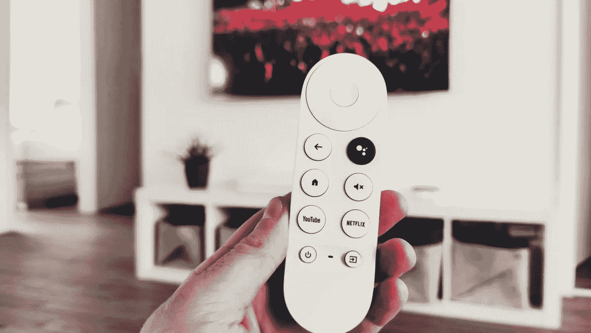

# APIs 解释得很简单…就像它是你的电视遥控器一样！

> 原文：<https://betterprogramming.pub/apis-explained-simply-like-its-your-tv-remote-c7430d654703>

## 随着我们进入 21 世纪 20 年代，API 变得越来越重要。但是你怎么向你的朋友、同事或妈妈解释呢？当然是用比喻了！

达里奥在 [Unsplash](https://unsplash.com/s/photos/tv-remote?utm_source=unsplash&utm_medium=referral&utm_content=creditCopyText) 上的照片

对于那些认识我的人来说，我是一个 API 的人。它们是我的菜。我定期在博客上谈论他们，在会议上演讲，甚至在播客上谈论他们。

它们是软件的组成部分。集成的核心。我们未来的关键。我们需要宣传他们有多伟大。但并不是每个人都懂技术术语。

我读过的每一篇关于 API 的文章都首先将它们描述为一个**应用程序 **P** 编程 **I** 接口。虽然这可能是首字母缩略词所代表的意思，但在解释它实际上是什么时，这并没有走多远。**

超高级的 API 让你在软件中做你可能是也可能不是创造者的事情。为了进一步理解这一点，让我们引入一个大家都知道的概念:电视。

# 提供基本功能的访问权限

电视具有众所周知的既定控制:

*   打开和关闭电源
*   调高和调低音量
*   上下频道
*   更改输入

你今天购买的每台电视都有这些控制。您可以通过电视遥控器执行所有这些命令。您可以使用电视附带的遥控器，也可以购买不同的遥控器。

遥控器将使用已建立的命令在您舒适的沙发上控制电视。你只需点击。

这就是 API 的工作方式。

一个软件有已知的和已建立的特性(API)。软件公司提供了关于哪些功能可用以及如何使用它们的文档。集成商构建自己的软件，与 API 进行通信，让它做自己想做的事情。

在这个比喻中，软件是电视，API 是电源开/关、音量增大/减小等..，集成商是电视遥控器。

# 按照已知标准建造

任何系统的主要目标之一都是降低进入门槛。公司希望尽可能方便地使用他们的产品，让消费者有愉快的体验，告诉他们的朋友，并传播爱。

提供快速学习体验的最简单方法是遵守行业制定的标准。

在我们的电视例子中，音量调高和调低是通用的。电视将期待遥控器发送的特定代码，当它接收到该代码时，它会调整音量。换频道或开关电源也是一样。

一些电视供应商将使用专有代码并决定与众不同，但这样做他们就失去了通过通用遥控器控制电视的能力。这不是获得和维持客户的好方法。

API 也是如此。

有一组既定的 [HTTP 状态代码](https://developer.mozilla.org/en-US/docs/Web/HTTP/Status)，它们定义了 API 在不同场景下应该如何响应。没有说 API 必须使用这些状态代码，但是如果软件开发人员希望集成商的进入门槛低，他们应该使用它们。

仅举一个例子，对于 HTTP 状态代码

*   如果你创建了新的东西，API 应该返回一个 201 状态码
*   如果你更新了一些东西，API 应该返回一个 204 状态码
*   如果你加载了一些东西，API 应该返回一个 200 状态码

同样，如果不遵循标准，API 也可以工作，但是如果遵循标准，学习起来会容易得多。

# 进入系统

你可能会发现，第一次使用新的通用遥控器时，它不会自动控制你的电视。你必须按下那个小`program`按钮，完成一个练习，让你按下电源按钮很多次，直到电视关闭。

遥控器正在通过一组不同的代码来判断哪一个与该品牌的电视进行通信。一旦它知道哪组代码适用于电视，你就可以随时控制它。

API 就是这样工作的。

大多数 API 都有一个认证级别，集成商必须使用这个级别来验证他们就是他们所说的那个人。由于 API 提供了对系统的访问，软件公司希望确保尽最大努力清除任何恶意用户。没有人希望一个糟糕的演员有可能故意把事情搞砸。

输入身份验证。API 有多种不同的方法来验证用户，从 API 密钥到 OAuth 再到基本身份验证。无论 API 使用什么类型的认证，目的都是一样的:阻止坏人，唯一地识别好人。

# 不同种类，不同用途

我们都去过一个朋友的地方，他在咖啡桌上有 7 个不同的遥控器，可以做 7 种不同的事情。这个是控制电视的，这个是调节音箱的，这个是空调的。都是遥控器，但是功能真的不一样。

信不信由你，有不同类型的 API 用于非常不同的事情。

*   REST API 是一个 API，它可以让你轻松、直观地访问应用程序内部的不同资源。
*   一个 [GraphQL](https://graphql.org/learn/) API 是一个不太结构化的 API，它允许调用者询问他们具体想要什么
*   web socket API 是一种类似于推送通知的 API。服务器调用客户端！

就像我们有许多不同遥控器的朋友一样，一个完整的软件解决方案由不同类型的 API 组成，以提供高价值的用户体验。

# 保持客户满意度

留住客户是任何企业成功的关键。你建立了客户忠诚度，你建立了经常性收入，你继续看到增长的结果。

有了我们的电视遥控器，开心的顾客会继续使用遥控器，可能会为他们的另一台电视再买一台，甚至可能会推荐给他们的朋友和家人。那么，如何让他们开心呢？

确保你的遥控器在第一次按键时 99.9%的时间都能正常工作是一个好的开始。同样重要的是，要保证每次按下频道上调按钮时，它都会上调频道，而不会降低音量或改变输入。

使用 API，可靠性和速度是成功的关键。软件公司非常重视确保 API 的高性能。就像你不会使用工作不稳定的遥控器一样，客户也不会使用不可靠的 API。

下次构建 API 时请记住这一点，人们对性能的关注和对功能的关注一样多。为了保持事情的可靠性，调整一下[的能力总是值得的。](/power-tune-your-serverless-api-for-happy-customers-289e83e3938f)

# 结论

API 是现代软件的基础。它们允许消费者与系统进行交互，以提供他们正在寻找的准确的体验。

通过使用像[开放应用编程接口规范(OAS)](https://swagger.io/specification/) 和 HTTP 状态码这样的已建立的标准，软件公司可以汇聚到一种允许开发者开始工作的格式上。不再需要花费很长时间来学习 API 开发的细微差别。

现在每个人都应该至少了解一点 API。从 Alexa 获取今天的天气，到你的手机为你提供餐饮服务，这个世界都是靠 API 运行的。这是当今软件公司关注的焦点。

我坚信[隐喻的力量](https://allenheltondev.medium.com/the-mighty-metaphor-your-new-secret-weapon-in-tech-a483957d72f0)以及它如何帮助推动理解。像解释电视遥控器如何工作一样解释 API 将帮助你的朋友、同事甚至妈妈理解它们。

下一次你有机会的时候，一定要传播消息，帮助你周围的人变得更专业一点。