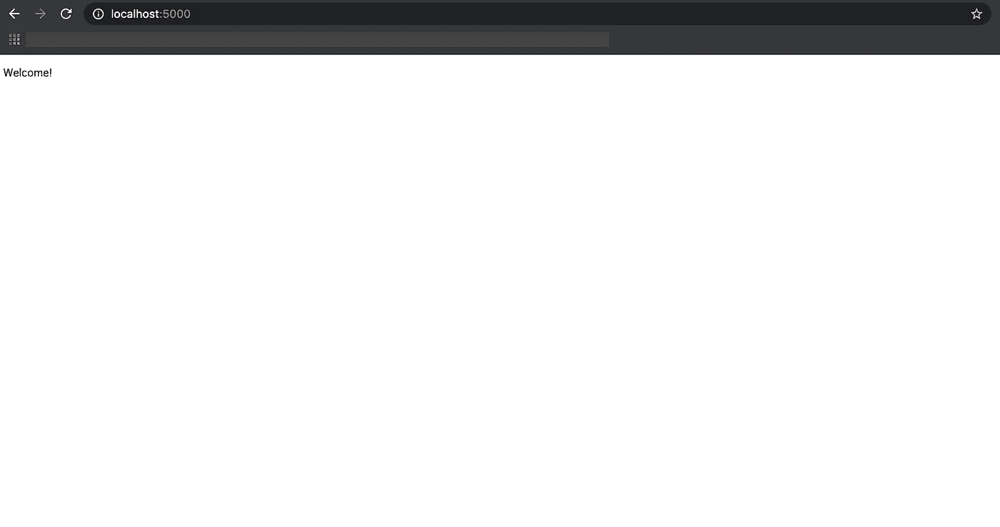
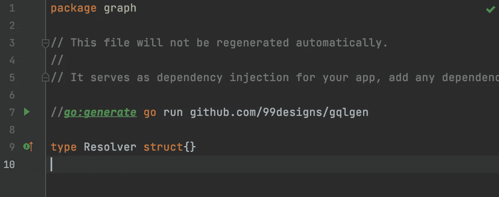
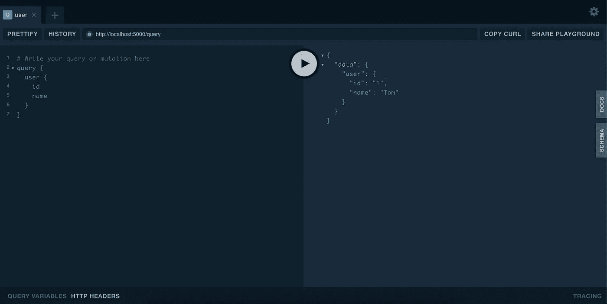
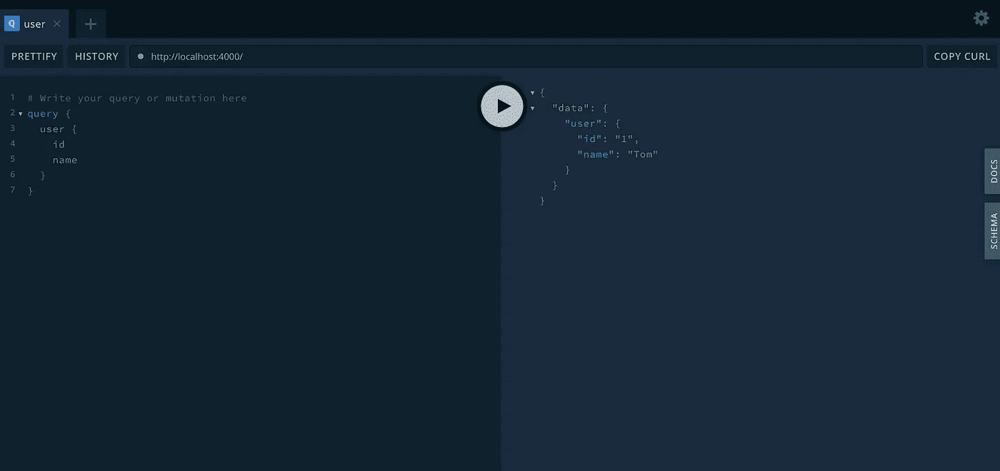

# 戈朗阿波罗联合会

> 原文：<https://betterprogramming.pub/apollo-federation-in-golang-2b5912e774dd>

## 更好的 GraphQL 与 Apollo 在 Go


图片来源:作者

在本文中，我将通过一个简单的例子向您介绍如何在 Go 中实现 Apollo Federation。以下是 GitHub 的最终代码:

[](https://github.com/manakuro/apollo-federation-golang-example) [## mana kuro/Apollo-联邦-golang-示例

### 阿波罗联邦与围棋示例。为 manakuro/Apollo-Federation-golang-example 开发做出贡献

github.com](https://github.com/manakuro/apollo-federation-golang-example) 

# 阿波罗联邦是什么？

[Apollo Federation](https://www.apollographql.com/docs/federation/) 是一种允许将多个 GraphQL 服务组合成一个统一数据图的技术。

Apollo Federation 可以为服务中的所有数据提供一个图表，而无需经历重量级的开发或大型代码库(如整体架构)。

它使我们能够在共享数据上与多个团队协作，并在不相互干扰的情况下将关注点分离到任何功能上。

这种想法基于微服务架构，因此您可以将实现图划分到多个可组合的服务中。

# 阿波罗联盟的优势

阿波罗联邦的优势如下:

*   关注点分离
*   增量迁移
*   前端友好

## 关注点分离

在 Apollo Federation 中，代码可以通过关注点来分离，而不是通过类型。重要的核心类型，如帐户数据，可以分布在不同的服务中，而不必跨越多个相同的类型。

## 增量迁移

Apollo Federation 使您的团队能够从一个单一的 GraphQL 服务器进行增量迁移，这样您就可以一次开发一个功能。

如果您已经使用了模式拼接，您可以按照他们提供的[步骤](https://www.apollographql.com/docs/federation/migrating-from-stitching/)迁移到使用 Apollo Federation。

## 前端友好

即使多个图是分开的，您也可以像 monolithic GraphQL 一样从客户端的单个响应中获取数据。

通过这种方式，Apollo Federation 使客户端开发能够不受任何干扰地继续进行。

# 支持阿波罗联邦的库

目前，以下库为 Apollo Federation 提供了内置支持:

*   Go: [gqlgen](https://github.com/99designs/gqlgen/tree/master/plugin/federation)
*   Java: [联邦-jvm](https://github.com/apollographql/federation-jvm)
*   JavaScript: [阿波罗服务器](https://github.com/apollographql/apollo-server/)
*   PHP:[PHP-graph QL-Federation](https://github.com/pascaldevink/php-graphql-federation)/[WP-graph QL-Federation](https://github.com/wp-graphql/wp-graphql-federation)
*   阿波罗-联邦-露比
*   斯卡拉:[卡利班](https://github.com/ghostdogpr/caliban)
*   Rust: [async-graphql](https://github.com/async-graphql/async-graphql)
*   科特林:[格拉福 QL-科特林](https://github.com/ExpediaGroup/graphql-kotlin)

# 实施概述

在本文中，我们将使用 [gqlgen](https://github.com/99designs/gqlgen/tree/master/plugin/federation) 为联邦图创建一个实现服务。

实施的步骤如下:

*   建立用户服务。
*   成立阿波罗联邦。
*   添加配置文件服务。

# 设置用户服务

首先，我们将创建一个提供用户数据的服务。

为了快速处理 HTTP 请求，我们将使用 [echo](https://github.com/labstack/echo) 包。

## 设置回显

安装回显:

```
go get github.com/labstack/echo/v4
```

添加`service-users/main.go`并启动一个服务器，就像这样:

您可以在`[http://localhost:4](http://localhost:5000:)001`看到欢迎页面:



欢迎

## 设置 gqlgen

接下来我们将建立`gqlgen`。

安装 gqlgen:

```
go get github.com/99designs/gqlgen
```

要安装程序包，请运行以下命令:

```
go run github.com/99designs/gqlgen init
```

这将在您的项目中生成以下布局:

```
├── go.mod
├── go.sum
├── gqlgen.yml
├── graph
│   ├── generated
│   │   └── generated.go
│   ├── model
│   │   └── models_gen.go
│   ├── resolver.go
│   ├── schema.graphqls
│   └── schema.resolvers.go
└── server.go
```

*   `gqlgen.yml` —控制生成文件的配置文件
*   `graph/generated` —运行时包(自动生成)
*   `model/models_gen.go` —所有图形模型的包(自动生成)
*   `resolver.go` —图形解析器的根
*   `schema.graphqls` —您可以随意定制的模式文件
*   `schema.resolvers.go` —解析器实施

`server.go`应该是这个布局中的一个入口点，但是我们将删除它，并将 gqlgen 处理程序放在`main.go`中:

我们将只从服务器提供简单的用户数据。

打开`service-users/graph/schema.graphqls`并定义一个用户模式:

在`service-users/graph/schema.resolvers.go`中添加解析器:

运行`gqlgen`命令:

```
gqlgen
```

它将生成包含模型和运行时代码的包。

**注意:**如果您想在您的项目中使用`go generate`，只需将它添加到`service-users/graph/resolver.go`:

```
//go:generate go run github.com/99designs/gqlgen
```

然后你可以在你的编辑器中运行`gqlgen`，或者只是运行`go generate`命令。



运行服务器，看到`http://localhost:4001/playground`的操场，像这样:



操场

您可以通过查询获得用户数据。

# 建立阿波罗联邦

要在 gqlgen 项目中启用 Apollo 联邦，需要执行以下步骤:

*   启用阿波罗联盟。
*   更新架构。
*   实现网关服务器。

## 启用阿波罗联盟

要启用 Apollo 联盟，请转到`gqlgen.yml`并取消对联盟配置的注释:

```
*# Uncomment to enable federation* federation:
   filename: graph/generated/federation.go
   package: generated
```

## 更新模式

接下来，更新`service-users/graph/schema.graphqls`中的模式:

`@key`将告诉其他联邦服务哪个字段是标识用户的惟一键。

运行`gqlgen`命令:

```
gqlgen 
```

然后你会看到文件`service-users/graph/entity.resolvers.go`。

向`FindUserByID`函数添加实现:

## 实现网关服务器

现在我们已经实现了响应用户数据的联邦服务，我们将设置一个网关服务器来处理所有的联邦服务并接受来自用户的请求。

为了创建网关，我们将使用 Node.js 服务器。

制作`gateway`文件夹。

```
mkdir gateway
```

我们现在的布局是这样的:

```
├── gateway
└── service-users
    ├── go.mod
    ├── go.sum
    ├── gqlgen.yml
    ├── graph
    │   ├── entity.resolvers.go
    │   ├── generated
    │   │   ├── federation.go
    │   │   └── generated.go
    │   ├── model
    │   │   └── models_gen.go
    │   ├── resolver.go
    │   ├── schema.graphqls
    │   └── schema.resolvers.go
    ├── main.go
```

在`gateway`中安装这些依赖项:

```
yarn add @apollo/gateway apollo-server graphql
```

添加`gateway/index.js`:

`@apollo/gateway`可以把多种服务放在一起，充当网关。

为了简化运行命令，向`package.json`添加脚本:

```
"scripts": {
  "start": "node index.js"
}
```

在启动网关服务器之前，确保用户的服务在`http://localhost:4001`运行:

```
go run service-users/main.go
```

启动网关:

```
yarn start
```

进入`[http://localhost:4000](http://localhost:4000,)`你会看到操场:



http://本地主机:4000

# 添加配置文件服务

现在我们准备实现其他服务。

让我们添加一个提供额外用户信息的配置文件服务。

添加`service-profile`，像这样:

```
├── gateway
└── service-profile
  ├── go.mod
  ├── go.sum
  ├── gqlgen.yml
  ├── graph
  │   ├── data
  │   │   └── profiles.go
  │   ├── entity.resolvers.go
  │   ├── generated
  │   │   ├── federation.go
  │   │   └── generated.go
  │   ├── model
  │   │   ├── model.go
  │   │   └── models_gen.go
  │   ├── resolver.go
  │   ├── schema.graphqls
  │   └── schema.resolvers.go
  └── main.go
```

和`service-user`几乎一样，但是我们会添加一些扩展`User`类型的代码。

首先我们将在`service-profile/graph/model/model.go`添加一个新的模型:

在`service-profile/graph/schema.graphqls`中定义`Profile`方案并扩展`User`类型:

在这种情况下，我们使用`extend`关键字和`@key`关键字在另一个服务中扩展现有的`User`类型，指定相同的关键字字段作为其主键。

`@external`关键字表示该字段源自另一个服务。

然后让我们运行`service-profile`中的`gqlgen`:

```
gqlgen
```

它将生成一些文件的输出。

接下来，转到`service-profile/graph/schema.resolvers.go`并添加一个实现:

`Profile`函数获取另一个服务通过网关传递的上下文和用户对象，并返回配置文件数据。

接下来，转到`service-profile/graph/entity.resolvers.go`并编写一些代码，就像这样:

`FindUserByID`应该使用给定的`id`返回一个`User`实体的表示。

现在我们准备发射了。

转到`gateway/index.js`并将配置文件服务添加到`serviceList`:

运行配置文件服务器:

```
go run service-profile/main.go
```

然后让我们在`[http://localhost:4000](http://localhost:4000:)`进行测试:


如您所见，配置文件服务扩展了`User`类型，并将配置文件数据合并到一个响应中。

# 结论

现在，我们可以使用 Apollo Federation 在一个数据图中实现多个服务。

为了模式的灵活性和组合的稳定性，您可以使用 Apollo Studio 提供的托管联合特性，该特性使您能够安全地验证每个模式、部署和观察对图形的更改。

我将在以后的另一篇文章中讨论这个问题。

如果你想试试我们讨论过的那个，可以在 GitHub 上找到我的[代码库。](https://github.com/manakuro/apollo-federation-golang-example)