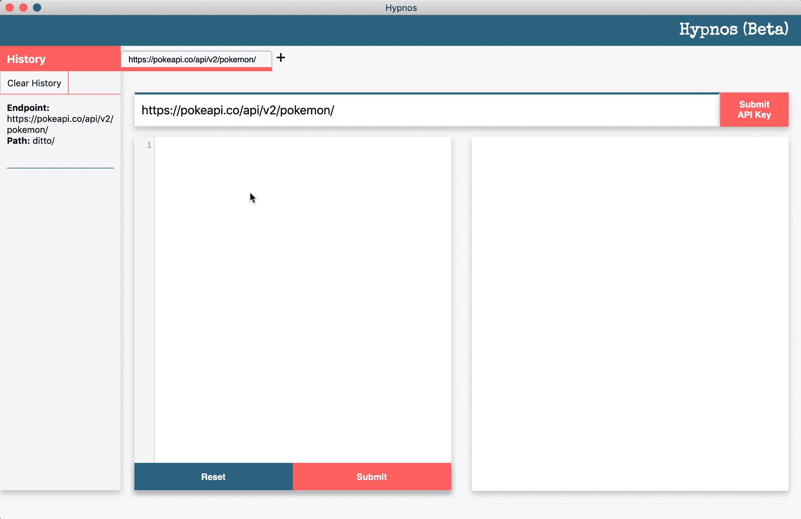

# 具有 RESTful APIs 的 GraphQL 的威力——来见见修普诺斯

> 原文：<https://betterprogramming.pub/apollo-graphql-rest-api-hypnos-f7a7dfd3df47>

## 桌面应用程序，用于沙盒 GraphQL 类调用和对 RESTful API 端点的响应

很难在不谈论其他的情况下讨论 GraphQL 或者 T2 阿波罗 T3。自 2016 年成立以来，Apollo 已经成为[在应用程序中利用](https://techcrunch.com/2019/06/12/apollo-raises-22m-for-its-graphql-platform/) GraphQL 的领先客户之一。

阿波罗宣称采用其技术的工程团队包括 Airbnb、奥迪、美国消费者新闻与商业频道和 Expedia。

GraphQL 因其速度和声明式查询而受到称赞；与 REST APIs 不同，GraphQL 查询将客户端请求的内容准确地返回给单个端点，从而提高了互联网连接不良或设备功能较弱的客户端的性能。

但是要实现查询语言，就需要对 API 进行彻底的修改，以适当地服务于 GraphQL 请求。为了测试查询，开发人员必须开发一个快速应用程序或编写一个 GraphQL 后端。

现有的游乐场是有用的，但它们可能没有对开发者有意义的数据或错误。虽然 GraphQL 非常强大，但错误不是描述性的，即使是在 Apollo 客户端层。

这就是修普诺斯的用武之地。

# **什么是修普诺斯？**

修普诺斯是一个端点测试者，利用 Apollo 的 link-rest 包对经过认证或未经认证的 RESTful APIs 进行 GraphQL 结构的查询。

当进行适当的查询时，屏幕上会呈现一个响应对象，其中包含客户机指定的字段。

# **它是如何工作的？**

使用 link-rest 包，Apollo 客户机向给定的 API 和路径发出获取请求。在接收到响应时，客户机解析响应以构造类似于从 GraphQL 端点返回的数据。

虽然底层的操作是通过对 REST APIs 的正常读取，而不是一个繁琐的 JSON 格式的对象，其中的字段与客户端无关，但数据是根据查询规范进行解析的。

# **修普诺斯如何帮忙**

Apollo 本身并不以声明方式处理错误。它确实允许开发者以他们选择的任何方式用 [apollo-link-error](https://www.apollographql.com/docs/react/features/error-handling/) 包捕捉错误。

然而，如果 GraphQL 错误没有被正确写入(例如，在前端)，则反馈可能是不清楚的。修普诺斯捕捉语法错误，并清楚地描述查询构造中的错误在哪里。

在修普诺斯运行查询

对于 GraphQL，如果一个查询被正确地构造到一个有效的端点，它将总是运行并返回信息和一个`200`状态代码，即使声明的查询字段返回 null。

为了帮助解决这个问题，修普诺斯解析响应数据来检查空值。由于 REST APIs 可能有意使用空值，因此仍然会显示整个响应，以及存在空值的堆栈跟踪。

修普诺斯团队([狄龙·加勒特](https://github.com/dillon-garrett)、[索菲·奈](https://github.com/SophieNye)和[威尔·罗宾逊](https://github.com/wrobinson91))对他们的第一次发布感到非常自豪。如果你对修普诺斯(v0.0.1-beta)感兴趣，请查看我们的 [GitHub 页面](https://github.com/oslabs-beta/hypnos/)，并[试用我们的应用](https://github.com/oslabs-beta/hypnos/releases)。