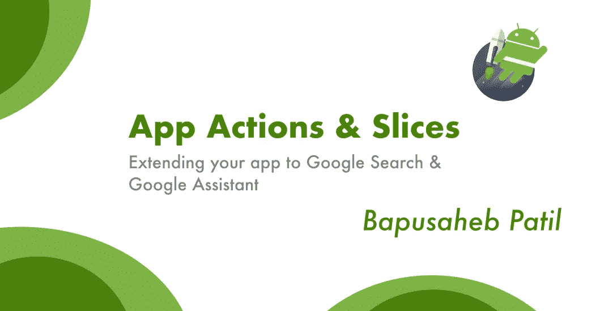
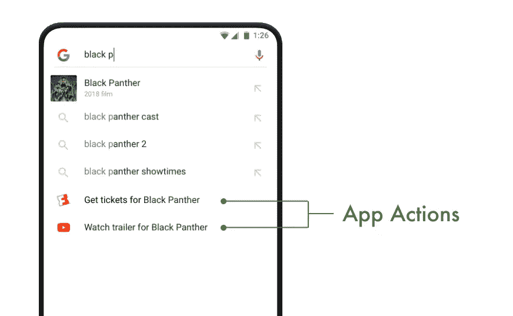
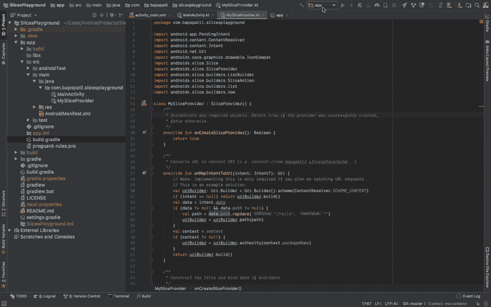
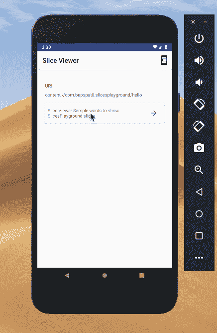

# 应用程序操作和切片——扩展您的应用程序以使用谷歌搜索和谷歌助手

> 原文：<https://betterprogramming.pub/app-actions-slices-extending-your-app-to-google-search-google-assistant-30dd803d4e79>

## 如何为你的应用程序创建一个简单的切片，并让用户在应用程序之外用更丰富的 UI 执行任务



Bapusaheb Patil 的横幅[Google 的 Jetpack 标志](https://bapspatil.com)

这篇文章是写给刚刚开始使用[应用动作](https://developer.android.com/guide/actions/)和[切片](https://developer.android.com/guide/slices/)的开发者的。

请注意，在写这篇文章的时候，Google 还没有提供创建应用程序的功能。这里有一张[表格](https://docs.google.com/forms/d/e/1FAIpQLSfzg7DrFtD8S_tHrYYoWpmsfFzLuduukoQQY6A2AtHsxTHgKg/viewform)，你可以填写它，以便在它可用时得到通知。

尽管如此，我们可以创建切片，这也是本文的重点。

但首先，我们来谈谈什么是 App 动作和切片，以及它们之间的关系。

# 什么是 App 动作？



截图来自官方 [App 动作页面](https://developer.android.com/guide/actions/)

**应用动作**是一种通过让用户在你的应用之外执行动作*来为你的用户提供更丰富用户体验的方式。这可能是在谷歌搜索，你的安卓启动器，甚至谷歌助手。如果你搜索一部电影，它看起来就像这里的截图。注意这里的**最后两个搜索结果**；都是 App 动作。*

让我们考虑另一个例子:你可以长按 Home 键打开谷歌助手，你需要做的就是开始输入“工作”，然后它会显示一个结果，点击后直接为你订购一辆优步。

相比之下，你通常需要做些什么来获得优步，你已经让你的生活变得更容易了——可能是因为用应用程序操作做同样的任务需要大约 8 秒钟，而用通常的方法会花更长的时间！

# 什么是切片？

应用程序动作和切片这两个概念一开始很难区分。

**基本上，你可以说切片是超级充电的 App 动作。**

切片是显示在你的应用程序之外的小块用户界面，它们使你的用户能够从你的应用程序中看到和访问某些**交互**、**图像**、**文本**，甚至**视频**，从而丰富你的应用程序操作！

切片有**单机**和**互动**。它们为用户提供了他们可以在完整的应用程序体验之外执行的相关操作，即用户不必每次都打开应用程序。

# 让我们开始构建我们的第一个切片…

你需要在手机上安装 **Android Studio 3.2** 和**slice viewer**；这个可以从 [**这里下载**](https://github.com/googlesamples/android-SliceViewer/releases) 。另外，请注意，本教程将在科特林。

以下是本文的示例应用程序:

[](https://github.com/bapspatil/SlicesPlayground) [## bapspatil/slice playground

### 一个用于玩 Android 切片的游乐场存储库。-bapspatil/slice playground

github.com](https://github.com/bapspatil/SlicesPlayground) 

## 步骤 1:添加切片依赖关系

将以下几行添加到应用程序级`build.gradle`文件的依赖项中:

```
implementation "androidx.slice:slice-builders-ktx:1.0.0-alpha6"
implementation "androidx.annotation:annotation:1.0.0"
```

## 步骤 2:创建一个 SliceProvider 来处理所有切片

您将需要一个`[SliceProvider](https://developer.android.com/reference/androidx/slice/SliceProvider)`类来向 Android 操作系统提供应用程序中的所有片段。您创建的切片由一个`[Uri](https://developer.android.com/reference/android/net/Uri)`标识，您的`SliceProvider`根据它接收到的`Uri`提供切片。

为此，点击**文件>新建>其他>切片提供器**。

您将看到一个包含以下字段的对话框:

*   **类名称** —这将是您的`SliceProvider`类的名称。在这个例子中，是`MySliceProvider`。
*   URI 当局, —这是我建议与你的包裹名称保持一致的东西。在这个例子中，是`com.bapspatil.slicesplayground`。
*   **主机 URL** —这将是您的域名。在本例中，是[bapspatil.com](http://bapspatil.com)。
*   **URI 当局** —这是指主机 URL，它是从主机 URL 映射到我们的`SliceProvider`的东西。你现在可以把它设置为`/hello`。

这一步将一个`provider`添加到您的`AndroidManifest.xml`文件中:

## 步骤 3:在您的 SliceProvider 中实现 onBindSlice 方法

`[onBindSlice](https://developer.android.com/reference/androidx/slice/SliceProvider.html#onBindSlice(android.net.Uri))`方法返回一个`[Slice](https://developer.android.com/reference/androidx/slice/Slice)`，它被作为参数传递给`onBindSlice`的`Uri`识别。我们需要实现`onBindSlice`方法来为特定的`Uri`创建一个`Slice`，如下所示:

## 步骤 4:为切片创建 SliceAction

在上面的`onBindSlice`方法实现中，我们通过调用方法`createActivityAction()`初始化了一个变量`activityAction`。这将返回一个`[SliceAction](https://developer.android.com/reference/androidx/slice/builders/SliceAction)`。

A `SliceAction`用于处理`Slice`上的点击，如果不将`row`中的`primaryAction`设置为 a `SliceAction`，即不将`null`的值设置为`primaryAction`，则`Slice`不会显示。

下面是我们如何创建一个`SliceAction`:

我们现在已经完成了切片的创建！

# 我如何查看我的切片？

一旦你在手机上安装了 [SliceViewer 工具](https://github.com/googlesamples/android-SliceViewer/releases)，你需要在 Android Studio 中添加一个新的**运行配置**来测试你的切片。

1.  点击**运行>编辑配置…**
2.  点击+按钮，选择**安卓应用**，在**名称**字段将配置名称设置为`slice`。
3.  在**启动选项**下，将**启动**的值从下拉列表更改为 **URL** ，并将 **URL** 设置为`slice-content://com.bapspatil.slicesplayground/hello`，这是您在`AndroidManifest.xml`文件中的权限名称，后跟您想要查看的切片的`Uri`路径。



仅此而已。连接您的设备，选择`slice`配置后点击**运行**。然后，根据屏幕上的提示，允许 SliceViewer 查看您的切片，并查看它的运行情况！



本文中演示应用程序的源代码可以在这里找到:

[](https://github.com/bapspatil/SlicesPlayground) [## bapspatil/slice playground

### 一个用于玩 Android 切片的游乐场存储库。-bapspatil/slice playground

github.com](https://github.com/bapspatil/SlicesPlayground) 

感谢阅读！