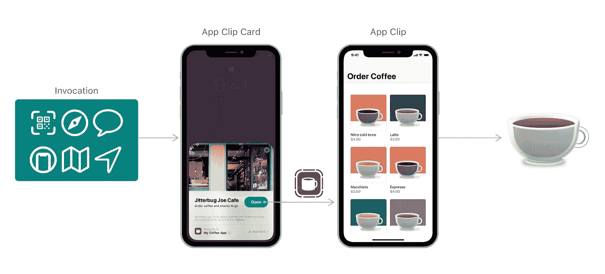
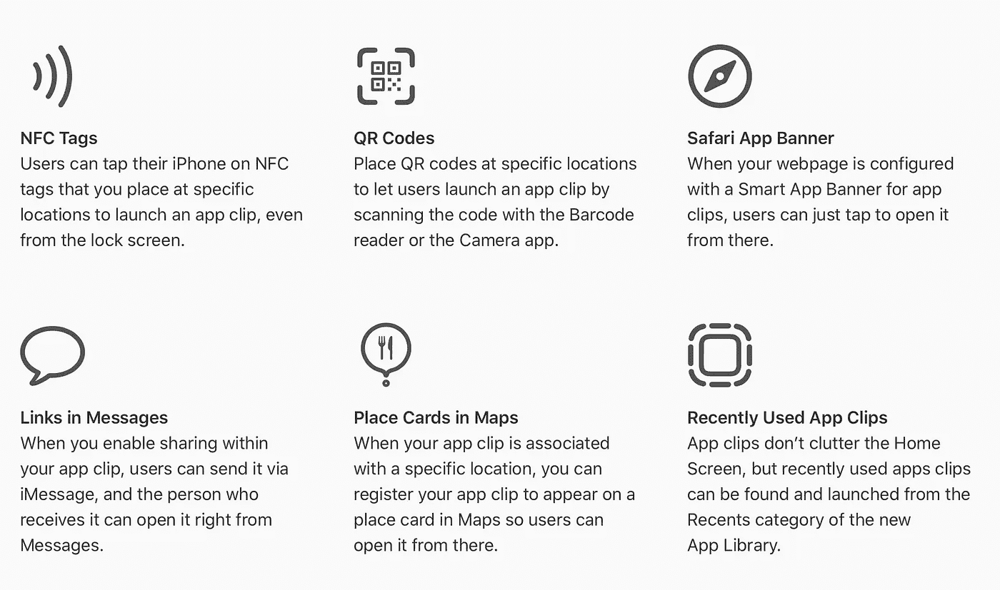
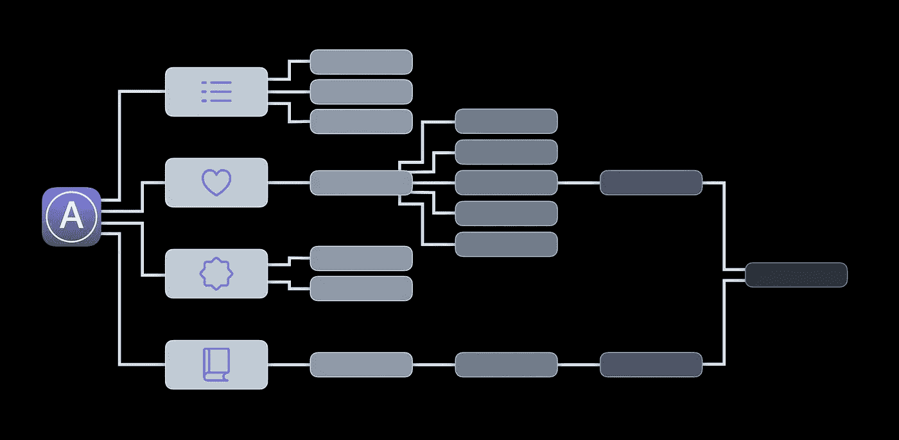
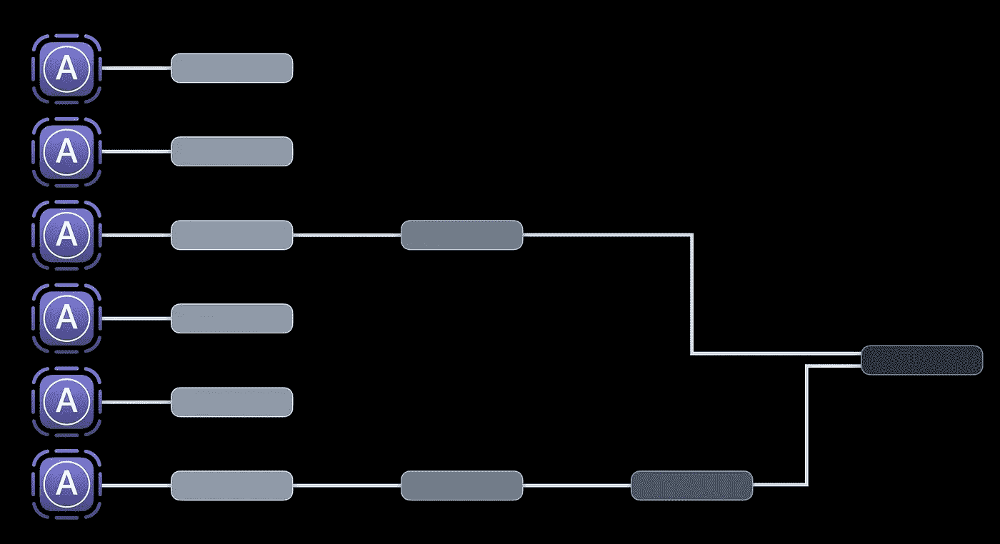
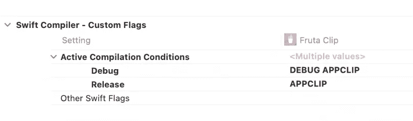
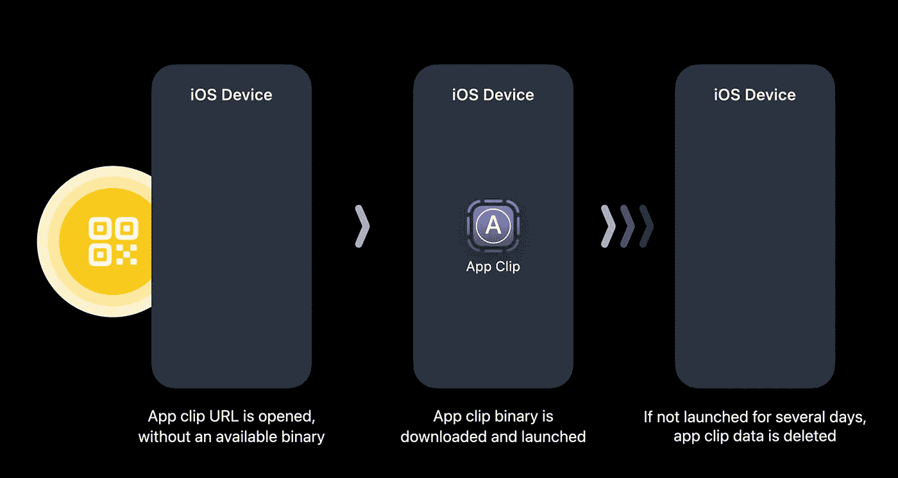
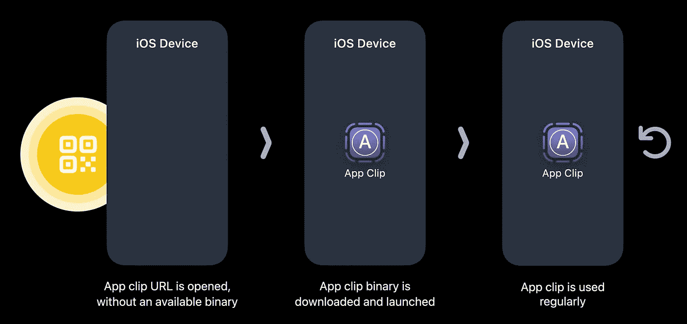
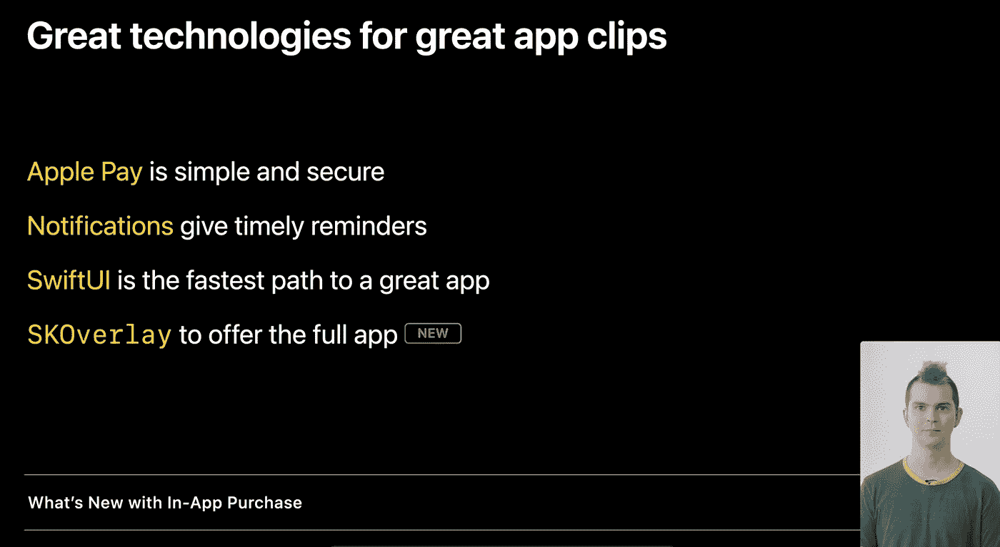

# iOS14 中的应用剪辑——即时移动应用

> 原文：<https://betterprogramming.pub/app-clips-in-ios14-swift-wwdc20-e10bb4280259>

## WWDC20 Swift 会议演练

通过[苹果开发者文档](https://developer.apple.com/documentation/app_clips)的说明

*本文是 WWDC20 届***的简短文字总结。**

*iOS 14 中引入了应用剪辑，通过几乎即时下载应用的一部分来完成一些任务，帮助更多人在旅途中发现应用。*

*与应用程序不同，应用程序剪辑不能从主屏幕打开。他们推出了应用程序剪辑网址，通过应用程序剪辑而不是浏览器来处理。这些 URL 可以嵌入到`NFC`标签中，处理成二维码/app-clip 码(可以用`NFC`，FYI 的力量扫描或点击)，或者只是通过 iMessages 转发。*

*App Store 提交的应用程序剪辑必须非常小，小于 10 MB。以前，应用程序在使用前需要安装、登录和设置。应用程序剪辑使人们可以扫描二维码，几乎立即下载你的应用程序剪辑来使用它，使它成为一个整体更流畅的体验。*

*对于开发人员来说，应用程序剪辑需要在 Xcode 中创建第二个应用程序目标，其中包含处理应用程序剪辑体验所需的所有代码。这是用 SwiftUI 或 UIKit 编写的原生 Swift 代码，意味着您可以将应用程序现有代码的一部分用于应用程序剪辑。*

**

*应用程序剪辑是应用程序的附加功能，这意味着您需要一个应用程序来制作应用程序剪辑。应用程序剪辑不能自行提交到应用程序商店。它们需要作为应用审查流程的一部分提交。*

*iOS 14 中的应用程序剪辑和应用程序是互斥的——下载应用程序剪辑而不下载整个应用程序是可能的，这是整个要点。但是，如果已经安装了应用程序，应用程序剪辑 URL 将打开应用程序的相关部分，而不是下载应用程序剪辑。*

*一个应用程序只能有一个应用程序剪辑，可以配置 URL 来打开应用程序的特定部分。*

# *应用程序剪辑的应用程序设计*

**

*典型应用图 WWDC20“探索应用剪辑”会议的 04:38*

*与应用程序不同，应用程序包含一个标签栏控制器，允许用户在不同的屏幕之间导航，应用程序剪辑应该省略像标签栏这样的顶级导航元素，而是将用户导向单个流程，从而允许用户根据 URL 执行特定的任务。*

**

*对不同的流使用多个 URL 的相同应用程序剪辑 WWDC20“探索应用程序剪辑”会议的 06:00*

*对于多种体验，可以有多个 URL——每个 URL 打开一个流线型的流程。*

*此外，应用程序剪辑对用户位置的依赖性可以被推迟。例如，如果用户试图从实体店结账，而不是向用户询问他们的位置来定位他们所在的商店，则可以配置该商店的 URL，以便应用程序剪辑知道用户在哪个商店。*

*在“身份”检查器的“目标成员资格”下，应用程序和应用程序剪辑之间通用的代码部分可以同时选择应用程序和应用程序剪辑目标。对于共享图像资源，您可以创建一个共享资源目录，并对目标成员资格进行类似的修改，以确保应用程序和应用程序剪辑都使用同一共享文件夹中的图像。*

*你可能在你的应用程序中需要一个类，但在你的应用程序剪辑中不需要，如果两者共有的代码使用这个类，就会导致构建错误。
在这种情况下，您需要通过在构建设置> Swift 编译器-定制标志部分为调试和发布创建一个定制条件，有条件地编译出对该类的引用。*

**

*[WWDC20“探索应用程序剪辑”会议的 10:00](https://developer.apple.com/videos/play/wwdc2020/10174/)*

*然后，我们可以有条件地编译出对对象的引用，这些引用不会包含在应用程序剪辑中，方法是:*

*`#if !APPCLIP
//Code which runs on app but not on appClip
#endif`*

*App clips 可以使用 iOS SDK 中的所有框架，但是对敏感数据的访问受到限制。像 HealthKit 这样的框架在作为应用程序剪辑运行时，对于`isHealthDataAvailable`(布尔表示访问健康数据)将总是返回负值。因此，在尝试使用数据之前，主应用程序应该检查对数据的访问。如果做到了这一点，应用程序剪辑将运行良好。*

*一旦用户使用应用程序剪辑并安装完整的应用程序，就可以通过共享数据容器将数据从应用程序剪辑自动填充到完整的应用程序，从而实现无缝体验。虽然这不是强制的，但是强烈推荐。*

# *关于 App-Clip 生命周期的更多信息*

*应用程序剪辑在需要时运行-当应用程序未安装且应用程序剪辑体验打开时。一段时间不活动后，它们会自动与该应用程序剪辑相关的数据一起删除。应用程序片段也不包括在 iCloud 备份中。*

**

*不活动后，可以随时删除应用程序剪辑。储存的数据也会随任何钥匙串数据一起被删除。因此，这种存储的数据应该被认为是临时缓存的数据，除非数据存储在共享数据容器中，并且用户还在应用剪辑被删除之前安装了完整的应用。*

*如果用户经常使用该应用程序剪辑，则该应用程序剪辑可能永远不会被删除。之前会话中的缓存数据可以在下一个会话中使用，例如，如果应用程序剪辑是为在当地实体店购物而设计的，则过去的订单可以用于推荐未来的订单。*

**

# *App-Clip 体验*

*苹果希望应用程序剪辑快速、直截了当，尽可能减少隐私问题，并尽可能减少障碍。*

*因此，获取个人数据是有限的。如果需要访问受限数据，应用程序剪辑可以提示用户下载完整的应用程序。*

*对于支付，建议使用 Apple Pay，因为用户不需要输入卡的详细信息或担心其安全性。*

*注册应该是可选的，因为用户将被迫输入他们的详细信息，而不是享受体验。相反，它可以在用户完成体验后以“以苹果身份登录”的方式呈现。*

**

*WWDC20“探索应用程序剪辑”会议的 18:12*

*要将 app clip 用户转换为安装完整应用，可以使用`SKOverlay`—或者在 SwiftUI 应用的情况下使用 App Store 覆盖修改器。*

# *总结*

*iOS 14 中引入的应用程序剪辑是新用户体验应用程序一部分的好方法。它们不会显示在主屏幕上，但可以通过 iMessage 上的 URL、苹果的 app-clip 代码或 Safari 上的横幅来调用。*

*一个应用程序只能有一个应用程序剪辑；然而，它可以通过不同的 URL 显示多种体验。无论是在 SwiftUI 还是 UIKit 中编码，您都可以拥有与应用程序剪辑相同的应用程序代码，这只是应用程序的一个扩展。将应用程序剪辑提交给审核流程时，其大小应小于 10 MB。*

*应用程序的小尺寸，加上预定义的流程，使用户可以轻松流畅地体验应用程序的一部分，从而让您有机会将他们转换为应用程序安装。*

# *资源*

*   *[苹果开发者文档](https://developer.apple.com/documentation/app_clips)*
*   *[“设计优秀的应用程序剪辑”视频](https://developer.apple.com/videos/play/wwdc2020/10172)*
*   *[“配置并链接您的应用程序剪辑”视频](https://developer.apple.com/videos/play/wwdc2020/10146)*