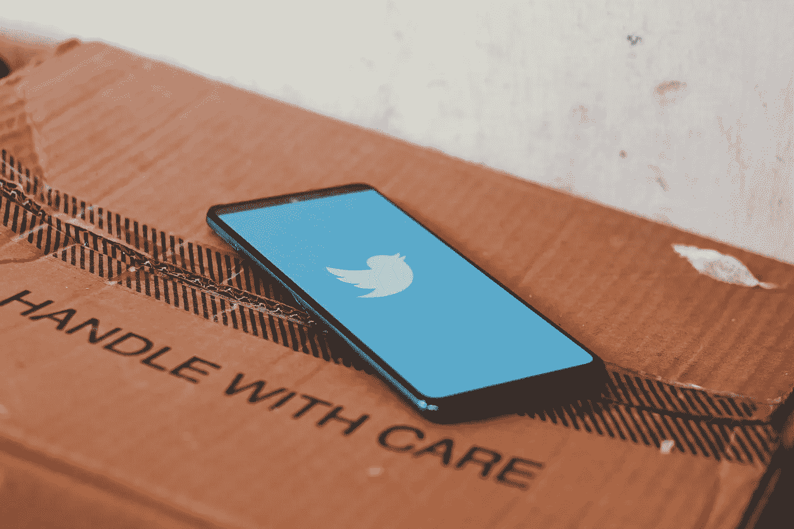
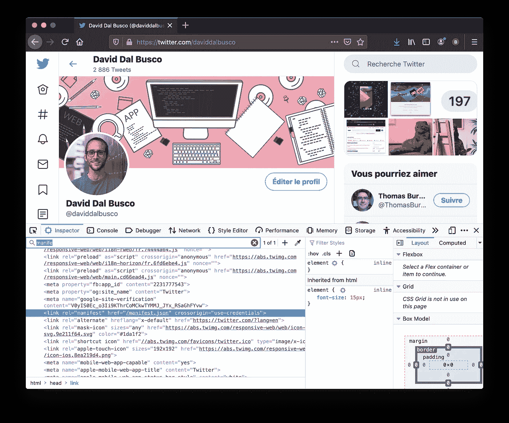
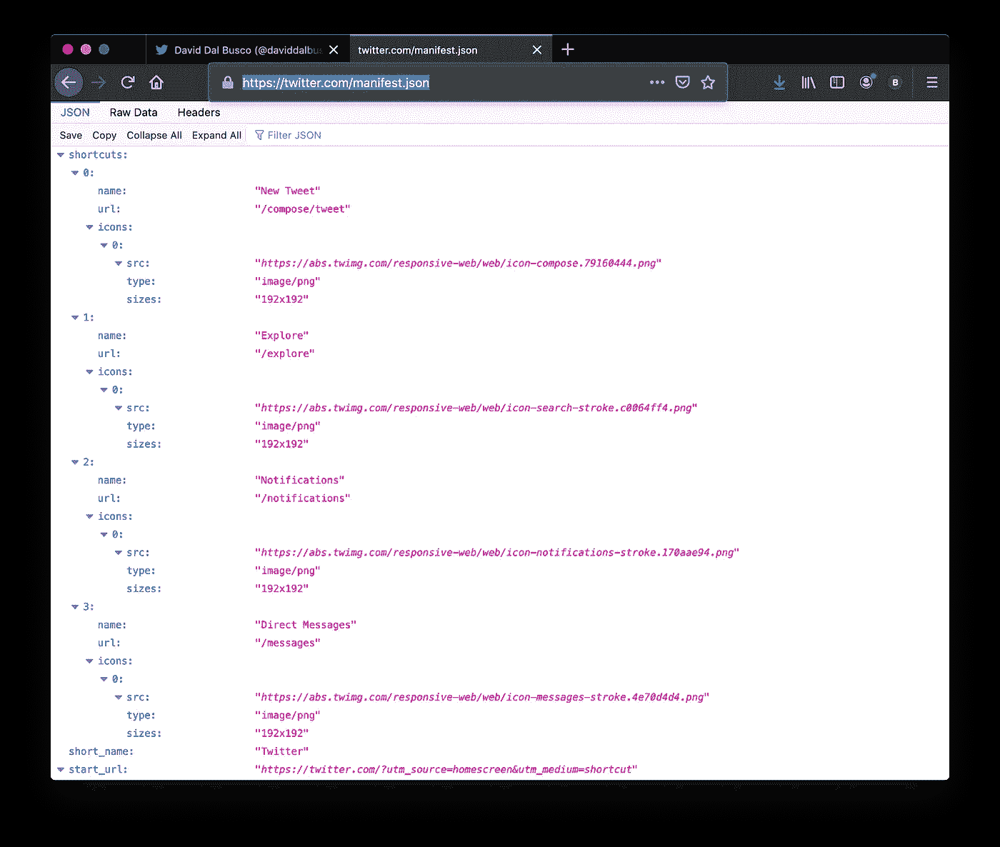
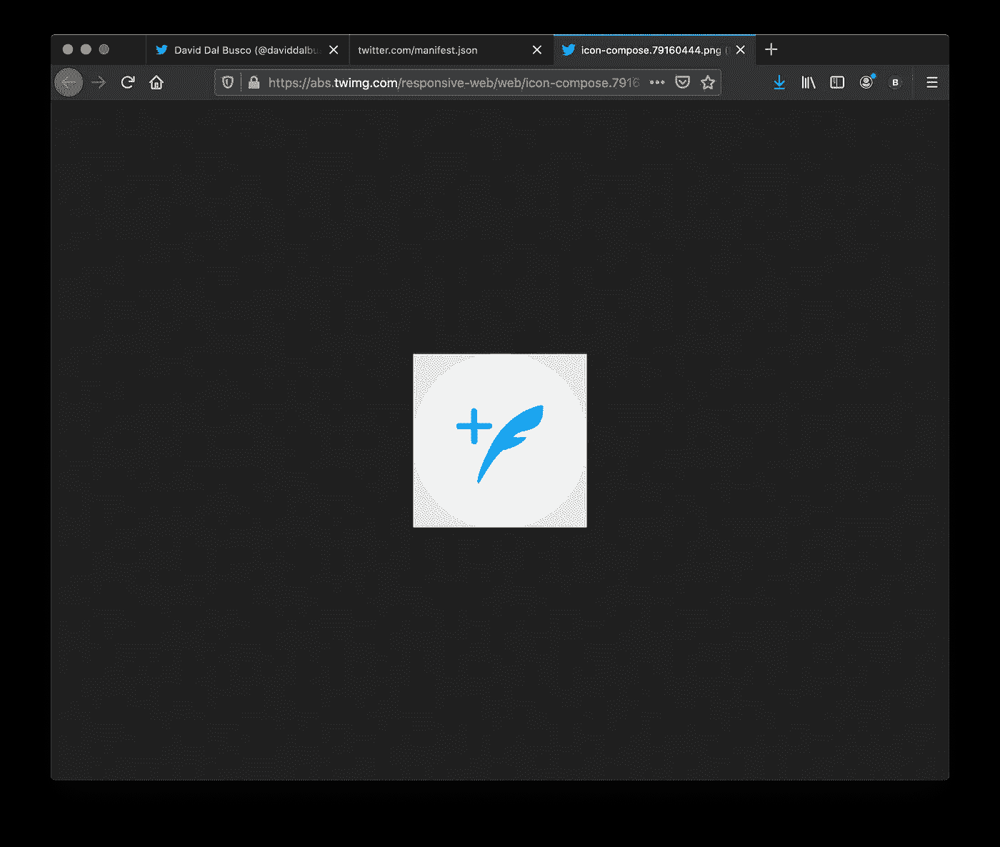
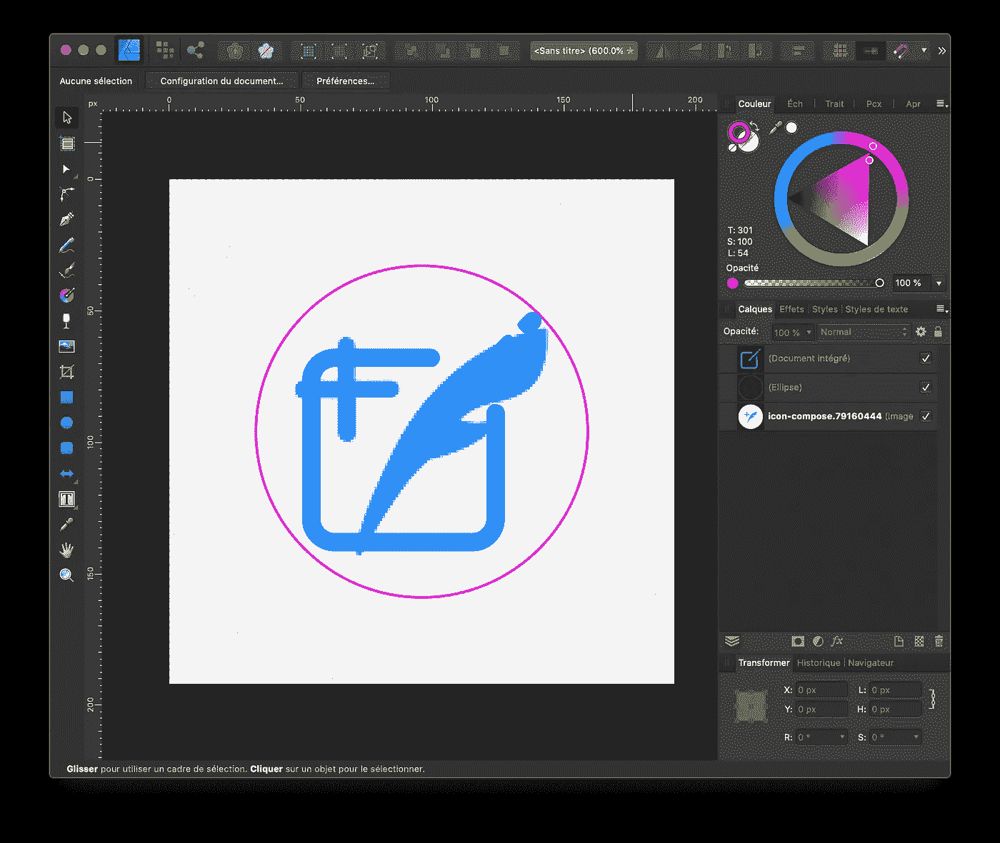
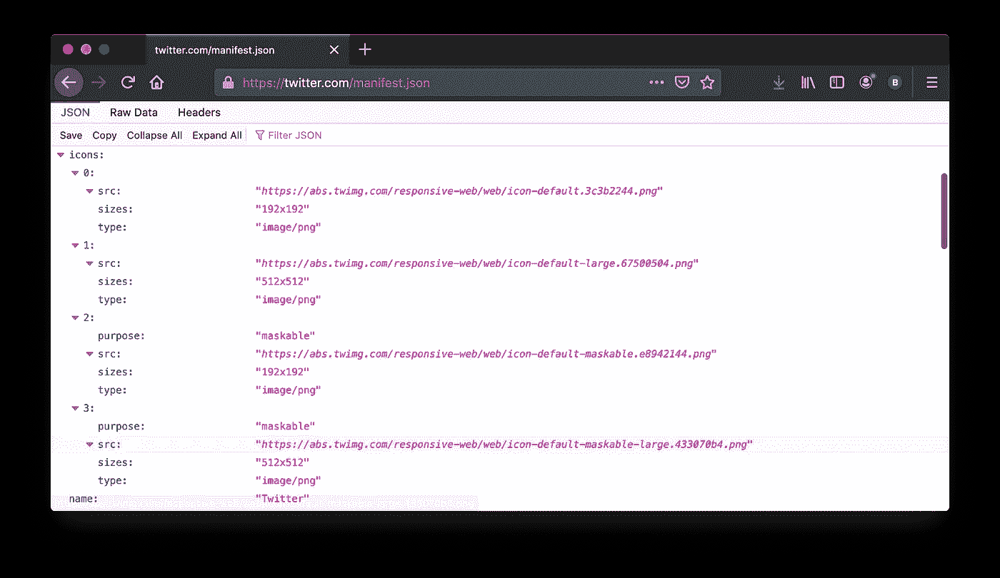
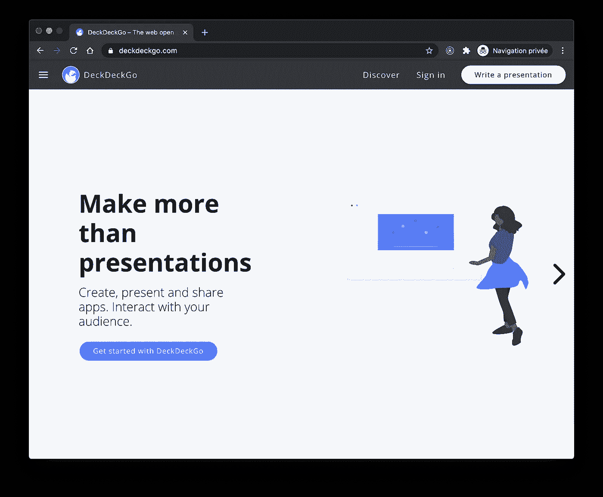

# 应用程序快捷方式和可屏蔽图标:像玩 Twitter 一样玩

> 原文：<https://betterprogramming.pub/app-shortcuts-and-maskable-icons-play-it-like-twitter-c7da9b7e90fa>

## 以 Twitter 为例，为你的渐进式网络应用添加应用快捷方式和可屏蔽图标



由 [Ravi Sharma](https://unsplash.com/@ravinepz?utm_source=unsplash&utm_medium=referral&utm_content=creditCopyText) 在 [Unsplash](https://unsplash.com/s/photos/twitter?utm_source=unsplash&utm_medium=referral&utm_content=creditCopyText) 上拍摄的照片

我们最近在 [DeckDeckGo](https://deckdeckgo.com) 中添加了应用快捷方式和可屏蔽图标。当我在阅读实现这些特性的教程时，我遇到了一些关于设计的问题，例如:

*   安全区有多大？
*   快捷图标的颜色应该是对比色吗？
*   快捷图标是可屏蔽图标还是常规图标？
*   可屏蔽图标和常规图标能一起找到位置吗？

虽然我可能能够通过更仔细地阅读相关的博客帖子和文档来解决这些问题，但我有了在这种情况下也能很好地工作的想法:做一个模仿者。

我每天都在使用的 Twitter 是进步网络应用的一个很好的例子。此外，我猜他们有一些预算投资在 UX 和设计开发。因此，为什么不使用他们的最佳实践来释放我们的功能，而不是重新发明轮子呢？

谢谢你，推特！

# 先睹为快

在这篇文章中，我分享了我们用来将应用程序快捷方式和可屏蔽图标添加到我们的编辑器中进行演示的答案和资源。

# 应用快捷方式

现在 [Chrome 版本 84](https://developers.google.com/web/updates/2020/07/nic84) 和[微软 Edge](https://geekermag.com/microsoft-edge-pwas-app-icon-shortcut-menu/) 都支持 App 快捷方式。

此外，Google Play 中提供的渐进式网络应用程序也支持快捷方式。我们正在使用 [PWA 生成器](https://www.pwabuilder.com/)将我们的 PWA 转换为商店要求的 TWA 格式。他们最近升级了他们的工具，也自动支持这些链接，所以再次感谢您的 PWA builder 团队的改进。

关于 [web.dev](https://web.dev/app-shortcuts/) 的教程是一个很好的入门资源。它描述了可以或者应该提供哪些选项来为 web 应用程序添加这样的快捷方式。

总之，它使用一个可以添加到`web app manifest`中的`shortcuts`列表。例如，我们可以创建如下两个快捷方式:

```
{
  "name": "Player FM",
  "start_url": "https://player.fm?utm_source=homescreen",
  …
  "shortcuts": [
    {
      "name": "Open Play Later",
      "short_name": "Play Later",
      "description": "View the list of podcasts",
      "url": "/play-later?utm_source=homescreen",
      "icons": [{ "src": "/icons/play.png", "sizes": "192x192" }]
    },
    {
      "name": "View Subscriptions",
      "short_name": "Subscriptions",
      "description": "View the list of podcasts you listen to",
      "url": "/subscriptions?utm_source=homescreen",
      "icons": [{ "src": "/icons/subs.png", "sizes": "192x192" }]
    }
  ]
}
```

除了技术问题，我还问自己哪种颜色最适合这些图标。我们的标志是蓝色的，我也应该提供蓝色图标吗？还是应该用对比色？还是取自我们调色板和身份的其他颜色？

这就是 Twitter 第一次出手相救的地方。

我首先查看 Twitter 的 HTML 源代码，找出他们的`web app manifest`的 URL。



找到后，我打开了[货单](https://twitter.com/manifest.json)文件，看了一下他们的`shortcuts`部分。它们提供了四种快捷方式:“新推”、“探索”、“通知”和“直接消息”



最后，我打开这些图标来回答我的问题:是的，它们没有使用它们的原色作为快捷方式图标的背景，而是使用对比色。他们用原色作为符号的颜色。我还注意到对比色不是白色而是浅灰色(#F5F5F5)。

此外，它也回答了另一个问题，我问自己:不，快捷图标是不可屏蔽的。这些是常规图标，因此可以是圆形的。



当我准备用这些颜色完成我的图标时，一个新的问题出现在我的脑海里:安全区域呢？

为了解决这个新问题，我下载了 Twitter 的快捷图标，将其导入到我的设计工具( [Affinity Designer](https://affinity.serif.com/fr/designer/) )中，并调整了我的大小，使其匹配相同的大小。告诉过你——为什么要重新发明轮子？



就这样。我的图标已经可以作为快捷方式添加了。

## 摘要

这不是什么应用快捷方式的总结，而是 Twitter 对我的相关问题所做的总结:

*   使用对比色作为快捷方式图标的背景，使用你的主要颜色作为符号。
*   对于这些背景，可以使用浅灰色(#F5F5F5)。
*   快捷图标是常规图标，192x192 PNG。它们可以是圆的。

# 可屏蔽图标

*Maskable* 是一种图标格式，在支持平台上使用自适应图标。换句话说:为你的渐进式网络应用程序提供一个图标，根据设备的期望，它可以显示为圆形、圆角矩形、正方形、水滴形或圆柱形。

web.dev 团队再次提供了一个关于这个主题的方便的教程[甚至链接了一些不错的工具，比如](https://web.dev/maskable-icon/) [Maskable.app](https://maskable.app/) ，它帮助创建这样的图标。

当我为我们的编辑开发这些图标时，尽管一开始一切看起来都很清楚，但在某些时候，我不确定是只提供可屏蔽的图标，还是也提供常规的图标。如果两者都可以提供，那么如何指定`web app manifest`的`purpose`字段呢？

值得注意的是，我不确定处理这个问题的最佳方式，因为当我进行第一次测试时，我注意到 Chrome 在其标签栏中显示了我们超级酷的方形标志，在我看来，与圆形相比，或者像以前一样，与我们闪亮的气泡相比，它不再那么可爱了。

Twitter 再一次出手相救。我检查了他们的清单，注意到他们确实提供了四个图标。



我注意到他们提供了两对图标，常规的和可遮盖的，都有两种尺寸，192x192 和 512x512。更重要的是，他们只为可屏蔽的人提供了`purpose`场。

我以同样的方式设定我们的定义。我很高兴地注意到，我的 Android 手机上仍然使用可屏蔽的图标，我们可爱的标志又以我想要的形式出现在 Chrome 标签栏中。



## 摘要

这不是如何应用和创建可屏蔽图标的总结，而是 Twitter 对我的相关问题所做的总结:

*   是的，可以提供常规图标和可屏蔽图标。
*   如果是，那么`web app manifest`中`icons`的字段`purpose`应该只为可屏蔽的分别指定；正规的不一定要有`purpose`。

# 总共

因为我们是开源的，让我指出这样一个事实，你可以在我们的 repo 中找到这些相关的[图标](https://github.com/deckgo/deckdeckgo/tree/master/studio/src/assets/favicon)以及我们下面的 [web 应用清单](https://github.com/deckgo/deckdeckgo/blob/master/studio/src/manifest.json)。

```
{
  "name": "DeckDeckGo",
  "short_name": "DeckDeckGo",
  "display": "standalone",
  "theme_color": "#ffffff",
  "background_color": "#3a81fe",
  "scope": "/",
  "start_url": "/",
  "orientation": "portrait",
  "icons": [
    {
      "src": "/assets/favicon/icon-default-192x192.png",
      "sizes": "192x192",
      "type": "image/png"
    },
    {
      "src": "/assets/favicon/icon-default-512x512.png",
      "sizes": "512x512",
      "type": "image/png"
    },
    {
      "purpose": "maskable",
      "src": "/assets/favicon/android-chrome-192x192.png",
      "sizes": "192x192",
      "type": "image/png"
    },
    {
      "purpose": "maskable",
      "src": "/assets/favicon/android-chrome-512x512.png",
      "sizes": "512x512",
      "type": "image/png"
    }
  ],
  "shortcuts": [
    {
      "name": "Write a presentation",
      "short_name": "Write a presentation",
      "description": "Start writing a new presentation",
      "url": "/editor",
      "icons": [{"src": "/assets/favicon/shortcut-editor-192x192.png", "sizes": "192x192"}]
    },
    {
      "name": "Dashboard",
      "short_name": "Dashboard",
      "description": "Access your dashboard",
      "url": "/dashboard",
      "icons": [{"src": "/assets/favicon/shortcut-dashboard-192x192.png", "sizes": "192x192"}]
    }
  ]
}
```

# 摘要

除了希望这篇文章有一天对某人有用，我还希望它传达了这样一种思想，即探讨设计和 UX 问题包括看看别人是怎么做的。

其他开发者问了我几次我是如何设计应用程序的，尽管我不是设计师，也不觉得自己是，而且可能永远也不会是。

我的回答总是一样的:我有点把自己当成一个模仿者。我找到我喜欢的东西，然后我尽最大努力自己开发一些受它们启发的东西。

团队中有一名毒品设计师绝对是一笔财富，但如果不幸的是，你没有，我希望这种方法可能会有所帮助。灵感在某种程度上是创作必不可少的一部分，不是吗？

到无限和更远的地方！