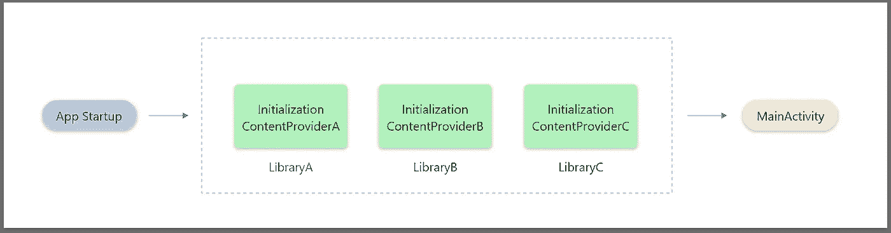
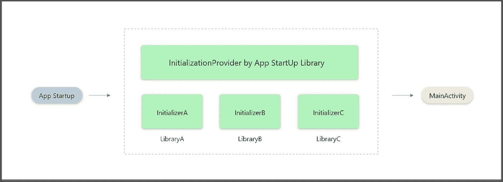

# 应用启动:一个新的架构组件

> 原文：<https://betterprogramming.pub/app-startup-new-architecture-component-d115b062a701>

## 缩短应用程序启动时间的简单方法

照片由[詹姆斯·哈里逊](https://unsplash.com/@jstrippa?utm_source=medium&utm_medium=referral)在 [Unsplash](https://unsplash.com?utm_source=medium&utm_medium=referral) 拍摄

# 这篇文章的要点是

在本文中，您将了解我们如何以及为什么需要使用[应用启动](https://developer.android.com/topic/libraries/app-startup)——新的 Jetpack 库。您还将了解如果应用程序有多个需要内容提供者的依赖项，如何使用应用程序启动初始化器，以及如何手动调用它们。

# 介绍

用户希望应用程序能够响应迅速。当你的应用程序无法满足这些基本要求时，用户通常会在 Play Store 中对其进行差评，甚至更糟的是，他们可能会卸载该应用程序。

不管怎样，这对生意都没有好处。最近，Android 团队专注于提供更好的工具，如 [Hilt](https://dagger.dev/hilt/) (实现 DI)[CameraX](https://developer.android.com/jetpack/androidx/releases/camera)(处理大量与相机相关的问题)，以及 [Paging3](https://developer.android.com/topic/libraries/architecture/paging/v3-overview) (使用 Kotlin Flow 比以往更舒适地实现分页)。

现在有了应用启动库——一个新生事物。是时候优化 app 启动时间了。应用程序启动库提供了一种在应用程序启动时初始化组件的简单明了的方法。

库开发人员和应用程序开发人员都可以使用应用程序启动来简化启动顺序，并显式设置初始化顺序。这将为开发人员节省大量时间，使他们能够专注于重要的事情。

# 它是如何工作的？

应用程序和库都依赖于应用程序启动时立即创建的组件。通常，这是由内容提供商完成的，他们是启动时间长的主要原因。

每个库有不同的内容提供者(图片来源:作者)

内容提供者是昂贵的，如果你的项目中有多个库在启动时需要内容提供者，那么显然如果他们创建单独的内容提供者，app 启动时间会比平时长。

它允许您定义共享单个内容提供者的组件`initializers`,而不是为初始化应用程序启动所需的每个组件创建单独的内容提供者。这可以改善应用程序的启动时间。

拥有应用启动库的集中式内容提供商(图片来源:作者)

如果您以前使用内容提供者来初始化应用程序中的组件，请确保在实现应用程序启动时删除它们。

# 综合

要将应用程序启动库集成到您的项目中，请在应用程序级`build.gradle`文件中的 dependencies 节点下添加以下行:

应用程序启动集成

# 组件初始化

简单地说，我们假设您的项目只有一个库。现在我们需要在这里定义初始化式。看一看:

单一依赖初始值设定项

我们需要通过扩展`[Initializer <T>](https://developer.android.com/reference/kotlin/androidx/startup/Initializer)`接口为每个组件创建一个初始化器。它有两个重要功能:

*   `create()`函数，包含初始化组件所需的所有操作，并返回依赖项的实例
*   `dependencies()`函数，返回`Initializer`依赖的其他`Initializer <T>`对象的列表。你可以使用这个方法来控制应用程序在启动时运行初始化器的顺序。

因为我们没有多个依赖项，所以我们返回一个空列表。现在，让我们看看另一个具有各种依赖关系的例子。看一看:

多依赖初始值设定项

如果我们有多个依赖项，我们需要为每个依赖项创建一个初始化器。在`dependencies`函数中，我们可以设置依赖项初始化的顺序。

# 清单条目

App StartUp 提供了一个名为`InitializationProvider`的新内容提供者。这样，我们可以通过提及元数据来自动初始化组件。看一看:

组件初始化器的自动调用

注意:我们不需要在清单中提到每个组件的元数据。这是因为当我们提到更高层次的依赖元数据时，应用程序启动使底层的组件可被发现。

# 禁用单个组件的自动初始化

并非所有的依赖项都需要在应用程序启动时调用，所以最好跳过它们。为此，我们需要在该组件的元数据中使用`tools:node= “remove”`。看一看:

暂停组件的自动初始化

**注意:**禁用组件的自动初始化也会禁用其下组件的自动初始化。

# 手动初始化组件

如果不想通过 manifest 文件中的元数据来初始化组件，我们可以手动使用`AppInitializer`。当我们希望在特定时间调用依赖组件时，这种惰性初始化选项非常方便。让我们看看如何手动调用组件:

手动初始化

# 奖金

要了解更多关于 Android 高级开发的信息，您可以阅读以下文章:

*   [如何将 Google Pay 整合到你现有的安卓应用中](https://medium.com/better-programming/how-to-integrate-google-pay-into-your-existing-android-app-d75b269cd623)
*   [Android 中适配器的演变](https://medium.com/better-programming/evolution-of-adapters-in-android-2e2ff58c0f98)

要了解有关 Jetpack 库的更多信息，请阅读以下文章:

*   [Jetpack Compose——一种在 Android 中创建材质 UI 的简单新方法](https://medium.com/better-programming/jetpack-compose-a-new-and-simple-way-to-create-material-ui-in-android-f49c6fcb448b)

目前就这些；希望你学到了有用的东西。感谢阅读。