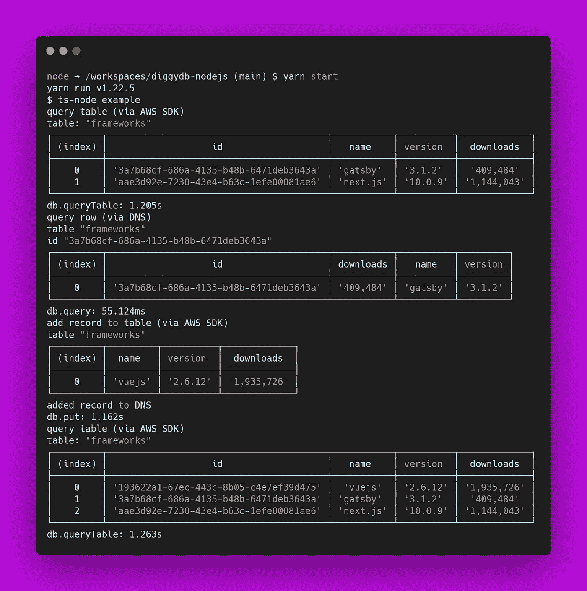
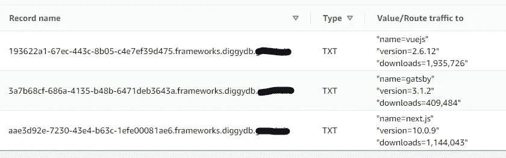

# 显然，您可以将 Route53 用作速度惊人的数据库

> 原文：<https://betterprogramming.pub/apparently-you-can-use-route53-as-a-blazingly-fast-database-dd416b56b005>

## 探索利弊，以及它是如何成为可能的


[简·侯伯](https://unsplash.com/@jan_huber?utm_source=medium&utm_medium=referral)在 [Unsplash](https://unsplash.com?utm_source=medium&utm_medium=referral) 上拍照

# 介绍

几年前，我偶然发现了科里·奎因的这个疯狂的故事，故事讲述了他们如何将[亚马逊路线 53](https://aws.amazon.com/route53/) 用作一个简单的数据库:

这是真是假，很难说，但科里经常把 Route53 称为他们选择的数据库。

事实证明，这可能完全是虚构的，根据他们的[博客文章](https://www.lastweekinaws.com/blog/route-53-amazons-premier-database/)，该文章实际上提出了一个相当不错且有些可行的用例。

Corey 也在 Reddit 上发表了这个评论，这可能会揭穿 Route53 是数据库的神话:

> “我的废话得到了牵引。请不要把它当成一个好主意；我的大部分建筑都是为了娱乐而故意糟糕的。”

考虑到这一点，让我们深入研究一下如何以及为什么您可能实际上使用 Route53 作为数据库。

# Route53(或任何域 DNS 配置)真的可以用作数据库吗？

仔细想想，DNS 配置实际上是一个非常初级的 NoSQL 数据库。您可以通过域名提供商的网站随时轻松地查看和修改它，并且您可以查看每个“记录”，就像查看数据库表中的一行一样。

许多服务使用 DNS TXT 记录来验证域所有权。您实际上是添加或修改一个 TXT 记录来存储一个键/值对，然后服务将对其进行查询。

作为一个例子，我们可以通过查询 Google 的 TXT 记录在实践中看到这一点:

```
$ dig -t txt google.com +short"facebook-domain-verification=22rm551cu4k0ab0bxsw536tlds4h95"
"docusign=1b0a6754-49b1-4db5-8540-d2c12664b289"
"docusign=05958488-4752-4ef2-95eb-aa7ba8a3bd0e"
"google-site-verification=wD8N7i1JTNTkezJ49swvWW48f8_9xveREV4oB-0Hf5o"
"apple-domain-verification=30afIBcvSuDV2PLX"
"v=spf1 include:_spf.google.com ~all"
"globalsign-smime-dv=CDYX+XFHUw2wml6/Gb8+59BsH31KzUr6c1l2BPvqKX8="
```

像脸书这样的服务将查询 TXT 记录，就像他们查询数据库中的行一样，以检索验证密钥来验证域的所有权。

您可以在任何时候从命令行使用`dig -t txt google.com +short`查询这些 TXT 记录，或者如果您喜欢冒险，您可以像我一样花几个小时编写一个可以在应用程序中实际使用的 [Node.js](https://nodejs.org/en/docs/) 库。稍后会详细介绍。

# 那么，你为什么要用亚马逊 Route53 做数据库呢？

实际上，使用 DNS 记录可能是一个好主意的原因有很多。

*   **性能:**查询一条 TXT 记录快得惊人。查询谷歌的 TXT 记录只花了大约 7 毫秒。
*   **高可用性:**与任何其他 AWS 服务不同，Route53 有保证的可用性。它基本上拥有 100%的 SLA。
*   **边缘缓存:** DNS 解析器通过缓存查找结果来减少 NS 查找延迟，并且通常非常靠近发出请求的机器，就像 CDN 一样。
*   **性价比:**托管区域每月只需 0.50 美元，DNS 查询每百万 0.40 美元。
*   **简单的 NS 查找**:任何人都可以以可读的格式“查询”数据。您不需要特定的数据库驱动程序或语言来查询它。

你相信了吗？这无疑让我有足够的信心来建立一个概念验证。

# DiggyDB 简介

我花了几个小时构建了一个名为 [DiggyDB](https://www.npmjs.com/package/diggydb-nodejs) 的 Node.js 库作为概念验证。

首先，我应该简要解释一些数据库定义以及它们的用法:

*   **数据库:**这实际上是域的主主机名。
    例如`diggydb.example.com`
*   **表:**这是子域的一部分。
    例如`**table**.diggydb.example.com`
*   **行/键:**这是子域的最后一部分，允许您查询“表”中的特定行
    例如`**3a7b68cf-686a-4135-b48b-6471deb3643a**.table.diggydb.example.com`
*   **值:**在其原始形式中，这是对应于如上所示的 FQDN 的实际 TXT 记录值。这被分解成本质上是一个**列**和它的**值**。

如果我们知道键和表，我们可以使用`dig`来查找值:

```
$ dig -t txt 3a7b68cf-686a-4135-b48b-6471deb3643a.frameworks.diggydb.example.com +short"name=gatsby"
"version=3.1.2"
"downloads=409,484"
```

记住这一点，让我们看看如果我们使用 DiggyDB 来:

1.  查询名为“框架”的表中的所有行(通过 AWS SDK)
2.  查询表中的特定项目(通过 DNS)
3.  向表中添加新项目(通过 AWS SDK)
4.  再次查询表中的所有行以显示新项目(通过 AWS SDK)



非常强大，您会注意到执行这些操作实际上非常快，特别是当我们查询表中的特定键时，因为这是通过 DNS 查找完成的，所以只需要大约 55 毫秒。DiggyDB 使用 AWS-SDK 来修改 DNS 记录，这大约需要 1 秒。

以下是它在 Route53 中的存储方式(即 raw 格式):



下面是查询表的实际代码:

当我们使用 AWS-SDK 时，我们需要在配置中包含`accessKeyId`和`secretAccessKey`。

下面是查询表中特定键的代码:

注意到我们没有包括 AWS 访问键配置吗？这是因为我们使用了 DNS 查找方法，所以不需要。

最后，这是我们将如何向表中添加一行(再次使用 AWS SDK):

# 所以，等等…这其实是个好主意？

我认为可以肯定地说，概念证明工作得非常好，这是一个非常有创意的解决方案。尽管有这么做的好处，但还是有一些缺点需要考虑:

**写入延迟:**由于 DNS 解析器的缓存行为，传播 DNS 更改可能需要 60 到 48 小时。尽管大多数公共 DNS 解析器会遵守 60s TTL，但有些会忽略它或完全忽略它。

**大小限制:**TXT 记录中的字符串最大长度为 255 个字符。FQDN 也被限制为 255 个字符。

**行限制:** Route53 对于每个托管区域有 10，000 个资源记录集的限制。你可以要求更高的限额，但祝你好运解释原因。

# 结论

实际上没有什么可以阻止你使用 Route53 作为数据库。DiggyDB 在概念验证方面做得非常好，并且有一些在 DNS 配置中存储值的有效用例。我可以肯定地看到 DiggyDB 对于某些场景是有用的。然而，如果你正在寻找一个合适的可伸缩数据库，它可能不是 Route53。

如果 DiggyDB 真的被证明是有用的，我很想知道你是如何使用它的！如果你有任何想法，也非常欢迎你为这个项目做出贡献，因为将这个概念推向极限是非常棒的。

谢谢，科里的灵感！