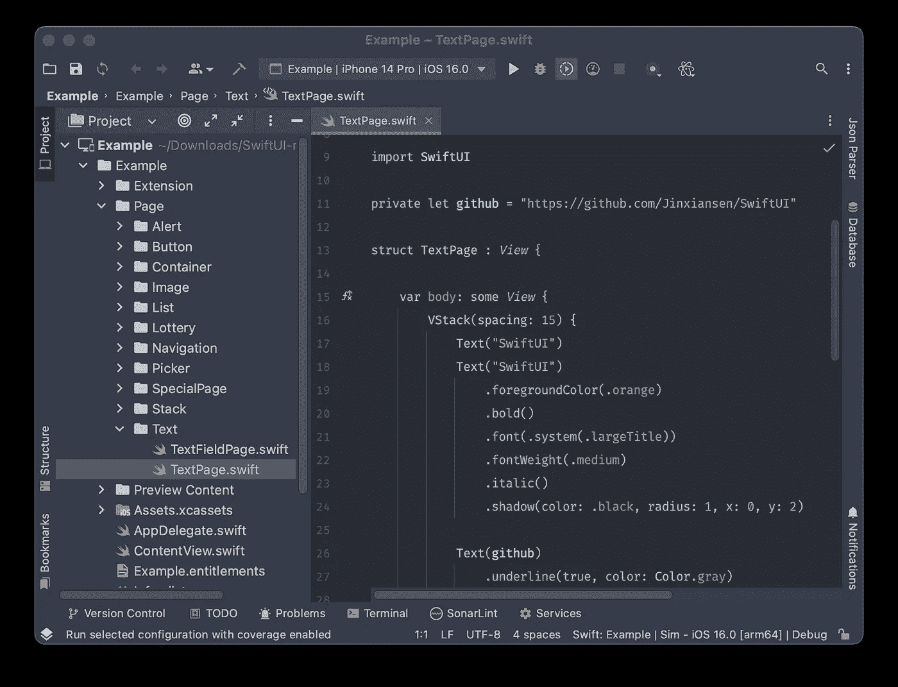
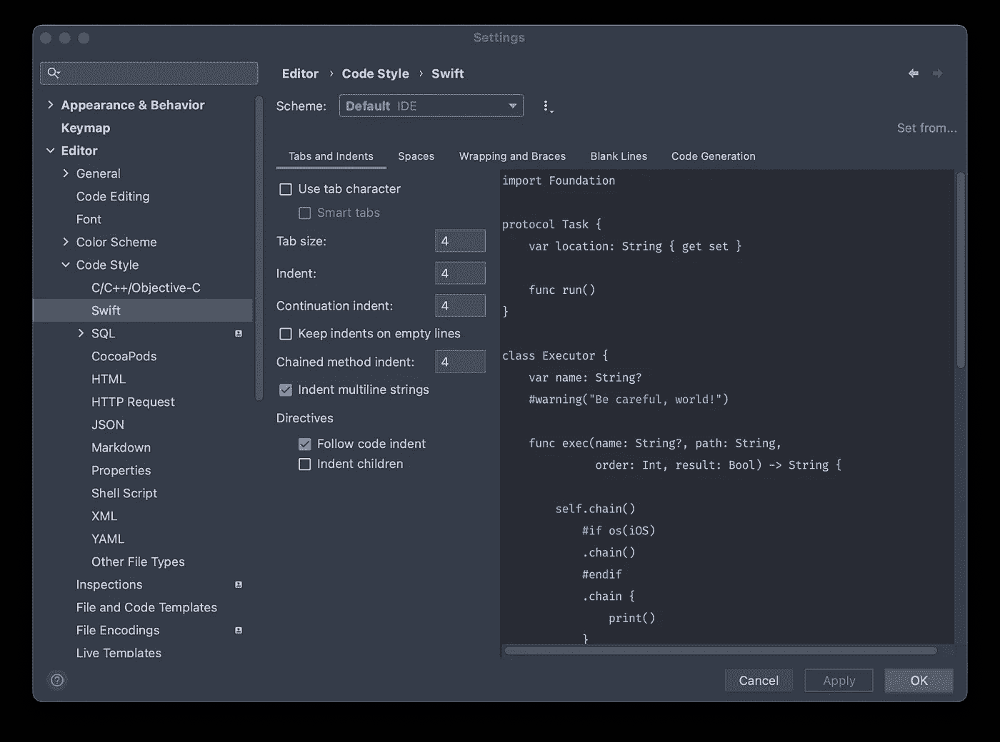
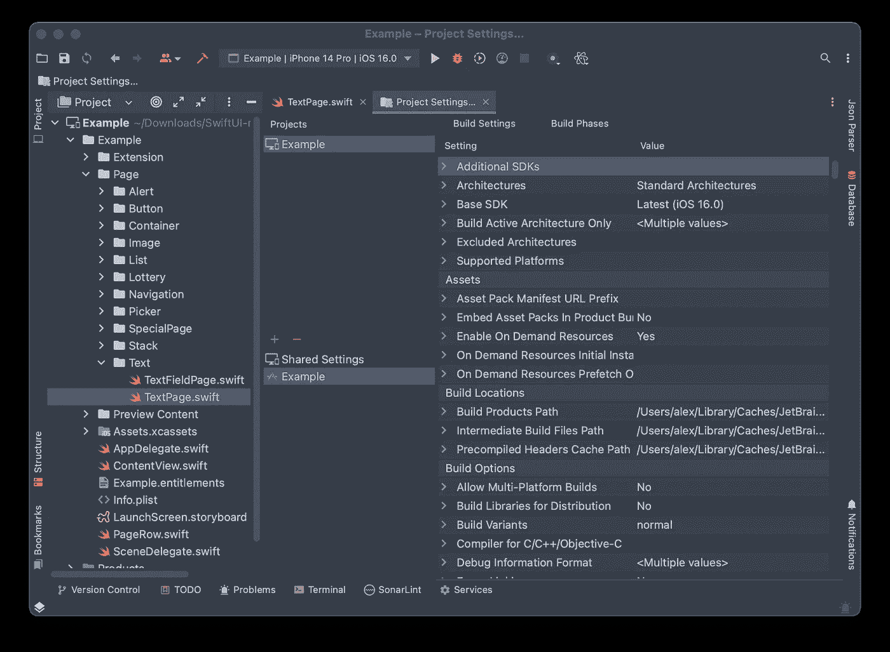
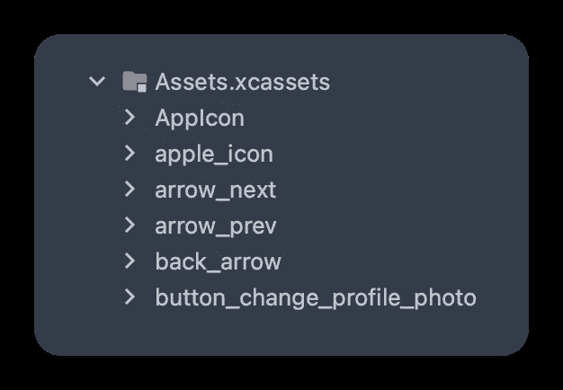
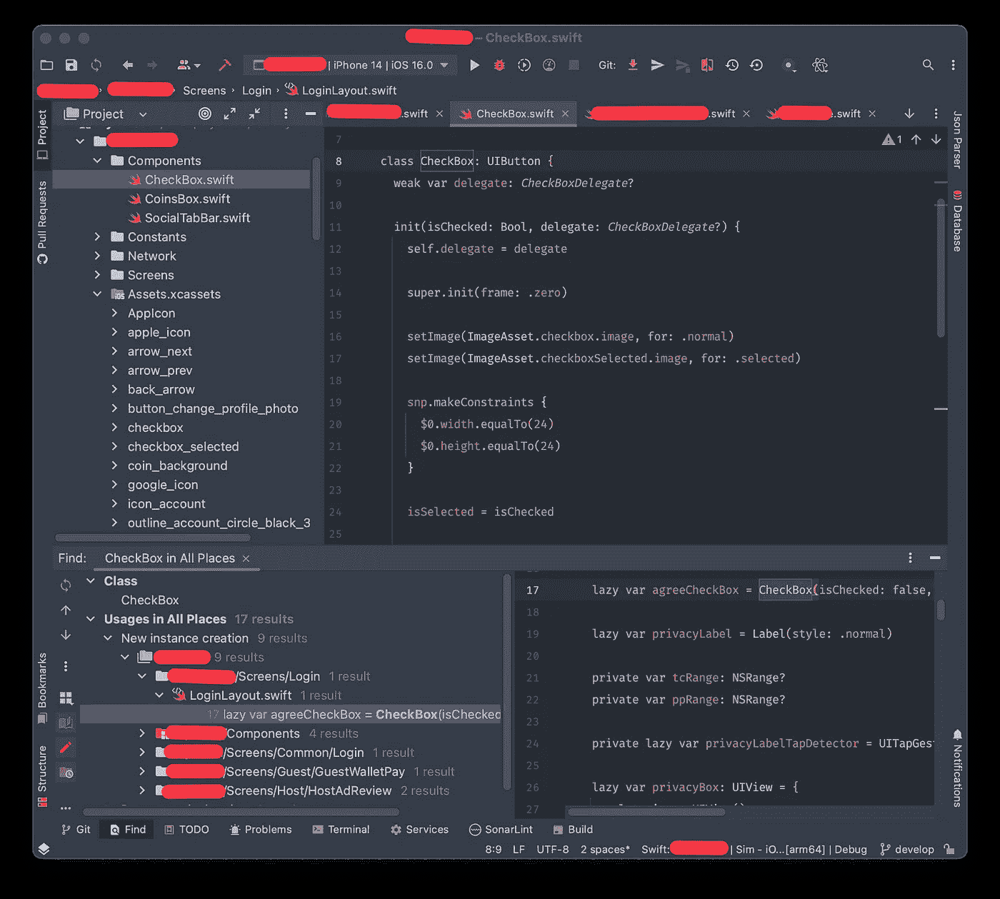
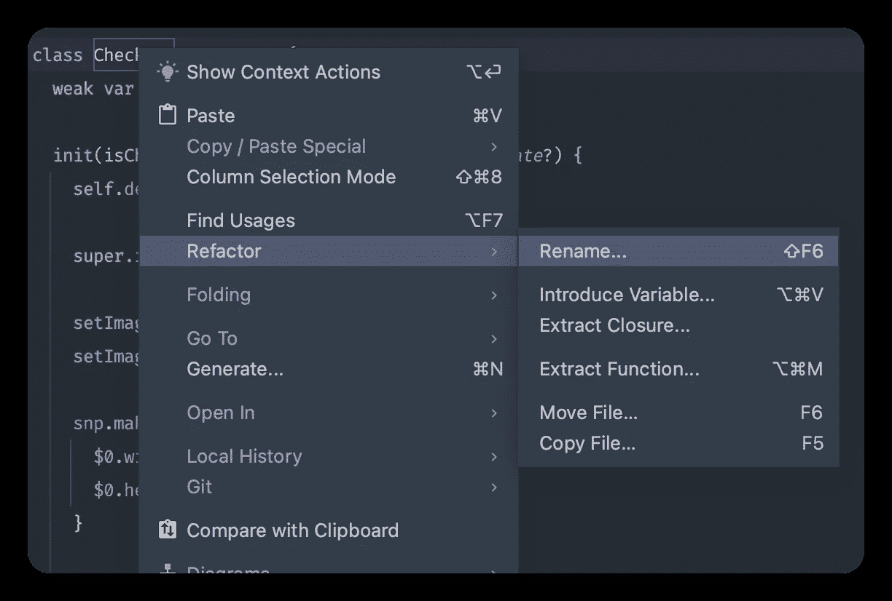
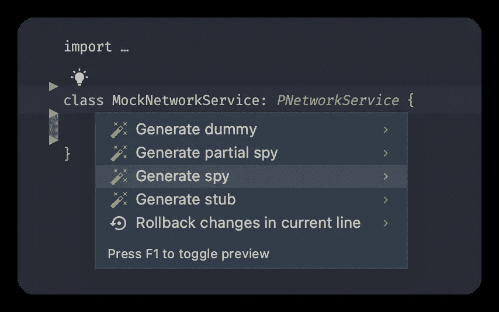
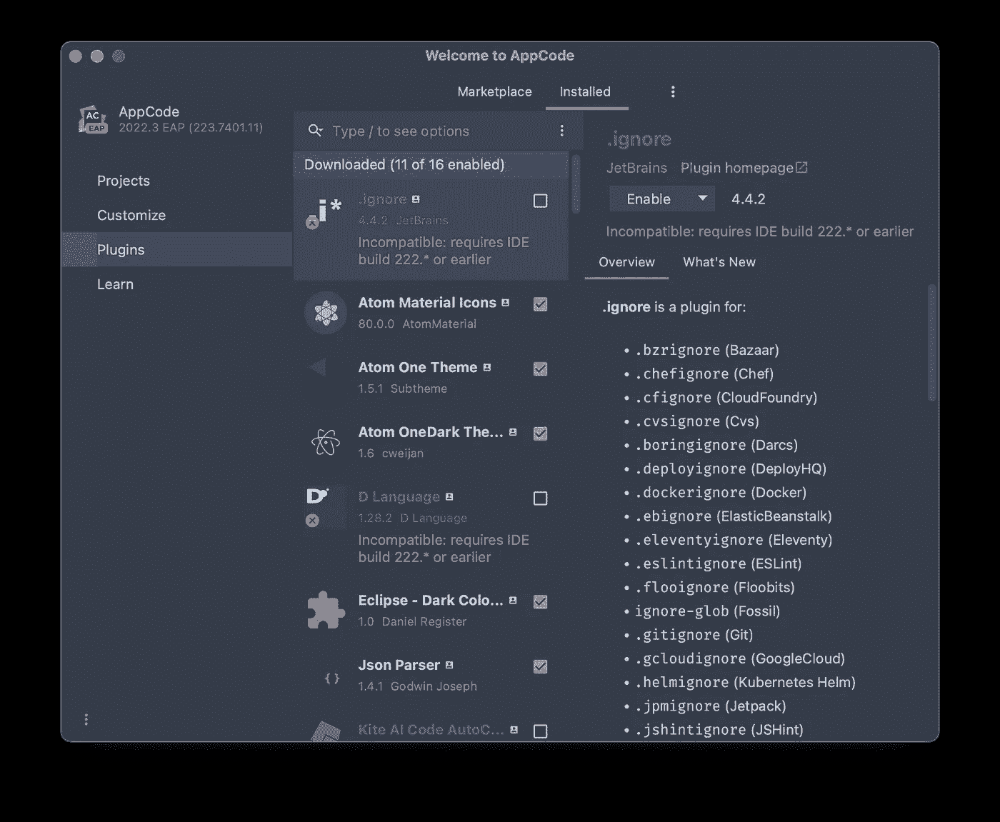

# JetBrains 的 AppCode IDE 与 Xcode

> 原文：<https://betterprogramming.pub/appcode-instead-of-xcode-a12f2d2810e2>

## 了解如何使用 AppCode 以及它为开发人员提供了什么

AppCode Splash

我写过几篇关于 Xcode 缺点的文章。其中一个提到 AppCode 是 Xcode 的替代方案，但是非常简短。你可以在这里找到[。](/writing-ios-apps-without-xcode-89450d0de21a)

在本文中，我想更深入地介绍细节，并展示如何使用 AppCode 来创建、开发、维护和支持您的项目。

*注意:对于这个故事，我使用了 AppCode 2022.3 EAP。*

# 为什么要用 AppCode？

10 年前我开始使用 Xcode，我非常喜欢它。感觉又快又稳又舒服。我用 Xcode 写了跨平台的 app，然后移植到 Windows 或者其他平台上。Xcode 是我成为移动开发者的原因之一。

这些年来，事情发生了相当大的变化。Xcode 变得非常消耗资源。除了是我的 Mac 上最大的应用程序之外，原生 Xcode 的运行速度甚至比基于 JVM 的 Android Studio 还要慢。它经常崩溃，显示内部错误，并且经常变得没有响应。

在某个时候，我开始寻找 Xcode 的替代品。原生开发，我只找到一个 app——**app code**，由 **JetBrains** 开发。这是一个付费应用程序，它使用与 Android Studio 相同的引擎。如果你是一个跨平台的移动开发者，并且喜欢 Android Studio IDE 胜过 Xcode，那么 AppCode 可能是一个不错的解决方案。如果你喜欢 Xcode，并且对它没有任何问题，那么这篇文章不适合你。

# AppCode 和 Xcode 兼容性

AppCode 使用与 Xcode 相同的项目格式。它支持项目和工作空间。此外，您可以在两个编辑器中打开相同的项目。如果您的 Mac 有足够的资源，您可以并排打开它们，并利用两个应用程序的优势。

项目(和工作空间)是 Xcode 和 AppCode 之间唯一的共同点。您不能共享设置、插件和其他 IDE 功能。

# AppCode 约束和限制

首先，AppCode 并不是 Xcode 的完全替代。它不包括编译器、链接器和其他工具。如果使用 AppCode，您需要安装 Xcode。

第二，AppCode 没有 Xcode 的所有功能。比如不允许编辑`xib`文件和`storyboards`。它也没有显示 SwiftUI 的预览。

在 AppCode 中编辑 SwiftUI 文件

第三，AppCode 有不同的索引系统。当您打开一个新项目，重新生成一个旧项目或拉一个更新，AppCode 可能会开始完全重新索引和重建。AppCode 中的索引持续时间非常长，比 Xcode 中长得多。原因可能是 AppCode 有更多的代码分析和重构功能。

# 使用 AppCode 编辑代码

这部分大概是和 Xcode 最相似的了。Swift 和 Objective-C 都是简单的文本文件。您甚至可以在“文本编辑”或“终端”应用程序中编辑它们。

Xcode 和 AppCode 都有项目导航器，其项目结构包含所有源文件和组。您可以在面板上选择要编辑的文件，并在编辑器窗口中进行编辑。

在这两种 ide 中，您都可以设置编辑规则。比如制表符代替空格，自动大括号，insets 等等。在 Xcode 中，您可以在菜单 *Xcode* - > *偏好设置…* - > *文本编辑*中找到设置。在 AppCode —菜单*app code*->-*设置…* - > *编辑*。

在 AppCode 中配置 Swift 代码风格

如果您比较这些 ide 中的设置列表，您会看到很大的不同。AppCode 的设置量要大得多，这并不奇怪。苹果总是提供尽可能少的设置。对比一下 macOS 和 Linux/Windows 的设置，你就明白我的意思了。

# 编辑用户界面

编辑 UI，在我看来是 AppCode 最大的问题。没有可视化编辑器。由于故事板不能手动编辑，所以没有办法在 AppCode 中编辑它们。如果双击`xib`或者`storyboard`文件，就会打开 Xcode。

在 AppCode 中有两种编辑 UI 的方法:

1.  SwiftUI 文件只是 Swift 文件。你可以在任何地方编辑它们。你仍然不能预览它们，但是如果你对 SwiftUI 有足够的经验，你可以试着盲测。
2.  用代码创建布局。您可以在 Objective-C 和 Swift 中创建 UIKit 组件和约束。我推荐使用 SnapKit 库来创建约束。

如果您不想或不能使用这些方式，您可以打开 Xcode 来编辑布局。

# 项目/生成设置

AppCode 中的构建设置比 Xcode 中的 UI 更复杂。如果你是一个经验丰富的 Xcode 用户，将很难切换到 AppCode。这就是为什么我个人会推荐在 Xcode 中编辑构建设置，即使你使用 AppCode 进行代码编辑。

如果您决定完全切换到 AppCode，您也可以在那里更改一些设置。要打开设置，打开*文件*菜单，选择*项目设置…* 或使用`⌘;`快捷键。

AppCode 中的生成设置

如果你打开*工作区*，你会看到一个项目列表。每个项目都有共享设置和每个目标的设置。在 AppCode 中，您可以编辑构建设置和构建阶段。

Xcode 可以在同一个项目设置编辑器中访问`Info.plist`和`Project.entitlements`——它们作为单独的标签提供。在 AppCode 中，您可以手动编辑这些文件。AppCode 提供了一个类似于 Xcode 中的分层键值编辑器。

# 资产

Xcode 有几种类型的资源。最常用的是字符串资源(本地化文件)和图像资源。字符串资产只是文本文件，它们很容易在 AppCode 中编辑。

每个 Xcode 项目都会自动创建一个图像资源文件。所述文件包含应用图标。从技术上讲，它不是图像资产文件，而是资产的一般列表。我称之为*图像资产*，因为默认情况下它有一个图像资产，并且通常只用于图像。这是一个扩展名为`xcassets`的文件夹。

AppCode 中的资源浏览器

AppCode 将其显示为项目面板上的可扩展列表。在我看来，它的用户界面非常不舒服。您可以分别预览每幅图像。通过右键单击上下文菜单来执行编辑。

# 重构和代码分析

如果你读到这一节，你可能会问自己:“如果 AppCode 的所有东西都让人不舒服，我为什么要换它？”。第一个答案是性能。Xcode 经常卡死甚至崩溃。AppCode 中一般不会出现这种情况。第二个答案是重构。

所有的 JetBrains 工具，包括 IntelliJ IDEA 和 Android Studio，都以强大的重构而闻名。AppCode 构建在相同的引擎上，尽管 Swift 语言对于 JetBrains IDEs 来说不如 Java 本地(它们构建在 Java 平台上)，但它提供了非常丰富的重构工具。

当您打开一个项目时，AppCode 会花费几分钟(取决于项目大小)来构建索引。这些索引用于提供对文档、交叉引用和重构工具的快速访问。

第一个有用的特性是*查找用法* ( `⌥F7`)。右键单击任何类、结构、枚举或变量名，并在*上下文菜单*中选择*查找用法*。AppCode 将使用您选择的实体显示代码中的所有位置。它比搜索效率高得多，因为它有助于避免名称相似的实体。

在 AppCode 中查找用法

第二个特点是*改名*。你基本上可以重命名任何东西。AppCode 将确保它在整个项目甚至工作区中更新这个实体。如果您为每个类创建一个单独的文件，并为文件和类使用相同的名称(这是一个推荐的做法)，那么 AppCode 也会重命名该文件。要重命名 AppCode 中的实体，右键单击它并选择*重构*->-重命名。或者当光标在类/结构/枚举/变量名中时，使用快捷方式`⇧F6`。

AppCode 中的重构

我喜欢并经常使用的下一个特性是*覆盖*。它显示了您可以覆盖的类成员的完整列表。例如，如果你正在处理`UIViewController`子类，你可能需要重载`viewDidLoad`、`viewWillAppear`和其他生命周期函数。要查看列表，将光标放在一个类内并按下`⌃O`。可能需要几秒钟来建立列表，然后你会看到它。选择一个你想要覆盖的函数，AppCode 会用默认的超类调用把它添加到你的代码中。

*函数提取*对于把复杂的函数变得简单非常有用。如果你使用像 SonarCube 这样的代码分析工具，如果一个函数太复杂，它会警告你。如果没有，就看看你的长函数的大小。他们有多少行代码？50?也许 100？那太长了。在这种情况下，您需要将它们分成更小的部分，以使您的代码更具可读性和可维护性。

选择一部分代码做一些相对独立于其他部分的事情；右键选择*重构*->-*提取函数…* 或按`⌥⌘M`。AppCode 会让你把它提取为一个类成员或者静态函数。它会让你选择函数参数。它会自动创建你的函数，改变必要的部分并调用它。在最复杂的情况下，您可能需要进行一些手动修复。

当你的项目变大时，可能很难维护，即使它有好的架构。有时你会在最意想不到的地方发现虫子。从代码分析开始调试可能是个好主意。AppCode 会自动找到代码中需要注意的地方。打开*代码*菜单，选择*检验代码…* 。选择您想要检查的范围，并…耐心等待。这通常需要几分钟，但如果你的项目很大，甚至可能需要一个小时或更长时间。您将看到警告如何出现在*问题*面板上。

完成后，您将看到一个按类别列出的潜在问题列表。一个一个地选择它们，检查它是否是你的代码中的一个真正的问题。无论如何，最好是修复潜在的问题，不要在下一个代码检查会话中看到它们。

一个类似的功能是*代码清理*。它会找到一些可以删除的代码部分，比如未使用的变量、函数和类等等。

不要害怕运行这些功能——没有您的允许，它们不会做任何更改。我建议定期运行它们，以保持代码的整洁。

AppCode 中有更多的重构特性，你可以在 IDE 中使用它们。这里我想提到的最后一个是*快速修复*或*修复*功能。要运行它，将光标放在您想要修复的地方，然后按`⌥⏎`。如果没有要修复的东西，AppCode 什么都不会做。另一方面，如果有问题(警告、错误、代码风格问题，甚至可能的改进)，AppCode 将显示一个上下文菜单，其中包含可能的操作。

# 单元测试和模拟生成

单元测试是一种自动测试代码的机制。在完美的情况下，每个功能都应该被一个或多个单元测试所覆盖，以测试不同的执行分支。然而 100%的覆盖率并不是一个现实的目标。

如果你的应用功能被分成几层，比如 UI、数据、视图模型、路由器和其他，你可能需要*模拟*或*间谍*来测试其他层。

假设您知道它在 Xcode 中是如何工作的，让我们来回顾一下 AppCode 的细节。

AppCode 不像 Xcode 那样提供在目标中运行所有测试。并且它不使用 Xcode 测试目标，您必须单独创建它们。

在 AppCode 中运行单元测试有两种主要方式:

第一个是创建一个测试目标并运行它。为此，您需要点击带有目标的*组合框*并选择*编辑配置…* 。点击 *+* ，根据您要测试的内容选择 *Swift Package Test* 或 *XCTest* 。在*目标配置*中，您可以选择文件。您可以选择它们或者创建一些测试场景作为单独的目标。

第二种更快的方法是打开一个包含测试的文件。这是一个继承自`XCTestCase`的类。如果 AppCode 索引成功，它将在左栏显示绿色箭头。类声明附近的箭头将测试整个类。功能旁边的箭头将只测试选定的功能。

为了生成模拟，我使用了 *Swift 模拟生成器*。这是一个免费的开源工具，但是没有很好的维护。我不知道有什么更好的工具来生成模拟文件。如果你有，请留下评论，让我知道。

Swift 模拟生成器是 Xcode 和 AppCode 的插件:

 [## GitHub-seanhenry/swiftmockgenertorforxcode:一个 Xcode 扩展(插件),用于生成 Swift 测试…

### ⚠️由于作者不再写 Swift，这个插件不再被积极开发。我会努力保持…

github.com](https://github.com/seanhenry/SwiftMockGeneratorForXcode)  [## GitHub - seanhenry/MockGenerator:一个 AppCode 插件，帮助生成 Swift 测试 doubles…

### ⚠️由于作者不再写 Swift，这个插件不再被积极开发。正在更新 AppCode…

github.com](https://github.com/seanhenry/MockGenerator) 

它的 AppCode 版本可以通过标准插件机制安装，你不需要从网站上下载。对我们 AppCode 用户来说，好消息是 AppCode 的版本更强大了。例如，Xcode 插件不能正确处理异步函数，这是一个严重的缺点。

要生成一个 spy，在测试目标中创建一个具有惟一名称的类，采用您需要监视的协议，并在光标位于类名上时按下`⌥⏎`。你会看到一个菜单提供生成间谍，存根和其他类型的模拟。

AppCode 中的模拟生成(带有模拟生成器)

个人认为，这是 AppCode 最相关的优点之一。由于我经常使用单元测试，我需要生成许多模拟。这意味着即使我使用 Xcode，我也会切换到 AppCode 来编写单元测试。

# 构建和归档

在 AppCode 中，你可以创建一个项目，编写源代码，编写单元测试，在模拟器或物理设备上运行你的应用程序，你可以分析和描述你的代码，但你不能在 App Store 中发布存档。您必须使用 Xcode 或外部构建系统。

# 插件

AppCode 使用标准的 JetBrains 插件系统，让你可以访问几十个插件。其中一些是专门为 AppCode 开发的，比如前面提到的*模拟生成器*。其他插件可以在所有 JetBrains IDEs 上工作，例如，改变 IDE 外观的插件、代码浏览、彩虹括号、命令行和 git 工具等等。

AppCode 插件

AppCode 的插件明显比 Xcode 多，而且几乎所有的插件要么是免费的，要么有免费的 lite 版本。

# 结论

AppCode 不是一个独立的 IDE，没有 Xcode 就不能使用。它需要 Xcode 来构建代码和执行一些 AppCode 不支持的操作，比如 UI 编辑或项目归档。

同时，AppCode 是由 IDE 开发的领导者 JetBrains 所做的 IDE。不幸的是，它只提供 30 天的免费试用，但对于个人来说，许可证是相当实惠的。这绝对值得一试，尤其是如果你是一个跨平台开发人员，并且也为 Android 或使用其他 JetBrains IDEs 编写代码。

编码快乐，下次见！