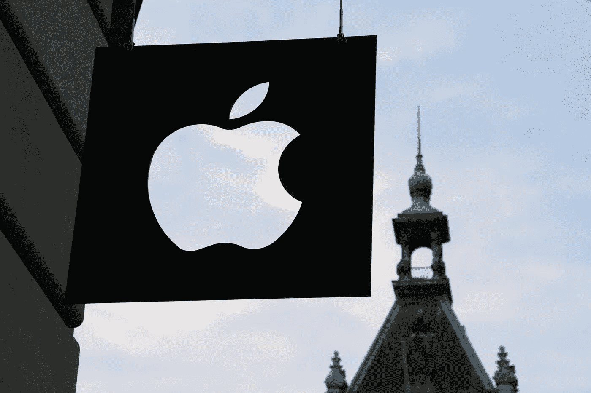
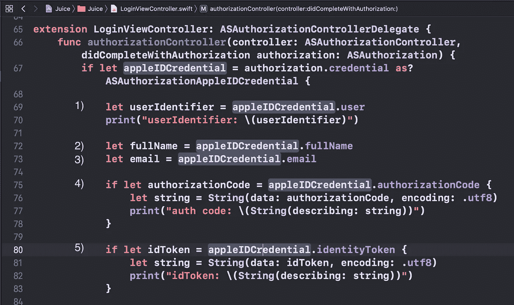
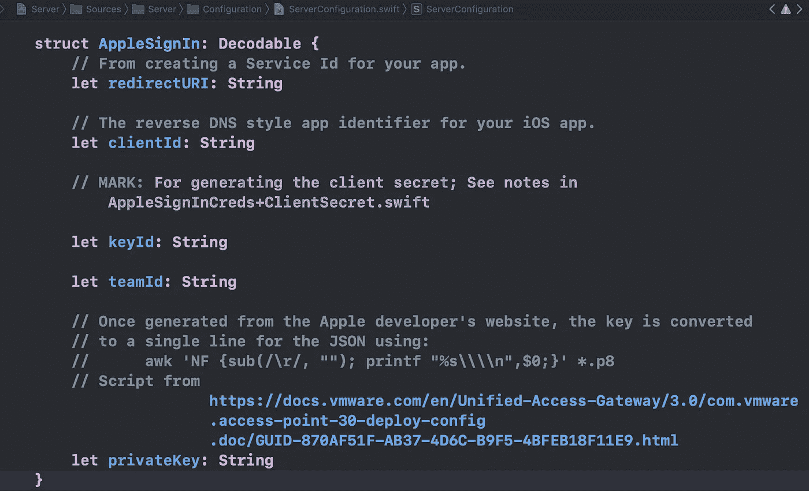
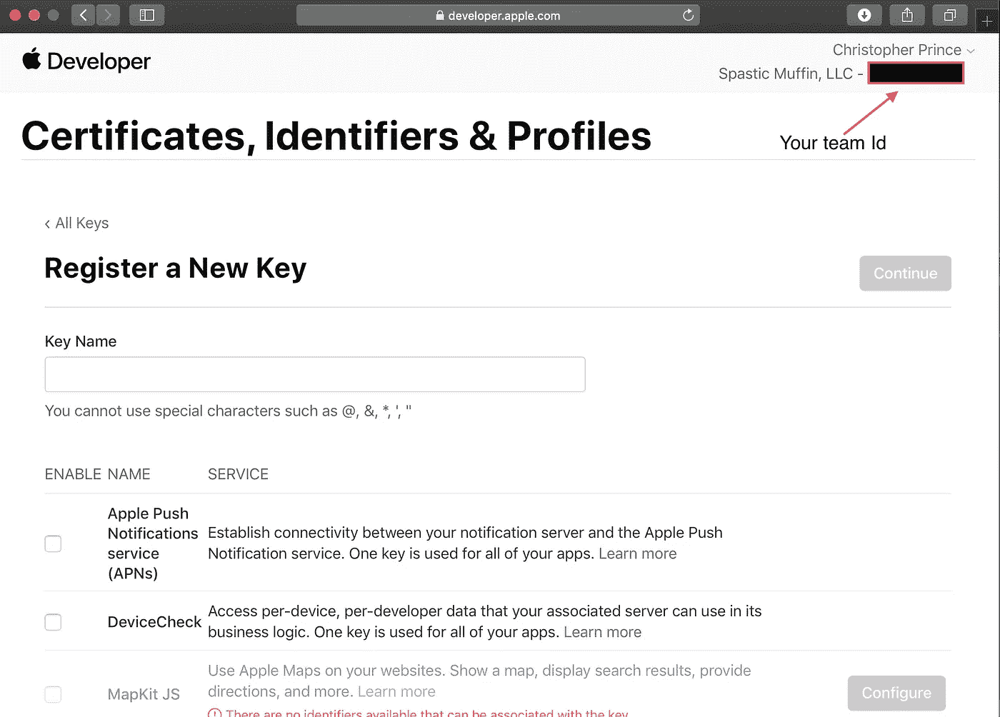
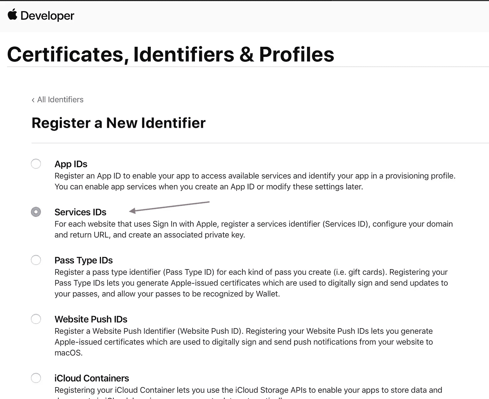
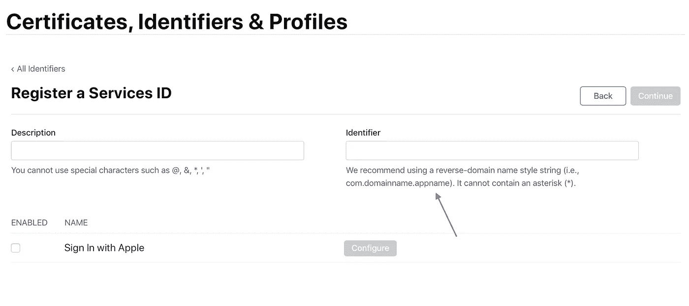

# 苹果登录:定制服务器和到期难题

> 原文：<https://betterprogramming.pub/apple-sign-in-custom-servers-and-an-expiry-conundrum-d1ad63223870>

## 服务器端使用应该采用苹果登录吗？

在 [Unsplash](https://unsplash.com/s/photos/apple?utm_source=unsplash&utm_medium=referral&utm_content=creditCopyText) 上 [Medhat Dawoud](https://unsplash.com/@medhatdawoud?utm_source=unsplash&utm_medium=referral&utm_content=creditCopyText) 拍摄的照片

[2020 年 7 月:参见[苹果登录:定制服务器和到期难题(第二部分)](/@crspybits/part-ii-apple-sign-in-custom-servers-and-an-expiry-conundrum-b3e9735dc079?source=your_stories_page---------------------------) ]

嗯，我在将苹果登录与我的应用程序集成方面取得了很大进展，但这并不容易。我仍然有一个问题——看起来像是一个节目中止。

我写这篇文章的目的是分享我的学习，并希望得到一些反馈。尽管我相信我的用例并没有那么不寻常，但我感觉自己好像是在荒野中。

我想使用 Apple 登录产生的 OAuth 令牌来访问我的服务器上的 HTTP REST API。

首先，让我从登录的角度详细说明一下我的系统。我的系统可能有点不寻常，因为它没有本地登录类型。它允许登录各种社交登录和云服务提供商:Dropbox、谷歌和脸书。

我最近整合了微软(OneDrive)的服务器端，并且正在开发苹果的登录功能。重点其实是云服务提供商。我的应用(苹果应用商店上的 [Neebla](https://apps.apple.com/us/app/neebla/id1244482164) ，后端的 [SyncServerII](https://github.com/crspybits/SyncServerII) )有一个 BYOCS——“自带云存储”的概念。

用户上传的数据通常存储在他们自己的云存储系统中，这些数据可以安全地与其他用户共享。社交登录(包括 Apple 登录)只有在云存储用户的邀请下才能进行，社交用户的数据存储被委托给邀请用户的存储。

Neebla 和 SyncServerII 上典型的登录和 REST API 用法的一个例子是 [Google 登录](https://developers.google.com/identity/sign-in/ios)。Google 提供了客户端 iOS 框架。用户使用他们的 Google 用户名和凭证登录，由此产生了几个结果:

1.  OAuth 令牌—授权代码和访问令牌。
2.  登录框架在客户端自动刷新访问令牌。
3.  这些令牌可以发送到我的自定义服务器，访问令牌很容易验证，使用谷歌端点。
4.  定制服务器上的初始令牌验证可以在端点请求处理的早期进行，无需访问定制服务器的数据库(如这里的[风格](https://github.com/IBM-Swift/Kitura-Credentials))。

我提到这几点是为了建立一个我希望在其他登录提供商身上看到的期望框架(并不是因为我是一个死忠的谷歌粉丝)。

现在，我将转到 Apple 登录，并从实现的角度描述这个过程是如何工作的。我将分三步考虑这个问题，这三步对应于我的系统中的机制。

# 1.客户端登录

我在 iOS 客户端应用程序中集成苹果登录的体验与[苹果开发者视频](https://developer.apple.com/videos/play/wwdc2019/706)中描述的非常相似。

除了几个例外。[我用了他们的演示 app](https://developer.apple.com/documentation/authenticationservices/adding_the_sign_in_with_apple_flow_to_your_app) 。我遇到的两个问题似乎都和 iOS 模拟器有关，至少从 Xcode 11.1 开始。

帐户不会从应用程序的启动一直保留(例如，使用他们的`getCredentialState`方法)，并且应用程序很容易锁定。

第一个问题主要是一个烦恼。你只需要继续登录。为了解决第二个问题，我要么切换到不同的设备模拟器，要么在设置应用程序中注销我的苹果账户。

我目前正在使用登录的结果作为我进一步发展的输入。具体来说，我使用下面的五项结果。

我将集中讨论其中的三个。`user` 属性提供了唯一的密钥来标识用户，而不是电子邮件地址。`authorizationCode` 和`identityToken` 为 OAuth。

可以将`authorizationCode`传递到您的服务器来创建一个刷新令牌。这方面的更多内容将在下面的第 3 部分中介绍。`identityToken`(或者只是 ID 令牌)是一个 JWT (JSON web 令牌)，10 分钟后到期。你也可以把它传递给你的服务器。

这个令牌一直是我持续沮丧的一个来源，所以我要再说一些事情。

在 iOS 应用中刷新的 ID 令牌是*不是* 。比如在苹果开发者论坛上看到[这个线程](https://forums.developer.apple.com/thread/117867)。这违背了我对 OAuth 登录机制的典型期望。

此外，*而不是* 似乎有可能创建另一个 ID 令牌，即服务器端的 ID 令牌，以延长 ID 令牌的有效期。具体来说，刷新令牌(再次参见下面的 3)可以用于验证，而不是用于创建新的 ID 令牌。参见[苹果文档](https://developer.apple.com/documentation/signinwithapplerestapi/generate_and_validate_tokens)。

事实证明，ID 令牌只是在用户登录时创建并提供给你的应用程序。所以，基本上只期望得到一次。

这引发了定制服务器 REST API 难题。

当 iOS 应用程序使用 Apple sign-in 向服务器进行鉴定时，应该向自定义服务器发送什么？

在我考虑的参考案例中，Google sign-in，我发送 OAuth 访问令牌。它的到期日期会定期更新，因为 Google 登录框架会定期在 iOS 应用程序上更新访问令牌。

从表面上看，我们可以使用两个令牌从客户端 iOS 应用程序发送到服务器:

1.  ID 标记。
2.  刷新令牌(不好意思，继续读)。

[我在这里概述了这些策略的一些考虑事项](https://stackoverflow.com/questions/58178187)。关于刷新令牌的另一个考虑是，有些人认为它不应该给客户端——例如，[iOS 版 MSAL 不允许 iOS 客户端访问刷新令牌。](https://github.com/AzureAD/microsoft-authentication-library-for-objc/issues/618)

通常，刷新令牌功能强大，经验法则是客户端不可信。

出于这些原因，我选择将 ID 令牌发送到我的服务器进行端点身份验证。我将把这个令牌保存在我客户端的钥匙串中。我还将授权代码发送到我的服务器，但是不要将它保存在客户机上(例如，它永远不会被发送回客户机)。

# 2.服务器端初始凭证验证

我用 Swift 编写的定制服务器使用插件的 [IBM 的 Kitura 凭证框架](https://github.com/IBM-Swift/Kitura-Credentials)为每个端点请求进行初始授权。

[例如，对于 Google](https://github.com/IBM-Swift/Kitura-CredentialsGoogle) ，它检查用户(通过 OAuth 访问令牌表示)是否是 Google 用户。它*不* 检查用户在系统上是否有帐户。

我正在创建一个[苹果登录 Kitura 凭证插件](https://github.com/crspybits/CredentialsAppleSignIn)。这个插件使用 ID 令牌为用户进行初始授权。它*不* 检查 ID 令牌的到期，原因如上所述。

相反，它假设额外的验证将在服务器上进行(参见下面的第 3 节)。

检查 ID 令牌的有效性并不容易。在我看过的两个 WWDC 2019 视频中，苹果都没有谈到它。他们的在线文档很少。

一些早期采用者已经在博客上对此进行了讨论，这很有帮助。比如见[柯蒂斯赫伯特](https://blog.curtisherbert.com/so-theyve-signed-in-with-apple-now-what/)和[奥克塔](https://developer.okta.com/blog/2019/06/04/what-the-heck-is-sign-in-with-apple)。

我的[Apple sign-in Kitura Credentials plugin](https://github.com/crspybits/CredentialsAppleSignIn)的代码可能是我能提供的最好的检查 ID 令牌有效性的代码，但是我将给出一个你需要遵循的步骤的概要来总结:

1.  通过对苹果的 HTTP 端点请求，获得苹果的 JSON web key (JWK)。
2.  将 JWK 重构为 PEM 公钥。
3.  使用该公钥验证 ID 标记的签名(记住，ID 标记是一个 JWT)。
4.  解码 ID 令牌的有效负载。
5.  验证有效负载的声明，不包括到期日期。

我使用两个框架来完成上述步骤:

*   [https://github.com/IBM-Swift/Swift-JWT.git](https://github.com/IBM-Swift/Swift-JWT.git)
*   [https://github.com/ibm-cloud-security/Swift-JWK-to-PEM.git](https://github.com/ibm-cloud-security/Swift-JWK-to-PEM.git)

我将让您深入研究我的代码以获取详细信息。我也给了一些更多的网络链接。

我将在这里给出一个进一步的细节。这些步骤*不* 向苹果公司核实你的应用程序目前是否获得该用户的授权。更具体地说，上面唯一的 HTTP/network 调用是在步骤 1 中，这是一个简单的 HTTP GET，您不需要向 Apple 提供任何信息。

# 3.服务器端最终验证

好了，你还在看书。还差一步。太棒了。抱歉。

还剩下什么？我们在上面的步骤 2 中对用户进行了初始的服务器端验证。然而，我们实际上还没有向苹果核实这个用户目前是否有效。(您需要检查该用户是否确实是您系统中的用户，但这超出了本博客的范围)。

同样，如果你正在为一个定制服务器做最后的验证，苹果没有提供视频和稀疏的文档。

我用来进行最终凭证验证的总体策略是定期使用刷新令牌进行验证。

这将用户和应用程序的信息通过 HTTP POST 调用传递到苹果端点，我假设如果用户撤销了应用程序的权限，它将失败。周期性地，我每 24 小时不超过一次——因为苹果公司说如果你做得超过这个次数，他们可能会掐死你。

刷新令牌是通过授权码和您的一些工作创建的。在我的系统中，当用户创建帐户时，授权码会从 iOS 应用程序上传到我的服务器。

事实证明,( a)创建刷新令牌和(b)使用刷新令牌进行验证的程序代码非常相似。下面我给出主要步骤。

我将再次向您推荐我的程序代码，以了解如何将授权代码交换为刷新令牌的完整细节。这次具体参考我的 [SyncServerII repo](https://github.com/crspybits/SyncServerII/tree/dev/Sources/Server/Account%20Specifics/AppleSignIn) 和`AppleSignInCreds+Refresh.swift`和`AppleSignInCreds+ClientSecret.swift`文件。

创建刷新令牌和验证刷新令牌需要一组参数。这是我的服务器上保存这些参数的结构:

底部的四个参数(`keyId`、`teamId`、`privateKey`和`clientId`)是生成客户端密码所需的主要参数。在其他系统中(例如，Google sign-in)，OAuth 的客户端机密只是一个复制和粘贴的字符串。

对于苹果登录，客户端密码更复杂。这实际上是一个你必须创造和签署的 JWT。

`teamId`来自苹果开发者网站(见下图)。`clientId`是您的 iOS 应用的捆绑包 ID 或应用 ID，例如`biz.SpasticMuffin.SharedImages`。

要获得`keyId`和`privateKey`，你必须通过苹果开发者网站上的步骤。以下是当前执行此操作的 [URL](https://developer.apple.com/account/resources/authkeys/add) ，看起来像是:

这也是下载私钥的方式。将私钥保存在私人的地方！对于我的服务器，这放在一个私有的 JSON 服务器配置文件中。

一旦有了这些参数，就必须在 JWT 报头和有效载荷中使用它们，并签名以创建 JWT 字符串。详情见我上面引用的文件— `AppleSignInCreds+ClientSecret.swift`。再次，我使用[斯威夫特 JWT](https://github.com/IBM-Swift/Swift-JWT.git) 的重物。

现在你有了 JWT 字符串，也就是客户端秘密。你还需要一个重定向 URI。为此，你似乎需要自己的 TLS 安全(HTTPS)网络域名。亚克。我告诉过你这最后一步很糟糕。

您使用[苹果开发者网站](https://developer.apple.com/account/resources/identifiers/list/serviceId)上的*服务 Id* 设置了这个重定向 URI。当你去那里点击大的`+`图标，它看起来像:

我发现这一步令人困惑。你不仅要输入一个网络域名(如 yourdomain.com)和一个“返回网址”(如 webddomain.com/callback)——我还不确定这些有什么用——并上传一个特殊文件到你的网络服务器上的一个特殊位置，你还必须给出一个“标识符”:

它有一些陈述不充分的约束/属性。据我所知，它*不可能* 与你的 iOS 应用 ID 相同。所以，我用了`biz.SpasticMuffin.SharedImages.AppleSignIn`，到目前为止似乎还行。

记住，这个服务 ID 练习的要点是获取一个重定向 URL，您需要它来创建刷新令牌。还记得刷新令牌吗？

鉴于上述所有情况，您应该能够将所有这些放在一起，并从授权代码创建刷新令牌。参见上面我引用的文件中的方法`generateRefreshToken`—`AppleSignInCreds+Refresh.swift`。

深呼吸。一切顺利，现在你有一个刷新令牌。在我的服务器中，我将其保存到我的服务器数据库中的用户记录中，之后，不超过 24 小时，执行一次刷新令牌验证步骤。

这个验证步骤非常类似于上面生成刷新令牌的过程。见`AppleSignInCreds+Refresh.swift`中我的方法`validateRefreshToken`。

# **在关闭时**

嗯，要么你把上面的都看完了，要么你只是浏览了一下。无论如何，它并不真的漂亮。在我集成到服务器上的五个 OAuth 类型的登录系统中，这一个是最大的挑战。也是我最不满意的一个。

为什么我不满意？让我们用我的谷歌登录框架的起点来回顾一下。

## 1.OAuth 令牌—授权代码和访问令牌

我们确实可以通过苹果登录获得这两个版本。(而且我模糊了一个区别，把 ID 令牌称为访问令牌，这不太正确。)

## *2。登录框架在客户端自动刷新访问令牌*

我们做*不是* 得到这个。事实上，我们显然无法获得更新的 ID 令牌。

这是我最大的一个问题。对于每个 HTTP 请求，我没有真正好的初始方法来验证我的服务器 REST API 中的用户——因为我似乎必须忽略 ID 令牌的到期日期。

## *3。这些令牌可以被发送到我的定制服务器，并且访问令牌很容易被验证——使用 Google 端点*

我一直在这里陈述困难。Apple 推荐的验证 ID 令牌的方法不使用 Apple 端点。他们也不谈论令牌过期的问题。

## *4。初始令牌验证*

定制服务器上的初始令牌验证可以在端点请求处理的早期进行，无需访问定制服务器数据库(如 [Kitura 凭证](https://github.com/IBM-Swift/Kitura-Credentials)中的样式)。

也许说得够多了。我对初始令牌验证不满意。

我想知道是否存在安全漏洞，攻击者以某种方式获取用户的 ID 令牌。现在，他们可以永久访问服务器，因为令牌实际上不会过期。

嗯。我想我需要使用额外的策略。上述工作的一部分，创建一个客户秘密，包括签署我自己的 JWT。大约每 24 小时向客户发送一次我自己的 JWT，并且可以检查它的到期时间，怎么样？以及在初始服务器交互后扔掉苹果的不过期 ID 令牌。

嗯。但是没有。这似乎打开了一个更大的蠕虫罐。获得 ID 令牌的攻击者可能会继续获得这些额外的或新的 JWT，并继续对服务器进行伪造的有效访问。

似乎有必要让客户端能够向服务器发送一些正在进行的、更新的凭证。这些持续更新的凭证可以限制某人获得单个 id 令牌的攻击所造成的损害。

# 摘要

总之，在服务器端使用苹果登录可能还为时过早。

他们关于服务器端编码主要部分的文档很少。而且似乎缺乏对主要服务器端用例的支持:对定制服务器的 REST API 进行安全认证。

到目前为止，我还不能得出结论，应该有一种方法在 iOS 客户端上获得更新的 ID 令牌。如果苹果能在这些问题上提供一些指导，我将不胜感激。

## **更新(10/19/19)**

我收到了苹果开发者技术支持的回复。我问:

> 我的问题是，我想不出一个很好的方法来以这种方式使用苹果登录系统。我的主要问题是，Apple Sign In 发行的 id 令牌显然无法更新，而且很快就会过期(10 分钟后)。

苹果回应道:

> 我已经审查了您的请求，并得出结论，没有支持的方式来实现预期的功能给定当前的运输系统配置。

正如这位支持人员进一步建议的那样，我将通过苹果反馈助手提出更改请求。此外，虽然我还没有得到证实(我在一个后续问题中要求证实)，但我计划以此为理由，在下一个 [Neebla](https://apps.apple.com/us/app/neebla/id1244482164) 应用版本中暂时不支持苹果登录。

## 进一步更新(2010 年 4 月 4 日发布)

在 2 月 2 日 20，我有进一步的电子邮件沟通苹果开发者技术支持(DTS)。不幸的是，他们只是在我已经知道的基础上增加了一些细节。我的问题还没有解决。

在苹果 DTS 人员进一步回复，添加细节后，我回复如下(我添加了一些我发给苹果的邮件中没有的粗体字)。

> 感谢您的邮件和持续的支持。然而，我认为我们还没有就这个问题进行充分的沟通。
> 
> 我怀疑这归结为对这种 OAuth 类型的系统应该支持的用例的期望。我认为苹果登录支持两种主要的用例:
> 
> (1) **当用户首次登录 iOS 客户端时，从 iOS 应用程序(可能还有其他客户端应用程序)到自定义服务器的初始连接**。identityToken 可用于此目的，因为它不应在此初始连接的短暂持续时间内过期。
> 
> (2) **在定制服务器上，最多每天一次验证**特定用户是否仍然是有效用户(“确认用户在该设备上的 Apple ID 在苹果服务器上仍然保持良好信誉”)。这可以使用刷新令牌来完成。
> 
> 就时间而言，我期望呈现的用例(到目前为止我还无法使用 Apple Sign In 解决)基本上落在上面的(1)和(2)之间。该用例是**验证从 iOS 客户端应用程序到定制服务器**的持续请求。这些请求位于 identityToken 过期后到 24 小时标记之间的时间间隔内。它们也落在每个后续 24 小时周期之间的间隔中。例如，用户在身份令牌最初到期后一小时(或到期后 25 小时，或 49 小时……)撤销访问应用程序的权利(例如，通过 https://appleid.apple.com/account/manage)。定制服务器如何处理这个问题？在我看来，在服务器上留出 24 小时的认证间隔是一个安全问题。攻击者可以访问用于身份验证的令牌，并获得长达 24 小时的服务器访问权限。
> 
> 对我来说，这是一个典型的在定制服务器上请求认证的主要用例，也是我可以在其他 OAuth 类型的系统上做的事情(例如，Google Sign In，脸书)。我更希望可以在客户端刷新访问令牌，或者在服务器端提供一些其他机制，以便可以更频繁地检查用户有效性(而不是每 24 小时一次)。

## 最终更新(2020 年 7 月)

苹果公司正在更新他们的苹果登录系统。也许他们一直在听像我这样的人说话？:).参见[苹果登录:定制服务器和到期难题(第二部分)](/@crspybits/part-ii-apple-sign-in-custom-servers-and-an-expiry-conundrum-b3e9735dc079?source=your_stories_page---------------------------)。