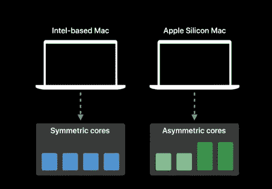
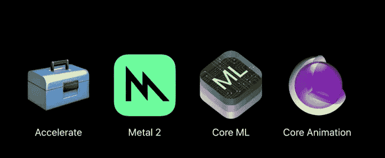
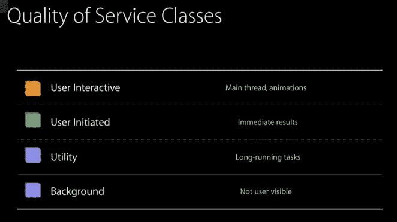

# 苹果芯片应用开发者

> 原文：<https://betterprogramming.pub/apple-silicon-app-developer-9d725f10bee8>

## 你如何利用苹果新的片上系统架构？


[JJ 英](https://unsplash.com/@jjying?utm_source=medium&utm_medium=referral)在 [Unsplash](https://unsplash.com?utm_source=medium&utm_medium=referral) 上拍照。

WWDC2020 上更令人惊讶的公告之一是从英特尔转移到苹果芯片。在这篇文章中，我想看看它将如何影响我们这些卑微的开发者。我们将如何利用新硬件的优势？

在这个关于主题为的 [WWDC2020 视频中，主讲人(Gavin Barraclough)讲述了基于英特尔芯片的 MAC 和基于苹果芯片的 MAC 之间的一些差异，并在一定程度上回答了我的问题。让我们更深入地研究一下他的建议。](https://developer.apple.com/videos/play/wwdc2020/10686/)

他提出的主要观点之一是，基于苹果芯片的新 MAC 电脑将使用单芯片系统或 SoC。SoC 本身是一个非对称多处理单元，与英特尔的不同，如该演示中的图片所示:



对称内核与不对称内核

重点是设计能够更有效地运行需要更少 CPU 的应用程序的硬件，同时保留更多 CPU 密集型应用程序所需的性能。在演示中，Gavin 介绍了您需要关注的框架和格式，以便充分利用新 SoC。类似这些专门命名的框架旨在利用多处理内核:



苹果框架已经调整过了

显然，这里有太多的细节需要涵盖，考虑到这一点，我想重点关注您可以做些什么来手动优化您的应用程序，以在非对称多处理苹果 SoC 硬件上运行——我怀疑您已经在进行优化了。

你看，Swift 利用这种架构已经有一段时间了，它有一个叫做 GCD 或 Grand Central Dispatch 的系统。

使用 GCD 聚焦 AMP 硬件以使用 QoS 为中心。Apple 在 Swift 中定义了四个 QoS 级别，在 WWDC2015 幻灯片中对此主题进行了说明:



默认情况下，主线程(用户交互)总是以最高优先级运行。从它调度的线程以用户启动的方式运行。除非您指定，否则不会作为实用程序或后台运行。让我们回顾一下它是什么样子的。

为了确保我们不是在拿苹果和橘子做比较，我将读入一个 48，000 行的文件，记录我开始和完成的时间。

我提供了一个非常简单的动画来展示正在发生的事情。下面的 GIF 说明了效果。当我启动演示应用程序时，两次上传都显示开始时间。随着数据的加载，UI 在作为后台运行上传的线程上更新。由于上传和 UI 在同一个线程上运行，所以在上传完成之前，它不会给我们任何更新。将线程推到后台的代码如下所示:

```
DispatchQueue.global(qos: .background).async { 
  //background thread
}
```

正如您可以清楚地看到的，虽然加载花费的时间更少，但效果并不十分用户友好。在上传完成之前，用户不会被告知上传进度。


这将如何与苹果硅工作？理论上，如果代码的优先级正确，它将在后台任务中运行得更好(即使用更少的功率，产生更少的热量)。看起来应该没什么不同。

但是等等，在后台有一个小小的警告:我发送回 UI 的消息将和它的父级(又名后台)以相同的优先级运行，这是行不通的。幸运的是，如果您犯了这个错误，Xcode 会用以下信息之一警告您:


要纠正这一点，您只需将 UI 代码包装在一个线程中，如下所示:

```
DispatchQueue.main.async {
  // Update UI
}
```

众所周知，作为一名程序员，成功的关键是有条理。为此，您可以使用如下代码创建标签来命名队列:

```
let background = DispatchQueue.init(label: "background", qos: .background, attributes: .concurrent, autoreleaseFrequency: .inherit, target: nil)
background.async {
  // do something
}
```

在 SoC 笔记本电脑上获得最大优势的秘诀是更新您的代码，确保您的线程以正确的 QoS 运行。

回到苹果芯片和那些你将要用来运行线程的内核。我们对 2020 年第四季度的 MBP (12 核)有一个推测性的数字。我们被告知四核将专注于效率，八核专注于性能。在创建线程时，您应该记住这些数字。然而，在这一点上，我想提一下 WWDC2015 视频中展示的一段更新的代码[:](https://developer.apple.com/videos/play/wwdc2015/718/)

使用这个，运行的后台任务的数量(假设我只有四个以功耗为中心的内核)永远不会超过四个。如果我的硬件中只有四个节能内核，这一点非常关键。

当然，随着时间的推移，您的应用程序可能会在许多不同的硬件平台上运行，在理想情况下，您可以通过查询它有多少个内核来使这段代码更加智能。您可以使用此代码来找出您正在运行的硬件必须使用什么:

```
let processInfo = ProcessInfo()
print(processInfo.activeProcessorCount)
```

在我结束之前，让我们来看一下 WWDC2017 演示，它探讨了在 MP 硬件上更仔细/高效地控制代码的另一种方法。这个小片段:

```
DispatchQueue.concurrentPerform(iterations: 16) { ( process ) in
  Thread.sleep(forTimeInterval: 1)
  print("process \(process)")
}
```

这将在尽可能多的内核上并行执行进程，有效地启动尽可能多的内核来执行任务。显然，手头的任务需要仔细划分，这样才有意义。我建议观看关于主题的 [WWDC2017 演讲的前几分钟，以更好地了解它如何也能为你工作。](https://developer.apple.com/videos/play/wwdc2017/706/)

继续向前发展，2021 年可能会包含更多原语，帮助您在不同类别的处理器上构建最高效的代码库。

回到我开始介绍 WWDC2020 的地方，Gavin 继续讨论了几个方面，并确实列举了两个您应该观看的 WWDC 会议。我会在接下来的几周看看这些。敬请关注。

这就把我带到了这篇短文的结尾。通过写这篇文章，我学到了一些东西，我希望你在阅读的时候也能学到。

保持冷静，继续编码。