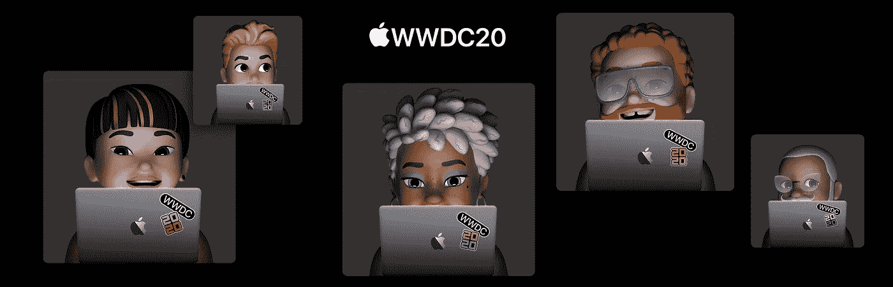
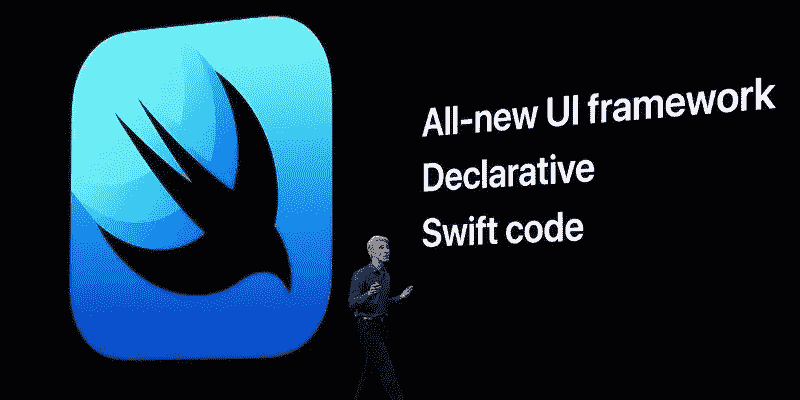
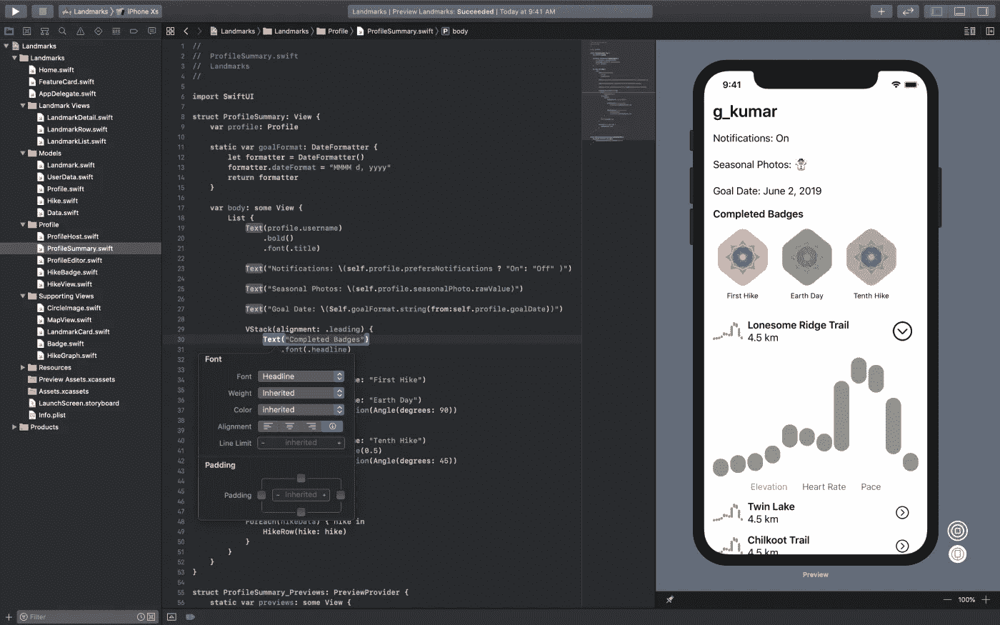
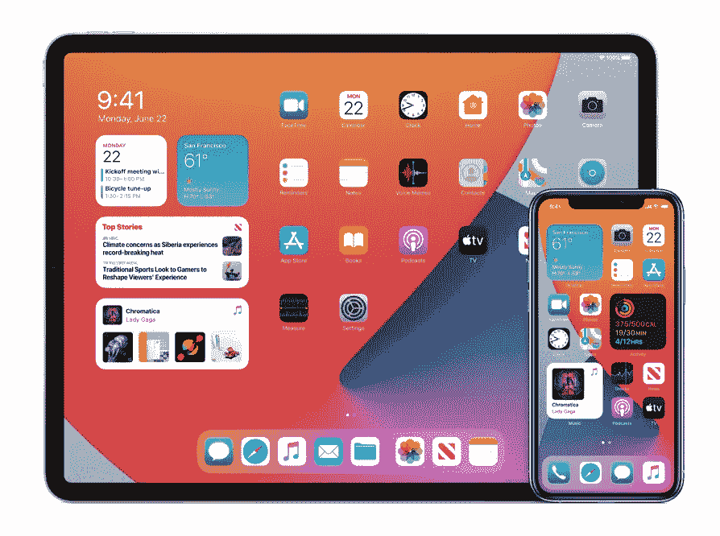
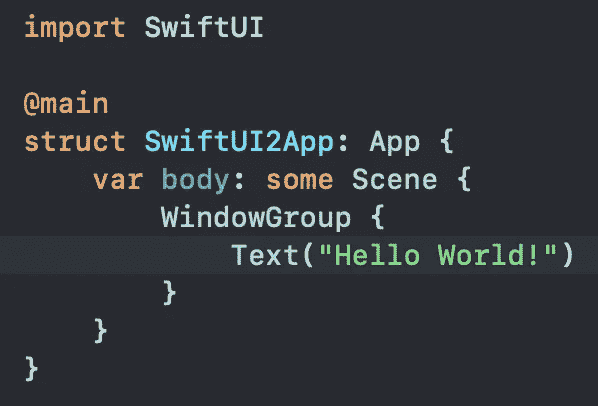

# 苹果:国王死了。国王万岁！

> 原文：<https://betterprogramming.pub/apple-the-king-is-dead-long-live-the-king-3a176863bd9f>

## 不，我说的不是英特尔和苹果芯片

即使在最好的情况下，试图确定苹果的未来方向也可能是困难的，经常需要一个人一边盯着昏暗的水晶球，一边阅读茶叶和喃喃自语奇怪的咒语。

然后就是今天，苹果真的拿起锤子砸你的头。

我说的是 UIKit 的死。

# **永别了，UIKit，我们几乎不认识你…**

好吧，这不完全正确。自从苹果引入了第三方在 iOS 上开发的能力，这些应用就依赖于 UIKit。

这些年来，UIKit 已经从它卑微的开始成长为…嗯，事实上，它已经成长为一个巨大的，可怕的，蹒跚的，神秘的，令人困惑的，被废弃的 API。

UIKit 的最大问题一直是它在低水平上运行。很低的水平。事实上，称之为地下并不为过，有时它如此之深，以至于我经常期待看到巴洛克从它的深处走出来。

在 UIKit 中没有什么是容易的。没什么。甚至像显示一个用户可以输入一些文本的表单这样简单的事情也会让我们陷入`UIResponder` s、`keyboardWillShowNotification` s、`UIScrollView`s 的混乱中……没关系。你去过那里。你知道我的意思。

想要在一个表格视图中有多个动态字段吗？我只能说你能做到。只要确保你的网页浏览器是打开的，并且你的栈溢出链接是准备好的。

不过，既然你提到了，即使堆栈溢出也没有多大帮助，因为已经有这么多版本的 iOS 和这么多版本的 UIKit，你找到的任何解决方案本身都可能过时。没错。那个*是*最佳实践。回到 2016 年的黑暗时代。

# 最佳实践

说到*最佳实践，* UIKit 都看过了吧？

还记得键值观察风靡一时的日子吗？和委托模式？通知中心？目标-动作和目标-C 方法选择器？故事板绑定和动作？

然后是方法回调和闭包的后现代时代？再加上一些新奇的函数式编程和协议？

嘿！还记得那次 [WWDC 会议](https://developer.apple.com/videos/play/wwdc2015/226/)上苹果建议 iOS 应用程序应该主要使用*n operation 的*来构建吗？

没错。任何单一的 iOS 应用程序，即使是在 Swift 中从头开始重新编写的现代应用程序，通常仍然是可以追溯到更早时代的技巧、技术和设计模式的随意组合。

# 斯威夫特伊

然后，在去年的 WWDC 上，苹果推出了 SwiftUI。

引用苹果公司的话，“SwiftUI 是一种创新的、极其简单的方式，利用 Swift 的力量在所有苹果平台上构建用户界面。”

SwiftUI 使用声明性语法，因此您可以简单地说明您的用户界面应该做什么，并且只用几行代码就可以完成。

据说 SwiftUI 通过提供对许多自动功能的访问来节省开发人员的时间，包括界面布局、黑暗模式、可访问性、从右到左的语言支持和国际化。SwiftUI 拥有针对 Apple Watch、tvOS 和 macOS 应用的原生框架，因此方法甚至大部分代码都可以跨平台。

您可以直接在 Xcode 中预览您的工作，甚至进行拖放式界面开发，将界面组件放到设计画布上会自动更新您的代码。

就像在 Swift Playgrounds 一样，你可以看到你在代码中所做的改变被实时反映出来。

克雷格·费德里吉(Craig Federighi)当时表示:“今天发布的新应用开发技术让开发者的应用开发变得更快、更容易、更有趣，代表了所有苹果平台应用创作的未来。”

我去年写道，“SwiftUI 来了。优点很明显，好处很多。”

嗯，SwiftUI 肯定会好起来的。

# WWDC 2020

快进到昨天，苹果展示了 iOS、iPadOS、macOS 中的许多新功能。还有 watchOS。

iOS 和 iPadOS 的帐篷杆功能是什么？显然，widgets 是跨这些平台引入的最大功能。

你是如何创造出这些看起来很现代的新部件的？SwiftUI 和 WidgetKit。

Apple Watch 获得了新的应用驱动的复杂性。你如何制造这些新的复杂情况？SwiftUI。

App 剪辑？SwiftUI。

你开始看到这里的模式了吗？

苹果甚至已经从标准的 SwiftUI 应用中消除了对 UIKit 的需求。`UIApplication` s、`AppDelegate` s、`applicationDidFinishLaunchingWithOption` s 都不见了

这是一个完整的 SwiftUI 应用。也许这不是一个非常有用的工具，但是它可以在设备上编译和运行。

## 设备支持

昨天你可能没有注意到的一件重要事情是，iOS 14 支持所有支持 iOS 13 的设备。

这意味着采用 iOS 14 的障碍比原本可能的要低得多。今天 92%的用户群可以在 iOS 发布时更新到新版本，没有人需要被落下。

这反过来意味着，想要提供酷的新部件、应用程序剪辑和复杂功能的开发者可以这样做，而不会留下大量现有用户。

他们在这方面还可以做得更好，但至少他们似乎在努力。

## 为 UIKit 辩护

一些人无疑会支持 UIKit，抗议 SwiftUI 可能是未来，但今天不是那一天。

而且可能是真的。在一定程度上。

当然，有些事情你仍然无法在 SwiftUI 中完成，你可能需要退回到使用 UIKit 和 *UIViewRepresentable* 。iOS SDK 太大了，无法一次完成所有的转换。

尽管如此，我强烈怀疑当苹果从碳迁移到可可时，人们会有同样的情绪，我知道当 Swift 第一次出现时，人们对远离 Objective-C 有同样的感觉。

“斯威夫特？是的，它可能是*的未来*，但它们将永远是 iOS 上 Objective-C 开发的地方。”

除此之外，今天根本没有它的位置，因为上面提到的所有新特性都*不可能*在 Objective-C 中实现

想想吧。

## 未来属于 SwiftUI

锤子已经落下，苹果已经说出了应该足够清晰，任何人和每个人都能理解的话。

任何重要的新特性都需要 SwiftUI。

想要开发最好的 watchOS 体验？SwiftUI。

想要开发一个在 iPadOS 和 macOS、tvOS 和 WatchOS 上运行良好的应用程序？SwiftUI。

想要为未来编码吗？SwiftUI。

国王死了。

国王万岁。

*如果你喜欢这篇文章，那就跳过去看看我的最新文章:*[*swift ui 中的深层观点、状态和性能。*](https://medium.com/@michaellong/deep-inside-views-state-and-performance-in-swiftui-d23a3a44b79) *我在这里解释了为什么 SwiftUI 中几乎没有一个词的意思是你所认为的那样……*